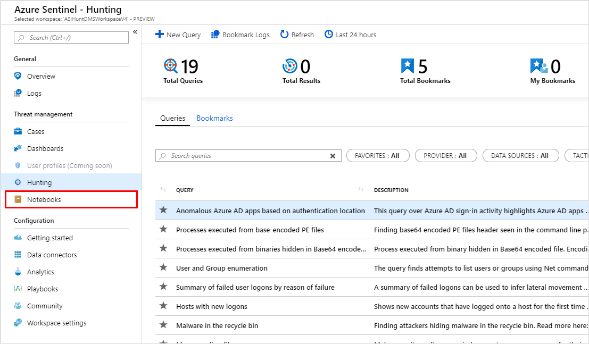
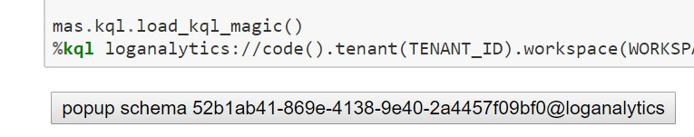

Jupyter, msticpy and Azure Sentinel
===================================

Creating a notebooks project within `Azure
Notebooks <https://notebooks.azure.com/>`__ is directly supported by
Azure Sentinel. Click on the notebook icon in the Azure Sentinel main
navigation menu. From here you have the option to create a new project
from our GitHub repo or just open your existing Azure Notebooks project.
Azure Notebooks is a
`Jupyterhub <https://jupyterhub.readthedocs.io/en/stable/>`__
implementation and has a free tier that you can use for any notebook
tasks.

   Accessing the Notebooks section of Azure Sentinel user interface.

If you have a local installation of Python 3.6 or later, you can also
download the notebooks and run these locally. My personal recommendation
is to use the `Anaconda <https://www.anaconda.com/distribution/>`__
distribution since it contains the Jupyter packages and many others
needed for the Azure Sentinel notebooks.

Further reading: `Using Notebooks in Azure
Sentinel <https://docs.microsoft.com/en-us/azure/sentinel/notebooks>`__
and .

Open one of the Sample Notebooks
~~~~~~~~~~~~~~~~~~~~~~~~~~~~~~~~

If you have cloned the Azure Sentinel repo you already have several
notebooks in your Notebooks for Azure Project -- in the notebooks and
notebooks/samples folders. Most of the notebooks in the samples folders
(anything that begins with "Example") have data is saved with them so
you can the expected output without having access to a data source. I
strongly recommend viewing the notebook using nbviewer.org. This seems
to have magical powers to render data and interactive JavaScript
controls that are displayed incorrectly even when viewing a notebook
locally. The GitHub notebook viewer is reasonable for simple notebooks
but not very sophisticated. Here is a link to one of the notebooks
displayed in
`nbviewer <https://nbviewer.jupyter.org/github/Azure/Azure-Sentinel/blob/master/Notebooks/Sample-Notebooks/Example%20-%20Step-by-Step%20Linux-Windows-Office%20Investigation.ipynb>`__.

Note: you do not need to have Python or any of the dependencies
installed to view notebooks in nbviewer or GitHub.

Notebook Setup
--------------

When it comes to running one of the notebooks in against real data, you
will need some preparatory steps.

Prerequisites
^^^^^^^^^^^^^

Permissions in your Azure Sentinel/Log Analytics Workspace
""""""""""""""""""""""""""""""""""""""""""""""""""""""""""

In order to read any data, you will need to have at least LogAnalytics
Reader role for your account.

Configuring your Python Environment for the First Time
^^^^^^^^^^^^^^^^^^^^^^^^^^^^^^^^^^^^^^^^^^^^^^^^^^^^^^

You will need to carry out this procedure every time you start working
in a fresh Python environment.

If you are using Notebooks for Azure using free computer, creating a new
project is effectively starting a new environment (although there are
ways to automate this setup). The exception to this is if you are using
a dedicated Compute resource such as a `Data Science Virtual
Machine <https://azure.microsoft.com/en-us/services/virtual-machines/data-science-virtual-machines/>`__.
Since this machine is persisted and linked to your Notebooks for Azure
account, all the configuration will be there next time you come to use
it.

If you are working locally or using another Jupyterhub hosted
environment, you will only need to do this environment configuration for
each fresh install or when you create a new python or conda virtual
environment.

Steps
"""""

1. Ensure that you have a version of Python 3.6 or later.

2. Install the two main packages used by the notebook: Kqlmagic and
   msticpy (see references at end of document). These will install most
   of the dependencies needed by the notebooks if they are not already
   installed.

3. Install one or two additional python packages -- these vary depending
   on the notebook.

If you are running on a Windows machine where Python is installed for
All Users, you may have to add the --user flag to the pip install
commands. You will see permission failures when trying to install if
this is the case.

    ``pip install --user <pkg_name>``

Notes for Conda users.

If you are running in a Conda environment (an Anaconda distribution) run
the pip commands from a Conda prompt, ideally in a dedicated Conda
virtual environment. Just start an Anaconda prompt shell, paste the pip
install commands into it and execute them, rather than running them from
the notebook. You will need to run Jupyter from the same environment.
More details of can be found
`here <https://www.anaconda.com/using-pip-in-a-conda-environment/>`__.

Keeping the packages up-to-date
^^^^^^^^^^^^^^^^^^^^^^^^^^^^^^^

It is a good idea to force an update of packages at regular intervals
using

    ``pip install --upgrade <pkg_name>``

to ensure that you have the latest features and fixes (including fixes
for security vulnerabilities).

Notebook Initialization
^^^^^^^^^^^^^^^^^^^^^^^

There are two main pieces of housekeeping here that you need each time a
notebook is started:

1. Importing python libraries (this is reading in the installed versions
   of the libraries so that they become accessible in your python
   session). I try to keep all of the imports at the start of my
   notebooks so that you have an early warning of missing dependencies.

2. Authenticating to Azure Sentinel/Log Analytics with Azure Active
   Directory. This is a complex topic but there are two main methods of
   authentication:

-  Interactive device/user authentication - this prompts you for user
   credentials and a one-time device code. While this frees you from
   having to worry about saving/pasting in credentials each time, you do
   suffer a multi-prompt authentication experience. If you happen to be
   working a long time in a single notebook this is not too onerous but
   can be frustrating if you are hopping between multiple notebooks.

-  `AppId
   authentication <https://docs.microsoft.com/en-us/azure/active-directory/develop/howto-create-service-principal-portal>`__
   - this uses an App account, created in your Azure Active Directory
   tenant, and granted read access to your Log Analytics workspace. This
   is a smoother authentication experience but means that you need to
   manage the app client secret (and, hopefully, avoid leaving a copy of
   it in a notebook uploaded to GitHub!).

On successful authentication you should see a button displayed. Clicking
this brings up a pop-up of the schema of all the tables your workspace
and is a useful reference feature. This feature is also accessible from
the notebook Help menu.

   Kql magic Show Schema button

References
----------

-  The `msticpy <https://github.com/microsoft/msticpy>`__ Python package
   containing tools used in these notebooks developed by engineers on the
   Microsoft Threat Intelligence team. It is available on
   `GitHub <https://github.com/microsoft/msticpy>`__ along with several
   notebooks documenting the use of the tools and on
   `PyPi <https://pypi.org/project/msticpy/>`__.

-  `Kqlmagic <https://github.com/microsoft/jupyter-Kqlmagic>`__ is a
   Jupyter-friendly package developed by Azure's Michael Binstock.

-  `Using Notebooks in Azure
   Sentinel <https://docs.microsoft.com/en-us/azure/sentinel/notebooks>`__
   is the official documentation for using Jupyter notebooks in Azure
   Sentinel.

-  `Get Started <https://github.com/Azure/Azure-Sentinel/blob/master/Notebooks/Get%20Started.ipynb>`__
   is a Jupyter notebook that demonstrates the use of Kqlmagic to
   retrieve data from Azure Sentinel.

Notebooks
---------

-  `Automating Security Operations Using Windows Defender ATP APIs with
   Python and Jupyter
   Notebooks <https://techcommunity.microsoft.com/t5/Windows-Defender-ATP/Automating-Security-Operations-Using-Windows-Defender-ATP-APIs/ba-p/294434>`__
   by John Lambert

-  Azure Sentinel sample Jupyter notebooks can be found
   `here <https://github.com/Azure/Azure-Sentinel>`__ on GitHub.

-  Windows Alert Investigation
   in \ `github <https://github.com/Azure/Azure-Sentinel/blob/master/Notebooks/Sample-Notebooks/Example%20-%20Guided%20Investigation%20-%20Process-Alerts.ipynb>`__ or `NbViewer <https://nbviewer.jupyter.org/github/Azure/Azure-Sentinel/blob/master/Notebooks/Sample-Notebooks/Example%20-%20Guided%20Investigation%20-%20Process-Alerts.ipynb>`__

-  Windows Host Explorer
   in \ `github <https://github.com/Azure/Azure-Sentinel/blob/master/Notebooks/Sample-Notebooks/Example%20-%20Guided%20Hunting%20-%20Windows-Host-Explorer.ipynb>`__ or `NbViewer <https://nbviewer.jupyter.org/github/Azure/Azure-Sentinel/blob/master/Notebooks/Sample-Notebooks/Example%20-%20Guided%20Hunting%20-%20Windows-Host-Explorer.ipynb>`__

-  Office 365 Exploration
   in \ `github <https://github.com/Azure/Azure-Sentinel/blob/master/Notebooks/Sample-Notebooks/Example%20-%20Guided%20Hunting%20-%20Office365-Exploring.ipynb>`__ or `NbViewer <https://nbviewer.jupyter.org/github.com/Azure/Azure-Sentinel/blob/master/Notebooks/Sample-Notebooks/Example%20-%20Guided%20Hunting%20-%20Office365-Exploring.ipynb>`__

-  Cross-Network Hunting
   in \ `github <https://github.com/Azure/Azure-Sentinel/blob/master/Notebooks/Sample-Notebooks/Example%20-%20Guided%20Hunting%20-%20Linux-Windows-Office.ipynb>`__ or `NbViewer <https://nbviewer.jupyter.org/github/Azure/Azure-Sentinel/blob/master/Notebooks/Sample-Notebooks/Example%20-%20Guided%20Hunting%20-%20Linux-Windows-Office.ipynb>`__
