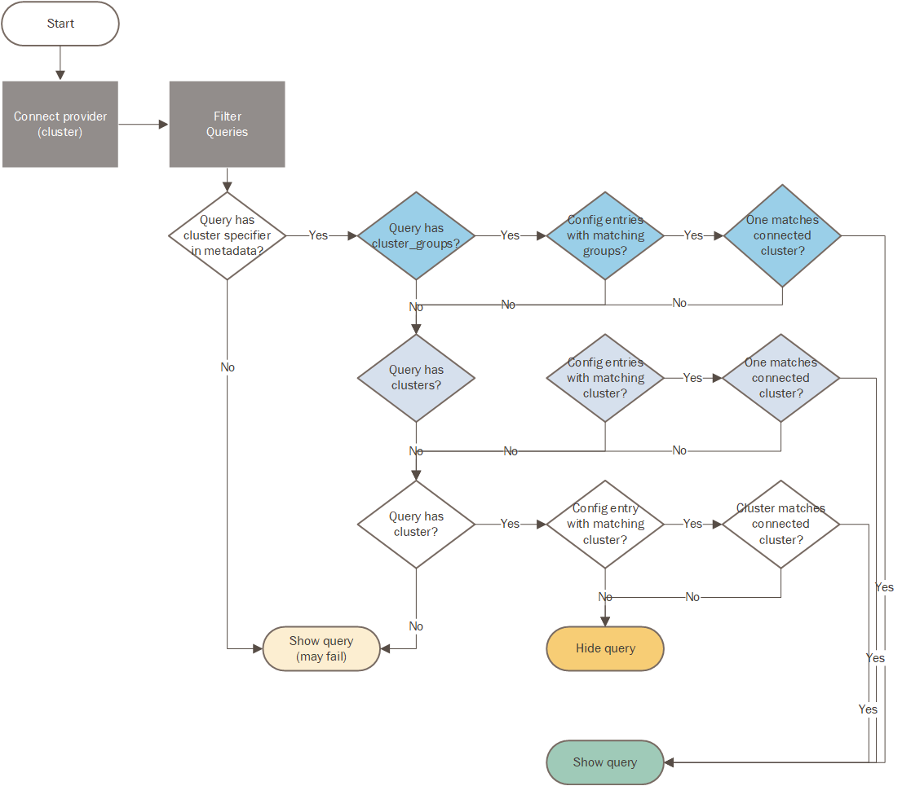

Azure Data Explorer/Kusto Provider - New Implementation
=======================================================

This is a new implementation of the Azure Data Explorer/Kusto
QueryProvider using the
`azure-data-kusto SDK <https://learn.microsoft.com/azure/data-explorer/python-query-data>`__
(the earlier implementation used
`Kqlmagic <https://github.com/microsoft/jupyter-Kqlmagic>`__).

.. warning:: This provider currently in beta and is available for testing.
   It is available alongside the existing Kusto provider for you
   to compare old and new.
   If you are using the existing implementation, see :doc:`./DataProv-Kusto`

Changes from the previous implementation
----------------------------------------

* Use the provider name ``Kusto_New`` when creating a QueryProvider
  instance. This will be changed to ``Kusto`` in a future release.
* The settings format has changed (although the existing format
  is still supported albeit with some limited functionality).
* You could previously specify a new cluster to connect to in
  when executing a query. This is no longer supported. Once the
  provider is connected to a cluster it will only execute queries against
  that cluster. (You can however, call the connect() function to connect
  the provider to a new cluster before running the query.)
* Some of the previous parameters have been deprecated:

  * ``mp_az_auth`` is replaced by ``auth_types`` (the former still works
    but will be removed in a future release).
  * ``mp_az_auth_tenant_id`` is replaced by ``tenant_id`` (the former
    is no longer supported

Kusto Configuration
-------------------

Kusto Configuration in MSTICPy
~~~~~~~~~~~~~~~~~~~~~~~~~~~~~~

You can store your connection details in *msticpyconfig.yaml*.

For more information on using and configuring *msticpyconfig.yaml* see
:doc:`msticpy Package Configuration <../getting_started/msticpyconfig>`
and :doc:`MSTICPy Settings Editor<../getting_started/SettingsEditor>`

.. note:: The settings for the new Kusto provider are stored in the
   ``KustoClusters`` section of the configuration file. This cannot
   currently be edited from the MSTICPy Settings Editor - please
   edit the *msticpyconfig.yaml* directly to edit these.

To accommodate the use of multiple clusters the new provider supports
a different configuration format.

The basic settings in the file should look like the following:

.. code:: yaml

    KustoClusters:
      ...
      Cluster1:
        Args:
          Cluster: https://uscluster.kusto.windows.net
      Cluster2:
        Args:
          Cluster: https://eucluster.kusto.windows.net
          IntegratedAuth: True  # This is default and is optional

You can have any number of cluster entries in this section.

Specifying additional parameters for a cluster
~~~~~~~~~~~~~~~~~~~~~~~~~~~~~~~~~~~~~~~~~~~~~~

You can add authentication and other parameters to the ``Args``
sub-key of a cluster definition. In the following example,
the TenantId is specified along with Client app ID and client secret
for *clientsecret* authentication.

.. code:: yaml

    KustoClusters:
      DataClusterX:
        Args:
          Cluster: https://xxx.kusto.windows.net
          ClientId: 69d28fd7-42a5-48bc-a619-af56397b1111
          TenantId: 69d28fd7-42a5-48bc-a619-af56397b9f28
          ClientSecret:
            KeyVault:

The ClusterDefaults section
~~~~~~~~~~~~~~~~~~~~~~~~~~~

If you have parameters that you want to apply to all clusters
you can add these to a ``ClusterDefaults`` section.

.. code:: yaml

    KustoClusters:
      ClusterDefaults:
        Args:
          TenantId: 69d28fd7-42a5-48bc-a619-af56397b9f28
      Cluster1:
        Args:
          Cluster: https://uscluster.kusto.windows.net
      Cluster2:
        Args:
          Cluster: https://eucluster.kusto.windows.net

Creating ClusterGroups
~~~~~~~~~~~~~~~~~~~~~~

You can create a group of clusters that you can reference by
cluster group name. This is useful if you have clusters in different regions
that share the same schema and you want to run the same queries
against all of them.

This is used primarily to support query templates, to match
queries to the correct cluster. See `Writing query templates for Kusto clusters`_
later in this document.

Loading a QueryProvider for Kusto
---------------------------------

.. code:: ipython3

    import msticpy as mp
    kql_prov = mp.QueryProvider("Kusto_New")

Connecting to a Kusto cluster
-----------------------------

Before running queries you need to connect to a cluster using
the ``connect()`` method.

See
:py:meth:`connect() <msticpy.data.drivers.azure_kusto_driver.AzureKustoDriver.connect>`

The parameters required for connection to a Kusto cluster can be passed
to ``connect()`` in
several of ways. You can provide a full connection string or parameters
for ``cluster`` (and optionally, ``database``).
In the latter case, you must have configured
settings for the cluster defined in your msticpyconfig.yaml.

If you have the cluster details configured in msticpy, the ``cluster``
parameter can be one of the following:

* The section name ("Cluster1" or "Cluster2" in the configuration example above)
* The full URL of the cluster either the actual cluster name
* The host name of the cluster (e.g. "uscluster", "eucluster" in the example)

In all cases these are case-insensitive.

These are all equivalent:

.. code:: ipython3

        kql_prov.connect(cluster="Cluster2")
        kql_prov.connect(cluster="eucluster")
        kql_prov.connect(cluster="https://eucluster.kusto.windows.net")

If the cluster is not in your configuration you must use the full
URL of the cluster.

You can optionally specify a default database to connect to. The database
can be changed with each query (either by specifying a ``database`` parameter
or by using the ``database`` metadata property in a query definition file
(see `Writing query templates for Kusto clusters`_) below)

You can also pass authentication parameters in the ``connect`` call:

* auth_types - to override the configured Azure credential types
* tenant_id - to override your default tenant_id

.. code:: python3

        kql_prov.connect(
            cluster="Cluster2",
            auth_types=["device_code"],
            tenant_id="69d28fd7-42a5-48bc-a619-af56397b9f28"
        )

For more details on Azure Authentication in *MSTICPy* see
:doc:`Azure Authentication <../getting_started/AzureAuthentication>`

Kusto QueryProvider methods and properties
------------------------------------------

The Kusto QueryProvider has the following methods and properties
in addition to those inherited from the base QueryProvider class.

* :py:meth:`get_database_names() <msticpy.data.drivers.azure_kusto_driver.AzureKustoDriver.get_database_names>`
  Returns the names of the databases for a connected cluster.
* :py:meth:`get_database_schema([database]) <msticpy.data.drivers.azure_kusto_driver.AzureKustoDriver.get_database_schema>`
  Returns a schema dictionary for the tables in a database a connected cluster.
* :py:meth:`configured_clusters (property) <msticpy.data.drivers.azure_kusto_driver.AzureKustoDriver.configured_clusters>`
* Returns a list of the configured cluster read from msticpyconfig.yaml.
* :py:meth:`cluster_uri (property) <msticpy.data.drivers.azure_kusto_driver.AzureKustoDriver.cluster_uri>`
  The URI of the connected cluster.
* :py:meth:`cluster_name  (property) <msticpy.data.drivers.azure_kusto_driver.AzureKustoDriver.cluster_name>`
  The host name of the connected cluster.
* :py:meth:`cluster_config_name  (property) <msticpy.data.drivers.azure_kusto_driver.AzureKustoDriver.cluster_config_name>`
  The configuration entry name for the connected cluster.
* :py:meth:`set_cluster(cluster) <msticpy.data.drivers.azure_kusto_driver.AzureKustoDriver.set_cluster>`
  Switch the provider to a different cluster - this is a more restricted version of the ``connect()`` method.
* :py:meth:`set_database(database) <msticpy.data.drivers.azure_kusto_driver.AzureKustoDriver.set_database>`
  Switches the default database for the provider.

Running Ad Hoc queries
----------------------

You can run ad hoc queries using the ``exec_query()`` method of the QueryProvider.

.. note:: You usually need to specify a ``database`` parameter when running
          ad hoc queries.

Writing query templates for Kusto clusters
------------------------------------------

The details for configuring and connecting to Kusto clusters
are enough to allow you to run ad hoc queries. However, if you want to
create and use parameterized queries there are some additional steps
that you need to take.

Please read the general section on
:ref:`Creating new queries <data_acquisition/DataProviders:Creating new queries>`
if you are not familiar with the general process of creating query
templates for *MSTICPy*.

The queries for Kusto work in the same way as for many other data providers
except that you can (and should) specify the cluster(s) and database for
the query to use.

Controlling which queries are displayed and runnable for a provider
~~~~~~~~~~~~~~~~~~~~~~~~~~~~~~~~~~~~~~~~~~~~~~~~~~~~~~~~~~~~~~~~~~~

Since Kusto clusters have widely varying schemas, it only makes sense
to run a query on a cluster for which it was designed.
MSTICPy enforces this by allowing you to specify parameters in
both the query template definitions and the cluster configuration
in ``msticpyconfig.yaml`` that correctly match queries to
providers connected to appropriate clusters.

When you first instantiate a Kusto QueryProvider, it will read
all queries files available for the Kusto DataEnvironment. However,
when you connect to a cluster, these queries and filtered so that
only ones compatible with this cluster are available.

If you have query definition files (query templates) you can
try this by creating a Kusto QueryProvider and running the
``list_queries()`` method. Then connect to a cluster and run
``list_queries()`` again. In the first case, you should see all
queries that you have defined but in the second case, you
should only see queries that have been built to run on that
cluster.

.. code:: python3

        from msticpy.data import QueryProvider
        kql_prov = QueryProvider("Kusto")
        kql_prov.list_queries()

.. code:: python3

        # new cell
        kql_prov.connect(cluster="Cluster2")
        kql_prov.list_queries()

This is explained more in the later sections on `Kusto cluster specifier`_
and

Basic Kusto query format
~~~~~~~~~~~~~~~~~~~~~~~~

The query template format for Kusto queries should look like
the following. The ``data_environments`` item must include
"Kusto" in the list of applicable environments.

This example show the metadata section for a query file, highlighting
the items that are specific Kusto queries. (``data_families`` is common
to other query types but has some Kusto-specific usage that is different
as explained later.)

.. code-block::
    :emphasize-lines: 4-12

    metadata:
        version: 1
        description: Kusto Queries
        data_environments: [Kusto]
        data_families: [DeviceEvents.hostdata]
        cluster: https://uscluster.kusto.windows.net
        clusters:
        - https://uscluster.kusto.windows.net
        - https://eucluster.kusto.windows.net
        cluster_groups:
        - Group1
        database: hostdata
        tags: ["user"]
    defaults:
      parameters:
        table:
          # ....
    sources:
        list_host_processes:
          description: Lists all process creations for a host
            # ....

Most of the query file is identical to queries for other drivers.
However, the metadata section has some additional items. These
are explained in the following sections.

Kusto database specifier
~~~~~~~~~~~~~~~~~~~~~~~~

You can use the ``database`` item to specify the cluster database to
use. For backward compatibility you can also specify this in the
``data_families`` entry using a dotted notation. ``data_families``
is also used to group queries in the query provider, so using this
to specify the database name is not recommended.

The following examples show the different ways of configuring
this.

For the following two configurations, the database used is ``DeviceEvents``
and the queries are grouped under the ``hostdata`` family (the
queries are attached as methods to the QueryProvider).

.. code-block:: yaml
   :emphasize-lines: 5,6

    metadata:
        version: 1
        description: Kusto Queries
        data_environments: [Kusto]
        data_families: [hostdata]
        database: DeviceEvents
        cluster: https://uscluster.kusto.windows.net

.. code-block:: yaml
    :emphasize-lines: 5,6

    # Deprecated format
    metadata:
        version: 1
        description: Kusto Queries
        data_environments: [Kusto]
        data_families: [hostdata.DeviceEvents]
        cluster: https://uscluster.kusto.windows.net

For this configuration the database used is ``DeviceEvents`` and the
queries will also be grouped under the DeviceEvents container.

.. code-block:: yaml
    :emphasize-lines: 5

    # Deprecated format
    metadata:
        version: 1
        description: Kusto Queries
        data_environments: [Kusto]
        data_families: [DeviceEvents]
        cluster: https://uscluster.kusto.windows.net

.. note:: The when using the ``data_families`` entry to specify
   the database name, only the first entry in the list is used
   for this. Subsequent items still work for creating
   data query groupings.

Kusto cluster specifier
~~~~~~~~~~~~~~~~~~~~~~~

Adding a cluster specifier matches queries to the right cluster
and prevents a query from being used with
a cluster and database for which it was not intended.

You can specify the cluster to use in three ways:

* Including a ``cluster_groups`` item in the metadata section.
  This is a list of cluster group names that are defined in the
  ``msticpyconfig.yaml`` file. Queries with one or more ``cluster_groups``
  entries can be used against any of the cluster definitions in
  ``msticpyconfig.yaml`` that have matching cluster group names.
* Including a ``clusters`` item in the metadata section.
  This is a list of cluster identifiers (URIs, names or configuration section names
  that are defined in the ``msticpyconfig.yaml`` file). These queries
  can be used with any cluster configuration entry that matches one
  of the IDs in the ``clusters`` item.
* Including a ``cluster`` item in the metadata section.
  This is a single cluster identifier (URI, name or configuration section name
  that is defined in the ``msticpyconfig.yaml`` file). These queries
  can only be used with the cluster configuration entry that matches
  the ID in the ``cluster`` item.

The cluster specifiers are used in the order above until a match is found.
You can include more than one cluster specifier in a query definition file.
If no match is found, the query will not be added to the query provider.

.. note:: For queries that have no cluster specifier, they will
          be added to the query provider but but may not work.

.. tip:: If you want to avoid these queries being added use
          the parameter ``strict_query_match=True`` when
          creating the Kusto QueryProvider as shown in the following
          example

.. code:: python3

        import msticpy as mp
        kql_prov = mp.QueryProvider("Kusto_New", strict_query_match=True)

The following examples show the different ways of configuring
clusters to match queries:

.. code-block:: yaml
   :emphasize-lines: 6,7

    metadata:
        version: 1
        description: Kusto Queries
        data_environments: [Kusto]
        data_families: [hostdata]
        cluster_groups:
        - Group1
        database: DeviceEvents

.. code-block:: yaml
   :emphasize-lines: 6,7

    metadata:
        version: 1
        description: Kusto Queries
        data_environments: [Kusto]
        data_families: [hostdata]
        clusters:
        - https://uscluster.kusto.windows.net
        - https://eucluster.kusto.windows.net
        database: DeviceEvents

.. code-block:: yaml
   :emphasize-lines: 6

    metadata:
        version: 1
        description: Kusto Queries
        data_environments: [Kusto]
        data_families: [hostdata]
        cluster: https://uscluster.kusto.windows.net
        database: DeviceEvents

.. note:: you can also use cluster specifiers (using the same syntax
    as show above) for individual query metadata. Each query has
    it's own optional ``metadata`` sub-key. Setting cluster
    specifiers at the query level, with different queries assigned
    to different clusters in the same file may make organizing
    your queries more difficult, so we recommend only using
    cluster specifiers at the file level. However, it is possible
    to do this if you need to.

Logical flow used to determine if a query is shown
~~~~~~~~~~~~~~~~~~~~~~~~~~~~~~~~~~~~~~~~~~~~~~~~~~

This flowchart shows the logic applied using the query definition
and configuration parameters to determine whether a query is
shown or not (i.e. whether it appears in ``list_queries()`` and
as attached to the QueryProvider as a query function.)

         and configuration settings.
   :height: 5in

Other Kusto Documentation
-----------------------------------

For examples of using the Kusto provider, see the samples
`Kusto Analysis Notebook <https://github.com/microsoft/msticpy/blob/master/docs/notebooks/Kusto-Analysis.ipynb>`__
and `Kusto Ingest Notebook <https://github.com/microsoft/msticpy/blob/master/docs/notebooks/Kusto-Ingest.ipynb>`__

:py:mod:`Kusto driver API documentation<msticpy.data.drivers.azure_kusto_driver>`