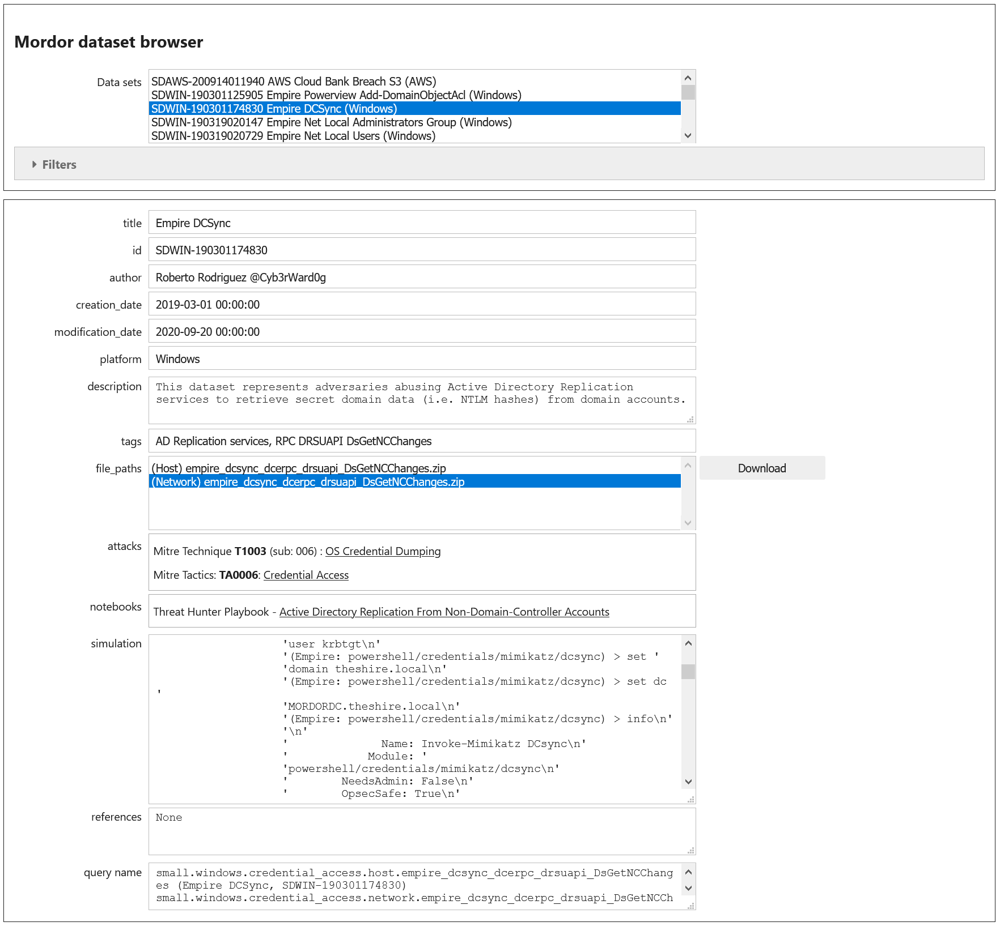
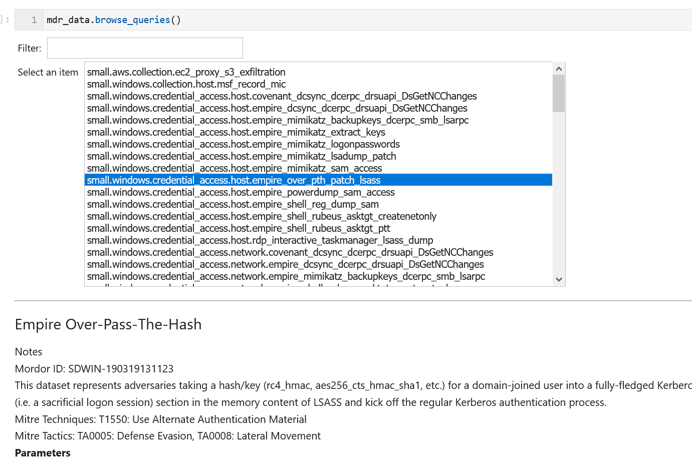

Open Threat Research Security Datasets data provider and browser
================================================================

The `OTRF <https://github.com/OTRF>`__ Security Datasets
is a project to capture host and network log data
that illustrates adversarial attack patterns. Mordor is part of the
Open Threat Research Forge created by Roberto Rodriquez and Jose
Rodriguez. It was originally named **Mordor** and the *MSTICPy*
naming still uses that (which we are rather fond of). In
this document we will use **Mordor** and **OTRF Security Datasets**
interchangeably - they both refer to the same thing

The Mordor project provides one of the most comprehensive
libraries of attack logs - the captured logs contain not just the
events directly related to the attack but also the set of benign events
happening at the time of the attack. Each data set is mapped to
Mitre ATT&CK techniques and tactics and includes simulation scripts
to allow you to produce the same data in your environment. This makes
Mordor very useful for testing detection logic - whether simple rules
or in more complex machine learning scenarios requiring labelled data.

This library allows you to browse through and query Mordor data sets
and query individual data sets in a similar way to other MSTICPy
data providers. Like the other providers, the Mordor provider
returns results as a pandas DataFrame, allowing it to be used
easily in Jupyter notebooks and other Python code. Unlike other
providers, it does not support custom queries or a query language.
The equivalent built-in queries for the Mordor provider return
the entire set of data for that item.

For more information on the OTRF data sets see the
`OTRF Jupyter Book documentation <https://securitydatasets.com/introduction.html>`__
and the `GitHub repository <https://github.com/OTRF/Security-Datasets>`__.

For more information on Mitre ATT&CK Techniques and Tactics see
`Mitre ATT&CK <https://attack.mitre.org/>`__.

You can view a notebook that shows the use of the Mordor
provider here
`MordorData <https://github.com/microsoft/msticpy/blob/master/docs/notebooks/MordorData.ipynb>`__

Using the Data Provider to download datasets
^^^^^^^^^^^^^^^^^^^^^^^^^^^^^^^^^^^^^^^^^^^^

Using the data provider you can download and render event data as a
pandas DataFrame.

.. note:: Mordor includes both host event data and network capture
   data. Although Capture files can be downloaded and unpacked, MSTICPy
   currently cannot display them in a pandas DataFrame. Most *network*
   datasets use capture (.cap) files. You can view these using
   tools such as tcpdump, tshark or GUI tools such as WireShark, Brim
   and others.

   Host event data stored in JSON files is retrieved and populated into DataFrames.

To use the Mordor provider, first create a Mordor query provider. Then
call the connect() function: this will download metadata from Mordor and
Mitre to populate the query set.

Download progress is shown with a progress bar (not shown below).

.. code:: ipython3

    >>> from msticpy.data import QueryProvider
    >>> mdr_data = QueryProvider("Mordor")
    >>> mdr_data.connect()

.. parsed-literal::

    Retrieving Mitre data...
    Retrieving Mordor data...

List Queries
------------

Once the metadata is downloaded, the provider is populated with query functions
that you can use to retrieve the datasets.

.. note:: Many Mordor data entries have multiple data sets, so we see
   more queries than Mordor entries.

You can see a list of available queries with the
:py:func:`list_queries<msticpy.data.data_providers.QueryProvider.list_queries>`
function. (Only first 15 are shown below)

.. code:: ipython3

    >>> mdr_data.list_queries()[:15]

.. parsed-literal::

    ['small.aws.collection.ec2_proxy_s3_exfiltration',
     'small.windows.collection.host.msf_record_mic',
     'small.windows.credential_access.host.covenant_dcsync_dcerpc_drsuapi_DsGetNCChanges',
     'small.windows.credential_access.host.empire_dcsync_dcerpc_drsuapi_DsGetNCChanges',
     'small.windows.credential_access.host.empire_mimikatz_backupkeys_dcerpc_smb_lsarpc',
     'small.windows.credential_access.host.empire_mimikatz_extract_keys',
     'small.windows.credential_access.host.empire_mimikatz_logonpasswords',
     'small.windows.credential_access.host.empire_mimikatz_lsadump_patch',
     'small.windows.credential_access.host.empire_mimikatz_sam_access',
     'small.windows.credential_access.host.empire_over_pth_patch_lsass',
     'small.windows.credential_access.host.empire_powerdump_sam_access',
     'small.windows.credential_access.host.empire_shell_reg_dump_sam',
     'small.windows.credential_access.host.empire_shell_rubeus_asktgt_createnetonly',
     'small.windows.credential_access.host.empire_shell_rubeus_asktgt_ptt',
     'small.windows.credential_access.host.rdp_interactive_taskmanager_lsass_dump']

Retrieving/querying a data set
------------------------------

To retrieve a data set, run the required query. The queries are all available
as attributes of the Mordor provider.

.. note:: The queries support tab-completion, so as you type each
   segment you can use the tab key to see a list of available options.

.. code:: ipython3

    >>> mdr_data.small.windows.credential_access.host.covenant_dcsync_dcerpc_drsuapi_DsGetNCChanges().head(3)

.. parsed-literal::

    https://raw.githubusercontent.com/OTRF/mordor/master/datasets/small/windows/credential_access/host/covenant_dcsync_dcerpc_drsuapi_DsGetNCChanges.zip
    Extracting covenant_dcsync_dcerpc_drsuapi_DsGetNCChanges_2020-08-05020926.json

==========  ====================  ==========  =========  ===============  =========================  ===========  ========================================================================
  @version              Keywords    ThreadID    Version  DestAddress      host                         LayerRTID  Message
==========  ====================  ==========  =========  ===============  =========================  ===========  ========================================================================
         1  -9214364837600034816        4888          1  239.255.255.250  wec.internal.cloudapp.net           44  The Windows Filtering Platform has permitted a connection.
         1  -9223372036854775808        4452          2  nan              wec.internal.cloudapp.net          nan  File created:                                                eventlog
         1  -9223372036854775808        4452          2  nan              wec.internal.cloudapp.net          nan  RawAccessRead detected:                                      eventlog
==========  ====================  ==========  =========  ===============  =========================  ===========  ========================================================================

.. note:: the table shown above has been truncated for illustration.

Optional parameters
-------------------

The data provider and the query functions support some parameters to control
aspects of the query operation.

-  **use_cached** : bool, optional Try to use locally saved file first,
   by default True. If you’ve previously downloaded a file, it will use
   this rather than downloading a new copy.
-  **save_folder** : str, optional Path to output folder, by default
   ".". The path that downloaded and extracted files are saved to.
-  **silent** : bool If True, suppress feedback. By default, False.

If you specify these when you initialize the data provider, the settings
will apply to all queries.

.. code:: ipython3

    >>> mdr_data = QueryProvider("Mordor", save_folder="./mordor")
    >>> mdr_data.connect()

.. note:: since the first line is creating a new instance of the Mordor
   provider, you will need to call "connect" again. The Mordor and Mitre
   metadata will be cached so you will not have to download this again
   in this session.

Using these parameters in the query will override the provider settings
and defaults for that query.

.. code:: ipython3

    >>> mdr_data.small.windows.credential_access.host.covenant_dcsync_dcerpc_drsuapi_DsGetNCChanges(
          save_folder="./investigation002"
        )

Getting summary data about a query
----------------------------------

Call the query function with a single "?" parameter to display
summary information.

.. code:: ipython3

    >>> mdr_data.small.windows.credential_access.host.covenant_dcsync_dcerpc_drsuapi_DsGetNCChanges("?")

.. parsed-literal::

    Query:  covenant_dcsync_dcerpc_drsuapi_DsGetNCChanges
    Data source:  Mordor
    Covenant DCSync

    Notes
    -----
    Mordor ID: SDWIN-200805020926
    This dataset represents adversaries abusing Active Directory Replication services to retrieve secret domain data (i.e. NTLM hashes) from domain accounts.

    Mitre Techniques: T1003: OS Credential Dumping
    Mitre Tactics: TA0006: Credential Access

    Parameters
    ----------
    Query:
    https://raw.githubusercontent.com/OTRF/mordor/master/datasets/small/windows/credential_access/host/covenant_dcsync_dcerpc_drsuapi_DsGetNCChanges.zip

Searching for Queries with QueryProvider.search_queries()
---------------------------------------------------------

You can use the provider
:py:func:`search_queries<msticpy.data.drivers.mordor_driver.MordorDriver.search_queries>`
function to search for queries for matching required attributes.

This function takes a single string parameter - ``search``.

Unless you include delimiters (see next), the search parameter treated as a literal
text string to search for. It tries to match this string against any text in the
metadata of the Mordor data sets. The search is case-sensitive.

Search also supports some simple search term logic and AND and OR expressions:

-  Substrings separated by commas will be treated as OR terms,
   e.g. "a, b" == "a" OR "b".
-  Substrings separated by “+” will be treated as AND terms,
   e.g. "a + b" == "a" AND "b"

.. note:: You cannot combine "+" and "," in the same search.
   For this reason, grouping of expressions is not supported.

The search returns a Python list of the names and descriptions of
any matching queries.

Examples:
~~~~~~~~~

Simple text string

.. code:: ipython3

    >>> mdr_data.search_queries("AWS")

.. parsed-literal::

    ['small.aws.collection.ec2_proxy_s3_exfiltration (AWS Cloud Bank Breach S3)']

Search for items that have both "Empire" and "T1222".

.. code:: ipython3

    >>> mdr_data.search_queries("Empire + T1222")

.. parsed-literal::

    ['small.windows.defense_evasion.host.empire_powerview_ldap_ntsecuritydescriptor (Empire Powerview Add-DomainObjectAcl)',
     'small.windows.defense_evasion.network.empire_powerview_ldap_ntsecuritydescriptor (Empire Powerview Add-DomainObjectAcl)']

Search for items that have both "Empire" and "Credential".

.. code:: ipython3

    >>> mdr_data.search_queries("Empire + Credential")

.. parsed-literal::

    ['small.windows.credential_access.host.empire_dcsync_dcerpc_drsuapi_DsGetNCChanges (Empire DCSync)',
     'small.windows.credential_access.network.empire_dcsync_dcerpc_drsuapi_DsGetNCChanges (Empire DCSync)',
     'small.windows.defense_evasion.host.empire_wdigest_downgrade.tar (Empire WDigest Downgrade)',
     'small.windows.credential_access.host.empire_mimikatz_sam_access (Empire Mimikatz SAM Extract Hashes)',
     'small.windows.credential_access.host.empire_mimikatz_lsadump_patch (Empire Mimikatz Lsadump LSA Patch)',
     'small.windows.credential_access.host.empire_mimikatz_logonpasswords (Empire Mimikatz LogonPasswords)']

Mordor Browser
^^^^^^^^^^^^^^

We’ve built a specialized browser for Mordor data. This uses
the metadata in the repository to let you search for and view full
details of the dataset.

You can also download and preview (if it is convertible to a DataFrame)
the dataset from the browser

See
:py:class:`MordorBrowser<msticpy.vis.mordor_browser.MordorBrowser>`.
for API details.

For more explanation of the data items shown in the browser, please see
the `Mordor GitHub repo <https://github.com/OTRF/mordor>`__ and the
`Threat Hunter Playbook <https://threathunterplaybook.com>`__

.. code:: ipython3

    >>> from msticpy.vis.mordor_browser import MordorBrowser
    >>> mdr_browser = MordorBrowser()

The top scrollable list is a list of the Mordor datasets. Selecting one
of these updates the data in the lower half of the browser.

Filter Drop-down
----------------

To narrow your search you can filter using a text search or filter by
Mitre ATT&CK Techniques or Tactics. Click on the arrow to open the
filter pane.

The Filter text box
~~~~~~~~~~~~~~~~~~~
This uses the same syntax as the provider ``search_queries()`` function.

-  Simple text string will find matches for datasets that contain this string
-  Strings separated by “,” are treated as OR terms
   i.e. it will match items that contain ANY of the substrings

-  Strings separated by “+” are treated as AND terms
   i.e. it will match items that contain ALL of the substrings

Filtering by Mitre Categories
~~~~~~~~~~~~~~~~~~~~~~~~~~~~~
-  The Mitre ATT&CK Techniques and Tactics lists are multi-select lists. Only
   items that have techniques and tactics matching the selected items will
   be show. By default, all are selected.

Clearing the Filter
~~~~~~~~~~~~~~~~~~~
-  Reset Filter button will clear any filtering.

.. figure:: _static/MordorBrowser-filter.png
   :alt: Filtering the list of data sets shown with text expressions.
   :width: 5in

Main Details Window
-------------------

-  title, ID, author, creation date, modification date and description
   are self-explanatory.
-  tags can be used for searching (although the search functions
   in the browser and data provider will search over all text).
-  file_paths (see `File paths`_ below)
-  attacks - lists related Mitre Technique and Tactics. The item title
   is a link to the Mitre page describing the technique or tactic.
-  notebooks - if there are one or more notebooks in the Threat Hunter Playbook
   site that relate to this dataset, descriptions and links to the notebooks
   are shown here.
-  simulation - raw data listing the steps in the attack (and useful for
   replaying the attack in a demo environment).
-  references - links to any external documents about the attack.

File paths
----------

This section allows you to select, download and (in most cases) display
the event data relating to the attack.

Select a file and click on the Download button.

The zipped file is downloaded and extracted. If it is event data, this
is converted to a pandas DataFrame and displayed below the rest of the
data.

The current dataset is available as an attribute of the browser:

::

       mdr_browser.current_dataset

Datasets that you’ve downloaded and displayed in this session are also
cached in the browser and available in the ``mdr_browser.datasets``
attribute.

Downloaded files
----------------

By default files are downloaded and extracted to the current folder. You
can change this with the ``save_folder`` parameter when creating the
``MordorBrowser`` object.

You can also specify the ``use_cached`` parameter. By default, this is
``True``, which causes downloaded files not to be deleted after
extraction. These local copies are used if you try to view the same data
set again. This also works across sessions.

If ``use_cache`` is set to False, files are deleted immediately after
downloading, extracting and populating the DataFrame.

Using the standard query browser
--------------------------------

You can also use the standard QueryProvider query browser to view some
details of the queries. This works for all query types (not just Mordor)
but has fewer details.
See
:py:mod:`query_browser<msticpy.vis.query_browser>`
for more details.

.. code:: ipython3

    >>> mdr_data.browse_queries()

