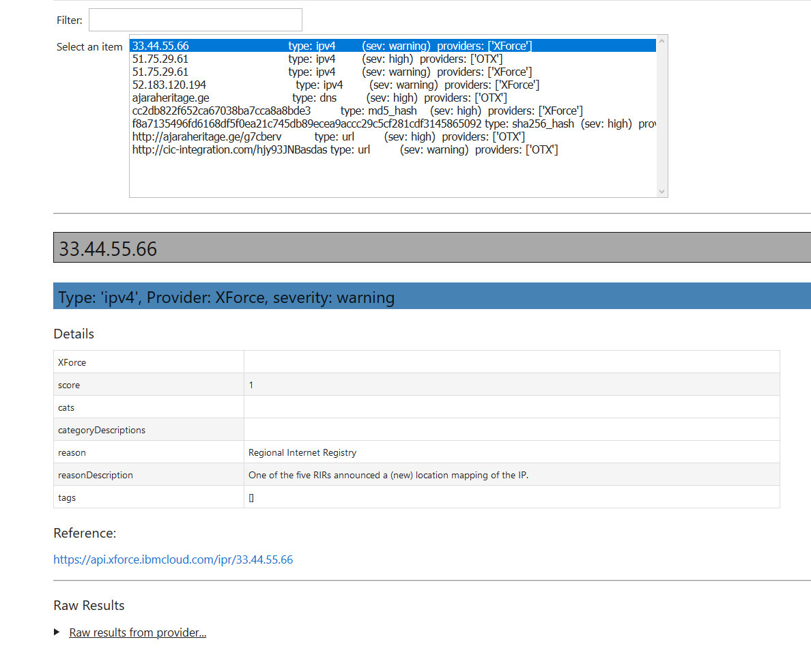

Threat Intel Lookup
===================

This document describes the use of the Threat Intelligence lookup class
in msticpy. The class allows lookup of individual or multiple IoCs from
one or more TI providers.

TILookup is also extensible - you can subclass TIProvider to implement
your own custom lookups. You can also subclass the HTTPProvider or
KqlProvider classes, which provide support for querying a REST endpoint
or Log Analytics table respectively.

Notebook
--------
`TIProvider Usage Notebook <https://github.com/microsoft/msticpy/blob/master/docs/notebooks/TIProviders.ipynb>`__

TILookup class
--------------

Input can be a single IoC observable or a pandas DataFrame containing
multiple observables. Processing may require a an API key and processing
performance may be limited to a specific number of requests per minute
for the account type that you have.

:py:mod:`TILookup API documentation<msticpy.sectools.tilookup>`

Constructor
~~~~~~~~~~~

See :py:class:`TILookup<msticpy.sectools.tilookup.TILookup>`

.. parsed-literal::

            Initialize TILookup instance.

            Parameters
            ----------
            primary_providers : Optional[List[TIProvider]], optional
                Primary TI Providers, by default None
            secondary_providers : Optional[List[TIProvider]], optional
                Secondary TI Providers, by default None
            providers: Optional[List[str]], optional
                List of provider names to load, by default all available
                providers are loaded. To see the list of available providers
                call `TILookup.list_available_providers()`.
                Note: if primary_provides or secondary_providers is specified
                This will override the providers list.

Methods
~~~~~~~

* *add_provider()* - Add a TI provider to the current collection.
* *available_providers()* - Return a list of built-in providers.
* *list_available_providers()* - Print a list of built-in providers with
  optional usage. (class method)
* *loaded_providers()* - Return dictionary of loaded providers.
* *lookup_ioc()* - Lookup single IoC in active providers.
* *lookup_iocs()* - Lookup a collection of IoCs.
* *provider_status()* - Return loaded provider status.
* *provider_usage()* - Print usage of loaded providers.
* *reload_provider_settings()* - Reload provider settings from config.
* *reload_providers()* - Reload providers based on current settings in config.
* *result_to_df()* - Return DataFrame representation of IoC Lookup response.

Available Providers
-------------------

The **msticpy** TI Provider library can lookup IoCs in multiple
providers.

The :py:meth:`list_available_providers <msticpy.sectools.tilookup.TILookup.list_available_providers>`
class method shows the current set of providers.

.. code:: ipython3

    >>> TILookup.list_available_providers()

    AzSTI
    OPR
    OTX
    Tor
    VirusTotal
    XForce

You can view the list of supported query types for each provider
with the ``show_query_types=True`` parameter.
See

.. code:: ipython3

    >>> TILookup.list_available_providers(show_query_types=True)

    AzSTI
    Azure Sentinel TI provider class. Supported query types:
      ioc_type=dns
      ioc_type=file_hash
      ioc_type=hostname
      ioc_type=ipv4
      ioc_type=ipv6
      ioc_type=linux_path
      ...

Loading TI Providers
--------------------

Calling TILookup with no parameters will load all of the available providers
that have a configuration entry in ``msticpyconfig.yaml`` (see next section).

.. code:: ipython3

    # load all configured providers
    ti_lookup = TILookup()
    ti_lookup.provider_status

    # Restricting which providers get loaded
    #ti_lookup = TILookup(providers=["VirusTotal", "XForce"])

.. parsed-literal::

    ['VirusTotal - VirusTotal Lookup. (primary)',
     'XForce - IBM XForce Lookup. (primary)']

.. tip:: If you are missing a required parameter for a provider, TILookup
   will throw an exception. You can use the `TILookup(providers=["prov",...])`
   parameter to load only specific providers.

Configuration File
------------------

You **must** have a correctly configured
:doc:`msticpyconfig.yaml <../getting_started/msticpyconfig>` in
order to use the TILookup module. In this file you specify the
providers you want to load, any API keys that the provider services
require. You can configure primary and secondary providers.

Primary providers are those used by default, when you query for IoCs
without specifying any specific provider names. You may want to
add some providers as secondary so that they are not used for every
query but are available if you want to search more widely.

You will usually need to supply an authorization (API) key and in some cases a
user ID for each provider.

For LogAnalytics/Azure Sentinel providers, you will need the workspace
ID and tenant ID and will need to authenticate in order to access the
data (although if you have an existing authenticated connection with the
same workspace/tenant, this connection will be re-used).

The configuration file is read from the current directory.

Alternatively, you can specify a location for this file in an
environment variable ``MSTICPYCONFIG``.

If you need to create a config file, use the content shown below.
The ``Provider`` key must correspond to an available Python class.
The names of the built-in provider classes can be obtained using the
:py:meth:`list_available_providers <msticpy.sectools.tilookup.TILookup.list_available_providers>`
function.

Delete any provider entries from the example below that you do not want
to use and add the missing parameters for your providers.
Save the file as ``msticpyconfig.yaml`` or insert the TIProviders
section into your existing msticpyconfig.yaml

.. code:: yaml

    QueryDefinitions:

    TIProviders:
      OTX:
        Args:
          AuthKey: "your-otx-key"
        Primary: True
        Provider: "OTX" # Explicitly name provider to override
      VirusTotal:
        Args:
          AuthKey: "your-vt-key"
        Primary: True
        Provider: "VirusTotal"
      XForce:
        Args:
          ApiID: "your-xforce-id"
          AuthKey: "your-xforce-key"
        Primary: True
        Provider: "XForce"
      AzureSentinel:
        # Note if you do not specify any settings in the Args key for the AzureSentinel
        # provider, it will default to using your default Azure Sentinel workspace.
        Args:
          WorkspaceID: "your-azure-sentinel-workspace-id"
          TenantID: "your-azure-sentinel-tenant-id"
        Primary: True
        Provider: "AzSTI"

.. note:: If you have your Azure Sentinel workspace and tenant IDs configured
  either in a config.json file or in the `AzureSentinel` configuration section
  of the `msticpyconfig.yaml` you do not need to set these values for the
  provider here. They will be inherited from the global configuration.
  If you want to use a different workspace for your TI lookups then specify
  the workspace and tenant IDs here. The tenant ID must be the same as
  in both cases though: the Kqlmagic data query library does not support
  access workspaces in multiple tenants from the same notebook.

You can also specify that the Args values as environment
variables as follows:

.. code:: yaml

      XForce:
          Args:
            ApiID:
              EnvironmentVar: "XFORCE_ID"
            AuthKey:
              EnvironmentVar: "XFORCE_KEY"
          Primary: False
          Provider: "XForce"

.. note:: You can also use Key Vault storage with optional local
   caching of the secrets using *keyring*. See
   :doc:`msticpy Package Configuration <../getting_started/msticpyconfig>`
   for more details.

When you have made a configuration change you can reload the
providers and check the status like this.

.. code:: ipython3

    ti_lookup.reload_providers()
    ti_lookup.provider_status

.. parsed-literal::

    ['OTX - AlientVault OTX Lookup. (primary)',
     'VirusTotal - VirusTotal Lookup. (primary)',
     'XForce - IBM XForce Lookup. (primary)',
     'AzSTI - Azure Sentinel TI provider class. (primary)']

.. tip:: If you are missing a required parameter for a provider, TILookup
   will throw an exception. You can use the `providers` parameter to
   `TILookup`

   `TILookup(providers=["prov",...])`

   to specify which providers to load and avoid loading any that
   causing problems.

   The `providers` parameter to TILookup affects which providers are
   *loaded*. When you are querying TI (using `lookup_ioc` or `lookup_iocs`)
   you can also specify a list of providers to use for the query. In the
   second case the `providers` list selects which of the loaded providers
   to send queries to. It does not cause additional providers to load.

Looking up IoCs
---------------

lookup_ioc
~~~~~~~~~~

See :py:meth:`lookup_ioc<msticpy.sectools.tilookup.TILookup.lookup_ioc>`

To lookup a single IoC.

::

   ti_lookup.lookup_ioc(
       observable: str = None,
       ioc_type: str = None,
       ioc_query_type: str = None,
       providers: List[str] = None,
       prov_scope: str = 'primary',
       **kwargs,
   ) -> Tuple[bool, List[Tuple[str, msticpy.sectools.tiproviders.ti_provider_base.LookupResult]]]

   Lookup single IoC in active providers.

   Parameters
   ----------
   observable : str
       IoC observable
       (`ioc` is also an alias for observable)
   ioc_type : str, optional
       One of IoCExtract.IoCType, by default None
       If none, the IoC type will be inferred
   ioc_query_type: str, optional
       The ioc query type (e.g. rep, info, malware)
   providers: List[str]
       Explicit list of providers to use
   prov_scope : str, optional
       Use primary, secondary or all providers, by default "primary"
   kwargs :
       Additional arguments passed to the underlying provider(s)

   Returns
   -------
   Tuple[bool, List[Tuple[str, LookupResult]]]
       The result returned as a tuple(bool, list):
       bool indicates whether a TI record was found in any provider
       list has an entry for each provider result

Lookup an IoC from a single provider
~~~~~~~~~~~~~~~~~~~~~~~~~~~~~~~~~~~~

And show the output

.. code:: ipython3

    result, details = ti_lookup.lookup_ioc(observable="38.75.137.9", providers=["OTX"])

    print("Positive" if result else "Negative")
    # the details is a list (since there could be multiple responses for an IoC)
    for provider, detail in details:
        print(provider)
        detail.summary
        print("\nRaw Results")
        detail.raw_result_fmt

.. parsed-literal::

    Positive
    OTX
    ioc: 38.75.137.9 ( ipv4 )
    result: True
    {   'names': ['Underminer EK'],
        'pulse_count': 1,
        'references': [   [   'https://blog.malwarebytes.com/threat-analysis/2019/07/exploit-kits-summer-2019-review/']],
        'tags': [[]]}
    reference:  https://otx.alienvault.com/api/v1/indicators/IPv4/38.75.137.9/general

    Raw Results
    { 'area_code': 0,
      'asn': 'AS63023 GTHost',
      'base_indicator': { 'access_reason': '',
                          'access_type': 'public',
                          'content': '',
                          'description': '',
                          'id': 2127020821,
                          'indicator': '38.75.137.9',
                          'title': '',
                          'type': 'IPv4'},
      'charset': 0,
      'city': 'Los Angeles',
      'city_data': True,
      'continent_code': 'NA',
      'country_code': 'US',
      'country_code3': 'USA',
      'country_name': 'United States',
      'dma_code': 803,
      'flag_title': 'United States',
      'flag_url': '/assets/images/flags/us.png',
      'indicator': '38.75.137.9',
      'latitude': 34.0584,
      'longitude': -118.278,
      'postal_code': '90017',
      'pulse_info': { 'count': 1,
                      'pulses': [ { 'TLP': 'white',
                                    'adversary': '',
                                    'attack_ids': [],
                                    'author': { 'avatar_url': 'https://otx.alienvault.com/assets/images/default-avatar.png',
                                                'id': '79520',
                                                'is_following': False,
                                                'is_subscribed': False,
                                                'username': 'mattvittitoe'},
                                    'cloned_from': None,
                                    'comment_count': 0,
                                    'created': '2019-07-31T18:01:29.744000',
                                    'description': '',
                                    'downvotes_count': 0,
                                    'export_count': 0,
                                    'follower_count': 0,
                                    'groups': [ { 'id': 614,
                                                  'name': 'DCT Security Team'}],
                                    'id': '5d41d77901a2f8c6e9b650e9',
                                    'in_group': True,
                                    'indicator_count': 24,
                                    'indicator_type_counts': { 'FileHash-MD5': 5,
                                                               'IPv4': 3,
                                                               'URL': 16},
                                    'industries': [],
                                    'is_author': False,
                                    'is_modified': False,
                                    'is_subscribing': None,
                                    'locked': 0,
                                    'malware_families': [],
                                    'modified': '2019-07-31T18:01:29.744000',
                                    'modified_text': '19 days ago ',
                                    'name': 'Underminer EK',
                                    'public': 1,
                                    'pulse_source': 'web',
                                    'references': [ 'https://blog.malwarebytes.com/threat-analysis/2019/07/exploit-kits-summer-2019-review/'],
                                    'subscriber_count': 10,
                                    'tags': [],
                                    'targeted_countries': [],
                                    'threat_hunter_scannable': True,
                                    'upvotes_count': 0,
                                    'validator_count': 0,
                                    'vote': 0,
                                    'votes_count': 0}],
                      'references': [ 'https://blog.malwarebytes.com/threat-analysis/2019/07/exploit-kits-summer-2019-review/']},
      'region': 'CA',
      'reputation': 0,
      'sections': [ 'general',
                    'geo',
                    'reputation',
                    'url_list',
                    'passive_dns',
                    'malware',
                    'nids_list',
                    'httpscans'],
      'type': 'IPv4',
      'type_title': 'IPv4',
      'whois': 'http://whois.domaintools.com/38.75.137.9'}

|

Or convert result to a DataFrame and let pandas do the display work
^^^^^^^^^^^^^^^^^^^^^^^^^^^^^^^^^^^^^^^^^^^^^^^^^^^^^^^^^^^^^^^^^^^

See :py:meth:`result_to_df<msticpy.sectools.tilookup.TILookup.result_to_df>`

.. code:: ipython3

    result = ti_lookup.lookup_ioc(observable="38.75.137.9", providers=["OTX"])
    ti_lookup.result_to_df(result).T

+---------------+------------------------------------------------------------------------------------------------------+
|               | OTX                                                                                                  |
+---------------+------------------------------------------------------------------------------------------------------+
| IoC           | 38.75.137.9                                                                                          |
+---------------+------------------------------------------------------------------------------------------------------+
| IoCType       | ipv4                                                                                                 |
+---------------+------------------------------------------------------------------------------------------------------+
| QuerySubtype  | None                                                                                                 |
+---------------+------------------------------------------------------------------------------------------------------+
| Result        | True                                                                                                 |
+---------------+------------------------------------------------------------------------------------------------------+
| Details       | {'pulse_count': 1, 'names': ['Underminer EK'], 'tags': [[]], 'references': [['\https://blog.malw...  |
+---------------+------------------------------------------------------------------------------------------------------+
| RawResult     | {'sections': ['general', 'geo', 'reputation', 'url_list', 'passive_dns', 'malware', 'nids_list',...  |
+---------------+------------------------------------------------------------------------------------------------------+
| Reference     | \https://otx.alienvault.com/api/v1/indicators/IPv4/38.75.137.9/general                               |
+---------------+------------------------------------------------------------------------------------------------------+
| Status        | 200                                                                                                  |
+---------------+------------------------------------------------------------------------------------------------------+

|

.. code:: ipython3

    # Extract a single field (RawResult) from the dataframe (.iloc[0] is to select the row)
    ti_lookup.result_to_df(result)["RawResult"].iloc[0]

.. parsed-literal::

    {'sections': ['general',
      'geo',
      'reputation',
      'url_list',
      'passive_dns',
      'malware',
      'nids_list',
      'httpscans'],
     'city': 'Los Angeles',
     'area_code': 0,
     'pulse_info': {'count': 1,
      'references': ['https://blog.malwarebytes.com/threat-analysis/2019/07/exploit-kits-summer-2019-review/'],
      'pulses': [{'indicator_type_counts': {'URL': 16,
         'FileHash-MD5': 5,
         'IPv4': 3},
        'pulse_source': 'web',
        'TLP': 'white',
        'description': '',
        ...

Lookup using all primary providers
~~~~~~~~~~~~~~~~~~~~~~~~~~~~~~~~~~

.. code:: ipython3

    result = ti_lookup.lookup_ioc(observable="38.75.137.9")
    ti_lookup.result_to_df(result)

+-------------+--------------+----------+---------------+---------+------------------------------------------------------------------------------------------------------+------------------------------------------------------------------------------------------------------+------------------------------------------------------------------------+---------+
|             | IoC          | IoCType  | QuerySubtype  | Result  | Details                                                                                              | RawResult                                                                                            | Reference                                                              | Status  |
+=============+==============+==========+===============+=========+======================================================================================================+======================================================================================================+========================================================================+=========+
| OTX         | 38.75.137.9  | ipv4     | None          | True    | {'pulse_count': 1, 'names': ['Underminer EK'], 'tags': [[]], 'references': [['\https://blog.malw...  | {'sections': ['general', 'geo', 'reputation', 'url_list', 'passive_dns', 'malware', 'nids_list',...  | \https://otx.alienvault.com/api/v1/indicators/IPv4/38.75.137.9/general | 200     |
+-------------+--------------+----------+---------------+---------+------------------------------------------------------------------------------------------------------+------------------------------------------------------------------------------------------------------+------------------------------------------------------------------------+---------+
| VirusTotal  | 38.75.137.9  | ipv4     | None          | True    | {'verbose_msg': 'IP address in dataset', 'response_code': 1, 'detected_urls': ['\http://38.75.13...  | {'asn': 63023, 'undetected_urls': [['\http://38.75.137.9:9088/', '3d5edb0e0bb726e414a9b76dac619c...  | \https://www.virustotal.com/vtapi/v2/ip-address/report                 | 200     |
+-------------+--------------+----------+---------------+---------+------------------------------------------------------------------------------------------------------+------------------------------------------------------------------------------------------------------+------------------------------------------------------------------------+---------+
| XForce      | 38.75.137.9  | ipv4     | None          | True    | {'score': 1, 'cats': {}, 'categoryDescriptions': {}, 'reason': 'Regional Internet Registry', 're...  | {'ip': '38.75.137.9', 'history': [{'created': '2012-03-22T07:26:00.000Z', 'reason': 'Regional In...  | \https://api.xforce.ibmcloud.com/ipr/38.75.137.9                       | 200     |
+-------------+--------------+----------+---------------+---------+------------------------------------------------------------------------------------------------------+------------------------------------------------------------------------------------------------------+------------------------------------------------------------------------+---------+
| AzSTI       | 38.75.137.9  | ipv4     | None          | False   | 0 rows returned.                                                                                     | None                                                                                                 | None                                                                   | -1      |
+-------------+--------------+----------+---------------+---------+------------------------------------------------------------------------------------------------------+------------------------------------------------------------------------------------------------------+------------------------------------------------------------------------+---------+

Provider Usage
--------------

This shows the supported IoC Types.

In some cases an IoC type will also support special types of sub-query
such as geo-ip and passive-dns

See :py:meth:`provider_usage<msticpy.sectools.tilookup.TILookup.provider_usage>`

.. code:: ipython3

    ti_lookup.provider_usage()

.. parsed-literal::

    Primary providers
    -----------------

    Provider class: OTX
    AlientVault OTX Lookup. Supported query types:
      ioc_type=dns
      ioc_type=dns, ioc_query_type=geo
      ioc_type=dns, ioc_query_type=passivedns
      ioc_type=file_hash
      ioc_type=hostname
      ioc_type=ipv4
      ioc_type=ipv4, ioc_query_type=geo
      ioc_type=ipv4, ioc_query_type=passivedns
      ioc_type=ipv6
      ioc_type=ipv6, ioc_query_type=geo
      ioc_type=ipv6, ioc_query_type=passivedns
      ioc_type=md5_hash
      ioc_type=sha1_hash
      ioc_type=sha256_hash
      ioc_type=url

    Provider class: VirusTotal
    VirusTotal Lookup. Supported query types:
      ioc_type=dns
      ioc_type=file_hash
      ioc_type=ipv4
      ioc_type=md5_hash
      ioc_type=sha1_hash
      ioc_type=sha256_hash
      ioc_type=url

    Provider class: XForce
    IBM XForce Lookup. Supported query types:
      ioc_type=dns, ioc_query_type=info
      ioc_type=dns, ioc_query_type=passivedns
      ioc_type=dns, ioc_query_type=whois
      ioc_type=file_hash
      ioc_type=hostname, ioc_query_type=whois
      ioc_type=ipv4
      ioc_type=ipv4, ioc_query_type=malware
      ioc_type=ipv4, ioc_query_type=passivedns
      ioc_type=ipv4, ioc_query_type=rep
      ioc_type=ipv4, ioc_query_type=whois
      ioc_type=ipv6
      ioc_type=ipv6, ioc_query_type=malware
      ioc_type=ipv6, ioc_query_type=passivedns
      ioc_type=ipv6, ioc_query_type=rep
      ioc_type=ipv6, ioc_query_type=whois
      ioc_type=md5_hash
      ioc_type=sha1_hash
      ioc_type=sha256_hash
      ioc_type=url
      ioc_type=url, ioc_query_type=malware

    Provider class: AzSTI
    Azure Sentinel TI provider class. Supported query types:
      ioc_type=dns
      ioc_type=file_hash
      ioc_type=hostname
      ioc_type=ipv4
      ioc_type=ipv6
      ioc_type=linux_path
      ioc_type=md5_hash
      ioc_type=sha1_hash
      ioc_type=sha256_hash
      ioc_type=url
      ioc_type=windows_path

    Secondary providers
    -------------------
    none

Use to do a passive DNS lookup
~~~~~~~~~~~~~~~~~~~~~~~~~~~~~~

.. code:: ipython3

    result = ti_lookup.lookup_ioc(observable="38.75.137.9", ico_type="ipv4", ioc_query_type="passivedns", providers=["XForce"])
    result

.. parsed-literal::

    (True,
     [('XForce',
       LookupResult(ioc='38.75.137.9', ioc_type='ipv4', query_subtype='passivedns', result=True, details={'records': 1}, raw_result={'Passive': {'query': '0x00000000000000000000ffff264b8909', 'records': []}, 'RDNS': ['9-137-75-38.clients.gthost.com'], 'total_rows': 1}, reference='\https://api.xforce.ibmcloud.com/resolve/38.75.137.9', status=200))])

Inferring IoC type vs specifying explicitly
--------------------------------------------

If you do a lookup without specifying a type, TILookup will try to infer
the type by matching regexes. There are patterns for all supported types
but there are some caveats:

-  The match is not 100% foolproof - e.g. some URLs and hash types may
   be misidentified.
-  The inference adds an overhead to each lookup.

If you know the type that you want to look up, it is always better to
explicitly include it. - For single IoC lookup, use the ``ioc_type``
parameter. - For multiple IoC lookups (see below), supply either: - a
DataFrame with a column that specifies the type for each entry - a
dictionary of the form ``{ioc_observable: ioc_type}``

Looking up Multiple IoCs
------------------------

See :py:meth:`lookup_iocs<msticpy.sectools.tilookup.TILookup.lookup_iocs>`

lookup_iocs
~~~~~~~~~~~

::

   Signature:
   ti_lookup.lookup_iocs(
       data: Union[pandas.core.frame.DataFrame, Mapping[str, str], Iterable[str]],
       obs_col: str = None,
       ioc_type_col: str = None,
       ioc_query_type: str = None,
       providers: List[str] = None,
       prov_scope: str = 'primary',
       **kwargs,
   ) -> pandas.core.frame.DataFrame

   Lookup a collection of IoCs.

   Parameters
   ----------
   data : Union[pd.DataFrame, Mapping[str, str], Iterable[str]]
       Data input in one of three formats:
       1. Pandas dataframe (you must supply the column name in
       `obs_col` parameter)
       2. Mapping (e.g. a dict) of [observable, IoCType]
       3. Iterable of observables - IoCTypes will be inferred
   obs_col : str, optional
       DataFrame column to use for observables, by default None
   ioc_type_col : str, optional
       DataFrame column to use for IoCTypes, by default None
   ioc_query_type: str, optional
       The ioc query type (e.g. rep, info, malware)
   providers: List[str]
       Explicit list of providers to use
   prov_scope : str, optional
       Use primary, secondary or all providers, by default "primary"
   kwargs :
       Additional arguments passed to the underlying provider(s)

   Returns
   -------
   pd.DataFrame
       DataFrame of results

.. code:: ipython3

    # View the docstring (as above)
    ti_lookup.lookup_iocs?

.. code:: ipython3

    ioc_ips = [
        "185.92.220.35",
        "213.159.214.86",
        "77.222.54.202",
        "91.219.29.81",
        "193.9.28.254",
        "89.108.83.196",
        "91.219.28.44",
        "188.127.231.124",
        "192.42.116.41",
        "91.219.31.18",
        "46.4.239.76",
        "188.166.168.250",
        "195.154.241.208",
        "51.255.172.55",
        "93.170.169.52",
        "104.215.148.63",
        "13.77.161.179",
        "40.76.4.15",
        "40.112.72.205",
        "40.113.200.201",
    ]

    ti_lookup.lookup_iocs(data=ioc_ips, providers="AzSTI")

+---+-----------------+----------+---------------+----------------------------------------+---------+---------+------------------------------------------------------------------------------------------------------+------------------------------------------------------------------------------------------------------+-----------+
|   | IoC             | IoCType  | QuerySubtype  | Reference                              | Result  | Status  | Details                                                                                              | RawResult                                                                                            | Provider  |
+===+=================+==========+===============+========================================+=========+=========+======================================================================================================+======================================================================================================+===========+
| 0 | 213.159.214.86  | ipv4     | None          | ThreatIntelligenceIndicator  | whe...  | True    | 0.0     | {'Action': 'alert', 'ThreatType': 'Malware', 'ThreatSeverity': nan, 'Active': True, 'Description...  | {'IndicatorId': '0164ADB4A6CB7A79FBAE7BE90A43050B090A18364E3855048AC86B9DA5E0A92B', 'TimeGenerat...  | AzSTI     |
+---+-----------------+----------+---------------+----------------------------------------+---------+---------+------------------------------------------------------------------------------------------------------+------------------------------------------------------------------------------------------------------+-----------+
| 1 | 40.113.200.201  | ipv4     | None          | ThreatIntelligenceIndicator  | whe...  | False   | -1.0    | 0 rows returned.                                                                                     | NaN                                                                                                  | AzSTI     |
+---+-----------------+----------+---------------+----------------------------------------+---------+---------+------------------------------------------------------------------------------------------------------+------------------------------------------------------------------------------------------------------+-----------+
| 2 | 91.219.29.81    | ipv4     | None          | ThreatIntelligenceIndicator  | whe...  | True    | 0.0     | {'Action': 'alert', 'ThreatType': 'Malware', 'ThreatSeverity': nan, 'Active': True, 'Description...  | {'IndicatorId': '3F458D91A21866C9037B99D997379A6906573766C0C2F8FB45327A6A15676A0D', 'TimeGenerat...  | AzSTI     |
+---+-----------------+----------+---------------+----------------------------------------+---------+---------+------------------------------------------------------------------------------------------------------+------------------------------------------------------------------------------------------------------+-----------+
| 3 | 89.108.83.196   | ipv4     | None          | ThreatIntelligenceIndicator  | whe...  | True    | 0.0     | {'Action': 'alert', 'ThreatType': 'Malware', 'ThreatSeverity': nan, 'Active': True, 'Description...  | {'IndicatorId': 'C3CA82D5B30A34F4BD6188C9DCFAD9E46D3C0CC45CC4FD969DA3A398DC34B1AE', 'TimeGenerat...  | AzSTI     |
+---+-----------------+----------+---------------+----------------------------------------+---------+---------+------------------------------------------------------------------------------------------------------+------------------------------------------------------------------------------------------------------+-----------+
| 4 | 192.42.116.41   | ipv4     | None          | ThreatIntelligenceIndicator  | whe...  | True    | 0.0     | {'Action': 'alert', 'ThreatType': 'Malware', 'ThreatSeverity': nan, 'Active': True, 'Description...  | {'IndicatorId': '2F321C9D2593B6EF59DEB64B6CB209F375529C429F0DF463D639784E7353AA5D', 'TimeGenerat...  | AzSTI     |
+---+-----------------+----------+---------------+----------------------------------------+---------+---------+------------------------------------------------------------------------------------------------------+------------------------------------------------------------------------------------------------------+-----------+

Multiple IoCs using all providers
~~~~~~~~~~~~~~~~~~~~~~~~~~~~~~~~~

Output sorted by IoC

.. code:: ipython3

    ioc_urls = [
        "http://cheapshirts.us/zVnMrG.php",
        "http://chinasymbolic.com/i9jnrc",
        "http://cetidawabi.com/468fd",
        "http://append.pl/srh9xsz",
        "http://aiccard.co.th/dvja1te",
        "http://ajaraheritage.ge/g7cberv",
        "http://cic-integration.com/hjy93JNBasdas",
        "https://google.com",  # benign
        "https://microsoft.com",  # benign
        "https://python.org",  # benign
    ]
    results = ti_lookup.lookup_iocs(data=ioc_urls)
    results.sort_values("IoC")

+---+----------------------------------+----------+---------------+---------+------------------------------------------------------------------------------------------------------+------------------------------------------------------------------------------------------------------+-----------------------------------------------------------------------------------------------------+-------------+---------+
|   | IoC                              | IoCType  | QuerySubtype  | Result  | Details                                                                                              | RawResult                                                                                            | Reference                                                                                           | Provider    | Status  |
+===+==================================+==========+===============+=========+======================================================================================================+======================================================================================================+=====================================================================================================+=============+=========+
| 0 | \http://aiccard.co.th/dvja1te    | url      | None          | True    | {'Action': 'alert', 'ThreatType': 'Malware', 'ThreatSeverity': nan, 'Active': True, 'Description...  | {'IndicatorId': 'FAE39C007D6554822504A1E0BDFD788E27DDC748ED63B258651DE52E4FA6D511', 'TimeGenerat...  | ThreatIntelligenceIndicator  | where TimeGenerated >= datetime(2019-07-21T17:30:41.900764Z) | w...  | AzSTI       | 0.0     |
+---+----------------------------------+----------+---------------+---------+------------------------------------------------------------------------------------------------------+------------------------------------------------------------------------------------------------------+-----------------------------------------------------------------------------------------------------+-------------+---------+
| 4 | \http://aiccard.co.th/dvja1te    | url      | None          | True    | {'cats': None, 'categoryDescriptions': None}                                                         | {'result': {'url': 'aiccard.co.th', 'cats': {}, 'score': None, 'categoryDescriptions': {}}, 'ass...  | \https://api.xforce.ibmcloud.com/url/\http://aiccard.co.th/dvja1te                                  | XForce      | NaN     |
+---+----------------------------------+----------+---------------+---------+------------------------------------------------------------------------------------------------------+------------------------------------------------------------------------------------------------------+-----------------------------------------------------------------------------------------------------+-------------+---------+
| 4 | \http://aiccard.co.th/dvja1te    | url      | None          | True    | {'pulse_count': 3, 'names': ['Locky Ransomware Distribution Sites URL blocklist (LY_DS_URLBL)', ...  | {'indicator': '\http://aiccard.co.th/dvja1te', 'alexa': '\http://www.alexa.com/siteinfo/aiccard.c... | \https://otx.alienvault.com/api/v1/indicators/url/\http://aiccard.co.th/dvja1te/general             | OTX         | NaN     |
+---+----------------------------------+----------+---------------+---------+------------------------------------------------------------------------------------------------------+------------------------------------------------------------------------------------------------------+-----------------------------------------------------------------------------------------------------+-------------+---------+
| 4 | \http://aiccard.co.th/dvja1te    | url      | None          | False   | No response from provider.                                                                           | <Response [403]>                                                                                     | \https://www.virustotal.com/vtapi/v2/url/report                                                     | VirusTotal  | NaN     |
+---+----------------------------------+----------+---------------+---------+------------------------------------------------------------------------------------------------------+------------------------------------------------------------------------------------------------------+-----------------------------------------------------------------------------------------------------+-------------+---------+
| 5 | \http://ajaraheritage.ge/g7cberv | url      | None          | True    | {'cats': None, 'categoryDescriptions': None}                                                         | {'result': {'url': 'ajaraheritage.ge', 'cats': {}, 'score': None, 'categoryDescriptions': {}}, '...  | \https://api.xforce.ibmcloud.com/url/\http://ajaraheritage.ge/g7cberv                               | XForce      | NaN     |
+---+----------------------------------+----------+---------------+---------+------------------------------------------------------------------------------------------------------+------------------------------------------------------------------------------------------------------+-----------------------------------------------------------------------------------------------------+-------------+---------+

.. note:: the URLs in the previous example have been altered to prevent
   inadvertent navigation to them.

Browsing and Selecting TI Results
---------------------------------
To make it easier to walk through the returned results msticpy has a browser.
This shows you the TI results aggregated by the IoC value (e.g. an individual IP
Address or URL) for all providers.

For each provider that returns a result for an IoC, the summarized details
will be shown in a table below the browse list.

Click on ``Raw results from provider...`` to see all returned data.

.. note:: the reference URL may not work if you have not authenticated
   to the TI service.

The value of the selected IoC entry is available as `ti_selector.value`.
You can match this back to the original results DataFrame as follows:

.. code:: IPython

    results[results["Ioc"] == ti_selector.value[0]]

Specifying Time Ranges
----------------------

Some providers (currently only AzSTI) support time ranges
so that you can specify specific periods to search for.

If a provider does not support time ranges, the parameters will be
ignored

.. code:: ipython3

    from datetime import datetime
    search_origin = datetime(2019, 8, 5)
    q_times = nbwidgets.QueryTime(units="hour", auto_display=True, origin_time=search_origin, max_after=24, max_before=24)

    # Using this data range returned no results
    ti_lookup.lookup_iocs(data=ioc_ips, providers="AzSTI", start=q_times.start, end=q_times.end).head()

+---+-----------------+----------+---------------+-----------------------------------------------------------------------------------------------------+---------+-------------------+---------+-----------+
|   | IoC             | IoCType  | QuerySubtype  | Reference                                                                                           | Result  | Details           | Status  | Provider  |
+===+=================+==========+===============+=====================================================================================================+=========+===================+=========+===========+
| 0 | 213.159.214.86  | ipv4     | None          | ThreatIntelligenceIndicator  | where TimeGenerated >= datetime(2019-08-04T00:00:00Z) | where Ti...  | False   | 0 rows returned.  | -1      | AzSTI     |
| 1 | 40.113.200.201  | ipv4     | None          | ThreatIntelligenceIndicator  | where TimeGenerated >= datetime(2019-08-04T00:00:00Z) | where Ti...  | False   | 0 rows returned.  | -1      | AzSTI     |
| 2 | 91.219.29.81    | ipv4     | None          | ThreatIntelligenceIndicator  | where TimeGenerated >= datetime(2019-08-04T00:00:00Z) | where Ti...  | False   | 0 rows returned.  | -1      | AzSTI     |
| 3 | 89.108.83.196   | ipv4     | None          | ThreatIntelligenceIndicator  | where TimeGenerated >= datetime(2019-08-04T00:00:00Z) | where Ti...  | False   | 0 rows returned.  | -1      | AzSTI     |
| 4 | 192.42.116.41   | ipv4     | None          | ThreatIntelligenceIndicator  | where TimeGenerated >= datetime(2019-08-04T00:00:00Z) | where Ti...  | False   | 0 rows returned.  | -1      | AzSTI     |
+---+-----------------+----------+---------------+-----------------------------------------------------------------------------------------------------+---------+-------------------+---------+-----------+

.. code:: ipython3

    from datetime import datetime
    search_origin = datetime(2019, 8, 5)
    q_times = nbwidgets.QueryTime(units="day", auto_display=True, origin_time=search_origin, max_after=24, max_before=24)

    # Using a wider ranges produces results
    ti_lookup.lookup_iocs(data=ioc_ips, providers="AzSTI", start=q_times.start, end=q_times.end)

+---+-----------------+----------+---------------+-----------------------------------------------------------------------------------------------------+---------+---------+------------------------------------------------------------------------------------------------------+------------------------------------------------------------------------------------------------------+-----------+
|   | IoC             | IoCType  | QuerySubtype  | Reference                                                                                           | Result  | Status  | Details                                                                                              | RawResult                                                                                            | Provider  |
+===+=================+==========+===============+=====================================================================================================+=========+=========+======================================================================================================+======================================================================================================+===========+
| 0 | 213.159.214.86  | ipv4     | None          | ThreatIntelligenceIndicator  | where TimeGenerated >= datetime(2019-07-12T00:00:00Z) | where Ti...  | True    | 0.0     | {'Action': 'alert', 'ThreatType': 'Malware', 'ThreatSeverity': nan, 'Active': True, 'Description...  | {'IndicatorId': '0164ADB4A6CB7A79FBAE7BE90A43050B090A18364E3855048AC86B9DA5E0A92B', 'TimeGenerat...  | AzSTI     |
+---+-----------------+----------+---------------+-----------------------------------------------------------------------------------------------------+---------+---------+------------------------------------------------------------------------------------------------------+------------------------------------------------------------------------------------------------------+-----------+
| 1 | 40.113.200.201  | ipv4     | None          | ThreatIntelligenceIndicator  | where TimeGenerated >= datetime(2019-07-12T00:00:00Z) | where Ti...  | False   | -1.0    | 0 rows returned.                                                                                     | NaN                                                                                                  | AzSTI     |
+---+-----------------+----------+---------------+-----------------------------------------------------------------------------------------------------+---------+---------+------------------------------------------------------------------------------------------------------+------------------------------------------------------------------------------------------------------+-----------+
| 2 | 91.219.29.81    | ipv4     | None          | ThreatIntelligenceIndicator  | where TimeGenerated >= datetime(2019-07-12T00:00:00Z) | where Ti...  | True    | 0.0     | {'Action': 'alert', 'ThreatType': 'Malware', 'ThreatSeverity': nan, 'Active': True, 'Description...  | {'IndicatorId': '3F458D91A21866C9037B99D997379A6906573766C0C2F8FB45327A6A15676A0D', 'TimeGenerat...  | AzSTI     |
+---+-----------------+----------+---------------+-----------------------------------------------------------------------------------------------------+---------+---------+------------------------------------------------------------------------------------------------------+------------------------------------------------------------------------------------------------------+-----------+
| 3 | 89.108.83.196   | ipv4     | None          | ThreatIntelligenceIndicator  | where TimeGenerated >= datetime(2019-07-12T00:00:00Z) | where Ti...  | True    | 0.0     | {'Action': 'alert', 'ThreatType': 'Malware', 'ThreatSeverity': nan, 'Active': True, 'Description...  | {'IndicatorId': 'C3CA82D5B30A34F4BD6188C9DCFAD9E46D3C0CC45CC4FD969DA3A398DC34B1AE', 'TimeGenerat...  | AzSTI     |
+---+-----------------+----------+---------------+-----------------------------------------------------------------------------------------------------+---------+---------+------------------------------------------------------------------------------------------------------+------------------------------------------------------------------------------------------------------+-----------+
| 4 | 192.42.116.41   | ipv4     | None          | ThreatIntelligenceIndicator  | where TimeGenerated >= datetime(2019-07-12T00:00:00Z) | where Ti...  | True    | 0.0     | {'Action': 'alert', 'ThreatType': 'Malware', 'ThreatSeverity': nan, 'Active': True, 'Description...  | {'IndicatorId': '2F321C9D2593B6EF59DEB64B6CB209F375529C429F0DF463D639784E7353AA5D', 'TimeGenerat...  | AzSTI     |
+---+-----------------+----------+---------------+-----------------------------------------------------------------------------------------------------+---------+---------+------------------------------------------------------------------------------------------------------+------------------------------------------------------------------------------------------------------+-----------+
