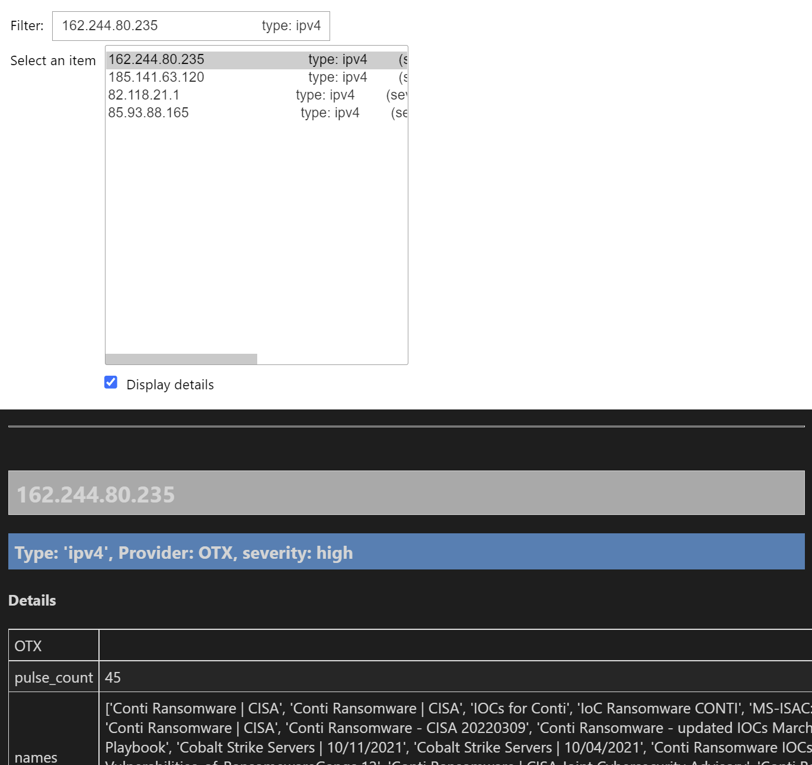
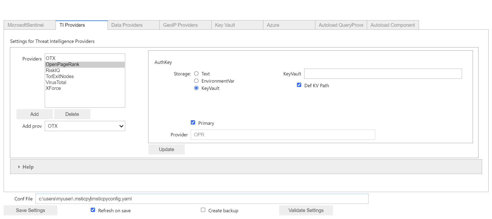
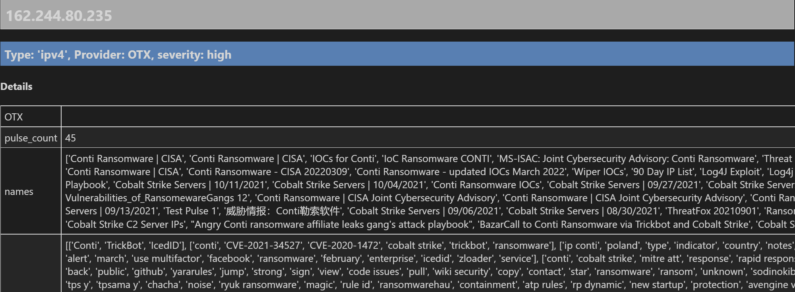
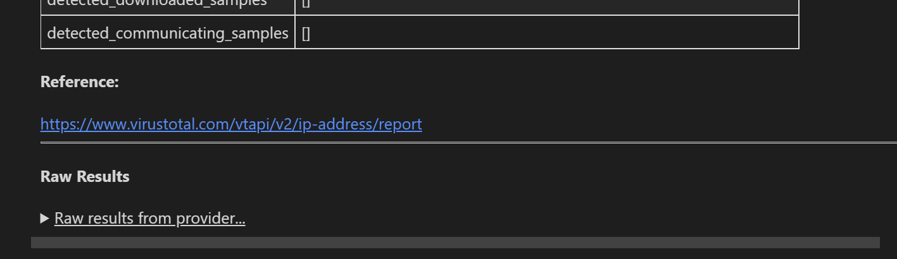

Threat Intel Lookup
===================

This document describes the use of the Threat Intelligence lookup functions
in *MSTICPy*. These of individual or multiple IoCs from
one or more TI providers.

The Threat Intelligence component is broken into the ``TILookup`` class
and multiple provider classes.
You can extend TILookup by subclassing either the ``HttpLookupProvider``
provider or ``TIProvider`` base classes.

Notebook
--------

There is a notebook based on this document available in the MSTICPy
GitHub repo:
`TIProvider Usage Notebook <https://github.com/microsoft/msticpy/blob/master/docs/notebooks/TIProviders.ipynb>`__

Features
--------

-  Supports simultaneous lookup of IoCs against multiple providers.
-  Providers include:

   -  **VirusTotal**
   -  **AlienVault OTX**
   -  **RiskIQ**
   -  **IBM XForce**
   -  **MS Sentinel TI**
   -  **GreyNoise**
   -  **CrowdSec**
   -  **AbuseIPDB**

-  Other pseudo-TI providers are also included:

   -  TOR exit nodes
   -  Open Page Rank
   -  IP Quality Score

-  Supports common IoC Types

   -  IP address
   -  URL
   -  Domain name
   -  File hash
   -  Some providers also support file name/path lookups

-  Requests to individual providers are run asynchronous so there is
   little or no performance penalty in querying multiple
   providers.
-  TI Results browser allows you to step through and examine details
   of TI results from different providers.


Introduction/Quickstart
-----------------------

The content in this section is covered in more detail later in the document.

You can do TI Lookups either from the ``TILookup`` class or from Entity
TI pivot functions.

The latter are more convenient for most cases but one limitation is that
pivot functions only work with IoC/Observable type corresponding to the
entity type (e.g. ``Url.ti.lookup_url()`` cannot be used to look up
IpAddresses.)

For bulk lookup of a mixture of IoC types you should use the TILookup
class ``lookup_iocs`` method.

.. note:: the following operations require TI Provider configuration in
   your msticpyconfig.yaml. Please see the following section
   "Configuring providers".

Initializing MSTICPy
~~~~~~~~~~~~~~~~~~~~

.. code:: python

  import msticpy as mp
  mp.init_notebook();

Using Pivot TI Functions
~~~~~~~~~~~~~~~~~~~~~~~~

.. code:: ipython3

    IpAddress.tilookup_ip("162.244.80.235")

.. parsed-literal::

  Observables processed: 100%|██████████| 3/3 [00:00<00:00, 600.44obs/s]

==============  =========  ================  ==========  ========  ===========  ============================================  ================  =====================================================  ========
Ioc             IocType    SanitizedValue    Provider    Result    Severity     Details                                       RawResult         Reference                                                Status
==============  =========  ================  ==========  ========  ===========  ============================================  ================  =====================================================  ========
162.244.80.235  ipv4       162.244.80.235    RiskIQ      True      high         {'summary': {'resolutions': 12, 'certific..   {'summary': {'..  https://community.riskiq.com                                  0
162.244.80.235  ipv4       162.244.80.235    VirusTotal  True      high         {'verbose_msg': 'IP address in dataset', ..   {'asn': 19624,..  https://www.virustotal.com/vtapi/v2/ip-address/report         0
162.244.80.235  ipv4       162.244.80.235    OTX         True      high         {'pulse_count': 45, 'names': \['Conti Ran..   {'whois': 'htt..  https://otx.alienvault.com/api/v1/indicators/IPv4/1..         0
==============  =========  ================  ==========  ========  ===========  ============================================  ================  =====================================================  ========

For further details see the later section `IoC Lookups using Pivot Functions`_.

For more information on use of pivot functions see
:doc:`../data_analysis/PivotFunctions`.

TILookup
~~~~~~~~

When using the standalone class `TILookup`,
you need to create an instance of this class before calling
`lookup_ioc`.

.. note:: We are passing result to ``TILookup.result_to_df``
   since the single-IoC method by default returns the format
   in a somewhat verbose format.

   For single-IoC lookups, pivot functions are generally recommended.

.. code:: ipython3

    ti_lookup = mp.TILookup()
    # need to pass result to `result_to_df`
    # to get results as a DataFrame
    results_df = mp.TILookup.result_to_df(
        ti_lookup.lookup_ioc("162.244.80.235")
    )
    results_df.head(3)

==============  =========  ================  ==========  ========  ===========  ============================================  ================  =====================================================  ========
Ioc             IocType    SanitizedValue    Provider    Result    Severity     Details                                       RawResult         Reference                                                Status
==============  =========  ================  ==========  ========  ===========  ============================================  ================  =====================================================  ========
162.244.80.235  ipv4       162.244.80.235    RiskIQ      True      high         {'summary': {'resolutions': 12, 'certific..   {'summary': {'..  https://community.riskiq.com                                  0
162.244.80.235  ipv4       162.244.80.235    VirusTotal  True      high         {'verbose_msg': 'IP address in dataset', ..   {'asn': 19624,..  https://www.virustotal.com/vtapi/v2/ip-address/report         0
162.244.80.235  ipv4       162.244.80.235    OTX         True      high         {'pulse_count': 45, 'names': \['Conti Ran..   {'whois': 'htt..  https://otx.alienvault.com/api/v1/indicators/IPv4/1..         0
==============  =========  ================  ==========  ========  ===========  ============================================  ================  =====================================================  ========

For further details see the later section `Looking up IoCs`_.

Multiple observable lookups
~~~~~~~~~~~~~~~~~~~~~~~~~~~

The syntax for pivot functions is unchanged but for
TILookup you need to use a different method: ``lookup_iocs``.

Using Pivot function for IpAddress

.. code:: python

  ips = ['162.244.80.235', '185.141.63.120', '82.118.21.1', '85.93.88.165']

  results_df = IpAddress.tilookup_ip(ips)
  results_df.head(3)

Using the generic lookup_iocs TILookup method. In this case, the
result is already formatted as a DataFrame, so you do not need to use
the results_to_df function.

.. code:: python

  results_df = ti_lookup.lookup_iocs(ips)
  results_df.head(3)

For further details see the later section `Looking up Multiple IoCs`_.

Browse Results
~~~~~~~~~~~~~~

To make it easier to read through the results, MSTICPy has a TI
browser, that allows you to page through individual results.

.. code:: python

  mp.TILookup.browse(results_df)



For further details see the later section `Browsing and Selecting TI Results`_

Configuring TI providers
------------------------

All providers require configuration before TILookup will load the
drivers for the provider.

Most providers need you to register an account and obtain an API key.

For the MS Sentinel TI provider, the configuration is the workspace and
tenant ID of the workspace containing your TI data table.

You can edit your ``msticpyconfig.yaml`` in an editor or use the MSTICPy
config editor.

We’ll use the configuration editor here and then show an example of what
the final msticpyconfig.yaml would look like.

Procedure
~~~~~~~~~

1. Sign up for and obtain an API key (in cases like XForce, you also
   need a user identifier).
2. In the MPConfigEdit “TI Providers” tab, select a provider from the
   **Add prov** selection list and click the **Add** button.
3. Select storage type of “Text” and paste the API/Auth key (and in some
   cases API ID) into the text box.
4. Click on **Update**
5. Repeat for any other providers that you want to add.
6. Verify that the **Conf File** path to your msticpyconfig.yaml is
   correct.
7. Click **Save Settings**

For the current sign-up pages (usually these are in the "Developer"
section of the site), go to the relevant provider site.

.. code:: ipython3

    config = mp.MpConfigEdit()
    config.set_tab("TI Providers")
    config




After saving the file you should see something like the
following in your msticpyconfig.yaml.

.. important:: We do not recommend keeping your API keys stored
  as plain text in your configuration file. You have the option
  to store these as environment variables or as secrets in Azure
  Key Vault. For more information on how to do this see
  :doc:`../getting_started/SettingsEditor` and
  :doc:`../getting_started/msticpyconfig`

The providers should reflect what you picked in the config
editor. The UUIDS for the keys in the example are
fictitious - the format of the keys may differ from what is shown

.. code:: yaml

    TIProviders:
      OTX:
        Args:
          AuthKey: 9e4c7cbf-6b34-47b5-a1a0-535dbec6e790
        Primary: True
        Provider: "OTX"
      VirusTotal:
        Args:
          AuthKey: 13e5e78a-e59d-4a71-95d1-b3ba87422925
        Primary: True
        Provider: "VirusTotal"
      XForce:
        Args:
          ApiID: 269fe6f8-c41c-4255-a90d-bc5025b0305a
          AuthKey: 5bec9a70-24c3-4a0b-9bba-cc87907d039c
        Primary: True
        Provider: "XForce"
      GreyNoise:
        Args:
          AuthKey: d9dde9d4-b848-4cef-b0ee-40d2b23ba088
        Primary: True
        Provider: "GreyNoise"
      AzureSentinel:
        Args:
          WorkspaceID: c7d6a1ad-357b-48b2-8ee1-a2dcbfa2842b
          TenantID: 228d7b5f-4920-4f8e-872f-52072b92b651
        Primary: True
        Provider: "AzSTI"
      CrowdSec:
        Args:
          AuthKey: [PLACEHOLDER]
        Primary: True
        Provider: "CrowdSec"
      AbuseIPDB:
        Args:
          AuthKey: 1234567890
        Primary: True
        Provider: "AbuseIPDB"

You need to tell `TILookup` to refresh its configuration.

After reloading the provider settings, you should see a list
of providers loaded.

.. code:: python

  ti_lookup.reload_providers()
  ti_lookup.provider_status

.. parsed-literal::


  ['OTX - AlientVault OTX Lookup. (primary)',
  'VirusTotal - VirusTotal Lookup. (primary)',
  'XForce - IBM XForce Lookup. (primary)',
  'GreyNoise - GreyNoise Lookup. (primary)',
  'AzSTI - Microsoft Sentinel TI provider class. (primary)',
  'CrowdSec - CrowdSec CTI Smoke Lookup. (primary)',
  'AbuseIPDB - AbuseIPDB Lookup. (primary)']

.. warning:: Depending on the type of account that you
  have with a provider, they will typically impose a limit
  on the number of requests that you can make each minute or
  hour. If you see results returning with a status of 403,
  it is likely that you have temporarily exceed you query
  quota.


.. note:: If you have your MS Sentinel workspace and tenant IDs configured
  as a "Default" entry in the `AzureSentinel` configuration section
  of the `msticpyconfig.yaml` you do not need to set these values for the
  provider here. They will be inherited from the global configuration.
  If you want to use a different workspace for your TI lookups then specify
  the workspace and tenant IDs here. The tenant ID must be the same as
  in both cases though: the Kqlmagic data query library does not support
  access workspaces in multiple tenants from the same notebook.


.. tip:: If you are missing a required parameter for a provider, TILookup
   will throw an exception. You can use the `providers` parameter to
   `TILookup`

   `TILookup(providers=["prov",...])`

   to specify which providers to load and avoid loading any that
   causing problems.


TILookup class
--------------

The TILookup class is the main interface to the TI Functions.

Pivot functions also call the `lookup_iocs` method of this class.

Brief help is shown below. You can read more details about the
attributes and functions in the
:py:mod:`TILookup documentation <msticpy.context.tilookup>`

To use TILookup, you need to create an instance of the class.
Avoid creating lots of instances of this class:

- Each instance caches recent results to avoid unnecessary network requests
  (instances do not share this cache)
- The enabled state of providers is not share across instances.

.. note:: The pivot functions use a single central TILookup instance
  so are not affected by this.

Input to the lookup methods can be a single IoC observable
or a pandas DataFrame (or Python iterable such as a list)
containing multiple observables.

.. note:: the equivalent Pivot functions can accept single values,
  DataFrames or lists/Python iterables as inputs.


:py:mod:`TILookup API documentation<msticpy.context.tilookup>`


Constructor
~~~~~~~~~~~


See :py:class:`TILookup<msticpy.context.tilookup.TILookup>`

.. parsed-literal::


            Initialize TILookup instance.

            Parameters
            ----------
            primary_providers : Optional[List[TIProvider]], optional
                Primary TI Providers, by default None
            secondary_providers : Optional[List[TIProvider]], optional
                Secondary TI Providers, by default None
            providers: Optional[List[str]], optional
                List of provider names to load, by default all available
                providers are loaded. To see the list of available providers
                call `TILookup.list_available_providers()`.
                Note: if primary_provides or secondary_providers is specified
                This will override the providers list.

Methods
~~~~~~~

* :py:meth:`add_provider() <msticpy.context.tilookup.TILookup.add_provider>` - Add a TI provider to the current collection.
* :py:meth:`available_providers <msticpy.context.tilookup.TILookup.available_providers>` - Return a list of built-in providers.
* :py:meth:`list_available_providers() <msticpy.context.tilookup.TILookup.list_available_providers>` - Print a list of built-in providers with
  optional usage. (class method)
* :py:meth:`loaded_providers() <msticpy.context.tilookup.TILookup.loaded_providers>` - Return dictionary of loaded providers.
* :py:meth:`configured_providers <msticpy.context.tilookup.TILookup.configured_providers>` - Return a list of providers with valid configuration
* :py:meth:`disable_provider() <msticpy.context.tilookup.TILookup.disable_provider>` - disable a named provider
* :py:meth:`enable_provider() <msticpy.context.tilookup.TILookup.enable_provider>` - enable a disabled provider
* :py:meth:`set_provider_state() <msticpy.context.tilookup.TILookup.set_provider_state>` - configure multiple providers as enabled/disabled
* :py:meth:`lookup_ioc() <msticpy.context.tilookup.TILookup.lookup_ioc>` - Lookup single IoC in active providers.
* :py:meth:`lookup_iocs() <msticpy.context.tilookup.TILookup.lookup_iocs>` - Lookup a collection of IoCs.
* :py:meth:`provider_status <msticpy.context.tilookup.TILookup.provider_status>` - Return loaded provider status.
* :py:meth:`provider_usage() <msticpy.context.tilookup.TILookup.provider_usage>` - Print usage of loaded providers.
* :py:meth:`reload_provider_settings() <msticpy.context.tilookup.TILookup.reload_provider_settings>` - Reload provider settings from config.
* :py:meth:`reload_providers() <msticpy.context.tilookup.TILookup.reload_providers>` - Reload settings and provider classes.
* :py:meth:`result_to_df() <msticpy.context.tilookup.TILookup.result_to_df>` - Return DataFrame representation of IoC Lookup response.


You can change which providers are loaded from the TILookup constructor.
However, this is usually not needed.

You can change the providers used in each lookup call by
supplying a list of provider names in the ```providers```
parameter. You can also use the ``enable_provider``,
``disable_provider`` and ``set_provider_state`` methods to make individual providers
active and inactive.

.. note:: Using either the constructor parameters or the enable/disable
  methods only affects the current instance of `TILookup`.
  If you create a new instance, the changes to providers
  in previously-created instances have no effect on the state
  of the new instance.
  The instance of TILookup used by the Pivot functions is created
  when MSTICPy is initialized.

Querying and Configuring the Pivot TILookup
-------------------------------------------

Pivot functions use their own instance of TILookup.
To access this instance of TILookup use the Pivot ``providers`` property

.. code:: python

  # Note Pivot is only initialized after running mp.init_notebook()
  mp.pivot.providers["TILookup"]

.. parsed-literal::

  {'OTX': <msticpy.context.tiproviders.alienvault_otx.OTX at 0x2494f626490>,
  'OPR': <msticpy.context.tiproviders.open_page_rank.OPR at 0x2494f626400>,
  'RiskIQ': <msticpy.context.tiproviders.riskiq.RiskIQ at 0x2494f626a60>,
  'Tor': <msticpy.context.tiproviders.tor_exit_nodes.Tor at 0x2494f5b0c10>,
  'VirusTotal': <msticpy.context.tiproviders.virustotal.VirusTotal at 0x2494eca3850>,
  'XForce': <msticpy.context.tiproviders.ibm_xforce.XForce at 0x2494ecae970>}

You can call any of the methods available on standalone TILookup
instances - such as enabling and disabling providers - on this
instance.

Listing Available Providers
---------------------------
The **msticpy** TI Provider library can lookup IoCs in multiple providers.

"Available Providers" means providers that have a MSTICPy *provider
class*, not that they are necessarily either configured or loaded.

The list below shows the currently implemented set of MSTICPy TI providers.

The :py:meth:`list_available_providers <msticpy.context.tilookup.TILookup.list_available_providers>`
class method shows the current set of providers.

.. code:: ipython3

    >>> TILookup.list_available_providers()

    AzSTI
    GreyNoise
    OPR
    OTX
    Tor
    VirusTotal
    XForce
    Intsights
    CrowdSec
    AbuseIPDB

You can view the list of supported query types for each provider
with the ``show_query_types=True`` parameter.
See

.. code:: ipython3

    >>> TILookup.list_available_providers(show_query_types=True)

    AzSTI
    Azure Sentinel TI provider class. Supported query types:
      ioc_type=dns
      ioc_type=file_hash
      ioc_type=hostname
      ioc_type=ipv4
      ioc_type=ipv6
      ioc_type=linux_path
      ...

Loading TI Providers
--------------------

Calling TILookup with no parameters will load all of the available providers
that have a configuration entry in ``msticpyconfig.yaml``
(see `Configuring TI providers`_).
Pivot functions automatically load all configured providers.

.. code:: ipython3

    # load all configured providers
    ti_lookup = TILookup()

You can provide a list of providers to load when
you create an instance of TILookup

.. code:: ipython3

    # Restricting which providers get loaded
    ti_lookup = TILookup(providers=["VirusTotal", "XForce"])
    ti_lookup.provider_status

.. parsed-literal::

    ['VirusTotal - VirusTotal Lookup. (primary)',
     'XForce - IBM XForce Lookup. (primary)']

.. tip:: If you are missing a required parameter for a provider, TILookup
   will throw an exception. You can use the `TILookup(providers=["prov",...])`
   parameter to load only specific providers.


Looking up IoCs
---------------

Lookup a single IoC
~~~~~~~~~~~~~~~~~~~

To lookup a single IoC use :py:meth:`lookup_ioc<msticpy.context.tilookup.TILookup.lookup_ioc>`.

Or you can use the pivot ``ti.lookup_xxx`` function from the
appropriate entity.

Lookup an IoC from a single provider
~~~~~~~~~~~~~~~~~~~~~~~~~~~~~~~~~~~~

And show the output

.. code-block:: ipython3
   :emphasize-lines: 1

    result, details = ti_lookup.lookup_ioc(observable="38.75.137.9", providers=["OTX"])

    print("Positive" if result else "Negative")
    # the details is a list (since there could be multiple responses for an IoC)
    for provider, detail in details:
        print(provider)
        detail.summary
        print("\nRaw Results")
        detail.raw_result_fmt


.. parsed-literal::

    Positive
    OTX
    ioc: 38.75.137.9 ( ipv4 )
    result: True
    {   'names': ['Underminer EK'],
        'pulse_count': 1,
        'references': [   [   'https://blog.malwarebytes.com/threat-analysis/2019/07/exploit-kits-summer-2019-review/']],
        'tags': [[]]}
    reference:  https://otx.alienvault.com/api/v1/indicators/IPv4/38.75.137.9/general

    Raw Results
    { 'area_code': 0,
      'asn': 'AS63023 GTHost',
      'base_indicator': { 'access_reason': '',
                          'access_type': 'public',
                          'content': '',
                          'description': '',
                          'id': 2127020821,
                          'indicator': '38.75.137.9',
                          'title': '',
                          'type': 'IPv4'},
      'charset': 0,
      'city': 'Los Angeles',
      'city_data': True,
      'continent_code': 'NA',
      'country_code': 'US',
      'country_code3': 'USA',
      'country_name': 'United States',
      'dma_code': 803,
      'flag_title': 'United States',
      'flag_url': '/assets/images/flags/us.png',
      'indicator': '38.75.137.9',
      'latitude': 34.0584,
      'longitude': -118.278,
      'postal_code': '90017',
      'pulse_info': { 'count': 1,
                      'pulses': [ { 'TLP': 'white',
                                    'adversary': '',
                                    'attack_ids': [],
                                    'author': { 'avatar_url': 'https://otx.alienvault.com/assets/images/default-avatar.png',
                                                'id': '79520',
                                                'is_following': False,
                                                'is_subscribed': False,
                                                'username': 'mattvittitoe'},
                                    'cloned_from': None,
                                    'comment_count': 0,
                                    ....[truncated for brevity]
                                    'name': 'Underminer EK',
                                    'public': 1,
                                    'pulse_source': 'web',
                                    'references': [ 'https://blog.malwarebytes.com/threat-analysis/2019/07/exploit-kits-summer-2019-review/'],
                                    'subscriber_count': 10,
                                    'tags': [],
                                    'targeted_countries': [],
                                    'threat_hunter_scannable': True,
                                    'upvotes_count': 0,
                                    'validator_count': 0,
                                    'vote': 0,
                                    'votes_count': 0}],
                      'references': [ 'https://blog.malwarebytes.com/threat-analysis/2019/07/exploit-kits-summer-2019-review/']},
      'region': 'CA',
      'reputation': 0,
      'sections': [ 'general',
                    'geo',
                    'reputation',
                    'url_list',
                    'passive_dns',
                    'malware',
                    'nids_list',
                    'httpscans'],
      'type': 'IPv4',
      'type_title': 'IPv4',
      'whois': 'http://whois.domaintools.com/38.75.137.9'}

|

Pivot function syntax

.. code:: python

   IpAddress.ti.lookup_ip("38.75.137.9", providers=["OTX"])


Lookup using all primary providers
~~~~~~~~~~~~~~~~~~~~~~~~~~~~~~~~~~

TILookup syntax

.. code:: ipython3

    result = ti_lookup.lookup_ioc(observable="38.75.137.9")
    ti_lookup.result_to_df(result)


+------------+-------------+--------------+---------+--------------------------------------------------------------------------------------------------------+------------------------------------------------------------------------------------------------------+------------------------------------------------------------------------+--------+
|            | IoC         | IoCType      | Result  | Details                                                                                                | RawResult                                                                                            | Reference                                                              | Status |
+============+=============+==============+=========+========================================================================================================+======================================================================================================+========================================================================+========+
| OTX        | 38.75.137.9 | ipv4         | True    | "{'pulse_count': 1, 'names': ['Underminer EK'], 'tags': [[]], 'references': [['\https://blog.malw..."  | {'sections': ['general', 'geo', 'reputation', 'url_list', 'passive_dns', 'malware', 'nids_list',...} | \https://otx.alienvault.com/api/v1/indicators/IPv4/38.75.137.9/general | 200    |
| VirusTotal | 38.75.137.9 | ipv4         | True    | "{'verbose_msg': 'IP address in dataset', 'response_code': 1, 'detected_urls': ['\http://38.75.13..."  | {'asn': 63023, 'undetected_urls': [['\http://38.75.137.9:9088/', '3d5edb0e0bb726e414a9b76dac619c...} | \https://www.virustotal.com/vtapi/v2/ip-address/report                 | 200    |
| XForce     | 38.75.137.9 | ipv4         | True    | "{'score': 1, 'cats': {}, 'categoryDescriptions': {}, 'reason': 'Regional Internet Registry', 're..."  | {'ip': '38.75.137.9', 'history': [{'created': '2012-03-22T07:26:00.000Z', 'reason': 'Regional In...} | \https://api.xforce.ibmcloud.com/ipr/38.75.137.9                       | 200    |
| AzSTI      | 38.75.137.9 | ipv4         | False   | "0 rows returned."                                                                                     | None                                                                                                 | None                                                                   | -1     |
| GreyNoise  | 38.75.137.9 | ipv4         | False   | "Not found."                                                                                           | &lt;Response [404]&gt;                                                                               | https://api.greynoise.io/v3/community/38.75.137.9                      | 404    |
| CrowdSec   | 38.75.137.9 | ipv4         | False   | "{'Background Noise': 0, 'Overall Score': 0, 'First Seen': '2021-12-26T18:45:00+00:00', 'Last See..."  | {'ip_range_score': 0, 'ip': '38.75.137.9', 'ip_range': '38.75.136.0/23', 'as_name': 'AS-GLOBALTE...} | https://cti.api.crowdsec.net/v2/smoke/38.75.137.9                      | 200    |
| AbuseIPDB  | 38.75.137.9 | ipv4         | True    | "{'countryCode': 'US', 'usage': 'Data Center/Web Hosting/Transit', 'isp': 'GlobalTeleHost Corp.',...}" | {'data': {'ipAddress': '38.75.137.9', 'isPublic': True, 'ipVersion': 4, 'isWhitelisted': None, ...}} | https://api.abuseipdb.com/api/v2/check                                 | 200    |
+------------+-------------+--------------+---------+--------------------------------------------------------------------------------------------------------+------------------------------------------------------------------------------------------------------+------------------------------------------------------------------------+--------+


Pivot function syntax

.. code:: python

   IpAddress.ti.lookup_ip("38.75.137.9")


How to convert a raw result to a DataFrame
~~~~~~~~~~~~~~~~~~~~~~~~~~~~~~~~~~~~~~~~~~

.. note:: The pivot functions always return a DataFrame so
   you do not need to use ``result_to_df``

See :py:meth:`result_to_df<msticpy.context.tilookup.TILookup.result_to_df>`

.. code:: ipython3

    result = ti_lookup.lookup_ioc(observable="38.75.137.9", providers=["OTX"])
    ti_lookup.result_to_df(result).T


+---------------+------------------------------------------------------------------------------------------------------+
|               | OTX                                                                                                  |
+---------------+------------------------------------------------------------------------------------------------------+
| IoC           | 38.75.137.9                                                                                          |
+---------------+------------------------------------------------------------------------------------------------------+
| IoCType       | ipv4                                                                                                 |
+---------------+------------------------------------------------------------------------------------------------------+
| QuerySubtype  | None                                                                                                 |
+---------------+------------------------------------------------------------------------------------------------------+
| Result        | True                                                                                                 |
+---------------+------------------------------------------------------------------------------------------------------+
| Details       | {'pulse_count': 1, 'names': ['Underminer EK'], 'tags': [[]], 'references': [['\https://blog.malw...  |
+---------------+------------------------------------------------------------------------------------------------------+
| RawResult     | {'sections': ['general', 'geo', 'reputation', 'url_list', 'passive_dns', 'malware', 'nids_list',...  |
+---------------+------------------------------------------------------------------------------------------------------+
| Reference     | \https://otx.alienvault.com/api/v1/indicators/IPv4/38.75.137.9/general                               |
+---------------+------------------------------------------------------------------------------------------------------+
| Status        | 200                                                                                                  |
+---------------+------------------------------------------------------------------------------------------------------+

|

.. code:: ipython3

    # Extract a single field (RawResult) from the dataframe (.iloc[0] is to select the row)
    ti_lookup.result_to_df(result)["RawResult"].iloc[0]


.. parsed-literal::

    {'sections': ['general',
      'geo',
      'reputation',
      'url_list',
      'passive_dns',
      'malware',
      'nids_list',
      'httpscans'],
     'city': 'Los Angeles',
     'area_code': 0,
     'pulse_info': {'count': 1,
      'references': ['https://blog.malwarebytes.com/threat-analysis/2019/07/exploit-kits-summer-2019-review/'],
      'pulses': [{'indicator_type_counts': {'URL': 16,
         'FileHash-MD5': 5,
         'IPv4': 3},
        'pulse_source': 'web',
        'TLP': 'white',
        'description': '',
        ...


Looking up Multiple IoCs
------------------------

The pattern for looking up multiple IoCs in a single request is
very similar to a single IoC.

Using TILookup.lookup_iocs
~~~~~~~~~~~~~~~~~~~~~~~~~~

``lookup_iocs`` documentation is available at
:py:meth:`lookup_iocs <msticpy.context.tilookup.TILookup.lookup_iocs>`
Example.

.. code:: ipython3

    ioc_ips = [
        "185.92.220.35",
        "213.159.214.86",
        "77.222.54.202",
        "13.77.161.179",
        "40.76.4.15",
        "40.112.72.205",
        "40.113.200.201",
    ]

    ti_lookup.lookup_iocs(data=ioc_ips, providers="AzSTI")


+---+-----------------+----------+---------------+----------------------------------------+---------+---------+------------------------------------------------------------------------------------------------------+------------------------------------------------------------------------------------------------------+-----------+
|   | IoC             | IoCType  | QuerySubtype  | Reference                              | Result  | Status  | Details                                                                                              | RawResult                                                                                            | Provider  |
+===+=================+==========+===============+========================================+=========+=========+======================================================================================================+======================================================================================================+===========+
| 0 | 213.159.214.86  | ipv4     | None          | ThreatIntelligenceIndicator \| whe...  | True    | 0.0     | {'Action': 'alert', 'ThreatType': 'Malware', 'ThreatSeverity': nan, 'Active': True, 'Description...  | {'IndicatorId': '0164ADB4A6CB7A79FBAE7BE90A43050B090A18364E3855048AC86B9DA5E0A92B', 'TimeGenerat...  | AzSTI     |
+---+-----------------+----------+---------------+----------------------------------------+---------+---------+------------------------------------------------------------------------------------------------------+------------------------------------------------------------------------------------------------------+-----------+
| 1 | 40.113.200.201  | ipv4     | None          | ThreatIntelligenceIndicator \| whe...  | False   | -1.0    | 0 rows returned.                                                                                     | NaN                                                                                                  | AzSTI     |
+---+-----------------+----------+---------------+----------------------------------------+---------+---------+------------------------------------------------------------------------------------------------------+------------------------------------------------------------------------------------------------------+-----------+
| 2 | 91.219.29.81    | ipv4     | None          | ThreatIntelligenceIndicator \| whe...  | True    | 0.0     | {'Action': 'alert', 'ThreatType': 'Malware', 'ThreatSeverity': nan, 'Active': True, 'Description...  | {'IndicatorId': '3F458D91A21866C9037B99D997379A6906573766C0C2F8FB45327A6A15676A0D', 'TimeGenerat...  | AzSTI     |
+---+-----------------+----------+---------------+----------------------------------------+---------+---------+------------------------------------------------------------------------------------------------------+------------------------------------------------------------------------------------------------------+-----------+
| 3 | 89.108.83.196   | ipv4     | None          | ThreatIntelligenceIndicator \| whe...  | True    | 0.0     | {'Action': 'alert', 'ThreatType': 'Malware', 'ThreatSeverity': nan, 'Active': True, 'Description...  | {'IndicatorId': 'C3CA82D5B30A34F4BD6188C9DCFAD9E46D3C0CC45CC4FD969DA3A398DC34B1AE', 'TimeGenerat...  | AzSTI     |
+---+-----------------+----------+---------------+----------------------------------------+---------+---------+------------------------------------------------------------------------------------------------------+------------------------------------------------------------------------------------------------------+-----------+
| 4 | 192.42.116.41   | ipv4     | None          | ThreatIntelligenceIndicator \| whe...  | True    | 0.0     | {'Action': 'alert', 'ThreatType': 'Malware', 'ThreatSeverity': nan, 'Active': True, 'Description...  | {'IndicatorId': '2F321C9D2593B6EF59DEB64B6CB209F375529C429F0DF463D639784E7353AA5D', 'TimeGenerat...  | AzSTI     |
+---+-----------------+----------+---------------+----------------------------------------+---------+---------+------------------------------------------------------------------------------------------------------+------------------------------------------------------------------------------------------------------+-----------+


IoC Lookups using Pivot functions
~~~~~~~~~~~~~~~~~~~~~~~~~~~~~~~~~

Several MSTICPy entities have pivot functions that allow TI lookup.
The type of IoC that they look up corresponds to the type of entity.
For example, ``Url.ti.lookup_url()`` does lookups for URLs,
``File.ti.lookup_file_hash()`` does lookups for file hashes, etc.

The functionality of the pivot TI lookup functions is identical to
``TILookup.lookup_iocs`` (the pivot functions call ``lookup_iocs``
under the covers.). The syntax is also almost identical, with the
exception that you should omit the
``ioc_type`` parameter, since this parameter is automatically supplied by
the pivot subsystem.

Example

.. code:: ipython3

    IpAddress.ti.lookup_ip(data=ioc_ips, providers="AzSTI")

For more information on use of pivot functions see
:doc:`../data_analysis/PivotFunctions`.

Asynchronous operation
~~~~~~~~~~~~~~~~~~~~~~

When using multiple providers, TILookup will send the set of requests to each
provider as an asynchronous operation. It splits the lookup job into
a group of asychronous jobs (one for each provider) that are run
simultaneously and in parallel.

The requests sent to a single provider are sent synchronously - i.e.
one item is sent and a response awaited before the next item is sent.

Asynchronous operation means that a lookup using multiple providers
should take no more time than the same lookup to a single provider -
although the whole job will only complete once the slowest provider
has completed.

Progress of the lookup job is shown using a progress bar.
The request totals shown in the progres bar are
``requested_items * num_providers`` - e.g. a lookup of 10 items
using 5 providers will show a total of 50.

.. parsed-literal::

    Observables processed: 100%|██████████| 50/50 [00:00<00:00, 474.00obs/s]

Multiple IoCs using all providers
~~~~~~~~~~~~~~~~~~~~~~~~~~~~~~~~~

Output sorted by IoC

.. code:: ipython3

    ioc_urls = [
        "http://cheapshirts.us/zVnMrG.php",
        "http://chinasymbolic.com/i9jnrc",
        "http://cetidawabi.com/468fd",
        "http://append.pl/srh9xsz",
        "http://aiccard.co.th/dvja1te",
        "http://ajaraheritage.ge/g7cberv",
        "http://cic-integration.com/hjy93JNBasdas",
        "https://google.com",  # benign
        "https://microsoft.com",  # benign
        "https://python.org",  # benign
    ]
    results = ti_lookup.lookup_iocs(data=ioc_urls)
    results.sort_values("IoC")

.. parsed-literal::

    Observables processed: 100%|██████████| 50/50 [00:00<00:00, 474.00obs/s]

+---+----------------------------------+----------+---------------+---------+------------------------------------------------------------------------------------------------------+------------------------------------------------------------------------------------------------------+-----------------------------------------------------------------------------------------------------+-------------+---------+
|   | IoC                              | IoCType  | QuerySubtype  | Result  | Details                                                                                              | RawResult                                                                                            | Reference                                                                                           | Provider    | Status  |
+===+==================================+==========+===============+=========+======================================================================================================+======================================================================================================+=====================================================================================================+=============+=========+
| 0 | \http://aiccard.co.th/dvja1te    | url      | None          | True    | {'Action': 'alert', 'ThreatType': 'Malware', 'ThreatSeverity': nan, 'Active': True, 'Description...  | {'IndicatorId': 'FAE39C007D6554822504A1E0BDFD788E27DDC748ED63B258651DE52E4FA6D511', 'TimeGenerat...  | ThreatIntelligenceIndicator  | where TimeGenerated >= datetime(2019-07-21T17:30:41.900764Z) | w...  | AzSTI       | 0.0     |
+---+----------------------------------+----------+---------------+---------+------------------------------------------------------------------------------------------------------+------------------------------------------------------------------------------------------------------+-----------------------------------------------------------------------------------------------------+-------------+---------+
| 4 | \http://aiccard.co.th/dvja1te    | url      | None          | True    | {'cats': None, 'categoryDescriptions': None}                                                         | {'result': {'url': 'aiccard.co.th', 'cats': {}, 'score': None, 'categoryDescriptions': {}}, 'ass...  | \https://api.xforce.ibmcloud.com/url/\http://aiccard.co.th/dvja1te                                  | XForce      | NaN     |
+---+----------------------------------+----------+---------------+---------+------------------------------------------------------------------------------------------------------+------------------------------------------------------------------------------------------------------+-----------------------------------------------------------------------------------------------------+-------------+---------+
| 4 | \http://aiccard.co.th/dvja1te    | url      | None          | True    | {'pulse_count': 3, 'names': ['Locky Ransomware Distribution Sites URL blocklist (LY_DS_URLBL)', ...  | {'indicator': '\http://aiccard.co.th/dvja1te', 'alexa': '\http://www.alexa.com/siteinfo/aiccard.c... | \https://otx.alienvault.com/api/v1/indicators/url/\http://aiccard.co.th/dvja1te/general             | OTX         | NaN     |
+---+----------------------------------+----------+---------------+---------+------------------------------------------------------------------------------------------------------+------------------------------------------------------------------------------------------------------+-----------------------------------------------------------------------------------------------------+-------------+---------+
| 4 | \http://aiccard.co.th/dvja1te    | url      | None          | False   | No response from provider.                                                                           | <Response [403]>                                                                                     | \https://www.virustotal.com/vtapi/v2/url/report                                                     | VirusTotal  | NaN     |
+---+----------------------------------+----------+---------------+---------+------------------------------------------------------------------------------------------------------+------------------------------------------------------------------------------------------------------+-----------------------------------------------------------------------------------------------------+-------------+---------+
| 5 | \http://ajaraheritage.ge/g7cberv | url      | None          | True    | {'cats': None, 'categoryDescriptions': None}                                                         | {'result': {'url': 'ajaraheritage.ge', 'cats': {}, 'score': None, 'categoryDescriptions': {}}, '...  | \https://api.xforce.ibmcloud.com/url/\http://ajaraheritage.ge/g7cberv                               | XForce      | NaN     |
+---+----------------------------------+----------+---------------+---------+------------------------------------------------------------------------------------------------------+------------------------------------------------------------------------------------------------------+-----------------------------------------------------------------------------------------------------+-------------+---------+

.. note:: the URLs in the previous example have been altered to prevent
   inadvertent navigation to them.


Inferring IoC type vs specifying explicitly
--------------------------------------------

If you do a lookup without specifying a type, TILookup will try to infer
the type by matching regexes. There are patterns for all supported types
but there are some caveats:

-  The match is not 100% foolproof - e.g. some URLs and hash types may
   be misidentified.
-  The inference adds an overhead to each lookup.

If you know the type that you want to look up, it is always better to
explicitly include it.

- For single IoC lookup, use the ``ioc_type`` parameter.
- For multiple IoC lookups (see below), supply either:

  - a DataFrame with a column that specifies the type for each entry
  - a dictionary of the form ``{ioc_observable: ioc_type}``

Browsing and Selecting TI Results
---------------------------------
To make it easier to walk through the returned results msticpy has a browser.
This shows you the TI results aggregated by the IoC value (e.g. an individual IP
Address or URL) for all providers.


For each provider that returns a result for an IoC, the summarized details
will be shown in a table below the browse list.




Click on ``Raw results from provider...`` to see all returned data.



.. note:: the reference URL may not work if you have not authenticated
   to the TI service.


The value of the selected IoC entry is available as `ti_selector.value`.
You can match this back to the original results DataFrame as follows:

.. code:: IPython

    results[results["Ioc"] == ti_selector.value[0]]


Advanced Provider Usage - Query types
-------------------------------------

Some providers also support special types of sub-query
such as geo-ip and passive-dns. To use these, you specify a
``query_type`` parameter in addition to the corresponding ``ioc_type``.

See :py:meth:`provider_usage<msticpy.context.tilookup.TILookup.provider_usage>`

You can see which providers support special query types with the
``provider_usage`` method.

.. code:: ipython3

    ti_lookup.provider_usage()


.. parsed-literal::

    Primary providers
    -----------------

    Provider class: OTX
    AlientVault OTX Lookup. Supported query types:
      ioc_type=dns
      ioc_type=dns, ioc_query_type=geo
      ioc_type=dns, ioc_query_type=passivedns
      ioc_type=file_hash
      ioc_type=hostname
      ioc_type=ipv4
      ioc_type=ipv4, ioc_query_type=geo
      ioc_type=ipv4, ioc_query_type=passivedns
      ....

    Provider class: XForce
    IBM XForce Lookup. Supported query types:
      ioc_type=dns, ioc_query_type=info
      ioc_type=dns, ioc_query_type=passivedns
      ioc_type=dns, ioc_query_type=whois
      ioc_type=file_hash
      ioc_type=hostname, ioc_query_type=whois
      ioc_type=ipv4
      ioc_type=ipv4, ioc_query_type=malware
      ioc_type=ipv4, ioc_query_type=passivedns
      ioc_type=ipv4, ioc_query_type=rep
      ioc_type=ipv4, ioc_query_type=whois
      ioc_type=ipv6
      ...

    Provider class: GreyNoise
    GreyNoise Lookup. Supported query types:
      ioc_type=ipv4
      ioc_type=ipv4, ioc_query_type=full
      ioc_type=ipv4, ioc_query_type=quick


Use to do a passive DNS lookup
~~~~~~~~~~~~~~~~~~~~~~~~~~~~~~

.. code-block:: ipython3
   :emphasize-lines: 4

    result = ti_lookup.lookup_ioc(
      observable="38.75.137.9",
      ico_type="ipv4",
      ioc_query_type="passivedns",
      providers=["XForce"])
    result


.. parsed-literal::

    (True,
     [('XForce',
       LookupResult(ioc='38.75.137.9', ioc_type='ipv4', query_subtype='passivedns', result=True, details={'records': 1}, raw_result={'Passive': {'query': '0x00000000000000000000ffff264b8909', 'records': []}, 'RDNS': ['9-137-75-38.clients.gthost.com'], 'total_rows': 1}, reference='\https://api.xforce.ibmcloud.com/resolve/38.75.137.9', status=200))])


Specifying Time Ranges
----------------------

Some providers (currently only AzSTI - the Sentinel TI provider) support time ranges
so that you can specify specific periods to search for.

If a provider does not support time ranges, the parameters will be
ignored

.. code-block:: ipython3
   :emphasize-lines: 9,10

    from datetime import datetime
    start = datetime(2021, 8, 5)
    end = datetime(2021, 9, 5)

    # Using this data range returned no results
    ti_lookup.lookup_iocs(
        data=ioc_ips,
        providers="AzSTI",
        start=q_times.start,
        end=q_times.end
    ).head()

+---+-----------------+----------+---------------+-----------------------------------------------------------------------------------------------------+---------+-------------------+---------+-----------+
|   | IoC             | IoCType  | QuerySubtype  | Reference                                                                                           | Result  | Details           | Status  | Provider  |
+===+=================+==========+===============+=====================================================================================================+=========+===================+=========+===========+
| 0 | 213.159.214.86  | ipv4     | None          | ThreatIntelligenceIndicator  | where TimeGenerated >= datetime(2019-08-04T00:00:00Z) | where Ti...  | False   | 0 rows returned.  | -1      | AzSTI     |
| 1 | 40.113.200.201  | ipv4     | None          | ThreatIntelligenceIndicator  | where TimeGenerated >= datetime(2019-08-04T00:00:00Z) | where Ti...  | False   | 0 rows returned.  | -1      | AzSTI     |
| 2 | 91.219.29.81    | ipv4     | None          | ThreatIntelligenceIndicator  | where TimeGenerated >= datetime(2019-08-04T00:00:00Z) | where Ti...  | False   | 0 rows returned.  | -1      | AzSTI     |
| 3 | 89.108.83.196   | ipv4     | None          | ThreatIntelligenceIndicator  | where TimeGenerated >= datetime(2019-08-04T00:00:00Z) | where Ti...  | False   | 0 rows returned.  | -1      | AzSTI     |
| 4 | 192.42.116.41   | ipv4     | None          | ThreatIntelligenceIndicator  | where TimeGenerated >= datetime(2019-08-04T00:00:00Z) | where Ti...  | False   | 0 rows returned.  | -1      | AzSTI     |
+---+-----------------+----------+---------------+-----------------------------------------------------------------------------------------------------+---------+-------------------+---------+-----------+


.. code:: ipython3

    from datetime import datetime
    search_origin = datetime(2019, 8, 5)
    q_times = nbwidgets.QueryTime(
        units="day",
        auto_display=True,
        origin_time=search_origin,
        max_after=24,
        max_before=24
    )

    # Using a wider ranges produces results
    ti_lookup.lookup_iocs(
        data=ioc_ips,
        providers="AzSTI",
        start=q_times.start,
        end=q_times.end
    )


+---+-----------------+----------+---------------+-----------------------------------------------------------------------------------------------------+---------+---------+------------------------------------------------------------------------------------------------------+------------------------------------------------------------------------------------------------------+-----------+
|   | IoC             | IoCType  | QuerySubtype  | Reference                                                                                           | Result  | Status  | Details                                                                                              | RawResult                                                                                            | Provider  |
+===+=================+==========+===============+=====================================================================================================+=========+=========+======================================================================================================+======================================================================================================+===========+
| 0 | 213.159.214.86  | ipv4     | None          | ThreatIntelligenceIndicator  | where TimeGenerated >= datetime(2019-07-12T00:00:00Z) | where Ti...  | True    | 0.0     | {'Action': 'alert', 'ThreatType': 'Malware', 'ThreatSeverity': nan, 'Active': True, 'Description...  | {'IndicatorId': '0164ADB4A6CB7A79FBAE7BE90A43050B090A18364E3855048AC86B9DA5E0A92B', 'TimeGenerat...  | AzSTI     |
+---+-----------------+----------+---------------+-----------------------------------------------------------------------------------------------------+---------+---------+------------------------------------------------------------------------------------------------------+------------------------------------------------------------------------------------------------------+-----------+
| 1 | 40.113.200.201  | ipv4     | None          | ThreatIntelligenceIndicator  | where TimeGenerated >= datetime(2019-07-12T00:00:00Z) | where Ti...  | False   | -1.0    | 0 rows returned.                                                                                     | NaN                                                                                                  | AzSTI     |
+---+-----------------+----------+---------------+-----------------------------------------------------------------------------------------------------+---------+---------+------------------------------------------------------------------------------------------------------+------------------------------------------------------------------------------------------------------+-----------+
| 2 | 91.219.29.81    | ipv4     | None          | ThreatIntelligenceIndicator  | where TimeGenerated >= datetime(2019-07-12T00:00:00Z) | where Ti...  | True    | 0.0     | {'Action': 'alert', 'ThreatType': 'Malware', 'ThreatSeverity': nan, 'Active': True, 'Description...  | {'IndicatorId': '3F458D91A21866C9037B99D997379A6906573766C0C2F8FB45327A6A15676A0D', 'TimeGenerat...  | AzSTI     |
+---+-----------------+----------+---------------+-----------------------------------------------------------------------------------------------------+---------+---------+------------------------------------------------------------------------------------------------------+------------------------------------------------------------------------------------------------------+-----------+
| 3 | 89.108.83.196   | ipv4     | None          | ThreatIntelligenceIndicator  | where TimeGenerated >= datetime(2019-07-12T00:00:00Z) | where Ti...  | True    | 0.0     | {'Action': 'alert', 'ThreatType': 'Malware', 'ThreatSeverity': nan, 'Active': True, 'Description...  | {'IndicatorId': 'C3CA82D5B30A34F4BD6188C9DCFAD9E46D3C0CC45CC4FD969DA3A398DC34B1AE', 'TimeGenerat...  | AzSTI     |
+---+-----------------+----------+---------------+-----------------------------------------------------------------------------------------------------+---------+---------+------------------------------------------------------------------------------------------------------+------------------------------------------------------------------------------------------------------+-----------+
| 4 | 192.42.116.41   | ipv4     | None          | ThreatIntelligenceIndicator  | where TimeGenerated >= datetime(2019-07-12T00:00:00Z) | where Ti...  | True    | 0.0     | {'Action': 'alert', 'ThreatType': 'Malware', 'ThreatSeverity': nan, 'Active': True, 'Description...  | {'IndicatorId': '2F321C9D2593B6EF59DEB64B6CB209F375529C429F0DF463D639784E7353AA5D', 'TimeGenerat...  | AzSTI     |
+---+-----------------+----------+---------------+-----------------------------------------------------------------------------------------------------+---------+---------+------------------------------------------------------------------------------------------------------+------------------------------------------------------------------------------------------------------+-----------+
