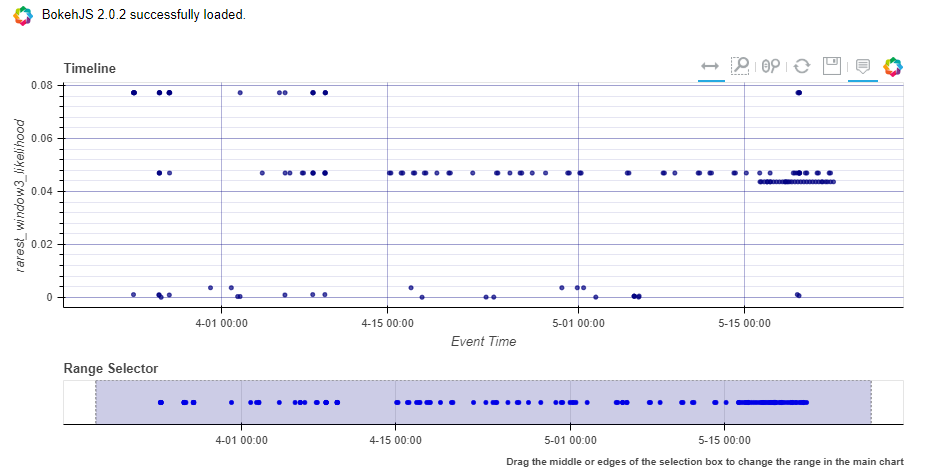
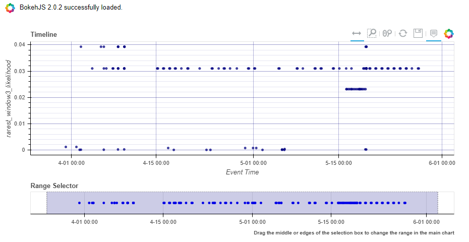
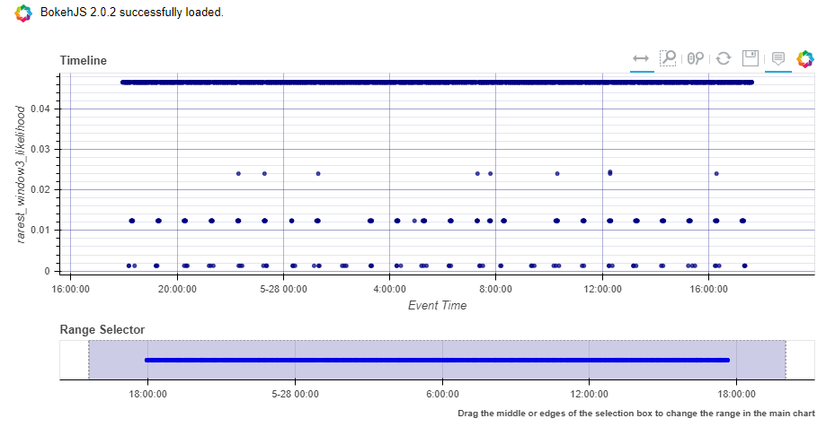
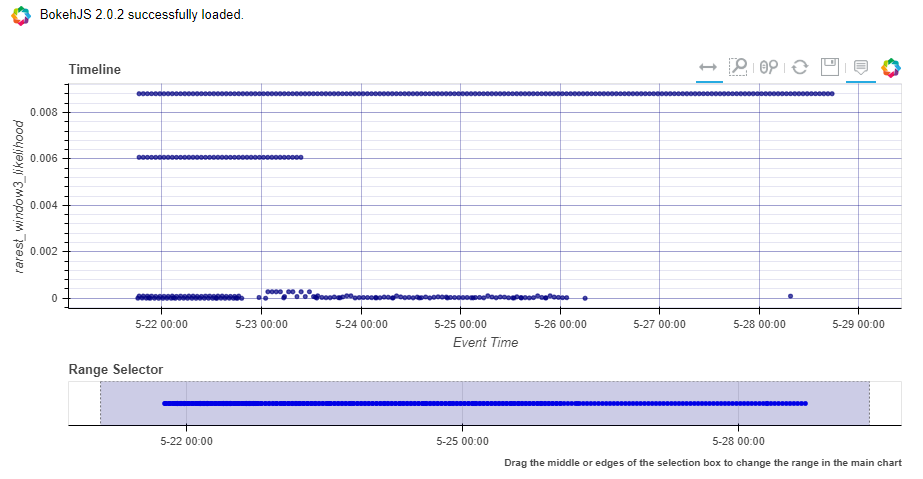

Anomalous Sessions
==================

Various types of security logs can be broken up into sessions/sequences
where each session can be thought of as an ordered sequence of events.

For example, we could treat the Exchange PowerShell cmdlets
("Set-Mailbox", "Set-MailboxFolderPermission" etc)
as "events" and then group the events into "sessions" on a per-user
basis.

It can be useful to model such sessions in order to understand what the
usual activity is like so that we can highlight anomalous sequences of
events.

`Msticpy <https://github.com/microsoft/msticpy/tree/master/msticpy/analysis/anomalous_sequence>`__
has a subpackage called anomalous\_sequence. This library allows the user to sessionize, model and
visualize their data via some high level functions.

We demonstrate how to use this subpackage on some Office Exchange Admin
logs from one of our demo tenants. There is a section at the end where we
demonstrate how some other log types can be sessionized as well.

.. code:: ipython3

    # Imports
    from msticpy.common.utility import check_py_version

    MIN_REQ_PYTHON = (3, 6)
    check_py_version(MIN_REQ_PYTHON)

    from typing import List, Dict, Union

    # setting pandas display options for dataframe
    import pandas as pd
    pd.set_option("display.max_rows", 100)
    pd.set_option("display.max_columns", 50)
    pd.set_option("display.max_colwidth", 100)

    # msticpy imports
    from msticpy.analysis.anomalous_sequence import sessionize
    from msticpy.analysis.anomalous_sequence.utils.data_structures import Cmd
    from msticpy.analysis.anomalous_sequence import anomalous
    from msticpy.analysis.anomalous_sequence.model import Model
    from msticpy.data import QueryProvider
    from msticpy.common.wsconfig import WorkspaceConfig

    %env KQLMAGIC_LOAD_MODE=silent

    print('finished the imports')

Creating the Sessions
---------------------

What is a Session?
^^^^^^^^^^^^^^^^^^

In this context, a session is an ordered sequence of events/commands.
The anomalous\_sequence subpackage can handle 3 different formats for
each of the sessions:

| 1. sequence of just events/commands.

.. code::

    ["Set-User", "Set-Mailbox"]

| 2. sequence of events/commands with accompanying parameters.

.. code::

    [Cmd(name="Set-User", params={"Identity', "Force"}),
     Cmd(name="Set-Mailbox", params={"Identity", "AuditEnabled"})]

| 3. sequence of events/commands with accompanying parameters and their
 corresponding values.

.. code::

   [Cmd(name="Set-User", params={"Identity": "blahblah", "Force": 'true'}),
    Cmd(name="Set-Mailbox", params={"Identity": "blahblah", "AuditEnabled": "false"})]

The Cmd datatype can be accessed from
msticpy.analysis.anomalous\_sequence.utils.data\_structures

Creating your sessions
^^^^^^^^^^^^^^^^^^^^^^

In this section, we demonstrate how you can use msticpy to create
sessions from your data.

We read in some office exchange events from one of our demo tenants as a
csv. (The csv can be found `here <https://github.com/microsoft/msticpy/tree/master/docs/notebooks/data>`__)

.. code:: ipython3

    exchange = pd.read_csv('data/demo_exchange_data.csv')

.. code:: ipython3

    exchange.head()

.. raw:: html

    

    
    <table border="1" class="dataframe">
      <thead>
        <tr style="text-align: right;">
          <th></th>
          <th>TimeGenerated</th>
          <th>UserId</th>
          <th>ClientIP</th>
          <th>Operation</th>
          <th>Parameters</th>
        </tr>
      </thead>
      <tbody>
        <tr>
          <th>0</th>
          <td>2020-04-18T04:50:30Z</td>
          <td>NaN</td>
          <td>NaN</td>
          <td>Set-ConditionalAccessPolicy</td>
          <td>[\n  {\n    "Name": "Identity",\n    "Value": "seccxpninja.onmicrosoft.com\\6490d00c-7ba1-42cf-a...</td>
        </tr>
        <tr>
          <th>1</th>
          <td>2020-04-18T04:50:31Z</td>
          <td>NaN</td>
          <td>NaN</td>
          <td>Set-ConditionalAccessPolicy</td>
          <td>[\n  {\n    "Name": "Identity",\n    "Value": "seccxpninja.onmicrosoft.com\\ba36f0a4-6d73-4ba4-9...</td>
        </tr>
        <tr>
          <th>2</th>
          <td>2020-04-18T04:50:30Z</td>
          <td>NaN</td>
          <td>NaN</td>
          <td>Set-ConditionalAccessPolicy</td>
          <td>[\n  {\n    "Name": "Identity",\n    "Value": "seccxpninja.onmicrosoft.com\\5fd0c4ff-1cd7-4bf6-8...</td>
        </tr>
        <tr>
          <th>3</th>
          <td>2020-04-18T04:50:30Z</td>
          <td>NaN</td>
          <td>NaN</td>
          <td>Set-ConditionalAccessPolicy</td>
          <td>[\n  {\n    "Name": "Identity",\n    "Value": "seccxpninja.onmicrosoft.com\\b2915792-0396-4abe-9...</td>
        </tr>
        <tr>
          <th>4</th>
          <td>2020-04-18T04:50:30Z</td>
          <td>NaN</td>
          <td>NaN</td>
          <td>Set-ConditionalAccessPolicy</td>
          <td>[\n  {\n    "Name": "Identity",\n    "Value": "seccxpninja.onmicrosoft.com\\83a057fb-dbca-4ba8-b...</td>
        </tr>
      </tbody>
    </table>
    

In the above example the ``Operation`` column will be our Cmd name.

If you are only interested in modeling the commands (without the
accompanying parameters), then you can skip this section and go straight
to the next section, "Use the sessionize data function".

In this section we will create some additonal columns to extract the parameters
and parameter values. This is optional because each session is allowed to be either a
list of strings, or a list of the Cmd datatype. The "Operation" column
is a string already.

However, if you are interested in including the parameters (and possibly
the values), then we need to define a custom cleaning function which will
combine the "Operation" and "Parameters" columns and convert them into one
of the `allowed types <#what-is-a-session>`_. This cleaning function is specific
to the format of the exchange demo data which we have read in.
Therefore, you may need to tweak it before you can use it on other data
sets.

.. code:: ipython3

    # let's define a helper function for creating columns which have the Cmd datatype

    def clean_exchange_params(operation: str, parameters: Union[str, Dict], include_vals: bool):
        params = parameters
        if isinstance(parameters, str):
            params = eval(params)
        new = dict()
        for dic in params:
            new[dic['Name']] = dic['Value']
        if include_vals:
            return Cmd(name=operation, params=new)
        return Cmd(name=operation, params=set(new.keys()))

.. code:: ipython3

    # let's apply the helper function we defined to create columns which have the Cmd datatype

    exchange['cmd_param'] = exchange.\
        apply(lambda x:
              clean_exchange_params(operation=x['Operation'], parameters=x['Parameters'], include_vals=False), axis=1)

    exchange['cmd_param_val'] = exchange.\
        apply(lambda x:
              clean_exchange_params(operation=x['Operation'], parameters=x['Parameters'], include_vals=True), axis=1)

Use the sessionize\_data function
^^^^^^^^^^^^^^^^^^^^^^^^^^^^^^^^^

We will do this for the first session type (just commands and ignoring parameters).

However, because we created columns for all three session types in the previous
section, you can set the ``event_col`` parameter in the ``sessionize_data`` function below to
any of the following:

1. Operation
2. cmd\_param
3. cmd\_param\_val

Here are some details about the arguments for the ``sessionize_data``
function:

::

    Help on function sessionize_data in module msticpy.analysis.anomalous_sequence.sessionize:

    sessionize_data(data: pd.DataFrame, user_identifier_cols: List[str], time_col: str,
               max_session_time_mins: int, max_event_separation_mins: int,
               event_col: str) -> pd.DataFrame

        Sessionize the input data.

        In particular, the resulting dataframe will have 1 row per session. It will contain the
        following columns: the user_identifier_cols, <time_col>_min, <time_col>_max,
        <event_col>_list, duration (<time_col>_max - <time_col>_min), number_events (length of the
        <event_col>_list value)

        Parameters
        ----------
        data: pd.DataFrame
            This dataframe should contain at least the following columns:
                - time stamp column
                - columns related to user name and/or computer name and/or ip address etc
                - column containing an event
        user_identifier_cols: List[str]
            Name of the columns which contain username and/or computer name and/or ip address etc.
            Each time the value of one of these columns changes, a new session will be started.
        time_col: str
            Name of the column which contains a time stamp.
            If this column is not already in datetime64[ns, UTC] format, it will be casted to it.
        max_session_time_mins: int
            The maximum length of a session in minutes. If a sequence of events for the same
            user_identifier_cols values exceeds this length, then a new session will be started.
        max_event_separation_mins: int
            The maximum length in minutes between two events in a session. If we have 2 events for
            the same user_identifier_cols values, and if those two events are more than
            `max_event_separation_mins` apart, then a new session will be started.
        event_col: str
            Name of the column which contains the event of interest.
            For example, if we are interested in sessionizing exchange admin commands,
            the "event_col" could contain values like: "Set-Mailbox" or "Set-User" etc.

        Returns
        -------
        pd.DataFrame containing the sessionized data. 1 row per session.

.. code:: ipython3

    # sessionize the data

    sessions_df = sessionize.sessionize_data(
        data=exchange,
        user_identifier_cols=['UserId', 'ClientIP'],
        time_col='TimeGenerated',
        max_session_time_mins=20,
        max_event_separation_mins=2,
        event_col='Operation'
    )

.. code:: ipython3

    sessions_df.shape

.. parsed-literal::

    (400, 7)

.. code:: ipython3

    sessions_df.head()

.. raw:: html

    

    
    <table border="1" class="dataframe">
      <thead>
        <tr style="text-align: right;">
          <th></th>
          <th>UserId</th>
          <th>ClientIP</th>
          <th>TimeGenerated_min</th>
          <th>TimeGenerated_max</th>
          <th>Operation_list</th>
          <th>duration</th>
          <th>number_events</th>
        </tr>
      </thead>
      <tbody>
        <tr>
          <th>0</th>
          <td>NAMPRD06\Administrator (Microsoft.Office.Datacenter.Torus.PowerShellWorker)</td>
          <td>NaN</td>
          <td>2020-05-12 01:34:59+00:00</td>
          <td>2020-05-12 01:35:02+00:00</td>
          <td>[Set-ConditionalAccessPolicy, Set-ConditionalAccessPolicy, Set-ConditionalAccessPolicy, Set-Cond...</td>
          <td>00:00:03</td>
          <td>13</td>
        </tr>
        <tr>
          <th>1</th>
          <td>NAMPRD06\Administrator (Microsoft.Office.Datacenter.Torus.PowerShellWorker)</td>
          <td>NaN</td>
          <td>2020-05-12 04:48:43+00:00</td>
          <td>2020-05-12 04:48:46+00:00</td>
          <td>[Set-ConditionalAccessPolicy, Set-ConditionalAccessPolicy, Set-ConditionalAccessPolicy, Set-Cond...</td>
          <td>00:00:03</td>
          <td>13</td>
        </tr>
        <tr>
          <th>2</th>
          <td>NAMPRD06\Administrator (Microsoft.Office.Datacenter.Torus.PowerShellWorker)</td>
          <td>NaN</td>
          <td>2020-05-20 02:18:27+00:00</td>
          <td>2020-05-20 02:18:31+00:00</td>
          <td>[Set-ConditionalAccessPolicy, Set-ConditionalAccessPolicy, Set-ConditionalAccessPolicy, Set-Cond...</td>
          <td>00:00:04</td>
          <td>14</td>
        </tr>
        <tr>
          <th>3</th>
          <td>NAMPRD06\Administrator (Microsoft.Office.Datacenter.Torus.PowerShellWorker)</td>
          <td>NaN</td>
          <td>2020-05-20 05:12:55+00:00</td>
          <td>2020-05-20 05:12:58+00:00</td>
          <td>[Set-ConditionalAccessPolicy, Set-ConditionalAccessPolicy, Set-ConditionalAccessPolicy, Set-Cond...</td>
          <td>00:00:03</td>
          <td>14</td>
        </tr>
        <tr>
          <th>4</th>
          <td>NAMPRD06\Administrator (Microsoft.Office.Datacenter.Torus.PowerShellWorker)</td>
          <td>NaN</td>
          <td>2020-05-21 01:50:12+00:00</td>
          <td>2020-05-21 01:50:13+00:00</td>
          <td>[Set-ConditionalAccessPolicy, Set-ConditionalAccessPolicy, Set-ConditionalAccessPolicy, Set-Cond...</td>
          <td>00:00:01</td>
          <td>14</td>
        </tr>
      </tbody>
    </table>
    

Model the sessions
------------------

Model Details
^^^^^^^^^^^^^

We will give a brief description of how the modelling works under the
hood for each of the three session types.

-  **Commands only**

   -  We treat the sessions as an ordered sequence of commands.
   -  We apply the Markov assumption where we assume each command
      depends only on the command immediately before it.
   -  This means the likelihood of each session can be computed by
      multiplying a sequence of transition probabilities together.
   -  We use a sliding window (e.g. of length 3) throughout each session
      and then use the likelihood of the rarest window as the score for
      the session.

-  **Commands with Parameters**

   -  All of the above ("commands only" case) except for one difference
      - this time, we include the parameters in the modelling.
   -  We make the assumption that the presence of each parameter is
      independent conditional on the command.
   -  We therefore model the presence of the parameters as independent
      Bernoulli random variables (conditional on the command)
   -  So to compute the likelihood of a session, each transition
      probability (of the commands) will be accompanied by a product of
      probabilities (for the parameters).
   -  A subtlety to note, is that we take the geometric mean of the
      product of parameter probabilities. This is so we don't penalise
      commands which happen to have more parameters set than on average.
   -  We use the same sliding window approach used with the "commands
      only" case.

-  **Commands with Parameters and their Values**

   -  All of the above ("commands with parameters" case) except that
      the parameter values are also included in the modelling.
   -  Some rough heuristics are used to determine which parameters have
      values which are categorical (e.g. "true" and "false" or "high",
      "medium" and "low") vs values which are arbitrary strings (such as
      email addresses). There is the option to override the
      "modellable\_params" directly in the Model class.
   -  We also make the assumption that the values depend only on the
      parameters and not on the command.
   -  So to compute the likelihood of a session, each transition
      probability (of the commands) will be accompanied by a product of
      probabilities (for the parameters and categorical values).
   -  We use the same sliding window approach used with the "commands
      only" case.

.. Important::
   If you set the window length to be k, then only sessions which have at
   least k-1 commands will have a valid (not np.nan) score. The reason for
   the -1 is because we append an end token to each session by default, so
   a session of length k-1 gets treated as length k during the scoring.

**There are 3 high level functions available in this library**

1. score\_sessions
2. visualize\_scored\_sessions
3. score\_and\_visualize\_sessions

Use the score\_sessions function
^^^^^^^^^^^^^^^^^^^^^^^^^^^^^^^^

In this example, we will do this for the "Commands Only" session type.

.. tip:: Depending on which column you chose as the event\_col in the
   `sessionize\_data function <#use-the-sessionize-data-function>`_, you could set the
   "session\_column" parameter in the "score\_sessions" function below to
   any of the following:

    1. Operation\_list
    2. cmd\_param\_list
    3. cmd\_param\_val\_list

Here are some details about the arguments for the ``score_sessions``
function:

::

    Help on function score_sessions in module msticpy.analysis.anomalous_sequence.anomalous:

    score_sessions(data: pd.DataFrame, session_column: str, window_length: int) -> pd.DataFrame

        Model sessions using a sliding window approach within a markov model.

        Parameters
        ----------
        data: pd.DataFrame
            Dataframe which contains at least a column for sessions
        session_column: str
            name of the column which contains the sessions
            The values in the session column should take one of the following formats:
                examples formats of a session:
                1) ['Set-User', 'Set-Mailbox']
                2) [Cmd(name='Set-User', params={'Identity', 'Force'}),
                    Cmd(name='Set-Mailbox', params={'Identity', 'AuditEnabled'})]
                3) [Cmd(
                        name='Set-User',
                        params={'Identity': 'blahblah', 'Force': 'true'}
                    ),
                    Cmd(
                        name='Set-Mailbox',
                        params={'Identity': 'blahblah', 'AuditEnabled': 'false'}
                    )]
            The Cmd datatype can be accessed from
            anomalous_sequence.utils.data_structures.Cmd
        window_length: int
            length of the sliding window to use when computing the likelihood
            metrics for each session.
            This should be set to an integer >= 2. Note that sessions which have
            fewer commands than the chosen window_length + 1 will end up with a
            np.nan score. (The + 1 is because we append a dummy `end_token` to each
            session before starting the sliding window, so a session of length 2,
            would be treated as length 3)

        Returns
        -------
        input dataframe with two additional columns appended.

This function will return a dataframe with two additonal columns appended:
``rarest_window3_likelihood`` and ``rarest_window3``

.. code:: ipython3

    modelled_df = anomalous.score_sessions(
        data=sessions_df,
        session_column='Operation_list',
        window_length=3
    )

Let's view the resulting dataframe in ascending order of the computed likelihood metric

.. code:: ipython3

    modelled_df.sort_values('rarest_window3_likelihood').head()

.. raw:: html

    

    
    <table border="1" class="dataframe">
      <thead>
        <tr style="text-align: right;">
          <th></th>
          <th>UserId</th>
          <th>ClientIP</th>
          <th>TimeGenerated_min</th>
          <th>TimeGenerated_max</th>
          <th>Operation_list</th>
          <th>duration</th>
          <th>number_events</th>
          <th>rarest_window3_likelihood</th>
          <th>rarest_window3</th>
        </tr>
      </thead>
      <tbody>
        <tr>
          <th>157</th>
          <td>NaN</td>
          <td>NaN</td>
          <td>2020-03-26 22:40:30+00:00</td>
          <td>2020-03-26 22:40:33+00:00</td>
          <td>[New-Mailbox, Set-Mailbox]</td>
          <td>00:00:03</td>
          <td>2</td>
          <td>0.000021</td>
          <td>[New-Mailbox, Set-Mailbox]</td>
        </tr>
        <tr>
          <th>216</th>
          <td>NaN</td>
          <td>NaN</td>
          <td>2020-04-17 21:00:31+00:00</td>
          <td>2020-04-17 21:00:31+00:00</td>
          <td>[New-App, New-App]</td>
          <td>00:00:00</td>
          <td>2</td>
          <td>0.000028</td>
          <td>[New-App, New-App]</td>
        </tr>
        <tr>
          <th>261</th>
          <td>NaN</td>
          <td>NaN</td>
          <td>2020-05-06 01:49:17+00:00</td>
          <td>2020-05-06 01:50:56+00:00</td>
          <td>[Enable-AddressListPaging, New-ExchangeAssistanceConfig, Set-TransportConfig, Install-DefaultSha...</td>
          <td>00:01:39</td>
          <td>48</td>
          <td>0.000063</td>
          <td>[Set-ExchangeAssistanceConfig, Set-TransportConfig, Set-RecipientEnforcementProvisioningPolicy]</td>
        </tr>
        <tr>
          <th>247</th>
          <td>NaN</td>
          <td>NaN</td>
          <td>2020-05-02 11:31:53+00:00</td>
          <td>2020-05-02 11:33:14+00:00</td>
          <td>[Enable-AddressListPaging, New-ExchangeAssistanceConfig, Set-TransportConfig, Install-DefaultSha...</td>
          <td>00:01:21</td>
          <td>49</td>
          <td>0.000081</td>
          <td>[Set-ExchangeAssistanceConfig, Set-AdminAuditLogConfig, Set-TenantObjectVersion]</td>
        </tr>
        <tr>
          <th>224</th>
          <td>NaN</td>
          <td>NaN</td>
          <td>2020-04-23 21:42:48+00:00</td>
          <td>2020-04-23 21:44:45+00:00</td>
          <td>[Enable-AddressListPaging, New-ExchangeAssistanceConfig, Set-TransportConfig, Install-DefaultSha...</td>
          <td>00:01:57</td>
          <td>49</td>
          <td>0.000085</td>
          <td>[Set-OwaMailboxPolicy, Set-Mailbox, Add-MailboxPermission]</td>
        </tr>
      </tbody>
    </table>
    

We can view individual sessions in more detail

.. code:: ipython3

    modelled_df.sort_values('rarest_window3_likelihood').rarest_window3.iloc[0]

.. parsed-literal::

    ['New-Mailbox', 'Set-Mailbox']

Access the Model Class Directly
^^^^^^^^^^^^^^^^^^^^^^^^^^^^^^^

Users who would like to have more control over the arguments used during
the modelling can access the Model class directly.

In particular, the user can specify whether start and end tokens
are used during the likelihood calculations and also whether the
geometric mean is used.

There is also the option to specify the ``modellable_params`` argument if
you do not wish for rough heuristics to be used to determine which
parameters take categorical values and are hence suitable for modelling.
For example, if you wish to experiment with modelling the values of all the
parameters (categorical + arbitrary strings), then you can use this
argument to do so.

Here are some details about the methods available for the Model class:

::

    Help on class Model in module msticpy.analysis.anomalous_sequence.model:

    class Model(builtins.object)
     |  Model(sessions: List[List[Union[str, msticpy.analysis.anomalous_sequence.utils.data_structures.Cmd]]], modellable_params: set = None)
     |  Class for modelling sessions data.
     |
     |  Methods defined here:
     |
     |  __init__(self, sessions: List[List[Union[str, msticpy.analysis.anomalous_sequence.utils.data_structures.Cmd]]], modellable_params: set = None)
     |      Instantiate the Model class.
     |
     |      This Model class can be used to model sessions, where each
     |      session is a sequence of commands. We use a sliding window
     |      approach to calculate the rarest part of each session. We
     |      can view the sessions in ascending order of this metric to
     |      see if the top sessions are anomalous/malicious.
     |
     |      Parameters
     |      ----------
     |      sessions: List[List[Union[str, Cmd]]]
     |          list of sessions, where each session is a list of either
     |          strings or a list of the Cmd datatype.
     |
     |          The Cmd datatype should have "name" and "params" as attributes
     |          where "name" is the name of the command (string) and "params"
     |          is either a set of accompanying params or a dict of
     |          accompanying params and values.
     |
     |          examples formats of a session:
     |              1) ['Set-User', 'Set-Mailbox']
     |              2) [Cmd(name='Set-User', params={'Identity', 'Force'}),
     |                  Cmd(name='Set-Mailbox', params={'Identity', 'AuditEnabled'})]
     |              3) [Cmd(
     |                      name='Set-User',
     |                      params={'Identity': 'blahblah', 'Force': 'true'}
     |                  ),
     |                  Cmd(name='Set-Mailbox',
     |                  params={'Identity': 'blahblah', 'AuditEnabled': 'false'})]
     |      modellable_params: set, optional
     |          set of params which you deem to have categorical values which are suitable
     |          for modelling.
     |          Note this argument will only have an effect if your sessions include commands,
     |          params and values. If your sessions include commands, params and values and
     |          this argument is not set, then some rough heuristics will be used to determine
     |          which params have values which are suitable for modelling.
     |
     |  compute_geomean_lik_of_sessions(self)
     |      Compute the geometric mean of the likelihood for each of the sessions.
     |
     |      This is done by raising the likelihood of the session to the power of
     |      (1 / k) where k is the length of the session.
     |
     |      Note: If the lengths (number of commands) of the sessions vary a lot,
     |      then you may not be able to fairly compare the likelihoods between a
     |      long session and a short session. This is because longer sessions
     |      involve multiplying more numbers together which are between 0 and 1.
     |      Therefore the length of the session will be negatively correlated with
     |      the likelihoods. If you take the geometric mean of the likelihood, then
     |      you can compare the likelihoods more fairly across different session
     |      lengths.
     |
     |  compute_likelihoods_of_sessions(self, use_start_end_tokens: bool = True)
     |      Compute the likelihoods for each of the sessions.
     |
     |      Note: If the lengths (number of commands) of the sessions vary a lot,
     |      then you may not be able to fairly compare the likelihoods between a
     |      long session and a short session. This is because longer sessions
     |      involve multiplying more numbers together which are between 0 and 1.
     |      Therefore the length of the session will be negatively correlated with
     |      the likelihoods. If you take the geometric mean of the likelihood, then
     |      you can compare the likelihoods more fairly across different session
     |      lengths
     |
     |      Parameters
     |      ----------
     |      use_start_end_tokens: bool
     |          if True, then `start_token` and `end_token` will be prepended
     |          and appended to the session respectively before the calculations
     |          are done
     |
     |  compute_rarest_windows(self, window_len: int, use_start_end_tokens: bool = True, use_geo_mean: bool = False)
     |      Find the rarest window and corresponding likelihood for each session.
     |
     |      In particular, uses a sliding window approach to find the rarest window
     |      and corresponding likelihood for that window for each session.
     |
     |      If we have a long session filled with benign activity except for a small
     |      window of suspicious behaviour, then this approach should be able to
     |      identity the session as anomalous. This approach should be more
     |      effective than simply taking the geometric mean of the full session
     |      likelihood. This is because the small window of suspicious behaviour
     |      might get averaged out by the majority benign behaviour in the session
     |      when using the geometric mean approach.
     |
     |      Note that if we have a session of length k, and we use a sliding window
     |      of length k+1, then we will end up with np.nan for the rarest window
     |      likelihood metric for that session. However, if `use_start_end_tokens`
     |      is set to True, then because we will be appending self.end_token to the
     |      session, the session will be treated as a session of length k+1,
     |      therefore, we will end up with a non np.nan value.
     |
     |      Parameters
     |      ----------
     |      window_len: int
     |          length of sliding window for likelihood calculations
     |      use_start_end_tokens: bool
     |          if True, then `start_token` and `end_token` will be prepended
     |          and appended to each
     |          session respectively before the calculations are done
     |      use_geo_mean: bool
     |          if True, then each of the likelihoods of the sliding windows
     |          will be raised to the power
     |          of (1/`window_len`)
     |
     |  compute_scores(self, use_start_end_tokens: bool)
     |      Compute some likelihood based scores/metrics for each of the sessions.
     |
     |      In particular, computes the likelihoods and geometric mean of
     |      the likelihoods for each of the sessions. Also, uses the sliding
     |      window approach to compute the rarest window likelihoods for each
     |      of the sessions. It does this for windows of length 2 and 3.
     |
     |      Note that if we have a session of length k, and we use a sliding
     |      window of length k+1, then we will end up with np.nan for the
     |      rarest window likelihood metric for that session.
     |      However, if `use_start_end_tokens` is set to True, then
     |      because we will be appending self.end_token to the session,
     |      the session will be treated as a session of length k+1,
     |      therefore, we will end up with a non np.nan value for that session.
     |
     |      Parameters
     |      ----------
     |      use_start_end_tokens: bool
     |          if True, then self.start_token and self.end_token will be
     |          prepended and appended to each
     |          of the sessions respectively before the calculations are done.
     |
     |  compute_setof_params_cond_cmd(self, use_geo_mean: bool)
     |      Compute likelihood of combinations of params conditional on the cmd.
     |
     |      In particular, go through each command from each session and
     |      compute the probability of that set of params (and values if provided)
     |      appearing conditional on the command.
     |
     |      This can help us to identify unlikely combinations of params
     |      (and values if provided) for each distinct command.
     |
     |      Note, this method is only available if each session is a list
     |       of the Cmd datatype. It will result in an Exception if you
     |       try and use it when each session is a list of strings.
     |
     |      Parameters
     |      ----------
     |      use_geo_mean: bool
     |          if True, then the probabilities will be raised to
     |          the power of (1/K)
     |          case1: we have only params:
     |              Then K is the number of distinct params which appeared
     |              for the given cmd across all the sessions.
     |          case2: we have params and values:
     |              Then K is the number of distinct params which appeared
     |              for the given cmd across all the sessions + the number
     |              of values which we included in the modelling for this cmd.
     |
     |  train(self)
     |      Train the model by computing counts and probabilities.
     |
     |      In particular, computes the counts and probabilities of the commands
     |      (and possibly the params if provided, and possibly the values if provided)
     |

.. code:: ipython3

   model = Model(sessions=sessions_df.Operation_list.values.tolist())
   model.train()
   model.compute_rarest_windows(window_len=2)
   model.rare_window_likelihoods[2][:5]

.. parsed-literal::

    [0.06277653078978894,
     0.06277653078978894,
     0.06277653078978894,
     0.06277653078978894,
     0.06277653078978894]

Visualise the Modelled Sessions
-------------------------------

Use the visualise\_scored\_sessions function
^^^^^^^^^^^^^^^^^^^^^^^^^^^^^^^^^^^^^^^^^^^^

Now we demonstrate the visualization component of the library.

We do this using the ``visualise_scored_sessions`` function. This
function returns an interactive timeline plot which allows you to zoom
into different sections etc.

-  The time of the session will be on the x-axis.
-  The computed likelihood metric will be on the y-axis.
-  lower likelihoods correspond to rarer sessions.

.. important::
   During the scoring/modelling stage, if you set the window length to be
   k, then only sessions which have at least k-1 commands will appear in
   the interactive timeline plot. This is because sessions with fewer than
   k-1 commands will have a score of np.nan. The reason for the -1 is
   because we append an end token to each session by default, so a session
   of length k-1 gets treated as length k during the scoring.

Here are some details about the arguments for the
visualise\_scored\_sessions function:

::

    Help on function visualise_scored_sessions in module msticpy.analysis.anomalous_sequence.anomalous:

    visualise_scored_sessions(data_with_scores: pandas.core.frame.DataFrame,
                              time_column: str,
                              score_column: str, window_column: str,
                              score_upper_bound: float = None,
                              source_columns: list = None)

        Visualise the scored sessions on an interactive timeline.

        Parameters
        ----------
        data_with_scores: pd.DataFrame
            Dataframe which contains at least columns for time,
            session score, window representing the session
        time_column: str
            name of the column which contains a timestamp
        score_column: str
            name of the column which contains a numerical score for each
            of the sessions
        window_column: str
            name of the column which contains a representation of each of the sessions.
            This representation will appear in the tooltips in the figure.
            For example, it could be the rarest window of the session,
            or the full session etc.
        score_upper_bound: float, optional
            an optional upper bound on the score for the visualisation figure.
            This can help to zoom in on the more anomalous sessions
        source_columns: list, optional
            an optional list of source columns to include in the tooltips
            in the visualisation.
            Note, the content of each of these columns should be json serializable
            in order to be compatible with the figure

        Returns
        -------
        figure

Visualise the scored sessions in an interactive timeline plot.

.. code:: ipython3

    anomalous.visualise_scored_sessions(
        data_with_scores=modelled_df,
        time_column='TimeGenerated_min',  # this will appear in the x-axis
        score_column='rarest_window3_likelihood',  # this will appear on the y-axis
        window_column='rarest_window3',  # this will represent the session in the tool-tips
        source_columns=['UserId', 'ClientIP']  # specify any additonal columns to appear in the tool-tips
    )

Use the score\_and\_visualise\_sessions function
^^^^^^^^^^^^^^^^^^^^^^^^^^^^^^^^^^^^^^^^^^^^^^^^

Now we demonstrate how you can score and visualise your sessions in one go.

We will do this for the "Commands only" session type.

But depending on which column you chose as the event\_col in the
`sessionize\_data function <#use-the-sessionize-data-function>`_, you could set the
"session\_column" parameter in the "score\_and\_visualise\_sessions"
function below to any of the following:

1. Operation\_list
2. cmd\_param\_list
3. cmd\_param\_val\_list

Here are some details about the arguments for the
``score_and_visualise_sessions`` function:

::

    Help on function score_and_visualise_sessions in module msticpy.analysis.anomalous_sequence.anomalous:

    score_and_visualise_sessions(data: pandas.core.frame.DataFrame, session_column: str, window_length: int, time_column: str, likelihood_upper_bound: float = None, source_columns: list = None)

        Model sessions and then produce an interactive timeline visualisation plot.

        In particular, the sessions are modelled using a sliding window approach
        within a markov model. The visualisation plot has time on the x-axis and
        the modelled session likelihood metric on the y-axis.

        Parameters
        ----------
        data: pd.DataFrame
            Dataframe which contains at least columns for time and sessions
        session_column: str
            name of the column which contains the sessions
            The values in the session column should take one of the following formats:
                examples formats of a session:
                1) ['Set-User', 'Set-Mailbox']
                2) [Cmd(name='Set-User', params={'Identity', 'Force'}),
                    Cmd(name='Set-Mailbox', params={'Identity', 'AuditEnabled'})]
                3) [Cmd(
                        name='Set-User',
                        params={'Identity': 'blahblah', 'Force': 'true'}
                    ),
                    Cmd(
                        name='Set-Mailbox',
                        params={'Identity': 'blahblah', 'AuditEnabled': 'false'}
                    )]
            The Cmd datatype can be accessed from
            seqeunce.utils.data_structures.Cmd
        window_length: int
            length of the sliding window to use when computing the
            likelihood metrics for each session.

            This should be set to an integer >= 2.
            Note that sessions which have fewer commands than the chosen
            window_length + 1 will not appear in the visualisation. (The + 1 is
            because we append a dummy `end_token` to each session before starting
            the sliding window, so a session of length 2, would be treated as length
            3)
        time_column: str
            name of the column which contains a timestamp
        likelihood_upper_bound: float, optional
            an optional upper bound on the likelihood metrics for the visualisation
            plot. This can help to zoom in on the more anomalous sessions
        source_columns: list, optional
            An optional list of source columns to include in the tooltips
            in the visualisation.
            Note, the content of each of these columns should be json
            serializable in order to be compatible with the figure

        Returns
        -------
        figure

Let's model and visualise these sessions in one go

.. code:: ipython3

    anomalous.score_and_visualise_sessions(
        data=sessions_df,
        session_column='Operation_list',
        window_length=3,
        time_column='TimeGenerated_min',
        source_columns=['UserId', 'ClientIP']
    )

Other Log Types + KQL
---------------------

The aim of this section is to provide some starter guidance on how one
might start to sessionize + model some other types of logs. We
demonstrate how to use KQL to sessionize directly.

In order to do the sessionizing using KQL, we use the
`row\_window\_session <https://docs.microsoft.com/azure/data-explorer/kusto/query/row-window-session-function>`__
function.

.. important:: Throughout this section, the decisions made about which
   columns should be interpreted as commands/events and parameters are
   meant to be illustrative; alternative approaches may also be valid.

Using LogAnalytics Query Provider
^^^^^^^^^^^^^^^^^^^^^^^^^^^^^^^^^

msticpy has a QueryProvider class which you can use to connect to your
Log Analytics data environment.

.. code:: ipython3

    # Try to read workspace configuration from msticpyconfig.yaml, and then authenticate
    try:
        ws_config = WorkspaceConfig(workspace='Default')
        qry_prov = QueryProvider(data_environment="LogAnalytics")
        qry_prov.connect(connection_str=ws_config.code_connect_str)
    except:
        print('There is an issue with reading in the config file. Please fill in the following manually.')
        tenant_id = input("Please enter your Log Analytics tenant id:")
        workspace_id = input("Please enter your Log Analytics workspace id:")
        la_connection_string = 'loganalytics://code().tenant("{}").workspace("{}")'.format(tenant_id, workspace_id)
        qry_prov = QueryProvider(data_environment="LogAnalytics")
        qry_prov.connect(connection_str=la_connection_string)

Office Activity Logs
^^^^^^^^^^^^^^^^^^^^

The cell below contains a kusto query which queries the OfficeActivity
table in Log Analytics. In this example, we wish for the sessions to be
on a per UserId - ClientIP basis. In addition, we require that each
session be no longer than 20 minutes in total, with each command no more
than 2 minutes apart from each other. (These requirements can be
adjusted for different data-sets/use-cases etc).

Here are some high level steps to the query:

-  Add a time filter which goes back far enough so you have enough data
   to train the model.
-  Filter to the desired type of logs.
-  Exclude some known automated users (optional)
-  Sort the rows by UserId, ClientIp, TimeGenerated in ascending order
-  Use the native KQL function row\_window\_session to create an
   additional "begin" column to aid creating the sessions
-  Summarize the commands (and optionally parameters) by UserId,
   ClientIp, begin
-  Optionally exclude sessions which have only 1 command

Note that in KQL, comments are made using //

.. code:: ipython3

    # write kql query
    query = """
    let time_back = 60d;
    OfficeActivity
    | where TimeGenerated >= ago(time_back)
    //
    // filter to the event type of interest
    | where RecordType == 'ExchangeAdmin'
    //
    // exclude some known automated users
    | where UserId !startswith "NT AUTHORITY" and UserId !contains "prod.outlook.com"
    //
    // create new dynamic variable with the command as the key, and the parameters as the values
    | extend params = todynamic(strcat('{"', Operation, '" : ', tostring(Parameters), '}'))
    | project TimeGenerated, UserId, ClientIP, Operation, params
    //
    // sort by the user related columns and the timestamp column in ascending order
    | sort by UserId asc, ClientIP asc, TimeGenerated asc
    //
    // calculate the start time of each session into the "begin" variable
    // With each session max 20 mins in length with each event at most 2 mins apart.
    // A new session is created each time one of the user related columns change.
    | extend begin = row_window_session(TimeGenerated, 20m, 2m, UserId != prev(UserId) or ClientIP != prev(ClientIP))
    //
    // summarize the operations and the params by the user related variables and the "begin" variable
    | summarize cmds=makelist(Operation), end=max(TimeGenerated), nCmds=count(), nDistinctCmds=dcount(Operation),
    params=makelist(params) by UserId, ClientIP, begin
    //
    //optionally specify an order to the final columns
    | project UserId, ClientIP, nCmds, nDistinctCmds, begin, end, duration=end-begin, cmds, params
    //
    // optionally filter out sessions which contain only one event
    //| where nCmds > 1
    """

.. code:: ipython3

    # execute the query
    exchange_df = qry_prov.exec_query(query=query)
    # I comment out this cell and run it again once it has run to prevent the notebook from slowing down

.. code:: ipython3

    try:
        print(exchange_df.shape)
    except AttributeError as e:
        exchange_df = _kql_raw_result_.to_dataframe()
        print(exchange_df.shape)

.. parsed-literal::

    (252, 9)

.. code:: ipython3

    exchange_df.head()

.. raw:: html

    

    
    <table border="1" class="dataframe">
      <thead>
        <tr style="text-align: right;">
          <th></th>
          <th>UserId</th>
          <th>ClientIP</th>
          <th>nCmds</th>
          <th>nDistinctCmds</th>
          <th>begin</th>
          <th>end</th>
          <th>duration</th>
          <th>cmds</th>
          <th>params</th>
        </tr>
      </thead>
      <tbody>
        <tr>
          <th>0</th>
          <td></td>
          <td></td>
          <td>2</td>
          <td>2</td>
          <td>2020-03-31 02:19:26+00:00</td>
          <td>2020-03-31 02:19:28+00:00</td>
          <td>00:00:02</td>
          <td>[Remove-MailboxLocation, Set-User]</td>
          <td>[{'Remove-MailboxLocation': [{'Name': 'Identity', 'Value': '4b2462a4-bbee-495a-a0e1-f23ae524cc9c...</td>
        </tr>
        <tr>
          <th>1</th>
          <td></td>
          <td></td>
          <td>1</td>
          <td>1</td>
          <td>2020-03-31 22:02:51+00:00</td>
          <td>2020-03-31 22:02:51+00:00</td>
          <td>00:00:00</td>
          <td>[Set-User]</td>
          <td>[{'Set-User': [{'Name': 'Identity', 'Value': '4b2462a4-bbee-495a-a0e1-f23ae524cc9c\\a2409f54-2a3...</td>
        </tr>
        <tr>
          <th>2</th>
          <td></td>
          <td></td>
          <td>2</td>
          <td>2</td>
          <td>2020-04-01 20:12:19+00:00</td>
          <td>2020-04-01 20:12:55+00:00</td>
          <td>00:00:36</td>
          <td>[Remove-MailboxLocation, Set-User]</td>
          <td>[{'Remove-MailboxLocation': [{'Name': 'Identity', 'Value': '4b2462a4-bbee-495a-a0e1-f23ae524cc9c...</td>
        </tr>
        <tr>
          <th>3</th>
          <td></td>
          <td></td>
          <td>3</td>
          <td>2</td>
          <td>2020-04-02 09:01:22+00:00</td>
          <td>2020-04-02 09:01:38+00:00</td>
          <td>00:00:16</td>
          <td>[Remove-MailboxLocation, Remove-MailboxLocation, Set-User]</td>
          <td>[{'Remove-MailboxLocation': [{'Name': 'Identity', 'Value': '4b2462a4-bbee-495a-a0e1-f23ae524cc9c...</td>
        </tr>
        <tr>
          <th>4</th>
          <td></td>
          <td></td>
          <td>1</td>
          <td>1</td>
          <td>2020-04-02 13:49:42+00:00</td>
          <td>2020-04-02 13:49:42+00:00</td>
          <td>00:00:00</td>
          <td>[Set-ConditionalAccessPolicy]</td>
          <td>[{'Set-ConditionalAccessPolicy': [{'Name': 'Identity', 'Value': 'seccxpninja.onmicrosoft.com\\64...</td>
        </tr>
      </tbody>
    </table>
    

Convert Exchange Sessions to Correct Format for the Model
~~~~~~~~~~~~~~~~~~~~~~~~~~~~~~~~~~~~~~~~~~~~~~~~~~~~~~~~~~

Recall the allowed session types `here <#what-is-a-session>`__

So let's see what needs to be done to the exchange\_df

-  The "cmds" column is already in a suitable format of type (1). This
   is because it is a list of strings.
-  If we wish to also include the parameters (and optionally the
   corresponding values) to the model, then we need to transform the
   "params" column slightly

.. code:: ipython3

    # define a helper function for converting the sessions with params (and values) into a suitable format

    def process_exchange_session(session_with_params: [List[Dict[str, List[Dict[str, str]]]]], include_vals: bool) -> List[Cmd]:
        """
        Converts an exchange session with params to an allowed format.

        Parameters
        ----------
        param session_with_params : list
            example format:
            [
                {'Set-Mailbox': [{'Name': 'MessageCopyForSentAsEnabled', 'Value': 'True'},
                {'Name': 'Identity', 'Value': 'blahblah@blah.com'}]}
            ]
        include_vals : bool
            if True, then it will be transformed to a format which includes the values,
            else the output will just contain the parameters

        Returns
        -------
        list :
            list of the Cmd data type which includes either just the parameters,
            or also the corresponding values
        """
        new_ses = []
        for cmd in session_with_params:
            c = list(cmd.keys())[0]
            par = list(cmd.values())[0]
            new_pars = set()
            if include_vals:
                new_pars = dict()
            for p in par:
                if include_vals:
                    new_pars[p['Name']] = p['Value']
                else:
                    new_pars.add(p['Name'])
            new_ses.append(Cmd(name=c, params=new_pars))
        return new_ses

Let's create suitable sessions for params, and suitable sessions for params + values

.. code:: ipython3

    sessions = exchange_df.cmds.values.tolist()
    param_sessions = []
    param_value_sessions = []

    for ses in exchange_df.params.values.tolist():
        new_ses_set = process_exchange_session(session_with_params=ses, include_vals=False)
        new_ses_dict = process_exchange_session(session_with_params=ses, include_vals=True)
        param_sessions.append(new_ses_set)
        param_value_sessions.append(new_ses_dict)

Let's see the differences between the three types of sessions.

.. code:: ipython3

    ind = 0

    print(sessions[ind][:3])
    print(param_sessions[ind][:3])
    print(param_value_sessions[ind][:3])

.. parsed-literal::

    ['Remove-MailboxLocation', 'Set-User']
    [Cmd(name='Remove-MailboxLocation', params={'ErrorAction', 'Identity', 'Confirm'}), Cmd(name='Set-User', params={'ErrorAction', 'Identity', 'SyncMailboxLocationGuids'})]
    [Cmd(name='Remove-MailboxLocation', params={'Identity': '4b2462a4-bbee-495a-a0e1-f23ae524cc9c\\b81afc79-520a-4143-bbc4-b8cadc11d007', 'Confirm': 'False', 'ErrorAction': 'Stop'}), Cmd(name='Set-User', params={'Identity': '4b2462a4-bbee-495a-a0e1-f23ae524cc9c\\a2409f54-2a30-4647-ba61-3cb44edc1a5a', 'SyncMailboxLocationGuids': 'True', 'ErrorAction': 'Stop'})]

.. code:: ipython3

    # let's add these reformatted sessions as columns to a dataframe
    data = exchange_df
    data['session'] = sessions
    data['param_session'] = param_sessions
    data['param_value_session'] = param_value_sessions

Now we will model and visualise these sessions in one go using the
``score_and_visualise_sessions`` function.

Since we created columns for all 3 session types, the session\_column
argument can be set to any of the following:

-  session
-  param\_session
-  param\_value\_session

.. code:: ipython3

    # let's model and visualise these sessions in one go

    anomalous.score_and_visualise_sessions(
        data=data,
        session_column='param_session',
        window_length=3,
        time_column='begin',
        source_columns=['UserId', 'ClientIP']
    )

AWS Cloud Trail Logs
^^^^^^^^^^^^^^^^^^^^

The cell below contains a kusto query which queries the AWSCloudTrail
table in Log Analytics. In this example, we wish for the sessions to be
on a per UserId - ClientIP - UserAgent - role basis. In addition, we
require that each session be no longer than 20 minutes in total, with
each command no more than 2 minutes apart from each other. (These
requirements can be adjusted for different data-sets/use-cases etc).

Note we choose a much shorter time\_back in this KQL query. This is just
because the AWS Cloud Trail logs have a lot more data when compared with
the exchange admin logs for this demo tenant. We therefore choose a
shorter time back purely to prevent this demo notebook from slowing
down.

.. code:: ipython3

    query = """
    let time_back = 1d;
    AWSCloudTrail
    | where TimeGenerated >= ago(time_back)
    //
    // filter to the event type of interest
    | where EventTypeName == 'AwsApiCall'
    //
    // optionally exclude some rows which are not suitable for your use case
    | where UserIdentityPrincipalid != '' and SessionIssuerUserName != ''
    //
    // create dynamic param variable which has the EventName as the key and the RequestParameters as the values
    | extend par = iff(RequestParameters == '', '{}', RequestParameters)
    | extend param = todynamic(strcat('{"', EventName, '": ', tostring(par), '}'))
    //
    // rename some columns
    | project TimeGenerated, Operation=EventName, UserId=UserIdentityPrincipalid, ClientIP=SourceIpAddress, UserAgent, role=SessionIssuerUserName, param
    //
    // sort by the user related columns and the timestamp column in ascending order
    | order by UserId asc, ClientIP asc, UserAgent asc, role asc, TimeGenerated asc
    //
    // calculate the start time of each session into the "begin" variable
    // With each session max 20 mins in length with each event at most 2 mins apart.
    // A new session is created each time one of the user related columns change.
    | extend begin = row_window_session(TimeGenerated, 20m, 2m, UserId != prev(UserId) or ClientIP != prev(ClientIP) or UserAgent != prev(UserAgent) or role != prev(role))
    //
    // summarize the operations and the params by the user related variables and the "begin" variable
    | summarize cmds=makelist(Operation), end=max(TimeGenerated), nCmds=count(), nDistinctCmds=dcount(Operation), UserAgent=any(UserAgent), role=any(role), params=makelist(param) by UserId, ClientIP, begin
    //
    // optionally specify an order to the final columns
    | project UserId, ClientIP, nCmds, nDistinctCmds, begin, end, duration=end-begin, role, UserAgent, cmds, params
    //
    //optionally filter out sessions which contain only one event
    | where nCmds > 1
    """

Execute the query

.. code:: ipython3

    aws_df = qry_prov.exec_query(query=query)
    # I comment out this cell and run it again once it has run to prevent the
    # notebook from slowing down

.. code:: ipython3

    try:
        print(aws_df.shape)
    except AttributeError as e:
        aws_df = _kql_raw_result_.to_dataframe()
        print(aws_df.shape)

.. parsed-literal::

    (2689, 11)

.. code:: ipython3

    aws_df.head()

.. raw:: html

    

    
    <table border="1" class="dataframe">
      <thead>
        <tr style="text-align: right;">
          <th></th>
          <th>UserId</th>
          <th>ClientIP</th>
          <th>nCmds</th>
          <th>nDistinctCmds</th>
          <th>begin</th>
          <th>end</th>
          <th>duration</th>
          <th>role</th>
          <th>UserAgent</th>
          <th>cmds</th>
          <th>params</th>
        </tr>
      </thead>
      <tbody>
        <tr>
          <th>0</th>
          <td>AROA3WIKNJYL5IERDHCJX:0e1059bf-bb62-449c-bca4-90871edc48b1</td>
          <td>13.68.133.167</td>
          <td>15</td>
          <td>1</td>
          <td>2020-05-28 04:18:17+00:00</td>
          <td>2020-05-28 04:18:18+00:00</td>
          <td>00:00:01</td>
          <td>Ashwin-AzSentinel</td>
          <td>aws-sdk-dotnet-45/3.3.100.7 aws-sdk-dotnet-core/3.3.100.7 .NET_Runtime/4.0 .NET_Framework/4.0 OS...</td>
          <td>[LookupEvents, LookupEvents, LookupEvents, LookupEvents, LookupEvents, LookupEvents, LookupEvent...</td>
          <td>[{'LookupEvents': {'startTime': 'May 28, 2020 3:57:26 AM', 'endTime': 'May 28, 2020 4:02:26 AM'}...</td>
        </tr>
        <tr>
          <th>1</th>
          <td>AROA3WIKNJYL5IERDHCJX:0e1059bf-bb62-449c-bca4-90871edc48b1</td>
          <td>13.68.133.167</td>
          <td>14</td>
          <td>1</td>
          <td>2020-05-28 04:23:23+00:00</td>
          <td>2020-05-28 04:23:23+00:00</td>
          <td>00:00:00</td>
          <td>Ashwin-AzSentinel</td>
          <td>aws-sdk-dotnet-45/3.3.100.7 aws-sdk-dotnet-core/3.3.100.7 .NET_Runtime/4.0 .NET_Framework/4.0 OS...</td>
          <td>[LookupEvents, LookupEvents, LookupEvents, LookupEvents, LookupEvents, LookupEvents, LookupEvent...</td>
          <td>[{'LookupEvents': {'startTime': 'May 28, 2020 4:02:26 AM', 'endTime': 'May 28, 2020 4:07:26 AM'}...</td>
        </tr>
        <tr>
          <th>2</th>
          <td>AROA3WIKNJYL5IERDHCJX:0e1059bf-bb62-449c-bca4-90871edc48b1</td>
          <td>40.87.53.92</td>
          <td>14</td>
          <td>1</td>
          <td>2020-05-28 04:13:08+00:00</td>
          <td>2020-05-28 04:13:09+00:00</td>
          <td>00:00:01</td>
          <td>Ashwin-AzSentinel</td>
          <td>aws-sdk-dotnet-45/3.3.100.7 aws-sdk-dotnet-core/3.3.100.7 .NET_Runtime/4.0 .NET_Framework/4.0 OS...</td>
          <td>[LookupEvents, LookupEvents, LookupEvents, LookupEvents, LookupEvents, LookupEvents, LookupEvent...</td>
          <td>[{'LookupEvents': {'startTime': 'May 28, 2020 3:52:26 AM', 'endTime': 'May 28, 2020 3:57:26 AM'}...</td>
        </tr>
        <tr>
          <th>3</th>
          <td>AROA3WIKNJYL5IERDHCJX:0e1059bf-bb62-449c-bca4-90871edc48b1</td>
          <td>40.87.53.92</td>
          <td>16</td>
          <td>1</td>
          <td>2020-05-28 04:42:30+00:00</td>
          <td>2020-05-28 04:42:30+00:00</td>
          <td>00:00:00</td>
          <td>Ashwin-AzSentinel</td>
          <td>aws-sdk-dotnet-45/3.3.100.7 aws-sdk-dotnet-core/3.3.100.7 .NET_Runtime/4.0 .NET_Framework/4.0 OS...</td>
          <td>[LookupEvents, LookupEvents, LookupEvents, LookupEvents, LookupEvents, LookupEvents, LookupEvent...</td>
          <td>[{'LookupEvents': {'startTime': 'May 28, 2020 4:22:26 AM', 'endTime': 'May 28, 2020 4:27:26 AM'}...</td>
        </tr>
        <tr>
          <th>4</th>
          <td>AROA3WIKNJYL5IERDHCJX:0e1059bf-bb62-449c-bca4-90871edc48b1</td>
          <td>52.170.0.208</td>
          <td>16</td>
          <td>1</td>
          <td>2020-05-28 04:02:45+00:00</td>
          <td>2020-05-28 04:02:45+00:00</td>
          <td>00:00:00</td>
          <td>Ashwin-AzSentinel</td>
          <td>aws-sdk-dotnet-45/3.3.100.7 aws-sdk-dotnet-core/3.3.100.7 .NET_Runtime/4.0 .NET_Framework/4.0 OS...</td>
          <td>[LookupEvents, LookupEvents, LookupEvents, LookupEvents, LookupEvents, LookupEvents, LookupEvent...</td>
          <td>[{'LookupEvents': {'startTime': 'May 28, 2020 3:42:26 AM', 'endTime': 'May 28, 2020 3:47:26 AM'}...</td>
        </tr>
      </tbody>
    </table>
    

Convert AWS sessions to the correct format for the model
~~~~~~~~~~~~~~~~~~~~~~~~~~~~~~~~~~~~~~~~~~~~~~~~~~~~~~~~~

Recall the allowed session types `here <#what-is-a-session>`__

So let's see what needs to be done to the aws\_df

The "cmds" column is already in a suitable format of type (1). This is
because it is a list of strings. If we wish to also include the
parameters (and optionally the corresponding values) to the model, then
we need to transform the "params" column slightly

.. code:: ipython3

    # define a helper function for converting the sessions with params (and values) into a suitable format

    def process_aws_session(session_with_params: List[Dict[str, Dict[str, any]]], include_vals: bool) -> List[Cmd]:
        """
        Converts an aws session with params to an allowed format.

        Parameters
        ----------
        session_with_params: example format:
            [
                {'GetAuthorizationToken': {'registryIds': ['424246']}},
                {'GetAuthorizationToken': {'registryIds': ['424246', '654321']}}
            ]
            Note that the accompanying values for the parameters can take dynamic
            types like dict, list etc.
            However, when we transform the aws session into an allowed format,
            the value will be cast into a string type.

        include_vals: bool
            if True, then it will be transformed to a format which
            includes the values, else the output will just contain the parameters

        Returns
        -------
        list :
            list of the Cmd data type which includes either just the parameters,
            or also the corresponding values
        """
        new_ses = []
        for cmd in session_with_params:
            c = list(cmd.keys())[0]
            par = list(cmd.values())[0]
            new_pars = set()
            if include_vals:
                new_pars = dict()
            for p, v in par.items():
                if include_vals:
                    new_pars[p] = str(v)
                else:
                    new_pars.add(p)
            new_ses.append(Cmd(name=c, params=new_pars))
        return new_ses

Let's create suitable sessions for params, and suitable sessions for params + values.

.. code:: ipython3

    #
    sessions = aws_df.cmds.values.tolist()
    param_sessions = []
    param_value_sessions = []

    for ses in aws_df.params.values.tolist():
        new_ses_set = process_aws_session(session_with_params=ses, include_vals=False)
        new_ses_dict = process_aws_session(session_with_params=ses, include_vals=True)
        param_sessions.append(new_ses_set)
        param_value_sessions.append(new_ses_dict)

Let's see the differences between the three types of sessions.

.. code:: ipython3

    ind = 0

    print(sessions[ind][:3])
    print(param_sessions[ind][:3])
    print(param_value_sessions[ind][:3])

.. parsed-literal::

    ['LookupEvents', 'LookupEvents', 'LookupEvents']
    [Cmd(name='LookupEvents', params={'startTime', 'endTime'}), Cmd(name='LookupEvents', params={'startTime', 'endTime'}), Cmd(name='LookupEvents', params={'startTime', 'endTime'})]
    [Cmd(name='LookupEvents', params={'startTime': 'May 28, 2020 3:57:26 AM', 'endTime': 'May 28, 2020 4:02:26 AM'}), Cmd(name='LookupEvents', params={'startTime': 'May 28, 2020 3:57:26 AM', 'endTime': 'May 28, 2020 4:02:26 AM'}), Cmd(name='LookupEvents', params={'startTime': 'May 28, 2020 3:57:26 AM', 'endTime': 'May 28, 2020 4:02:26 AM'})]

.. code:: ipython3

    # let's add these reformatted sessions as columns to a dataframe
    data = aws_df
    data['session'] = sessions
    data['param_session'] = param_sessions
    data['param_value_session'] = param_value_sessions

Now we will model and visualise these sessions in one go using the
``score_and_visualise_sessions`` function.

As before, since we created columns for all 3 session types, the
session\_column argument can be set to any of the following:

-  session
-  param\_session
-  param\_value\_session

.. code:: ipython3

    # let's model and visualise these sessions in one go

    anomalous.score_and_visualise_sessions(
        data=data,
        session_column='param_session',
        window_length=3,
        time_column='begin',
        source_columns=['UserId', 'ClientIP']
    )

VM Process Logs
^^^^^^^^^^^^^^^

The cell below contains a kusto query which queries the VMProcess table
in Log Analytics. In this example, we wish for the sessions to be on a
per UserId - Computer basis. In addition, we require that each session
be no longer than 20 minutes in total, with each command no more than 2
minutes apart from each other. (These requirements can be adjusted for
different data-sets/use-cases etc).

Note that in the examples for `Office Activity <#office-activity-logs>`_ and
`AWS Cloud Trail <#aws-cloud-trail-logs>`__ logs, it was fairly clear cut from
the data what we could use as parameters for each of the
events/commands. However, for the VM Process Logs, it is less clear.

Some possible approaches:

1. The command line entries are provided. So a possible approach could
   be to parse the command line logs into the commands used and their
   accompanying parameters.
2. The executable name could be used as the event/command

   a) The services associated with the executable could be used as the
      parameters
   b) Or we could use a combination of some other columns as the
      parameters

In this example, we apply approach (2b). In particular, we use
"ExecutableName" as the event/command, and the following columns as
parameters: "DisplayName", "ProductName", "Group", "ProductVersion",
"ExecutablePath".

.. important:: Some modelling assumptions are made in the
   anomalous\_sequence subpackage of msticpy.

In particular, when we model the third session type (command + params +
values), we make the assumption that the values depend only on the
parameter and not on the command.

This means if we were to treat the parameters as a dictionary for
example:

.. code::

    Cmd(name="miiserver", params={"ProductVersion": "123542",
        "ExecutablePath": "a/path"})

Then the value "123542" will be conditioned only on param
"ProductVersion" and value "a/path" will be conditioned only on param
"ExecutablePath". But since ProductVersion, and ExecutablePath
parameters will be present for all the events, this is not useful. We
want the values to be conditioned on the executable.

Therefore, for this approach, we will use the second session type
(command + params). For example:

.. code::

    Cmd(name="miiserver", params={"123542", "a/path"})

Now, the presence of "123542" and "a/path" will be modelled
independently conditional on the executable "miiserver"

(note, this modification is still not perfect, since "123542" and
"a/path" will each be modelled as Bernoulli instead of categorical. But
this approach should hopefully still be affective at downscoring the
likelihood of the rarer param settings conditional on the executable.)

.. code:: ipython3

    query = """
    let time_back = 7d;
    VMProcess
    | where TimeGenerated >= ago(time_back)
    //
    // exclude some known automated users
    | where UserDomain != 'NT AUTHORITY'
    | extend UserId = strcat(UserName, '--', UserDomain)
    | where UserId != "--"
    //
    // replace backwards slash with forward slash in ExecutablePath and make it lower case
    | extend path = replace(@'\\\\', @'/',tolower(ExecutablePath))
    //
    // create dynamic params variable which has the ExecutableName as the key and some other columns as the values
    | extend params = todynamic(strcat('{"', ExecutableName, '": ["', DisplayName, '", "', ProductName, '", "', Group,'", "', ProductVersion, '", "', path, '"]}'))
    //
    // keep only the needed columns
    | project TimeGenerated, Computer, UserId, ExecutableName, params
    //
    // sort by the user related columns and the timestamp column in ascending order
    | sort by UserId asc, Computer asc, TimeGenerated asc
    //
    // calculate the start time of each session into the "begin" variable
    // With each session max 20 mins in length with each event at most 2 mins apart.
    // A new session is created each time one of the user related columns change.
    | extend begin = row_window_session(TimeGenerated, 20m, 2m, UserId != prev(UserId) or Computer != prev(Computer))
    //
    // summarize the executables and the params by the user related variables and the "begin" variable
    | summarize executables=makelist(ExecutableName), end=max(TimeGenerated), nExecutables=count(),
        nDistinctExecutables=dcount(ExecutableName), params=makelist(params) by UserId, Computer, begin
    //
    // optionally specify an order to the final columns
    | project UserId, Computer, nExecutables, nDistinctExecutables ,begin, end, duration=end-begin, executables, params
    //
    //optionally filter out sessions which contain only one event
    //| where nExecutables > 1
    """

.. code:: ipython3

    # execute the query
    vm_df = qry_prov.exec_query(query=query)
    # I comment out this cell and run it again once it has run to prevent the notebook from slowing down

.. code:: ipython3

    try:
        print(vm_df.shape)
    except AttributeError as e:
        vm_df = _kql_raw_result_.to_dataframe()
        print(vm_df.shape)

.. parsed-literal::

    (3582, 9)

.. code:: ipython3

    vm_df.head()

.. raw:: html

    

    
    <table border="1" class="dataframe">
      <thead>
        <tr style="text-align: right;">
          <th></th>
          <th>UserId</th>
          <th>Computer</th>
          <th>nExecutables</th>
          <th>nDistinctExecutables</th>
          <th>begin</th>
          <th>end</th>
          <th>duration</th>
          <th>executables</th>
          <th>params</th>
        </tr>
      </thead>
      <tbody>
        <tr>
          <th>0</th>
          <td>AAD_c47380e4e88e--CONTOSO</td>
          <td>ContosoDc.Contoso.Azure</td>
          <td>1</td>
          <td>1</td>
          <td>2020-05-21 18:32:45.557000+00:00</td>
          <td>2020-05-21 18:32:45.557000+00:00</td>
          <td>0 days</td>
          <td>[miiserver]</td>
          <td>[{'miiserver': ['miiserver', 'Microsoft® Azure® AD Connect', 'Microsoft® Azure® AD Connect',...</td>
        </tr>
        <tr>
          <th>1</th>
          <td>AAD_c47380e4e88e--CONTOSO</td>
          <td>ContosoDc.Contoso.Azure</td>
          <td>1</td>
          <td>1</td>
          <td>2020-05-21 19:32:45.731000+00:00</td>
          <td>2020-05-21 19:32:45.731000+00:00</td>
          <td>0 days</td>
          <td>[miiserver]</td>
          <td>[{'miiserver': ['miiserver', 'Microsoft® Azure® AD Connect', 'Microsoft® Azure® AD Connect',...</td>
        </tr>
        <tr>
          <th>2</th>
          <td>AAD_c47380e4e88e--CONTOSO</td>
          <td>ContosoDc.Contoso.Azure</td>
          <td>1</td>
          <td>1</td>
          <td>2020-05-21 20:32:45.911000+00:00</td>
          <td>2020-05-21 20:32:45.911000+00:00</td>
          <td>0 days</td>
          <td>[miiserver]</td>
          <td>[{'miiserver': ['miiserver', 'Microsoft® Azure® AD Connect', 'Microsoft® Azure® AD Connect',...</td>
        </tr>
        <tr>
          <th>3</th>
          <td>AAD_c47380e4e88e--CONTOSO</td>
          <td>ContosoDc.Contoso.Azure</td>
          <td>1</td>
          <td>1</td>
          <td>2020-05-21 21:32:46.104000+00:00</td>
          <td>2020-05-21 21:32:46.104000+00:00</td>
          <td>0 days</td>
          <td>[miiserver]</td>
          <td>[{'miiserver': ['miiserver', 'Microsoft® Azure® AD Connect', 'Microsoft® Azure® AD Connect',...</td>
        </tr>
        <tr>
          <th>4</th>
          <td>AAD_c47380e4e88e--CONTOSO</td>
          <td>ContosoDc.Contoso.Azure</td>
          <td>1</td>
          <td>1</td>
          <td>2020-05-21 22:32:46.271000+00:00</td>
          <td>2020-05-21 22:32:46.271000+00:00</td>
          <td>0 days</td>
          <td>[miiserver]</td>
          <td>[{'miiserver': ['miiserver', 'Microsoft® Azure® AD Connect', 'Microsoft® Azure® AD Connect',...</td>
        </tr>
      </tbody>
    </table>
    

Convert VM Process sessions to the correct format for the model
~~~~~~~~~~~~~~~~~~~~~~~~~~~~~~~~~~~~~~~~~~~~~~~~~~~~~~~~~~~~~~~~

Recall the allowed session types `here <#what-is-a-session>`__

So let's see what needs to be done to the vm\_df

The "executables" column is already in a suitable format of type (1).
This is because it is a list of strings. If we wish to also include the
parameters to the model, then we need to transform the "params" column
slightly.

.. code:: ipython3

    # define a helper function for converting the sessions with params into a suitable format

    def process_vm_session(session_with_params: List[Dict[str, Dict[str, any]]]) -> List[Cmd]:
        """
        Converts a vm session with params to an allowed format.

        param session_with_params: example format:
             [{'Explorer': ['Explorer','Microsoft® Windows® Operating System',
               'Microsoft® Windows® Operating System', '10.0.14393.0', 'c:/windows/explorer.exe']}]

        return: list of the Cmd data type which includes the parameters
        """
        new_ses = []
        for cmd in session_with_params:
            c = list(cmd.keys())[0]
            par = list(cmd.values())[0]
            new_pars = set(par)
            new_ses.append(Cmd(name=c, params=new_pars))
        return new_ses

.. code:: ipython3

    # let's create suitable sessions for params
    sessions = vm_df.executables.values.tolist()
    param_sessions = []

    for ses in vm_df.params.values.tolist():
        new_ses_set = process_vm_session(session_with_params=ses)
        param_sessions.append(new_ses_set)

.. code:: ipython3

    # let's see the differences between the two types of sessions
    ind = 0

    print(sessions[ind])

    print(param_sessions[ind])

.. parsed-literal::

    ['miiserver']
    [Cmd(name='miiserver', params={'c:/program files/microsoft azure ad sync/bin/miiserver.exe', 'miiserver', 'Microsoft® Azure® AD Connect', '1.5.30.0'})]

.. code:: ipython3

    # let's add these reformatted sessions as columns to a dataframe
    data = vm_df
    data['session'] = sessions
    data['param_session'] = param_sessions

Now we will model and visualise these sessions using the
``score_and_visualise_sessions`` function.

As before, since we created columns for 2 of the 3 session types, the
session\_column argument can be set to any of the following:

-  session
-  param\_session

.. code:: ipython3

    # let's model and visualise these sessions in one go

    anomalous.score_and_visualise_sessions(
        data=data,
        session_column='param_session',
        window_length=3,
        time_column='begin',
        source_columns=['UserId', 'Computer']
    )

