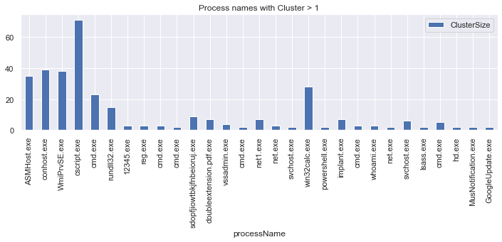
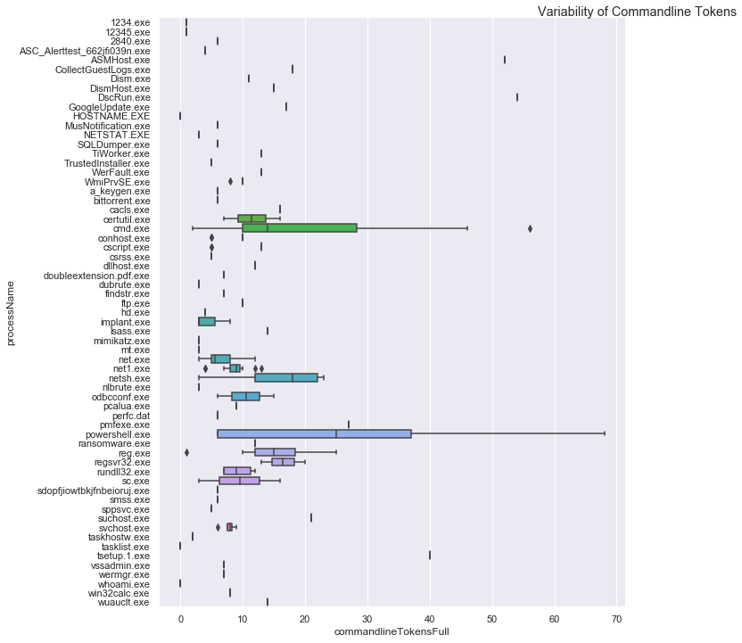
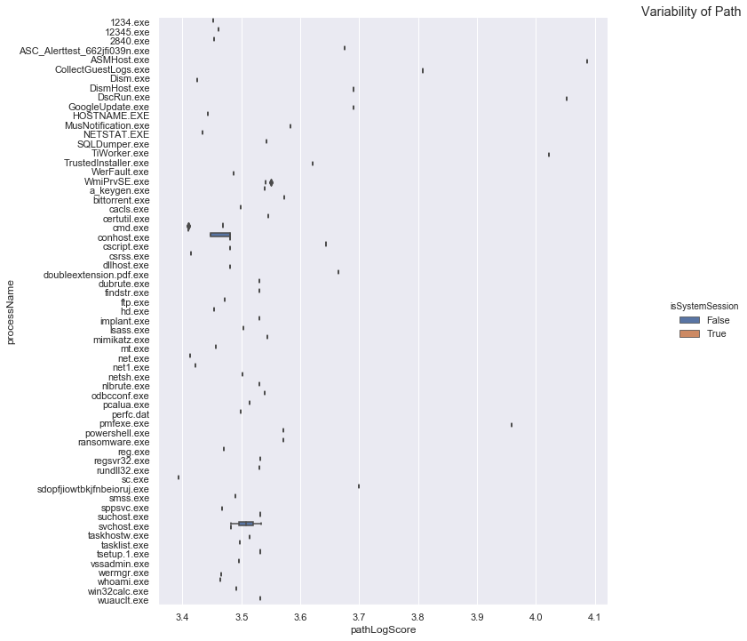
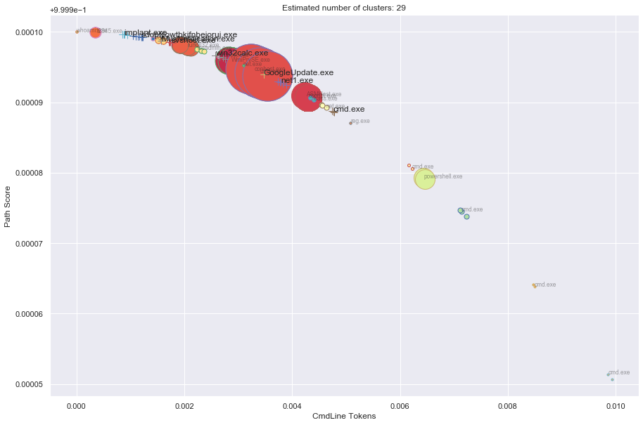
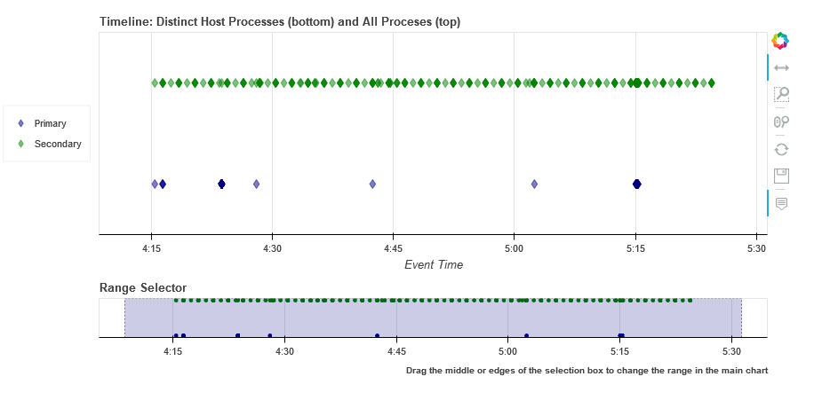
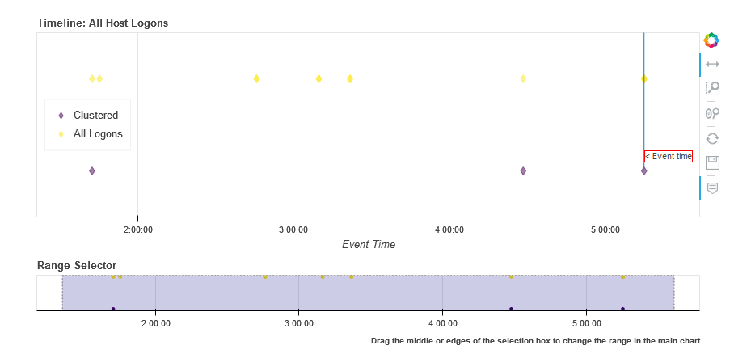
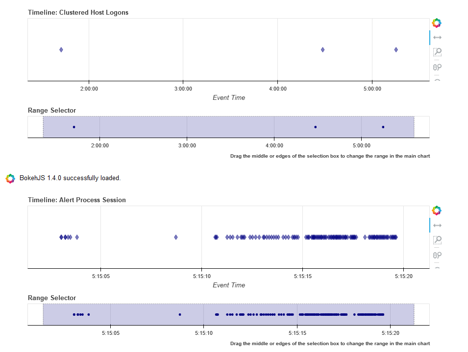
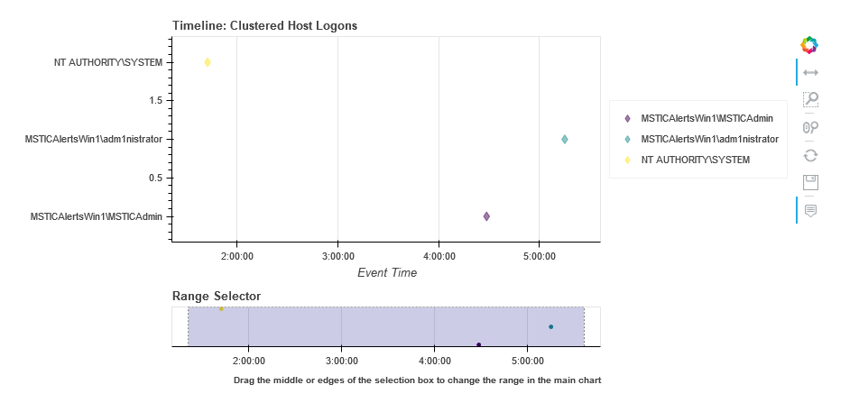

Event Clustering
================

Large sets of events often contain a lot of very repetitive items. As
security investigators, we are typically looking for anomalous events
and this repetitive noise can make it difficult to see the more unusual
events that we're searching for.

Sometimes you can you can use simple sorting and grouping to manage
the duplicates. On other occasions, there are values that almost repeat
but each instance is subtley different.

Some examples might be a system process that runs repeatedly but each
time it has commandline that includes a timestamp, guid or perhaps a
remote host name or address. This unique content makes it difficult
to use standard sorting and grouping to uncover truly distinct activity.

At the same time we want to use a technique to uncover anomalies that
is sensitive to slightly different usage of common operations. Examples
might be:

-  a browser User Agent string that has been crafted to look like a
   common browser
-  a process on a path designed to look like a common process
-  a common system command that is being used in an unusual way

We can use clustering, together with appropriate feature
selection, to help us differentiate between repetitive events
and truly unusual instances.

One of the problems with using common
machine learning techniques with log data is that machine learning
packages usually expect features to be represented as numeric values
whereas we a typically working with text data. One of the challenges
will be creating a numeric representation of the features that we
are interested in that captures the anomaly patterns that we want
to find.

.. code:: ipython3

    # Imports
    import sys
    import warnings

    from msticpy.nbtools.utility import check_py_version
    MIN_REQ_PYTHON = (3,6)
    check_py_version(MIN_REQ_PYTHON)

    from IPython import get_ipython
    from IPython.display import display, HTML, Markdown
    import ipywidgets as widgets

    import matplotlib.pyplot as plt
    import seaborn as sns
    sns.set()
    import networkx as nx

    import pandas as pd
    pd.set_option('display.max_rows', 100)
    pd.set_option('display.max_columns', 50)
    pd.set_option('display.max_colwidth', 100)

    from msticpy.data import QueryProvider
    from msticpy.nbtools import *
    from msticpy.sectools import *
    from msticpy.nbtools.foliummap import FoliumMap

    WIDGET_DEFAULTS = {'layout': widgets.Layout(width='95%'),
                       'style': {'description_width': 'initial'}}

    # Some of our dependencies (networkx) still use deprecated Matplotlib
    # APIs - we can't do anything about it so suppress them from view
    from matplotlib import MatplotlibDeprecationWarning
    warnings.simplefilter("ignore", category=MatplotlibDeprecationWarning)

Processes on Host - Clustering
------------------------------

Sometimes you
don’t have a source process to work with. Other times it’s just useful
to see what else is going on on the host. This section retrieves all
processes on the host within the time bounds set in the query times
widget.

You can display the raw output of this by looking at the
*processes_on_host* dataframe. Just copy this into a new cell and hit
Ctrl-Enter.

Usually though, the results return a lot of very repetitive and
uninteresting system processes so we attempt to cluster these to make the
view easier to negotiate. To do this we process the raw event list
output to extract a few features that render strings (such as
commandline)into numerical values. The default below uses the following
features: - commandLineTokensFull - this is a count of common delimiters
in the commandline (given by this regex
``[\s\-\/.,"'|&:;%$()]``. The aim of this is to capture the
commandline structure while ignoring variations on what is essentially
the same pattern (e.g. temporary path GUIDs, target IP or host names,
etc.) - pathScore - this sums the ordinal (character) value of each
character in the path (so /bin/bash and /bin/bosh would have similar
scores). - isSystemSession - 1 if this is a root/system session, 0 if
anything else.

Then we run a clustering algorithm (DBScan in this case) on the process
list. The result groups similar (noisy) processes together and leaves
unique process patterns as single-member clusters.

Clustered Processes (i.e. processes that have a cluster size > 1)
^^^^^^^^^^^^^^^^^^^^^^^^^^^^^^^^^^^^^^^^^^^^^^^^^^^^^^^^^^^^^^^^^

.. code:: ipython3

    from msticpy.sectools.eventcluster import dbcluster_events, add_process_features
    processes_on_host = pd.read_csv('data/processes_on_host.csv',
                                    parse_dates=["TimeGenerated"],
                                    infer_datetime_format=True)

    feature_procs = add_process_features(input_frame=processes_on_host)

    # you might need to play around with the max_cluster_distance parameter.
    # decreasing this gives more clusters.
    (clus_events, dbcluster, x_data) = dbcluster_events(
        data=feature_procs,
        cluster_columns=['commandlineTokensFull',
                        'pathScore',
                        'isSystemSession'],
        max_cluster_distance=0.0001
    )
    print('Number of input events:', len(feature_procs))
    print('Number of clustered events:', len(clus_events))
    (clus_events[['ClusterSize', 'processName']]
                [clus_events['ClusterSize'] > 1]
                .plot.bar(x='processName',
                          title='Process names with Cluster > 1',
                          figsize=(12,3)));

.. parsed-literal::

    Number of input events: 363
    Number of clustered events: 62

.. code:: ipython3

    # Looking at the variability of commandlines and process image paths
    import seaborn as sns
    sns.set(style="darkgrid")

    proc_plot = sns.catplot(y="processName", x="commandlineTokensFull",
                            data=feature_procs.sort_values('processName'),
                            kind='box', height=10)
    proc_plot.fig.suptitle('Variability of Commandline Tokens', x=1, y=1)

    proc_plot = sns.catplot(y="processName", x="pathLogScore",
                            data=feature_procs.sort_values('processName'),
                            kind='box', height=10, hue='isSystemSession')
    proc_plot.fig.suptitle('Variability of Path', x=1, y=1);

The top graph shows that, for a given process, some have a wide
variability in their command line content while the majority have little
or none. Looking at a couple of examples - like cmd.exe, powershell.exe,
reg.exe, net.exe - we can recognize several common command line tools.

The second graph shows processes by full process path content. We
wouldn’t normally expect to see variation here - as is the cast with
most. There is also quite a lot of variance in the score making it a
useful proxy feature for unique path name (this means that proc1.exe and
proc2.exe that have the same commandline score won’t get collapsed into
the same cluster).

Any process with a spread of values here means that we are seeing the
same process name (but not necessarily the same file) is being run from
different locations.

.. code:: ipython3

    display(clus_events.sort_values('ClusterSize')[['TimeGenerated', 'LastEventTime',
                                                    'NewProcessName', 'CommandLine',
                                                    'ClusterSize', 'commandlineTokensFull',
                                                    'pathScore', 'isSystemSession']])

.. raw:: html

    

    
    <table border="1" class="dataframe">
      <thead>
        <tr style="text-align: right;">
          <th></th>
          <th>TimeGenerated</th>
          <th>LastEventTime</th>
          <th>NewProcessName</th>
          <th>CommandLine</th>
          <th>ClusterSize</th>
          <th>commandlineTokensFull</th>
          <th>pathScore</th>
          <th>isSystemSession</th>
        </tr>
      </thead>
      <tbody>
        <tr>
          <th>46</th>
          <td>2019-01-15 04:23:43.103</td>
          <td>2019-01-15 05:15:20.623</td>
          <td>C:\Diagnostics\UserTmp\reg.exe</td>
          <td>.\reg  not /domain:everything that /sid:shines is /krbtgt:golden !</td>
          <td>1</td>
          <td>16</td>
          <td>2951</td>
          <td>False</td>
        </tr>
        <tr>
          <th>356</th>
          <td>2019-01-15 04:23:43.103</td>
          <td>2019-01-15 05:15:20.623</td>
          <td>C:\Program Files\Microsoft Monitoring Agent\Agent\Health Service State\Resources\222\pmfexe.exe</td>
          <td>"C:\Program Files\Microsoft Monitoring Agent\Agent\Health Service State\Resources\222\pmfexe.exe...</td>
          <td>1</td>
          <td>27</td>
          <td>9108</td>
          <td>True</td>
        </tr>
        <tr>
          <th>301</th>
          <td>2019-01-15 04:23:43.103</td>
          <td>2019-01-15 05:15:20.623</td>
          <td>C:\Windows\System32\cmd.exe</td>
          <td>"cmd"</td>
          <td>1</td>
          <td>2</td>
          <td>2570</td>
          <td>True</td>
        </tr>
        <tr>
          <th>256</th>
          <td>2019-01-15 04:23:43.103</td>
          <td>2019-01-15 05:15:20.623</td>
          <td>C:\WindowsAzure\GuestAgent_2.7.41491.901_2019-01-14_202614\CollectGuestLogs.exe</td>
          <td>"CollectGuestLogs.exe" -Mode:ga -FileName:C:\WindowsAzure\CollectGuestLogsTemp\710dc858-9c96-4df...</td>
          <td>1</td>
          <td>18</td>
          <td>6421</td>
          <td>True</td>
        </tr>
        <tr>
          <th>219</th>
          <td>2019-01-15 04:23:43.103</td>
          <td>2019-01-15 05:15:20.623</td>
          <td>C:\Windows\System32\wermgr.exe</td>
          <td>C:\Windows\system32\wermgr.exe -upload</td>
          <td>1</td>
          <td>7</td>
          <td>2922</td>
          <td>True</td>
        </tr>
        <tr>
          <th>198</th>
          <td>2019-01-15 04:23:43.103</td>
          <td>2019-01-15 05:15:20.623</td>
          <td>C:\Diagnostics\UserTmp\cmd.exe</td>
          <td>cmd  /c echo " SYSTEMINFO &amp;&amp; SYSTEMINFO &amp;&amp; DEL "</td>
          <td>1</td>
          <td>17</td>
          <td>2941</td>
          <td>False</td>
        </tr>
        <tr>
          <th>195</th>
          <td>2019-01-15 04:23:43.103</td>
          <td>2019-01-15 05:15:20.623</td>
          <td>C:\Diagnostics\UserTmp\cmd.exe</td>
          <td>cmd  /c "cd /d "C:\inetpub\wwwroot"&amp;c:\windows\system32\inetsrv\appcmd set config "Default Web S...</td>
          <td>1</td>
          <td>39</td>
          <td>2941</td>
          <td>False</td>
        </tr>
      </tbody>
    </table>
    

.. code:: ipython3

    # Look at clusters for individual process names
    def view_cluster(exe_name):
        display(clus_events[['ClusterSize', 'processName', 'CommandLine', 'ClusterId']][clus_events['processName'] == exe_name])
    view_cluster('reg.exe')

.. raw:: html

    

    
    <table border="1" class="dataframe">
      <thead>
        <tr style="text-align: right;">
          <th></th>
          <th>ClusterSize</th>
          <th>processName</th>
          <th>CommandLine</th>
          <th>ClusterId</th>
        </tr>
      </thead>
      <tbody>
        <tr>
          <th>46</th>
          <td>1</td>
          <td>reg.exe</td>
          <td>.\reg  not /domain:everything that /sid:shines is /krbtgt:golden !</td>
          <td>-1</td>
        </tr>
        <tr>
          <th>56</th>
          <td>3</td>
          <td>reg.exe</td>
          <td>.\reg.exe  add \hkcu\software\microsoft\some\key\Run /v abadvalue</td>
          <td>7</td>
        </tr>
      </tbody>
    </table>
    

.. code:: ipython3

    # Show all clustered processes
    from msticpy.sectools.eventcluster import plot_cluster
    # Create label with unqualified path
    labelled_df = processes_on_host.copy()
    labelled_df['label'] = labelled_df.apply(lambda x: x.NewProcessName.split("\\")[-1], axis=1)

    %matplotlib inline
    #%matplotlib notebook
    plt.rcParams['figure.figsize'] = (15,10)
    plot_cluster(dbcluster, labelled_df, x_data, plot_label='label', plot_features=[0,1], verbose=False, cut_off=3,
                 xlabel='CmdLine Tokens', ylabel='Path Score');

Timeline showing clustered vs. original data
~~~~~~~~~~~~~~~~~~~~~~~~~~~~~~~~~~~~~~~~~~~~

.. code:: ipython3

    # Show timeline of events - clustered events
    nbdisplay.display_timeline(data=clus_events,
                              overlay_data=processes_on_host,
                              title='Distinct Host Processes (bottom) and All Proceses (top)')

Host Logons
-----------

Since the number of logon events may be large and, in the case of system
logons, very repetitive, we use clustering to try to identity logons
with unique characteristics.

In this case we use the numeric score of the account name and the logon
type (i.e. interactive, service, etc.). The results of the clustered
logons are shown below along with a more detailed, readable printout of
the logon event information. The data here will vary depending on
whether this is a Windows or Linux host.

.. code:: ipython3

    from msticpy.sectools.eventcluster import dbcluster_events, add_process_features, _string_score

    host_logons = pd.read_csv('data/host_logons.csv',
                              parse_dates=["TimeGenerated"],
                              infer_datetime_format=True)
    logon_features = host_logons.copy()
    logon_features['AccountNum'] = host_logons.apply(lambda x: _string_score(x.Account), axis=1)
    logon_features['LogonHour'] = host_logons.apply(lambda x: x.TimeGenerated.hour, axis=1)

    # you might need to play around with the max_cluster_distance parameter.
    # decreasing this gives more clusters.
    (clus_logons, _, _) = dbcluster_events(data=logon_features, time_column='TimeGenerated',
                                           cluster_columns=['AccountNum',
                                                            'LogonType'],
                                                             max_cluster_distance=0.0001)
    print('Number of input events:', len(host_logons))
    print('Number of clustered events:', len(clus_logons))
    print('\nDistinct host logon patterns:')
    display(clus_logons.sort_values('TimeGenerated'))

.. parsed-literal::

    Number of input events: 14
    Number of clustered events: 3

    Distinct host logon patterns:

.. raw:: html

    

    
    <table border="1" class="dataframe">
      <thead>
        <tr style="text-align: right;">
          <th></th>
          <th>Unnamed: 0</th>
          <th>TenantId</th>
          <th>Account</th>
          <th>EventID</th>
          <th>TimeGenerated</th>
          <th>SourceComputerId</th>
          <th>Computer</th>
          <th>SubjectUserName</th>
          <th>SubjectDomainName</th>
          <th>SubjectUserSid</th>
          <th>TargetUserName</th>
          <th>TargetDomainName</th>
          <th>TargetUserSid</th>
          <th>TargetLogonId</th>
          <th>LogonProcessName</th>
          <th>LogonType</th>
          <th>AuthenticationPackageName</th>
          <th>Status</th>
          <th>IpAddress</th>
          <th>WorkstationName</th>
          <th>AccountNum</th>
          <th>LogonHour</th>
          <th>Clustered</th>
          <th>ClusterId</th>
          <th>ClusterSize</th>
          <th>FirstEventTime</th>
          <th>LastEventTime</th>
        </tr>
      </thead>
      <tbody>
        <tr>
          <th>1</th>
          <td>1</td>
          <td>802d39e1-9d70-404d-832c-2de5e2478eda</td>
          <td>NT AUTHORITY\SYSTEM</td>
          <td>4624</td>
          <td>2019-01-15 01:42:28.340</td>
          <td>46fe7078-61bb-4bed-9430-7ac01d91c273</td>
          <td>MSTICAlertsWin1</td>
          <td>MSTICAlertsWin1$</td>
          <td>WORKGROUP</td>
          <td>S-1-5-18</td>
          <td>SYSTEM</td>
          <td>NT AUTHORITY</td>
          <td>S-1-5-18</td>
          <td>0x3e7</td>
          <td>Advapi</td>
          <td>5</td>
          <td>Negotiate</td>
          <td>NaN</td>
          <td>-</td>
          <td>-</td>
          <td>1484</td>
          <td>5</td>
          <td>True</td>
          <td>1</td>
          <td>11</td>
          <td>2019-01-15 01:42:28.340</td>
          <td>2019-01-15 05:15:14.453</td>
        </tr>
        <tr>
          <th>0</th>
          <td>0</td>
          <td>802d39e1-9d70-404d-832c-2de5e2478eda</td>
          <td>MSTICAlertsWin1\MSTICAdmin</td>
          <td>4624</td>
          <td>2019-01-15 04:28:33.090</td>
          <td>46fe7078-61bb-4bed-9430-7ac01d91c273</td>
          <td>MSTICAlertsWin1</td>
          <td>MSTICAlertsWin1$</td>
          <td>WORKGROUP</td>
          <td>S-1-5-18</td>
          <td>MSTICAdmin</td>
          <td>MSTICAlertsWin1</td>
          <td>S-1-5-21-996632719-2361334927-4038480536-500</td>
          <td>0xfaac27</td>
          <td>Advapi</td>
          <td>4</td>
          <td>Negotiate</td>
          <td>NaN</td>
          <td>-</td>
          <td>MSTICAlertsWin1</td>
          <td>2319</td>
          <td>5</td>
          <td>True</td>
          <td>0</td>
          <td>2</td>
          <td>2019-01-15 04:28:33.090</td>
          <td>2019-01-15 05:15:02.980</td>
        </tr>
        <tr>
          <th>2</th>
          <td>2</td>
          <td>802d39e1-9d70-404d-832c-2de5e2478eda</td>
          <td>MSTICAlertsWin1\adm1nistrator</td>
          <td>4624</td>
          <td>2019-01-15 05:15:06.363</td>
          <td>46fe7078-61bb-4bed-9430-7ac01d91c273</td>
          <td>MSTICAlertsWin1</td>
          <td>-</td>
          <td>-</td>
          <td>S-1-0-0</td>
          <td>adm1nistrator</td>
          <td>MSTICAlertsWin1</td>
          <td>S-1-5-21-996632719-2361334927-4038480536-1066</td>
          <td>0xfb5ee6</td>
          <td>NtLmSsp</td>
          <td>3</td>
          <td>NTLM</td>
          <td>NaN</td>
          <td>fe80::38dc:e4a9:61bd:b458</td>
          <td>MSTICAlertsWin1</td>
          <td>2799</td>
          <td>5</td>
          <td>False</td>
          <td>-1</td>
          <td>1</td>
          <td>2019-01-15 05:15:06.363</td>
          <td>2019-01-15 05:15:06.363</td>
        </tr>
      </tbody>
    </table>
    

.. code:: ipython3

    # Display logon details
    nbdisplay.display_logon_data(clus_logons)

.. parsed-literal::

    ### Account Logon
    Account:  adm1nistrator
    Account Domain:  MSTICAlertsWin1
    Logon Time:  2019-01-15 05:15:06.363000
    Logon type: 3  (Network)
    User Id/SID:  S-1-5-21-996632719-2361334927-4038480536-1066
        SID S-1-5-21-996632719-2361334927-4038480536-1066 is local machine or domain account
    Session id '0xfb5ee6'
    Subject (source) account:  -/-
    Logon process:  NtLmSsp
    Authentication:  NTLM
    Source IpAddress:  fe80::38dc:e4a9:61bd:b458
    Source Host:  MSTICAlertsWin1
    Logon status:  nan

    ### Account Logon
    Account:  MSTICAdmin
    Account Domain:  MSTICAlertsWin1
    Logon Time:  2019-01-15 04:28:33.090000
    Logon type: 4  (Batch)
    User Id/SID:  S-1-5-21-996632719-2361334927-4038480536-500
        SID S-1-5-21-996632719-2361334927-4038480536-500 is administrator
        SID S-1-5-21-996632719-2361334927-4038480536-500 is local machine or domain account
    Session id '0xfaac27'
    Subject (source) account:  WORKGROUP/MSTICAlertsWin1$
    Logon process:  Advapi
    Authentication:  Negotiate
    Source IpAddress:  -
    Source Host:  MSTICAlertsWin1
    Logon status:  nan

    ### Account Logon
    Account:  SYSTEM
    Account Domain:  NT AUTHORITY
    Logon Time:  2019-01-15 01:42:28.340000
    Logon type: 5  (Service)
    User Id/SID:  S-1-5-18
        SID S-1-5-18 is LOCAL_SYSTEM
    Session id '0x3e7'  System logon session

    Subject (source) account:  WORKGROUP/MSTICAlertsWin1$
    Logon process:  Advapi
    Authentication:  Negotiate
    Source IpAddress:  -
    Source Host:  -
    Logon status:  nan

Comparing All Logons with Clustered results relative to Alert time line
^^^^^^^^^^^^^^^^^^^^^^^^^^^^^^^^^^^^^^^^^^^^^^^^^^^^^^^^^^^^^^^^^^^^^^^

.. code:: ipython3

    clus_logons

.. raw:: html

    

    
    <table border="1" class="dataframe">
      <thead>
        <tr style="text-align: right;">
          <th></th>
          <th>Unnamed: 0</th>
          <th>TenantId</th>
          <th>Account</th>
          <th>EventID</th>
          <th>TimeGenerated</th>
          <th>SourceComputerId</th>
          <th>Computer</th>
          <th>SubjectUserName</th>
          <th>SubjectDomainName</th>
          <th>SubjectUserSid</th>
          <th>TargetUserName</th>
          <th>TargetDomainName</th>
          <th>TargetUserSid</th>
          <th>TargetLogonId</th>
          <th>LogonProcessName</th>
          <th>LogonType</th>
          <th>AuthenticationPackageName</th>
          <th>Status</th>
          <th>IpAddress</th>
          <th>WorkstationName</th>
          <th>AccountNum</th>
          <th>LogonHour</th>
          <th>Clustered</th>
          <th>ClusterId</th>
          <th>ClusterSize</th>
          <th>FirstEventTime</th>
          <th>LastEventTime</th>
        </tr>
      </thead>
      <tbody>
        <tr>
          <th>2</th>
          <td>2</td>
          <td>802d39e1-9d70-404d-832c-2de5e2478eda</td>
          <td>MSTICAlertsWin1\adm1nistrator</td>
          <td>4624</td>
          <td>2019-01-15 05:15:06.363</td>
          <td>46fe7078-61bb-4bed-9430-7ac01d91c273</td>
          <td>MSTICAlertsWin1</td>
          <td>-</td>
          <td>-</td>
          <td>S-1-0-0</td>
          <td>adm1nistrator</td>
          <td>MSTICAlertsWin1</td>
          <td>S-1-5-21-996632719-2361334927-4038480536-1066</td>
          <td>0xfb5ee6</td>
          <td>NtLmSsp</td>
          <td>3</td>
          <td>NTLM</td>
          <td>NaN</td>
          <td>fe80::38dc:e4a9:61bd:b458</td>
          <td>MSTICAlertsWin1</td>
          <td>2799</td>
          <td>5</td>
          <td>False</td>
          <td>-1</td>
          <td>1</td>
          <td>2019-01-15 05:15:06.363</td>
          <td>2019-01-15 05:15:06.363</td>
        </tr>
        <tr>
          <th>0</th>
          <td>0</td>
          <td>802d39e1-9d70-404d-832c-2de5e2478eda</td>
          <td>MSTICAlertsWin1\MSTICAdmin</td>
          <td>4624</td>
          <td>2019-01-15 04:28:33.090</td>
          <td>46fe7078-61bb-4bed-9430-7ac01d91c273</td>
          <td>MSTICAlertsWin1</td>
          <td>MSTICAlertsWin1$</td>
          <td>WORKGROUP</td>
          <td>S-1-5-18</td>
          <td>MSTICAdmin</td>
          <td>MSTICAlertsWin1</td>
          <td>S-1-5-21-996632719-2361334927-4038480536-500</td>
          <td>0xfaac27</td>
          <td>Advapi</td>
          <td>4</td>
          <td>Negotiate</td>
          <td>NaN</td>
          <td>-</td>
          <td>MSTICAlertsWin1</td>
          <td>2319</td>
          <td>5</td>
          <td>True</td>
          <td>0</td>
          <td>2</td>
          <td>2019-01-15 04:28:33.090</td>
          <td>2019-01-15 05:15:02.980</td>
        </tr>
        <tr>
          <th>1</th>
          <td>1</td>
          <td>802d39e1-9d70-404d-832c-2de5e2478eda</td>
          <td>NT AUTHORITY\SYSTEM</td>
          <td>4624</td>
          <td>2019-01-15 01:42:28.340</td>
          <td>46fe7078-61bb-4bed-9430-7ac01d91c273</td>
          <td>MSTICAlertsWin1</td>
          <td>MSTICAlertsWin1$</td>
          <td>WORKGROUP</td>
          <td>S-1-5-18</td>
          <td>SYSTEM</td>
          <td>NT AUTHORITY</td>
          <td>S-1-5-18</td>
          <td>0x3e7</td>
          <td>Advapi</td>
          <td>5</td>
          <td>Negotiate</td>
          <td>NaN</td>
          <td>-</td>
          <td>-</td>
          <td>1484</td>
          <td>5</td>
          <td>True</td>
          <td>1</td>
          <td>11</td>
          <td>2019-01-15 01:42:28.340</td>
          <td>2019-01-15 05:15:14.453</td>
        </tr>
      </tbody>
    </table>
    

.. code:: ipython3

    # Show timeline of events - all logons + clustered logons
    # ref marker indicates
    logon_data = {"Clustered": {"data": clus_logons},
                  "All Logons": {"data": host_logons}}
    nbdisplay.display_timeline(data=logon_data,
                               source_columns=['Account', 'LogonType'],
                               ref_event=clus_logons.iloc[0],
                               title='All Host Logons', legend="inline")

View Process Session and Logon Events in Timelines
~~~~~~~~~~~~~~~~~~~~~~~~~~~~~~~~~~~~~~~~~~~~~~~~~~

This shows the timeline of the clustered logon events with the process
tree obtained earlier. This allows you to get a sense of which logon was
responsible for the process tree session whether any additional logons
(e.g. creating a process as another user) might be associated with the
alert timeline.

.. tip:: Use the pan and zoom tools to align the timelines since
   the data may be over different time ranges.

.. code:: ipython3

    # Show timeline of events - all events
    nbdisplay.display_timeline(data=clus_logons,
                               source_columns=['Account', 'LogonType'],
                               title='Clustered Host Logons', height=200)
    process_tree = pd.read_csv('data/process_tree.csv',
                               parse_dates=["TimeGenerated"],
                               infer_datetime_format=True)
    nbdisplay.display_timeline(data=process_tree,
                               title='Alert Process Session', height=200)

.. code:: ipython3

    nbdisplay.display_timeline(data=clus_logons,
                               group_by="Account",
                               source_columns=['Account', 'LogonType'],
                               title='Clustered Host Logons',
                               legend="right",
                               yaxis=True)

.. code:: ipython3

    # Counts of Logon types by Account
    host_logons[['Account', 'LogonType', 'TimeGenerated']].groupby(['Account','LogonType']).count()

.. raw:: html

    

    
    <table border="1" class="dataframe">
      <thead>
        <tr style="text-align: right;">
          <th></th>
          <th></th>
          <th>TimeGenerated</th>
        </tr>
        <tr>
          <th>Account</th>
          <th>LogonType</th>
          <th></th>
        </tr>
      </thead>
      <tbody>
        <tr>
          <th>MSTICAlertsWin1\MSTICAdmin</th>
          <th>4</th>
          <td>2</td>
        </tr>
        <tr>
          <th>MSTICAlertsWin1\adm1nistrator</th>
          <th>3</th>
          <td>1</td>
        </tr>
        <tr>
          <th>NT AUTHORITY\SYSTEM</th>
          <th>5</th>
          <td>11</td>
        </tr>
      </tbody>
    </table>
    

