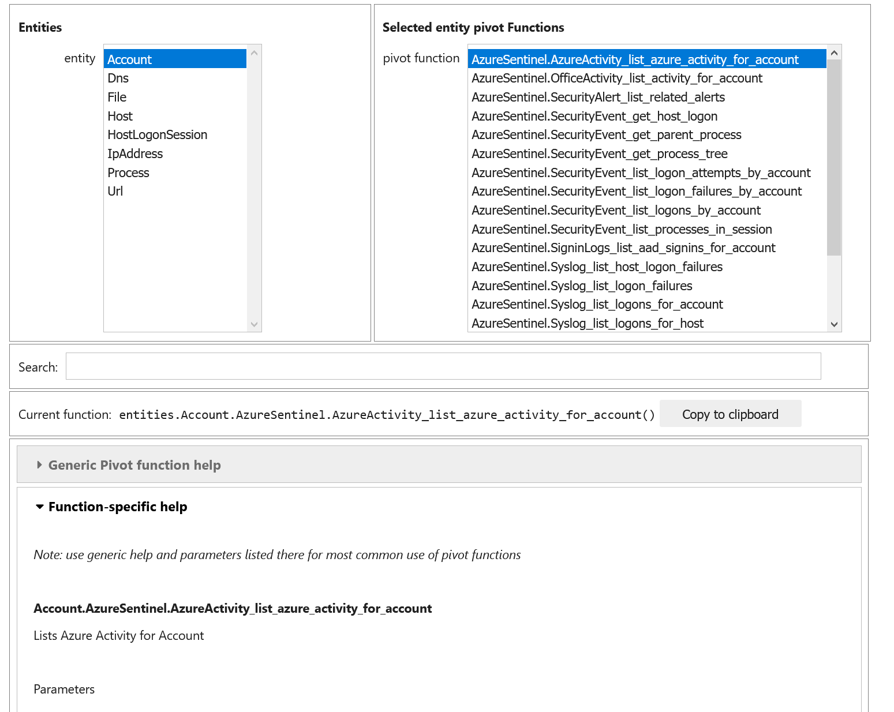
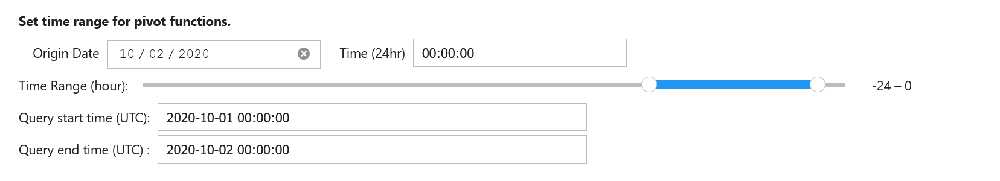
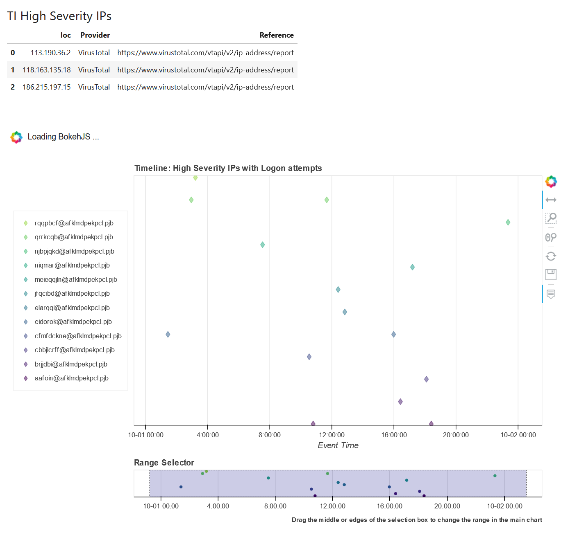

Pivot Functions
===============

What are Pivot Functions?
-------------------------

*MSTICPy* has a lot of functionality distributed across many classes and
modules. However, there is no simple way to discover where these
functions are and what types of data the function is relevant to.

Pivot functions bring this functionality together grouped around
*Entities*. Entities are representations of real-world objects found
commonly in CyberSec investigations.
Some examples are: IpAddress, Host, Account, URL.

The pivot functions are attached to the entities most relevant
to that operation. E.g. IP geolocation lookup is a method of the
IpAddress entity. The functions are also grouped into logical
containers. You can see some examples here of functions being
run on the IpAddress entity in the "util" group.

.. parsed-literal::

    >>> IpAddress.util.ip_type(ip_str="157.53.1.1"))
    ip          result
    157.53.1.1  Public

    >>> IpAddress.util.whois("157.53.1.1"))
    asn  asn_cidr  asn_country_code  asn_date    asn_description  asn_registry  nets .....
    NA   NA        US                2015-04-01  NA               arin          [{'cidr': '157.53.0.0/16'...

    >>> IpAddress.util.geoloc(value="157.53.1.1"))
    CountryCode  CountryName    State   City   Longitude   Latitude   Asn...
    US           United States  None    None   -97.822     37.751     None...

This second example shows a pivot function that does a data query for host
entities. The "list_host_logons" function is an AzureSentinel query.
If you have queries for other environments such as Splunk or MDE, these
appear in their own containers.

.. parsed-literal::
    >>> Host.AzureSentinel.list_host_logons(host_name="VictimPc")
    Account               EventID   TimeGenerated                      Computer                 SubjectUserName   SubjectDomainName
    NT AUTHORITY\SYSTEM   4624      2020-10-01 22:39:36.987000+00:00   VictimPc.Contoso.Azure   VictimPc$         CONTOSO
    NT AUTHORITY\SYSTEM   4624      2020-10-01 22:39:37.220000+00:00   VictimPc.Contoso.Azure   VictimPc$         CONTOSO
    NT AUTHORITY\SYSTEM   4624      2020-10-01 22:39:42.603000+00:00   VictimPc.Contoso.Azure   VictimPc$         CONTOSO

You can also chain pivot functions together using pandas to create a processing
pipeline that does multiple operations on data:

.. code:: ipython3

    >>> (
            # take a list of IP Addresses
            suspicious_ips_df
            # Lookup IPs at VirusTotal
            .mp_pivot.run(IpAddress.ti.lookup_ipv4_VirusTotal, column="IPAddress")
            # Filter on high severity TI hits
            .query("Severity == 'high'")
            # Find who owns these IPs
            .mp_pivot.run(IpAddress.util.whois, column="Ioc", join="left")
            # Query IPs that have login attempts in our AAD
            .mp_pivot.run(IpAddress.AzureSentinel.list_aad_signins_for_ip, ip_address_list="Ioc")
            # Send the output of this to a plot
            .mp_timeline.plot(
                title="High Severity IPs with Logon attempts",
                source_columns=["UserPrincipalName", "IPAddress", "ResultType", "ClientAppUsed", "UserAgent", "Location"],
                group_by="UserPrincipalName"
            )
        )

.. note:: We'll see many more examples of how to do these pivoting
   operations later in the document.

*MSTICPy* has had entity classes from the very early days but, until now,
these have only been used sporadically in the rest of the package.

The pivot functionality exposes operations relevant to a particular
entity as methods (or functions) of that entity. These operations include:

-  Data queries
-  Threat intelligence lookups
-  Other data lookups such as geo-location or domain resolution
-  and other local functionality

The pivot library essentially wraps these various functions in a
more standardized form. This gives us several benefits:

-  You can more easily find functions related to what you are
   working on.
-  You can discover functionality that you weren't previously
   aware of.
-  The functions have standarized input and output.
-  The functions will take input data in a number of different
   formats so you don't waste time wrangling data to suit the function
   you want to use.
-  For functions that require a time range (e.g. queries) the time
   range is set centrally and used by all functions (you can change
   the time range at any time, of course).

What is "Pivoting"?
-------------------

The term comes from the common practice of Cyber investigators
navigating between related entities. For example an entity/investigation
chain might look like the following:

==== ============ ==================== ===============================
Step Source       Operation            Target
==== ============ ==================== ===============================
1    Alert        Review alert ->      Source IPs
2    Source IPs   Lookup TI ->         Related URLs and Malware names
3    URL          Query web logs ->    Requesting hosts
4    Host         Query host logons -> Accounts
==== ============ ==================== ===============================

At each step there are one or more directions that you can take to
follow the chain of related *indicators of activity* in a possible attack.

Bringing these functions into a few, well-known locations makes it
easier to use *MSTICPy* to carry out this common pivoting pattern in
Jupyter notebooks.

Getting started
---------------

The pivoting library depends on a number of data providers and other
functions defined in
*MSTICPy*. These normally need to be loaded and initialized before starting
the Pivot library.

1. Load *MSTICPy*
~~~~~~~~~~~~~~~~~

.. code:: ipython3

    from msticpy.nbtools.nbinit import init_notebook
    init_notebook(namespace=globals());

2. Load one or more data providers
~~~~~~~~~~~~~~~~~~~~~~~~~~~~~~~~~~

You can create as many data providers (for different data
backends) as you need - pivot will search all of them for usable
queries.

.. note:: You do not have to authenticate to the data provider before
   loading Pivot. However, some providers are populated with additional
   queries only after connecting to the service. These dynamically-added
   queries will not be added
   to the pivot functions unless you authenticate/connect prior to creating
   the new Pivot object (or create a new Pivot object).

.. warning:: If you are working with multiple Azure Sentinel workspaces,
   Pivot does not create multiple instances of pivot query functions for
   each workspace. To switch workspaces, use the ``QueryProvider.connect()``
   function to switch to your desired workspace. Pivot query functions
   will now be executed against that workspace. If you have a need to
   query multiple workspaces, let us know and we will try to implement
   simultaneous workspace pivots.

You don't have to explicity load providers such as Threat Intelligence (TILookup)
and GeoIP. If you do not initialize these before starting Pivot they
will be loaded with the defaults as specified in your
*msticpyconfig.yaml*. If you want to use a specific configuration for
any of these, you should load and configure them before starting Pivot.

.. code:: ipython3

    az_provider = QueryProvider("AzureSentinel")

3. Initialize the Pivot library
~~~~~~~~~~~~~~~~~~~~~~~~~~~~~~~

See the next section.

Initializing the Pivot library
------------------------------

You can either pass an explicit list of providers to Pivot or let it
look for them in the notebook global namespace. In the latter case, the
Pivot class will use the most recently-created instance of each that it
finds.

If you have data providers loaded that you do not want
Pivot to use, pass an explicit list of provider objects when initializing
the Pivot class. For more details see
:py:mod:`Pivot<msticpy.datamodel.pivot>`.

You will usually see some output as provider libraries are loaded.

.. code:: ipython3

    from msticpy.datamodel.pivot import Pivot
    Pivot(namespace=globals())

.. note:: Although you can assign the created Pivot object to a variable
   you normally don’t need to do so. You can access the current Pivot
   instance using the class attribute ``Pivot.current``

What happens at initialization?
~~~~~~~~~~~~~~~~~~~~~~~~~~~~~~~

-  Any instantiated data providers are searched for relevant queries.
   Any queries found are added to the approriate entity or entities.
-  The TILookup provider is loaded and entity-specific lookups (e.g. IP, Url,
   File) are added as pivot functions
-  Miscellaneous *MSTICPy* functions and classes (e.g. GeoIP, IpType,
   Domain utils) are added as pivot functions to the appropriate entity.
-  A default time range is set - this is only used by queries executed
   as pivot functions and covered later in `Data query pivot functions`_

You can add additional functions as pivot functions by creating a
registration template and importing the function. Details of this are
covered later in `Customizing and managing Pivots`_.

View the list of providers loaded by the Pivot class
~~~~~~~~~~~~~~~~~~~~~~~~~~~~~~~~~~~~~~~~~~~~~~~~~~~~

Notice that TILookup was loaded even though we did not create an
instance of TILookup beforehand.

.. code:: ipython3

    Pivot.current.providers

.. parsed-literal::

    {'AzureSentinel': <msticpy.data.data_providers.QueryProvider at 0x2741dfd4408>,
     'TILookup': <msticpy.sectools.tilookup.TILookup at 0x2741e114888>}

After loading the Pivot class, entities have pivot functions added to them
~~~~~~~~~~~~~~~~~~~~~~~~~~~~~~~~~~~~~~~~~~~~~~~~~~~~~~~~~~~~~~~~~~~~~~~~~~

.. code:: ipython3

    print("Host pivot functions\n")
    display(entities.Host.get_pivot_list())
    print("\nIpAddress pivot functions\n")
    display(entities.IpAddress.get_pivot_list())

.. parsed-literal::

    Host pivot functions

    ['AzureSentinel.alerts',
    'AzureSentinel.aznet_interface',
    'AzureSentinel.aznet_net_flows',
    'AzureSentinel.aznet_net_flows_depr',
    'AzureSentinel.azsent_bookmarks',
    'AzureSentinel.hb_heartbeat',
    ...
    'AzureSentinel.lxsys_squid_activity',
    'AzureSentinel.lxsys_sudo_activity',
    'AzureSentinel.lxsys_user_group_activity',
    'AzureSentinel.lxsys_user_logon',
    ...
    'AzureSentinel.wevt_logons',
    'AzureSentinel.wevt_parent_process',
    'AzureSentinel.wevt_process_session',
    'AzureSentinel.wevt_processes',
    'dns_is_resolvable',
    'dns_resolve',
    'qry_alerts',
    'qry_aznet_interface',
    'qry_aznet_net_flows',
    'qry_azsent_bookmarks',
    ...
    'qry_wevt_all_events',
    'qry_wevt_events_by_id',
    'qry_wevt_logon_attempts',
    'qry_wevt_logon_failures',
    ...
    'util.dns_in_abuse_list',
    'util.dns_is_resolvable',
    'util.dns_resolve',
    'util.dns_validate_tld']

    IpAddress pivot functions

    ['AzureSentinel.hb_heartbeat',
    'AzureSentinel.hb_heartbeat_for_ip_depr',
    'AzureSentinel.list_alerts_for_ip',
    ...
    'geoloc',
    'ip_type',
    'qry_aad_signins',
    'qry_az_activity',
    ...
    'ti.lookup_ipv4_VirusTotal',
    'ti.lookup_ipv4_XForce',
    ...
    'tilookup_ip',
    'tilookup_ipv4',
    'tilookup_ipv6',
    'util.geoloc',]

Reloading Pivots
^^^^^^^^^^^^^^^^
If you need to refresh the pivot functions because, for example, you loaded
a query provider after initializing the Pivot library you can call
:py:meth:`reload_pivots<msticpy.datamodel.pivot.Pivot.reload_pivots>`.
This takes the same ``namespace`` and ``providers`` parameters as when
initializing the class.
You can also acheive the same thing by creating a new instance of the
Pivot class.

.. note:: Reloading will remove previously attached pivot functions.
   This is usually a safe operation since these can be dynamically
   created at any time. If you don't want to remove existing functions
   use the ``no_clear=True`` parameter to ``reload_pivots``.

Discovering entity names
^^^^^^^^^^^^^^^^^^^^^^^^

The entities module has a utility names `find_entity`. You
can use that to verify the name of an entity.

.. code:: ipython3

    entities.find_entity("dns")

.. parsed-literal::

    Match found 'Dns'

    msticpy.datamodel.entities.dns.Dns

If a unique match is found the entity class is returned. Otherwise,
we try to suggest possible matches for the entity name.

.. code:: ipython3

    entities.find_entity("azure")

.. parsed-literal::

    No exact match found for 'azure'.
    Closest matches are 'AzureResource', 'Url', 'Malware'

Pivot functions are grouped into containers
~~~~~~~~~~~~~~~~~~~~~~~~~~~~~~~~~~~~~~~~~~~

Data queries are grouped into a container with the name of the data
provider to which they belong. E.g. AzureSentinel queries are in a
container of that name, Splunk queries would be in a “Splunk” container.

TI lookups are put into a "ti" container.

All other built-in functions are added to the "util" container, by default.

The containers themselves are callable and will return a list of their
contents.

.. code:: ipython3

    entities.Host.AzureSentinel()

.. parsed-literal::

    list_related_alerts function
    az_net_analytics function
    get_info_by_hostname function
    auditd_all function
    ...

Containers are also iterable - each iteration returns a tuple
(pair) of name/function values.

.. code:: ipython3

    [query for query, _ in entities.Host.AzureSentinel if "logon" in query]

.. parsed-literal::

    ['user_logon',
     'list_logons_for_host',
     'list_host_logon_failures',
     'get_host_logon',
     'list_host_logons',
     'list_all_logons_by_host']

In notebooks/IPython you can also use tab completion to get to the right
function.

Shortcut pivot functions
~~~~~~~~~~~~~~~~~~~~~~~~

A subset of many regularly-used pivot functions are also added
as "shortcuts" to the entities. These are not in containers but
available as direct methods on the entity classes and entity instances.
A shortcut is just a reference or pointer to a pivot function in
one of the containers described in the previous section.

Because the shortcut methods behave as *instance* methods they can take input
values from the entity attributes directly. In this example, the input to
the ``ip_type`` function is automatically taken from the ``Address``
attribute of the IP entity.

.. code:: ipython3

    >>> ip = IpAddress(Address="192.168.1.1")
    >>> ip.ip_type()
    ip          result
    192.168.1.1 Private

These shortcuts otherwise work in the same way as the pivot functions
described in the rest of the document. In the previous example showing
pivot functions with the ``get_pivot_list()`` function, the shortcut
versions of the pivot functions appear without a "." in the name.

To help you navigate which shortcut does what, data query shortcuts are prefixed
with "qry\_" and threat intelligence lookups with "ti\_".

You can create your own shortcut methods to existing or custom pivot functions
as described in `Creating and deleting shortcut pivot functions`_.

Using the Pivot Browser
~~~~~~~~~~~~~~~~~~~~~~~

Pivot also has a utility that allows you to browse entities and the
pivot functions attached to them. You can search for functions with
desired keywords, view help for the specific function and copy the function
signature to paste into a code cell. Both fully-qualified pivot functions
and shortcut equivalents are shown in the browser.

.. code:: ipython3

    Pivot.browse()

Running a pivot function
------------------------

Pivot functions support a variety of input parameter types. They can be
used with the following types of parameters:

-  entity instances (e.g. where you have an *IpAddress* entity with a
   populated ``Address`` field)
-  single values (e.g. a string with DNS domain name)
-  lists of values (e.g. a list of IpAddresses)
-  pandas DataFrames (where one or more of the columns contains the
   input parameter data that you want to use)

Pivot functions normally return results as a dataframe (although some
complex functions such as Notebooklets can return composite result
objects containing multiple dataframes and other object types).

Pivot functions retain their original documentation string (i.e. the
docstring of the function before it was wrapped) so you can lookup
help on a pivot function at any time using the builtin Python help()
function or a trailing "?"

.. note:: Most examples in the document use entity classes has been
   imported individually (``from msticpy.datamodel.entities import Host``).
   This is done to make the examples syntax cleaner. However, you do not need to
   import each entity class individually before using it. The ``init_notebook``
   function described in the `Getting Started`_ section imports the "entities"
   parent module, which contains the individual entity classes. You can run
   ``from msticpy.datamodel import entities`` to do the same.
   This means that you can use any entity by prefixing it with ``entities.``
   (e.g. ``entities.Host()`` - create a host entity or
   ``entities.Account.util.my_pivot()`` - run the Account entity ``my_pivot``
   function ). Using the entities module prefix like this is usually much more
   convenient than seperate import statements for each entity.

.. code:: ipython3

    from msticpy.datamodel.entities import IpAddress
    IpAddress.util.ip_type?

.. parsed-literal::

    Signature: IpAddress.util.ip_type(ip: str = None, ip_str: str = None)
    Docstring:
    Validate value is an IP address and deteremine IPType category.

    (IPAddress category is e.g. Private/Public/Multicast).

    Parameters
    ----------
    ip_str : str
        The string of the IP Address

    Returns
    -------
    str
        Returns ip type string using ip address module

Specifying Parameter names
~~~~~~~~~~~~~~~~~~~~~~~~~~

There are a few variations in the way you can specify parameters:

-  Positional parameter - If the function only accepts one parameter you
   can usually just supply it without a name - as a *positional parameter*
   (see first and third examples in the code sample in the next section)
-  Native parameter - You can also use the native parameter name -
   i.e. the name that the underlying function expects and that will be
   shown in the ``help(function)`` output. (second example below)
-  Generic parameter - You can also use the generic parameter name
   “value” in most cases. (fourth example)

.. note:: There are some exceptions to the use of generic parameters
   like "column" and "value". These are called out later
   in this document.

If in doubt, use ``help(entity.container.func)`` or ``entity.container.func?``
to find the specific parameter(s) that the function expects.

.. note:: Most of the examples in the following sections use the **IpAddress**
   entity to it easier to compare the different ways of calling pivot functions.
   The same patterns apply to all other entities (Account, Host, Dns, Url, etc.)
   that have pivot functions.

Using single value parameters as input
~~~~~~~~~~~~~~~~~~~~~~~~~~~~~~~~~~~~~~

Some examples of simple pivot functions for an IpAddress string.

.. code:: ipython3

    display(IpAddress.util.ip_type("10.1.1.1"))
    display(IpAddress.util.ip_type(ip_str="157.53.1.1"))
    display(IpAddress.util.whois("157.53.1.1"))
    display(IpAddress.util.geoloc(value="157.53.1.1"))

========  ========
ip        result
========  ========
10.1.1.1  Private
========  ========

==========  ========
ip          result
==========  ========
157.53.1.1  Public
==========  ========

===========  ================  =========================================================================================================================================================================================================================================================================================================================================================================================================================================================================================================================================================================================================================
ip_column    AsnDescription    whois_result
===========  ================  =========================================================================================================================================================================================================================================================================================================================================================================================================================================================================================================================================================================================================================
157.53.1.1   NA                {'nir': None, 'asn_registry': 'arin', 'asn': 'NA', 'asn_cidr': 'NA', 'asn_country_code': 'US', 'asn_date': '2015-04-01', 'asn_description': 'NA', 'query': '157.53.1.1', 'nets': [{'cidr': '157.53.0.0/16', 'name': 'NETACTUATE-MDN-04', 'handle': 'NET-157-53-0-0-1', 'range': '157.53.0.0 - 157.53.255.255', 'description': 'NetActuate, Inc', 'country': 'US', 'state': 'NC', 'city': 'Raleigh', 'address': 'PO Box 10713', 'postal_code': '27605', 'emails': ['ops@netactuate.com', 'abuse@netactuate.com'], 'created': '2015-04-01', 'updated': '2016-10-25'}], 'raw': None, 'referral': None, 'raw_referral': None}
===========  ================  =========================================================================================================================================================================================================================================================================================================================================================================================================================================================================================================================================================================================================================

=============  =============  =======  ======  ===========  ==========  =====  =======  ===========  ================  ===========
CountryCode    CountryName    State    City      Longitude    Latitude  Asn    edges    Type         AdditionalData    IpAddress
=============  =============  =======  ======  ===========  ==========  =====  =======  ===========  ================  ===========
US             United States                       -97.822      37.751         set()    geolocation  {}                157.53.1.1
=============  =============  =======  ======  ===========  ==========  =====  =======  ===========  ================  ===========

Using an entity as a parameter
~~~~~~~~~~~~~~~~~~~~~~~~~~~~~~

Behind the scenes the Pivot API use a mapping of entity attributes
to supply the right value to the function parameter. This is not
always foolproof but usually works.

Here, we're
creating two IpAddress entities and initializing them with their ``Address``
values. Then we supply these entities as parameters to the pivot functions.

.. code:: ipython3

    ip1 = IpAddress(Address="10.1.1.1")
    ip2 = IpAddress(Address="157.53.1.1")

    display(IpAddress.util.ip_type(ip1))
    display(IpAddress.util.ip_type(ip2))
    display(IpAddress.util.whois(ip2))
    display(IpAddress.util.geoloc(ip2))

The output is the same as the previous example
`Using single value parameters as input`_

For shortcut functions you can also use the entity instance to
provide the input value:

.. code:: ipython3

    ip_1 = IpAddress(Address="10.1.1.1")
    ip_2 = IpAddress(Address="157.53.1.1")
    display(ip_1.ip_type())
    display(ip_2.whois())

========  ========
ip        result
========  ========
10.1.1.1  Private
========  ========

===========  ================  =========================================================================================================================================================================================================================================================================================================================================================================================================================================================================================================================================================================================================================
ip_column    AsnDescription    whois_result
===========  ================  =========================================================================================================================================================================================================================================================================================================================================================================================================================================================================================================================================================================================================================
157.53.1.1   NA                {'nir': None, 'asn_registry': 'arin', 'asn': 'NA', 'asn_cidr': 'NA', 'asn_country_code': 'US', 'asn_date': '2015-04-01', 'asn_description': 'NA', 'query': '157.53.1.1', 'nets': [{'cidr': '157.53.0.0/16', 'name': 'NETACTUATE-MDN-04', 'handle': 'NET-157-53-0-0-1', 'range': '157.53.0.0 - 157.53.255.255', 'description': 'NetActuate, Inc', 'country': 'US', 'state': 'NC', 'city': 'Raleigh', 'address': 'PO Box 10713', 'postal_code': '27605', 'emails': ['ops@netactuate.com', 'abuse@netactuate.com'], 'created': '2015-04-01', 'updated': '2016-10-25'}], 'raw': None, 'referral': None, 'raw_referral': None}
===========  ================  =========================================================================================================================================================================================================================================================================================================================================================================================================================================================================================================================================================================================================================

Using a list (or other iterable) as a parameter
~~~~~~~~~~~~~~~~~~~~~~~~~~~~~~~~~~~~~~~~~~~~~~~

Many of the underlying *MSTICPy* functions (the functions wrapped by the Pivot
library) accept either single values or
collections of values (usually in DataFrames) as input.

Using single-valued input functions when you have a list of values to
process can be messy. Functions that require dataframe input can also
take a bit of preparation time if the data you want to use isn't
already in a dataframe. In either case you usually need to build
some glue code to handle the formatting and calling the function
multiple times.

The pivot library tries to smooth this path so that you do not have to
worry about how the original function was built to handle input.
In cases
where the underlying function does not accept iterables as parameters,
the Pivot library will iterate through each value in your input list,
calling the function and
collating the results to hand you back a single dataframe.

.. note:: Not all *MSTICPy* pivot functions are configured to allow
   iterated calling. This is usually where the
   underlying function is long-running or expensive and we've opted to
   block accepting iterated calls. Notebooklets are an example of functions
   that will not work with iterable or dataframe input.

Similarly, where the function expects a dataframe or iterable as an
input, you can supply a simple string value and the pivot interface
will convert to the expected input type (in this case a single-column,
single-row DataFrame).

For functions with multiple input parameters you can supply a mixture of
iterables and single values. In these cases, the single-valued parameters
are re-used on each call,
paired with the item in the list(s) taken from the multi-valued
parameters.

You can also use multiple iterables for multiple parameters. In this
case the iterables *should* be the same length. If they are different
lengths the iterations stop after the shortest list/iterable is
exhausted.

For example:

::

     list_1 = [1, 2, 3, 4]
     list_2 = ["a", "b", "c"]
     entity.util.func(p1=list_1, p2=list_2)

The function will execute with the pairings (1, “a”), (2, “b”) and (3,
"c) - (4, \_) will be ignored

That may all sound a little confusing but, in practice, you should not
need to worry about the mechanics of how the pivot library works.

This is an example of using the same pivot functions shown previously,
but now with list inputs.

.. code:: ipython3

    ip_list1 = ip_df1.AllExtIPs.values[-6:]

    display(IpAddress.util.ip_type(ip_list1))
    display(IpAddress.util.ip_type(ip_str=list(ip_list1)))
    display(IpAddress.util.whois(value=tuple(ip_list1)))
    display(IpAddress.util.geoloc(ip_list1))

===============  ========
ip               result
===============  ========
23.96.64.84      Public
65.55.44.108     Public
131.107.147.209  Public
10.0.3.4         Private
10.0.3.5         Private
===============  ========

===============  ========
ip               result
===============  ========
23.96.64.84      Public
65.55.44.108     Public
131.107.147.209  Public
10.0.3.4         Private
10.0.3.5         Private
===============  ========

=====  ==============  =====  ==============  ==================  ==========  ===============================  ===============  ===============================================================================================================================================================================================================================================================================================================================================================================================================  =====  ==========  ==============
  nir  asn_registry      asn  asn_cidr        asn_country_code    asn_date    asn_description                  query            nets                                                                                                                                                                                                                                                                                                                                                                                                               raw    referral    raw_referral
=====  ==============  =====  ==============  ==================  ==========  ===============================  ===============  ===============================================================================================================================================================================================================================================================================================================================================================================================================  =====  ==========  ==============
  nan  arin             8075  23.96.0.0/14    US                  2013-06-18  MICROSOFT-CORP-MSN-AS-BLOCK, US  23.96.64.84      [{'cidr': '23.96.0.0/13', 'name': 'MSFT', 'handle': 'NET-23-96-0-0-1', 'range': '23.96.0.0 - 23.103.255.255', 'description': 'Microsoft Corporation', 'country': 'US', 'state': 'WA', 'city': 'Redmond', 'address': 'One Microsoft Way', 'postal_code': '98052', 'emails': ['msndcc@microsoft.com', 'IOC@microsoft.com', 'abuse@microsoft.com'], 'created': '2013-06-18', 'updated': '2013-06-18'}]                nan         nan             nan
  nan  arin             8075  65.52.0.0/14    US                  2001-02-14  MICROSOFT-CORP-MSN-AS-BLOCK, US  65.55.44.108     [{'cidr': '65.52.0.0/14', 'name': 'MICROSOFT-1BLK', 'handle': 'NET-65-52-0-0-1', 'range': '65.52.0.0 - 65.55.255.255', 'description': 'Microsoft Corporation', 'country': 'US', 'state': 'WA', 'city': 'Redmond', 'address': 'One Microsoft Way', 'postal_code': '98052', 'emails': ['msndcc@microsoft.com', 'IOC@microsoft.com', 'abuse@microsoft.com'], 'created': '2001-02-14', 'updated': '2013-08-20'}]       nan         nan             nan
  nan  arin             3598  131.107.0.0/16  US                  1988-11-11  MICROSOFT-CORP-AS, US            131.107.147.209  [{'cidr': '131.107.0.0/16', 'name': 'MICROSOFT', 'handle': 'NET-131-107-0-0-1', 'range': '131.107.0.0 - 131.107.255.255', 'description': 'Microsoft Corporation', 'country': 'US', 'state': 'WA', 'city': 'Redmond', 'address': 'One Microsoft Way', 'postal_code': '98052', 'emails': ['msndcc@microsoft.com', 'IOC@microsoft.com', 'abuse@microsoft.com'], 'created': '1988-11-11', 'updated': '2013-08-20'}]    nan         nan             nan
  nan  nan               nan  nan             nan                 nan         nan                              nan              nan                                                                                                                                                                                                                                                                                                                                                                                                                nan         nan             nan
  nan  nan               nan  nan             nan                 nan         nan                              nan              nan                                                                                                                                                                                                                                                                                                                                                                                                                nan         nan             nan
=====  ==============  =====  ==============  ==================  ==========  ===============================  ===============  ===============================================================================================================================================================================================================================================================================================================================================================================================================  =====  ==========  ==============

=============  =============  ==========  ==========  ===========  ==========  =====  =======  ===========  ================  ===============
CountryCode    CountryName    State       City          Longitude    Latitude  Asn    edges    Type         AdditionalData    IpAddress
=============  =============  ==========  ==========  ===========  ==========  =====  =======  ===========  ================  ===============
US             United States  Virginia    Washington     -78.1539     38.7095         set()    geolocation  {}                23.96.64.84
US             United States  Virginia    Boydton        -78.375      36.6534         set()    geolocation  {}                65.55.44.108
US             United States  Washington  Redmond       -122.126      47.6722         set()    geolocation  {}                131.107.147.209
US             United States  Virginia    Washington     -78.1539     38.7095         set()    geolocation  {}                13.82.152.48
=============  =============  ==========  ==========  ===========  ==========  =====  =======  ===========  ================  ===============

Using DataFrames as input
~~~~~~~~~~~~~~~~~~~~~~~~~

Using a dataframe as input requires a slightly different syntax since
you not only need to pass the dataframe as a parameter but also tell the
function which column to use for input.

To specify the column to use, you can use the name of the parameter that
the underlying function expects or one of these generic names:

-  column
-  input_column
-  input_col
-  src_column
-  src_col

.. note:: These generic names are not shown in the function help: they
   are just a convenience so that you don't need to remember what the
   names of the underlying function parameters are.

Examples showing the same pivot functions with dataframe inputs.

.. code:: ipython3

    display(IpAddress.util.ip_type(data=ip_df1, input_col="AllExtIPs"))
    display(IpAddress.util.ip_type(data=ip_df1, ip="AllExtIPs"))
    display(IpAddress.util.whois(data=ip_df1, column="AllExtIPs"))
    display(IpAddress.util.geoloc(data=ip_df1, src_col="AllExtIPs"))

Output is the same as `Using a list (or other iterable) as a parameter`_

Aside - converting text to a dataframe
~~~~~~~~~~~~~~~~~~~~~~~~~~~~~~~~~~~~~~

The pivot library includes a convenience IPython magic for times when
you just have raw text (e.g. something pasted from a Threat Intel report).
You can use this to convert raw, structured text into a form that you
can send to a pivot function.

.. code:: ipython3

    from msticpy.datamodel import txt_df_magic

Here, we paste in the text into a cell, add the cell magic ``%%txt2df``
at the top of the cell with parameters
telling it that the first row is a head row and that we want it to
create a named pandas DataFrame in the notebook global namespace.
(This just means that when you execute this cell it will create
a DataFrame variable named "ip_df1" that you can use in subsequent
cells).

Use ``%%txt2df --help`` to see the supported usage.

.. code:: ipython3

    %%txt2df --headers --name ip_df1
    AllExtIPs
    9, 172.217.15.99
    10, 40.85.232.64
    11, 20.38.98.100
    12, 23.96.64.84
    13, 65.55.44.108

====  =============
       AllExtIPs
====  =============
  9   172.217.15.99
 10   40.85.232.64
 11   20.38.98.100
 12   23.96.64.84
 13   65.55.44.108
====  =============

Joining input to output data
~~~~~~~~~~~~~~~~~~~~~~~~~~~~

You might want to return a data set that is joined to your input set. To
do that use the “join” parameter. Join works with all types of inputs:
value, list or DataFrame.

The value of join can be one of the following:

-  inner
-  left
-  right
-  outer

To preserve all rows from the input, use a “left” join. To keep only
rows that have a valid result from the function use “inner” or “right”

   Note while most functions only return a single output row for each
   input row, some return multiple rows. Be cautious using “outer” in
   these cases.

.. code:: ipython3

    display(IpAddress.util.geoloc(data=ip_df1, src_col="AllExtIPs", join="left"))

=============  =============  =============  ========  ==========  ===========  ==========  =====  =======  ===========  ================  =============
AllExtIPs      CountryCode    CountryName    State     City          Longitude    Latitude  Asn    edges    Type         AdditionalData    IpAddress
=============  =============  =============  ========  ==========  ===========  ==========  =====  =======  ===========  ================  =============
172.217.15.99  US             United States                           -97.822      37.751          set()    geolocation  {}                172.217.15.99
40.85.232.64   CA             Canada         Ontario   Toronto        -79.4195     43.6644         set()    geolocation  {}                40.85.232.64
20.38.98.100   US             United States  Virginia  Washington     -78.1539     38.7095         set()    geolocation  {}                20.38.98.100
23.96.64.84    US             United States  Virginia  Washington     -78.1539     38.7095         set()    geolocation  {}                23.96.64.84
65.55.44.108   US             United States  Virginia  Boydton        -78.375      36.6534         set()    geolocation  {}                65.55.44.108
=============  =============  =============  ========  ==========  ===========  ==========  =====  =======  ===========  ================  =============

By default, the pivot functions will infer the join keys for input and output data
from the function definitions and parameters.

For advanced use, you can override the default behavior of joining on
inferred join keys by specifying ``left_on`` and ``right_on`` parameters.
The ``left_on`` parameter is typically the input parameter name and
``right_on`` is a column in the output DataFrame (the pivot results).
Usually, you won't need to use this flexibility.

The join operation also supports a ``join_ignore_case`` parameter.
This lets you join text columns ignoring case differences. This can
be helpful with data like hash strings and domain names, which are
case insensitive and can be represented differently.

.. warning:: using ``join_ignore_case`` does add a performance
   overhead since normalized case columns need to be created for both
   input and output data sets before the join takes place.
   This might be a significant overhead on larger data sets.

Data query pivot functions
--------------------------

How are queries assigned to specific entities?
~~~~~~~~~~~~~~~~~~~~~~~~~~~~~~~~~~~~~~~~~~~~~~

The Pivot library uses the parameters defined for each query to
decide whether a query is related to a particular entity type. It
also uses the query parameters to create mappings between specific
entity attributes (e.g. IpAddress.Address) and query parameters
(ip_address or ip_address_list).

It uses a limited set of parameter names to do this mapping so to
have your query show up as a pivot function, you should follow the same
standard parameter naming as we use in *MSTICPy* built-in queries.

Query parameter mapping:

=================  ================  ===================
Query Parameter    Entity            Entity Attribute
=================  ================  ===================
account_name       Account           Name
host_name          Host              fqdn
process_name       Process           ProcessFilePath
source_ip_list     IpAddress         Address
ip_address_list    IpAddress         Address
ip_address         IpAddress         Address
user               Account           Name
logon_session_id   Process           LogonSession
                   HostLogonSession  SessionId
                   Account           LogonId
process_id         Process           ProcessId
commandline        Process           CommandLine
url                Url               Url
file_hash          File              file_hash
domain             Dns               DomainName
resource_id        AzureResource     ResourceId
=================  ================  ===================

If you have existing queries that use different names than those
listed in this table, you can take advantage of a feature added to the
*MSTICPy* query definition format - *parameter aliases*.

To use these, change the primary name of your parameter to one of the
items listed above and then add an aliases item to the parameter entry
for the query. The example below shows that *file_hash* has an alias
of *sha1*. This means that you can use either of these to refer to the same
parameter when invoking the query.

.. code::yaml

        | where SHA1 has "{file_hash}"
        {add_query_items}'
    parameters:
      file_hash:
        description: SHA1 hash
        type: str
        aliases:
          - sha1

Running pivot data queries
~~~~~~~~~~~~~~~~~~~~~~~~~~

A word about parameters
^^^^^^^^^^^^^^^^^^^^^^^

A significant difference between the pivot functions that we've seen so far
and data query functions is that the latter **do not** accept **generic**
parameter names (other than the "data" parameter).

The reason for is that frequently data queries require multiple
parameters and using generic names like "column" and "value"
makes it very difficult to decide which value belongs to which
column.

When you use a named parameter in a data query pivot, you must
specify the parameter name that the query function is expecting.

.. code:: ipython3

    Host.AzureSentinel.list_host_events_by_id(
        host_name="mypc",
    )

    Host.AzureSentinel.list_host_events_by_id(
        data=input_df,
        host_name="computer",
    )

In the first example, the query will be run with "host_name='mypc'.
In the second example, ``host_name`` is the parameter name expected by the
query and ``computer`` is the name of the column in the input
DataFrame that is the source of the host_name values. The query will
be executed once for each row, supplying each row's value for the
``computer`` column as the query's ``host_name`` parameter.

If in doubt about what the correct parameter name to use is,
use the "?" suffix to show the function help.

Example:

::

       Host.AzureSentinel.list_host_events_by_id?

Ensure that you've authenticated/connected to the data provider.

.. code:: ipython3

    ws = WorkspaceConfig(workspace="YourWorkspace")
    az_provider.connect(ws.code_connect_str)

A second significant difference is that most queries require
a time range to operate over.

The ``start`` and ``end`` datetime parameters common to most queries
are automatically added by the pivot library. The values of these are
taken from the Pivot object, using the time range
defined in its ``timespan`` property. You can override these auto-populated
values when you call a function by explicitly
specifying the ``start`` and ``end`` parameter values in the function
call.

.. note:: The time range is used dynamically. If you change
   the Pivot timespan property, the new value will be used by
   future queries as they are run. This means that
   if you re-run earlier queries after changing the timespan they
   will execute with different time parameters.

Setting default timespan for queries interactively
~~~~~~~~~~~~~~~~~~~~~~~~~~~~~~~~~~~~~~~~~~~~~~~~~~

Use the ``edit_query_time`` function to set/change the time range used
by queries.

With no parameters it defaults to a period of

-  start == [*UtcNow - 1 day*]
-  end == [*UtcNow*]

Alternatively, you can specify a timespan for the QueryTime UI, using
the :py:class:`TimeSpan<msticpy.common.timespan.TimeSpan>` class.

See :py:meth:`edit_query_time<msticpy.datamodel.pivot.Pivot.edit_query_time>`

.. code:: ipython3

    from msticpy.common.timespan import TimeSpan
    ts = TimeSpan(start="2020-10-01", period="1d")
    Pivot.current.edit_query_time(timespan=ts)

Setting the timespan programmatically
~~~~~~~~~~~~~~~~~~~~~~~~~~~~~~~~~~~~~

You can also just set the
:py:attr:`timespan<msticpy.datamodel.pivot.Pivot.timespan>`
directly on the pivot object

.. code:: ipython3

    Pivot.current.timespan = ts

What data queries do we have?
~~~~~~~~~~~~~~~~~~~~~~~~~~~~~

This will vary for each Entity type (many entity types have no
data queries).

For each entity type, you can execute the container object
corresponding to the data provider that you want to view. Shortcut
query functions are also displayed with a "qry\_" prefix.

.. code:: ipython3

    Host.AzureSentinel()

.. parsed-literal::

    alerts function
    azsent_bookmarks function
    aznet_net_flows_depr function
    aznet_interface function
    hb_heartbeat function
    aznet_net_flows function
    hb_heartbeat_for_host_depr function
    lxaud_auditd_all function
    ...
    lxsys_user_logon function
    lxsys_logons function
    lxsys_logon_failures function
    wevt_all_events function
    wevt_events_by_id function
    wevt_list_other_events function
    wevt_logon_session function

.. code:: ipython3

    host = Host(HostName="VictimPc")
    Host.AzureSentinel.hb_heartbeat(host)

==============  ================================  =============  ======================  ============  ========  ================  ================  =============
SourceSystem    TimeGenerated                     ComputerIP     Computer                Category      OSType      OSMajorVersion    OSMinorVersion  Version
==============  ================================  =============  ======================  ============  ========  ================  ================  =============
OpsManager      2020-12-02 20:24:59.613000+00:00  13.89.108.248  VictimPc.Contoso.Azure  Direct Agent  Windows                 10                 0  10.20.18040.0
==============  ================================  =============  ======================  ============  ========  ================  ================  =============

.. note:: some columns have been removed for brevity

.. code:: ipython3

    Host.AzureSentinel.wevt_logons(host_name="VictimPc").head()

===================  =========  ================================  ======================  =================  ===================  ================  ================  ==================  ==============================================  ===============
Account                EventID  TimeGenerated                     Computer                SubjectUserName    SubjectDomainName    SubjectUserSid    TargetUserName    TargetDomainName    TargetUserSid                                   TargetLogonId
===================  =========  ================================  ======================  =================  ===================  ================  ================  ==================  ==============================================  ===============
NT AUTHORITY\SYSTEM       4624  2020-10-01 22:39:36.987000+00:00  VictimPc.Contoso.Azure  VictimPc$          CONTOSO              S-1-5-18          SYSTEM            NT AUTHORITY        S-1-5-18                                        0x3e7
NT AUTHORITY\SYSTEM       4624  2020-10-01 22:39:37.220000+00:00  VictimPc.Contoso.Azure  VictimPc$          CONTOSO              S-1-5-18          SYSTEM            NT AUTHORITY        S-1-5-18                                        0x3e7
NT AUTHORITY\SYSTEM       4624  2020-10-01 22:39:42.603000+00:00  VictimPc.Contoso.Azure  VictimPc$          CONTOSO              S-1-5-18          SYSTEM            NT AUTHORITY        S-1-5-18                                        0x3e7
CONTOSO\RonHD             4624  2020-10-01 22:40:00.957000+00:00  VictimPc.Contoso.Azure  VictimPc$          CONTOSO              S-1-5-18          RonHD             CONTOSO             S-1-5-21-1661583231-2311428937-3957907789-1105  0x117a0f7f
NT AUTHORITY\SYSTEM       4624  2020-10-01 22:40:14.040000+00:00  VictimPc.Contoso.Azure  VictimPc$          CONTOSO              S-1-5-18          SYSTEM            NT AUTHORITY        S-1-5-18                                        0x3e7
===================  =========  ================================  ======================  =================  ===================  ================  ================  ==================  ==============================================  ===============

Query prefixes
~~~~~~~~~~~~~~

The queries are usually prefixed by a short string indicating the
data table (or data source) targeted by the query. This is to help
disambiguate the query functions and keep the overall function
name manageably short.

Some commonly used prefixes are:

=========  =====================================================
Prefix     Data source
=========  =====================================================
azsent     Azure Sentinel data queries (e.g. bookmarks)
aznet      Azure network analytics
aad        Azure Active Directory
az         Other Azure
hb         OMS Heartbeat table
lxsys      Linux Syslog
lxaud      Linux auditd
o365       Office 365 activity
wevt       Windows security events
=========  =====================================================

Using additional parameters
~~~~~~~~~~~~~~~~~~~~~~~~~~~

We may need to specify multiple parameters for a query. For example,
the ``list_host_events_by_id`` function requires a host_name parameter
but can also take a list of event IDs to filter the list returned.

.. parsed-literal::

    Retrieves list of events on a host.

    Parameters
    ----------
    add_query_items: str (optional)
        Additional query clauses
    end: datetime
        Query end time
    event_list: list (optional)
        List of event IDs to match
        (default value is: has)
    host_name: str
        Name of host

The example below shows using two parameters - an entity and a list.
The host entity is the initial positional parameter.
Pivot is using the attribute mapping to assign the ``host_name`` function
parameter the value of the ``host.fqdn`` entity attribute.

The second parameter is a list of event IDs.

Also notice that we are following the query with a series of pandas expressions.
Because the return value of these functions is a pandas DataFrame you can
perform pandas operations on the data before displaying it or saving to a variable.

The pandas code here simply selects a subset of columns, the groups by EventID to
return a count of each event type.

.. code:: ipython3

    (
        Host.AzureSentinel.list_host_events_by_id(   # Pivot query returns DataFrame
            host, event_list=[4624, 4625, 4672]
        )
        [["Computer", "EventID", "Activity"]] we could have save the output to a dataframe
        .groupby(["EventID", "Activity"])     variable but we can also use pandas
        .count()                              functions/syntax directly on the output
    )

==========================================================  ==========
                                                              Computer
==========================================================  ==========
(4624, '4624 - An account was successfully logged on.')            520
(4672, '4672 - Special privileges assigned to new logon.')         436
==========================================================  ==========

Using the "print" parameter to help debug queries
~~~~~~~~~~~~~~~~~~~~~~~~~~~~~~~~~~~~~~~~~~~~~~~~~

When calling queries directly from the data provider (e.g.
``my_provider.get_host_logons(...)``) you can supply a positional string argument
"print". This causes the query that would be sent to the provider to be
returned as a string, with parameter values substituted. This is useful for
debugging queries.

The pivot wrapping mechanism removes positional arguments passed to
the query pivot function so it is no longer possible to use the simple
"print" argument. Instead add a keyword argument ``print=True``. This
causes the provider to skip the query and print out (but not return)
the full query that would have been executed. Unfortunately it isn't
possible to return the query string from the pivot function since the
pivot machinery would try to interpret it as a query result and would
try to put it into a DataFrame, which would be less than helpful when trying
to debug something.

Using iterables as parameters to data queries
~~~~~~~~~~~~~~~~~~~~~~~~~~~~~~~~~~~~~~~~~~~~~

Some data queries accept “list” items as parameters (e.g. many of the IP
queries accept a list of IP addresses). These work as expected, with a
single query calling sending the whole list as a single parameter.

.. code:: ipython3

    ip_list = [
        "203.23.68.64",
        "67.10.68.45",
        "182.69.173.164",
        "79.176.167.161",
        "167.220.197.230",
    ]

    IpAddress.AzureSentinel.list_aad_signins_for_ip(ip_address_list=ip_list).head(5)

================================   ================  ============  ==========  =======  ==========  ================================  ===========================  ===============  ==============================  =========================  ===============  ===================================  ==========
TimeGenerated                      OperationName       ResultType  Identity      Level  Location    AppDisplayName                    AuthenticationRequirement    ClientAppUsed    ConditionalAccessPolicies       DeviceDetail               IsInteractive    UserPrincipalName                    Type
================================   ================  ============  ==========  =======  ==========  ================================  ===========================  ===============  ==============================  =========================  ===============  ===================================  ==========
2020-10-01 13:02:35.957000+00:00   Sign-in activity             0  Brandon           4  US          Azure Advanced Threat Protection  singleFactorAuthentication   Browser          [{'id': '8872f6fb-da88-4b6...   {'deviceId': '', 'oper...  False            brandon@seccxpninja.onmicrosoft.com  SigninLogs
2020-10-01 14:02:40.100000+00:00   Sign-in activity             0  Brandon           4  US          Azure Advanced Threat Protection  singleFactorAuthentication   Browser          [{'id': '8872f6fb-da88-4b6...   {'deviceId': '', 'oper...  False            brandon@seccxpninja.onmicrosoft.com  SigninLogs
2020-10-01 15:02:45.205000+00:00   Sign-in activity             0  Brandon           4  US          Azure Advanced Threat Protection  singleFactorAuthentication   Browser          [{'id': '8872f6fb-da88-4b6...   {'deviceId': '', 'oper...  False            brandon@seccxpninja.onmicrosoft.com  SigninLogs
2020-10-01 17:45:14.507000+00:00   Sign-in activity             0  Brandon           4  US          Microsoft Cloud App Security      singleFactorAuthentication   Browser          [{'id': '8872f6fb-da88-4b6...   {'deviceId': '', 'oper...  False            brandon@seccxpninja.onmicrosoft.com  SigninLogs
2020-10-01 10:02:18.923000+00:00   Sign-in activity             0  Brandon           4  US          Azure Advanced Threat Protection  singleFactorAuthentication   Browser          [{'id': '8872f6fb-da88-4b6...   {'deviceId': '', 'oper...  False            brandon@seccxpninja.onmicrosoft.com  SigninLogs
================================   ================  ============  ==========  =======  ==========  ================================  ===========================  ===============  ==============================  =========================  ===============  ===================================  ==========

Using iterable values for queries that only accept single values
~~~~~~~~~~~~~~~~~~~~~~~~~~~~~~~~~~~~~~~~~~~~~~~~~~~~~~~~~~~~~~~~

In this case the pivot function will iterate through the values of the
iterable, making a separate query for each and then joining the results.

We can see that this function only accepts a single value for
“account_name”.

.. code:: ipython3

    Account.AzureSentinel.list_aad_signins_for_account?

.. parsed-literal::

    Lists Azure AD Signins for Account

    Parameters
    ----------
    account_name: str
        The account name to find
    add_query_items: str (optional)
        Additional query clauses
    end: datetime (optional)
        Query end time
    start: datetime (optional)
        Query start time
        (default value is: -5)
    table: str (optional)
        Table name
        (default value is: SigninLogs)

We can pass a list of account names that we want to return results for, assigning
the list to the account_name parameter. The pivot library takes care of
executing the individual queries and joining the results.

.. code:: ipython3

    accounts = [
        "ananders",
        "moester",
    ]

    Account.AzureSentinel.list_aad_signins_for_account(account_name=accounts)

================================  ================  ============  ===========  =======  ==========  ================  ===========================  ===============  =====================================================  ================================  ===============  ==============================  ======================
TimeGenerated                     OperationName       ResultType  Identity       Level  Location    AppDisplayName    AuthenticationRequirement    ClientAppUsed    ConditionalAccessPolicies                              DeviceDetail                      IsInteractive    UserAgent                       UserPrincipalName
================================  ================  ============  ===========  =======  ==========  ================  ===========================  ===============  =====================================================  ================================  ===============  ==============================  ======================
2020-10-01 11:04:42.689000+00:00  Sign-in activity             0  Anil Anders        4  IL          Azure Portal      multiFactorAuthentication    Browser          [{'id': '8872f6fb-da88-4b63-bcc7-17247669596b', 'disp  {'deviceId': '', 'operatingSyste  False            Mozilla/5.0 (Windows NT 10...   ananders@microsoft.com
2020-10-01 11:19:36.626000+00:00  Sign-in activity             0  Mor Ester          4  IL          Azure Portal      multiFactorAuthentication    Browser          [{'id': '8872f6fb-da88-4b63-bcc7-17247669596b', 'disp  {'deviceId': 'e7e06bcd-1c72-4550  False            Mozilla/5.0 (Windows NT 10...   moester@microsoft.com
2020-10-01 11:19:40.787000+00:00  Sign-in activity             0  Mor Ester          4  IL          Azure Portal      singleFactorAuthentication   Browser          [{'id': '8872f6fb-da88-4b63-bcc7-17247669596b', 'disp  {'deviceId': 'e7e06bcd-1c72-4550  False            Mozilla/5.0 (Windows NT 10...   moester@microsoft.com
================================  ================  ============  ===========  =======  ==========  ================  ===========================  ===============  =====================================================  ================================  ===============  ==============================  ======================

Of course, this type of iterated query execution is not as efficient as
constructing the query to do exactly what you want and letting the database engine
take care of the details. However, it does mean that we can use
generic queries in a more flexible way than was possible before.

.. warning:: Because iterating queries like this is not very efficient,
   you should avoid using this for
   large queries where you are passing thousands of query values in a list
   or dataframe.

Combining multiple iterables and single-valued parameters
~~~~~~~~~~~~~~~~~~~~~~~~~~~~~~~~~~~~~~~~~~~~~~~~~~~~~~~~~

The same rules as outline earlier for multiple parameters of different
types apply to data queries.

Here we are combining sending a list and a string.

.. code:: ipython3

    project = "| project UserPrincipalName, Identity"
    Account.AzureSentinel.list_aad_signins_for_account(account_name=accounts, add_query_items=project)

Using DataFrames as input to query pivots
~~~~~~~~~~~~~~~~~~~~~~~~~~~~~~~~~~~~~~~~~

This is similar to using dataframes as input parameters, as described
earlier.

You must use the ``data`` parameter to specify the input dataframe. You
supply the column name from your input dataframe as the value of the
parameters expected by the function.

Let's create a toy DataFrame from the earlier list to show the principle.

.. code:: ipython3

    account_df = pd.DataFrame(accounts, columns=["User"])
    display(account_df)

Now we have our dataframe:

-  we specify ``account_df`` as the value of the ``data`` parameter.
-  in our source (input) dataframe, the column that we want to use as
   the input value for each query is ``User``
-  we specify that column name as the value of the function parameter.
   In this case the function parameter is ``account_name``.

On each iteration, the column value from the current row will be
extracted and given as the parameter value for the ``account_name``
function parameter.

If the function query parameter type is a *list* type - i.e. it
expects a list of values, the parameter value will be sent as a list
created from all of the values in that dataframe column. Similarly,
if you have multiple *list* parameters sourced from different
columns of your input dataframe, a list will be created for
column and assigned to the query parameter. In cases where you have
only a single *list* parameter or all parameters are *lists*, only
a single query is executed.

However, if you have multiple parameters of mixed types (i.e.
some lists and some string parameters), the query will be broken into
separate queries for each row of the input dataframe. Each sub-query
will get its parameter values from a single row of the input dataframe.

You should not need to worry about these details but if a query
operation is taking longer than expected, it might be useful to know
what is happening under the covers.

Joining query output to input
~~~~~~~~~~~~~~~~~~~~~~~~~~~~~

If the input to your data query pivot function is a DataFrame you can
also join it to the output. By default, it uses the index of the input
rows to join to the output. This usually works well unless the input
index has duplicate values.

Index joining may not work if the query parameter are "list" types
(e.g. some queries accept parameters that are a sequence of values).
In these cases, you can override the default joining behavior by
specifying ``left_on`` and ``right_on`` column names. The ``left_on``
column name must be a column in the input DataFrame and ``right_on``
must be a column in the output DataFrame (the query results).

The join operation also supports a ``join_ignore_case`` parameter.
This lets you join text columns ignoring case differences. This can
be helpful with data like hash strings and domain names, which are
case insensitive and can be represented differently.

.. warning:: using ``join_ignore_case`` does add a performance
   overhead since normalized case columns need to be created from
   the data before the join takes place. This might be noticable
   on larger data sets.

Threat Intelligence lookups
---------------------------

These work in the same way as the functions described earlier. However,
there are a few peculiarities of the Threat Intel functions:

**Provider-specific pivot functions**

Queries for individual providers are broken out into separate functions
You will see multiple ``lookup_ipv4`` functions, for example: one with
no suffix and one for each individual TI provider with a corresponding
suffix. This is a convenience to let you use a specific provider more
quickly. You can still use the generic function (``lookup_ipv4``) and
supply a providers parameter to indicate which providers you want to
use. See :py:meth:`lookup_iocs<msticpy.sectools.tilookup.TILookup.lookup_iocs>`
for more details.

**IPv4 and IPv6**

Some providers treat these interchangably and use the same endpoint for
both. Other providers do not explicitly support IPV6 (for example, the Tor exit
nodes provider). Still others (notably OTX) use different endpoints for
IPv4 and IPv6.

If you are querying IPv4 you can use either the ``lookup_ip`` function
or one of the ``lookup_ipv4`` functions. In most cases, you can also use
these functions for a mixture of IPv4 and IPv6 addresses. However, in
cases where a provider does not support IPv6 or uses a different
endpoint for IPv6 queries you will get no responses for these items.

Entity mapping to IoC Types
~~~~~~~~~~~~~~~~~~~~~~~~~~~

This table shows the mapping between and entity type and IoC Types:

========= =======================================
Entity    IoCType
========= =======================================
IpAddress ipv4, ipv6
Dns       domain
File      filehash (including md5, sha1, sha256)
Url       url
========= =======================================

You will find all of the TI Lookup functions relating to IpAddresses
as pivot functions attached to the IpAddress entity.

.. note:: Where you are using a File entity as a parameter, there is a
   complication. A file entity can have multiple hash values (md5, sha1,
   sha256 and even sha256 authenticode). The ``file_hash`` attibute of
   File is used as the default parameter. In cases where a file has
   multiple hashes the highest priority hash (in order sha256, sha1,
   md5, sha256ac) is returned. If you are not using file entities as
   parameters (and specifying the input values explicitly or via a
   Dataframe or iterable), you can ignore this.

To show the TI lookup functions available for an entity, run the *ti*
contain function.

.. code:: ipython3

    IpAddress.ti()

.. parsed-literal::

    lookup_ip function
    lookup_ipv4 function
    lookup_ipv4_OTX function
    lookup_ipv4_Tor function
    lookup_ipv4_VirusTotal function
    lookup_ipv4_XForce function
    lookup_ipv6 function
    lookup_ipv6_OTX function

This is showing an example of a simple query of a domain using
a Dns entity

.. code:: ipython3

    from msticpy.datamodel.entities import Url, Dns, File
    dns = Dns(DomainName="fkksjobnn43.org")

    Dns.ti.lookup_dns(dns)

===============  =========  ===============  ==============  ==========  ========  ===========  ===========================================================================  ========
Ioc              IocType    SafeIoc          QuerySubtype    Provider    Result    Severity     Reference                                                                      Status
===============  =========  ===============  ==============  ==========  ========  ===========  ===========================================================================  ========
fkksjobnn43.org  dns        fkksjobnn43.org                  OTX         True      high         https://otx.alienvault.com/api/v1/indicators/domain/fkksjobnn43.org/general         0
fkksjobnn43.org  dns                                         OPR         True      warning      https://openpagerank.com/api/v1.0/getPageRank?domains[0]=fkksjobnn43.org            0
fkksjobnn43.org  dns        fkksjobnn43.org                  VirusTotal  True      information  https://www.virustotal.com/vtapi/v2/domain/report                                   0
fkksjobnn43.org  dns        fkksjobnn43.org                  XForce      True      information  https://api.xforce.ibmcloud.com/url/fkksjobnn43.org                                 0
===============  =========  ===============  ==============  ==========  ========  ===========  ===========================================================================  ========

Using a simple string value returns the same result (as expected).

.. code:: ipython3

    Dns.ti.lookup_dns(value="fkksjobnn43.org")

Like other pivot functions, you can provide input from a list.

.. code:: ipython3

    hashes = [
        "02a7977d1faf7bfc93a4b678a049c9495ea663e7065aa5a6caf0f69c5ff25dbd",
        "06b020a3fd3296bc4c7bf53307fe7b40638e7f445bdd43fac1d04547a429fdaf",
        "06c676bf8f5c6af99172c1cf63a84348628ae3f39df9e523c42447e2045e00ff",
    ]

    File.ti.lookup_file_hash_VirusTotal(hashes)

================================================================  ===========  ================================================================  ==============  ==========  ========  ==========  ===============================================  ========
Ioc                                                               IocType      SafeIoc                                                           QuerySubtype    Provider    Result    Severity    Reference                                          Status
================================================================  ===========  ================================================================  ==============  ==========  ========  ==========  ===============================================  ========
02a7977d1faf7bfc93a4b678a049c9495ea663e7065aa5a6caf0f69c5ff25dbd  sha256_hash  02a7977d1faf7bfc93a4b678a049c9495ea663e7065aa5a6caf0f69c5ff25dbd                  VirusTotal  True      high        https://www.virustotal.com/vtapi/v2/file/report         0
06b020a3fd3296bc4c7bf53307fe7b40638e7f445bdd43fac1d04547a429fdaf  sha256_hash  06b020a3fd3296bc4c7bf53307fe7b40638e7f445bdd43fac1d04547a429fdaf                  VirusTotal  True      high        https://www.virustotal.com/vtapi/v2/file/report         0
06c676bf8f5c6af99172c1cf63a84348628ae3f39df9e523c42447e2045e00ff  sha256_hash  06c676bf8f5c6af99172c1cf63a84348628ae3f39df9e523c42447e2045e00ff                  VirusTotal  True      high        https://www.virustotal.com/vtapi/v2/file/report         0
================================================================  ===========  ================================================================  ==============  ==========  ========  ==========  ===============================================  ========

You can use a DataFrame as your input. To specify the source column
you can use either “column” or “obs_column”.

.. code:: ipython3

    # Create a dataframe from our hash list and add some extra columns
    hashes_df = pd.DataFrame(
        [(fh, f"item_{idx}", "stuff") for idx, fh in enumerate(hashes)],
        columns=["hash", "ref", "desc"],
    )
    display(hashes_df)
    File.ti.lookup_file_hash_VirusTotal(data=hashes_df, column="hash")

A pandas processing pipeline with pivot functions
-------------------------------------------------

In an earlier section `What is "Pivoting"?`_, we gave an example of
a typical pivoting pipeline that you might see in a cybersec investigation.

Because pivot functions can take pandas DataFrames as inputs and return them
as outputs, you can could imagine implementing this chain of operations as
a series of calls to various pivot functions, taking the output from one
and feeding it to the next, and so on. However, pandas already supports
stacking these kinds of operations in what is known as a
`fluent interface <https://en.wikipedia.org/wiki/Fluent_interface>`_.

Here is an example that chains three operations but without using
any intermediate variables to store the results of each step. Each operation
is a method of a dataframe that takes some parameters and its output is
another dataframe - the results of whatever transformation that particular
operation performed on the data.

.. code:: ipython3

    (
        my_df
        .query("UserCount > 1")
        .drop_duplicates()
        .plot()
    )

The advantages of the fluent style are conciseness and not having to
deal with intermediate results variables. After building and debugging
the pipeline, you're never going to be interested in these intermediate
variables, so why have them?

To make building these types of pipelines easier with pivot functions
we've implemented some pandas helper functions.

These are available in the
:py:class:`mp_pivot<msticpy.datamodel.pivot_pd_accessor.PivotAccessor>`
property of pandas DataFrames, once Pivot is imported.

mp_pivot.run
~~~~~~~~~~~~

:py:meth:`mp.pivot.run<msticpy.datamodel.pivot_pd_accessor.PivotAccessor.run>`
lets you run a pivot function as a pandas pipeline operation.

Let's take an example of a simple pivot function using a dataframe as input

.. code:: ipython3

    IpAddress.util.whois(data=my_df, column="Ioc")

This takes a dataframe as the first parameter and returns a dataframe result.
However, we want to use this function using a fluent style in the middle of
a larger pandas expression.
Let's say we have an existing pandas expression like this:

.. code:: ipython3

    (
        my_df
        .query("UserCount > 1")
        .drop_duplicates()
    )

We want to add a call to the pivot `whois` function into the middle of this
without having to create intermediate dataframes a clutter our code.

We can us mp_pivot.run to do this:

.. code:: ipython3

    (
        my_df
        .query("UserCount > 1")
        .mp_pivot.run(IpAddress.util.whois, column="Ioc")
        .drop_duplicates()
    )

The pandas extension takes care of the `data=my_df` parameter. We still have
to add any other required parameters (like the column specification in this case.
When it runs it returns its output as a DataFrame and the next operation
(drop_duplicates()) runs on this output.

Depending on the scenario you might want to preserve the existing dataframe
contents (most of the pivot functions only return the results of their specific
operation - e.g. whois returns ASN information for an IP address). You
can carry the columns of the input dataframe over to the output from
the pivot function by adding a `join` parameter to the mp_pivot.run() call.
Use a "left" to keep all of the input rows regardless of whether the pivot
function returned a result for that row.
Use an "inner" join to return only rows where the input had a positive result
in the pivot function.

.. code:: ipython3

    .mp_pivot.run(IpAddress.util.whois, column="Ioc", join="inner")

``mp_pivot.run()`` also supports a couple of parameters to help with
debugging or simply to have something interesting to watch while
your pipeline executes. ``verbose`` will print out the number of rows
returned from the ``run`` function. This is useful to spot which
item was responsible for your long and ultimate empty pipeline.
``debug`` add a few more details like a list of columns returned in
the data and the execution time of the run function.

There are also a few convenience functions.

.. note:: These second two functions only work in an IPython/Jupyter environment.

mp_pivot.display
~~~~~~~~~~~~~~~~

:py:meth:`mp_pivot.display<msticpy.datamodel.pivot_pd_accessor.PivotAccessor.display>`
will display the intermediate results of the dataframe in the middle
of a pipeline. It does not change the data at all, but does give you the
chance to display a view of the data partway through processing.

This
is useful for debugging but its main purpose is to give you a way to
show partial results without having to break the pipeline into pieces
and create a bunch of throw-away variables that will add bulk and clutter
to your memory (the memory on the computer that is - no guarantees that
it will clear any clutter in your brain!)

display supports some options that you can use to modify the displayed
output:

-  ``title`` - displays a title above the data
-  ``columns`` - a list of columns to display (others are hidden)
-  ``query`` - you can filter the output using a df.query() string.
   See
   `DataFrame.query
   <https://pandas.pydata.org/pandas-docs/stable/reference/api/pandas.DataFrame.query.html?highlight=query#pandas.DataFrame.query>`_
   for more details
-  ``head`` - limits the display to the first ``head`` rows

These options do not affect the data being passed through the pipeline -
only how the intermediate output is displayed.

mp_pivot.tee
~~~~~~~~~~~~

:py:meth:`mp_pivot.tee<msticpy.datamodel.pivot_pd_accessor.PivotAccessor.tee>`
behaves a little like the Linux "tee" command that splits an input stream
into two.

mp_pivot.tee allows the input
data to pass through unchanged but allows you to create a variable that
is a snapshot of the data at that point in the pipeline. It takes
a parameter ``var_name`` and assigns the current DataFrame instance
to that name. So, when your pipeline has run you can access partial results (again,
without having to break up your pipeline to do so).

By default, it will not overwrite an existing variable of the same name
unless you specify ``clobber=True`` in the call to ``tee``.

mp_pivot.tee_exec
~~~~~~~~~~~~~~~~~

:py:meth:`mp_pivot.tee_exec<msticpy.datamodel.pivot_pd_accessor.PivotAccessor.tee_exec>`
behaves similarly to the "tee" function above except that it
will try to execute the named DataFrame accessor function on the input
DataFrame.
The name of the function (as a string) can be passed named as the value of the
`df_func` named parameter, or the first positional parameter.

The function **must** be a method of a pandas DataFrame - this includes
built-in functions such as ``.query``, ``.sort_values`` or a custom function
added as a custom pd accessor function (see
`Extending pandas <https://pandas.pydata.org/pandas-docs/stable/development/extending.html?highlight=accessor>`_

mp_pivot.tee_exec allows the input
data to pass through unchanged but will also send
a snapshot of the data at that point in the pipeline to the named function.
You can also pass arbitrary other named arguments to the `tee_exec`. These
will be passed to the ``df_func`` function.

The next three methods are simple helper functions that duplicate a subset
of the pandas functionality. The syntax is probably more user-friendly
than the pandas equivalents but not as powerful and, in some cases, potentially
much less performant.

mp_pivot.filter
~~~~~~~~~~~~~~~

:py:meth:`mp_pivot.filter<msticpy.datamodel.pivot_pd_accessor.PivotAccessor.filter>`
is a simple text or regular expression filter that matches and returns
only rows with the specified patterns. If you know the exact columns that
you need to filter on, and particularly if the dataset is large, you should
use pandas native query functions like ``query`` or boolean filtering.
However, the filter accessor can be useful for quick and dirty uses.

The ``expr`` parameter can be a string, a regular expression or a number. In
the former two cases the expression is matched against all string (or pandas object)
columns. The matching is not case-sensitive by default but you can force this
by specifying ``match_case=True``.

If ``expr`` is a number, it is matched against numeric columns. However, it is matched
as a string. The value of the ``expr`` parameter is converted to a string and all
of the DataFrame columns of type "number" are converted to strings. Any row
with a number that partially matches will be returned. For example, ``expr=462`` will
match 4624 and 4625 from the numeric EventID columns in Windows Security event
data.

You can also specify a regular expression string to match numeric columns by
adding the ``numeric_col=True`` parameter. Using ``expr="462[4-7]", numeric_col=True``
will match numbers in the range 4624-4627.

mp_pivot.filter_cols
~~~~~~~~~~~~~~~~~~~~

:py:meth:`mp_pivot.filter_cols<msticpy.datamodel.pivot_pd_accessor.PivotAccessor.filter_cols>`
lets you filter the columns in the pipeline.

The ``cols`` parameter can be a string (single column) or a list of strings (multiple
columns). Each item can also be a regular expression to let you match groups of
related column names (e.g. "Target.*").

The ``match_case`` parameter (False by default) forces case-sensitve matching on
exact or regular expression matching of column names.

The ``sort_columns`` parameter will sort the columns alphabetically in the
output DataFrame - the default is to preserve the input column order.

mp_pivot.sort
~~~~~~~~~~~~~

:py:meth:`mp_pivot.sort<msticpy.datamodel.pivot_pd_accessor.PivotAccessor.sort>`
lets you sort the output DataFrame by one or more columns.

The ``cols`` parameter specifies which columns to sort by. This can be a single
column name, a string containing a comma-separated list of column names, a
Python list of column names or a Python dictionary of column_name-boolean pairs.

Column names are matched in the following sequence:

-  exact matches
-  case-insensivitve matches
-  regular expressions

Where a column regular expression matches more than one column, all matched
columns will be added to the column sorting order.

In the case of the string and list types you can add a ":desc" or ":asc" suffix
to the name (no spaces) to indicated descending or ascending sort order.
Ascending is the default so you typically do not need to add the ":asc" suffix
except for reasons of clarity.

You can also control the sorting behavior of individual columns by passing
a dict as the ``cols`` parameter. The keys of the dict are the column names
and the value is a boolean: True means ascending, False means descending.

Column sorting priority is controlled by the order in which you specify
the column names/expressions in the ``cols`` parameter. E.g.
``cols="colA:desc, colB:asc"`` will sort by colA descending, then by colB, ascending.

You can also force a single ordering for all columns with the ``ascending``
parameter - this will override any column-specific settings.

Example pipeline
~~~~~~~~~~~~~~~~

The example below shows the use of mp_pivot.run and mp_pivot.display.

This takes an existing DataFrame - suspcious_ips - and:

-  checks for threat intelligence reports on any of the IP addresses
-  uses pandas ``query`` function to filter only the high severity hits
-  calls the whois pivot function to obtain ownership information for these IPs
   (note that we join the results of the previous step here usine ``join='left'``
   so our output will be all TI result data plus whois data)
-  displays a sample of the combined output
-  uses ``tee`` to save a snapshot to a DF variable *ti_whois_df*
-  calls a pivot data query (AzureSentinel.list_aad_signins_for_ip) to check
   for Azure Active Directory logins that
   have an IP address source that matches any of these addresses.

The final step uses another *MSTICPy* pandas extension to plot the login attempts
on a timeline chart.

.. code:: ipython3

    (
        suspicious_ips
        # Lookup IPs at VT
        .mp_pivot.run(IpAddress.ti.lookup_ipv4_VirusTotal, column="IPAddress")
        # Filter on high severity
        .query("Severity == 'high'")
        # lookup whois info for IPs
        .mp_pivot.run(IpAddress.util.whois, column="Ioc", join="left")
        # display sample of intermediate results
        .mp_pivot.display(title="TI High Severity IPs", cols=["Ioc", "Provider", "Reference"], head=5)
        .mp_pivot.tee(var_name="ti_whois_df")
        # Query IPs that have login attempts
        .mp_pivot.run(IpAddress.AzureSentinel.list_aad_signins_for_ip, ip_address_list="Ioc")
        # Send the output of this to a plot
        .mp_timeline.plot(
            title="High Severity IPs with Logon attempts",
            source_columns=["UserPrincipalName", "IPAddress", "ResultType", "ClientAppUsed", "UserAgent", "Location"],
            group_by="UserPrincipalName"
        )
    )

An sample of the results you would see from this pipeline.

Creating custom pipelines as YAML files
~~~~~~~~~~~~~~~~~~~~~~~~~~~~~~~~~~~~~~~

You can define a pipeline as a YAML file, then import and execute it
using your chosen input DataFrame.

The format of the pipeline YAML file is shown below, illustrating
the definitions for the different pipeline types described earlier.

.. code:: yaml

    pipelines:
      pipeline1:
        description: Pipeline 1 description
        steps:
          - name: get_logons
            step_type: pivot
            function: util.whois
            entity: IpAddress
            comment: Standard pivot function
            params:
              column: IpAddress
              join: inner
          - name: disp_logons
            step_type: pivot_display
            comment: Pivot display
            params:
              title: "The title"
              cols:
                - Computer
                - Account
              query: Computer.str.startswith('MSTICAlerts')
              head: 10
          - name: tee_logons
            step_type: pivot_tee
            comment: Pivot tee
            params:
                var_name: var_df
                clobber: True
          - name: tee_logons_disp
            step_type: pivot_tee_exec
            comment: Pivot tee_exec with mp_timeline.plot
            function: mp_timeline.plot
            params:
              source_columns:
                - Computer
                - Account
          - name: logons_timeline
            step_type: pd_accessor
            comment: Standard accessor with mp_timeline.plot
            function: mp_timeline.plot
            pos_params:
              - one
              - 2
            params:
              source_columns:
                - Computer
                - Account
      pipeline2:
        description: Pipeline 2
        steps:
          - ...

You can store multiple pipelines in a file. Each pipeline has one or
more steps. The pipeline will be run in the order of the steps
in the file.

- ``name`` is the step name
- ``step_type`` is one of:
    - pivot
    - display
    - tee
    - tee_exec
    - pd_accessor
- ``comment`` - optional comment to describe the step
- ``function`` - see discussion below
- ``pos_params`` - a list of positional parameters
- ``params`` - a dictionary of keyword parameters and values

The ``function`` parameter
^^^^^^^^^^^^^^^^^^^^^^^^^^

This is the full name of the function to be executed. This is only needed for
step types pivot, tee_exec and pd_accessor.

In the pivot case it must
be the full path to the pivot function from the entity (e.g. if you
want to call IpAddress.util.whois, enter "util.whois" as the function
name).

In the case of tee_exec and pd_accessor this must be the name
or path of the function as if it was being executed as a method of the
DataFrame. For built-in DataFrame methods, such as ``sort_values`` or
``query``, this is simply the function name. For custom accessor
functions this must be the full dotted path. For example, *MSTICPy*
has a custom accessor ``mp_timeline.plot()`` that plots the event
timeline of events in a DataFrame. To invoke this use the full
path of the function - "mp_timeline.plot".

Reading a saved pipeline
^^^^^^^^^^^^^^^^^^^^^^^^

Assuming that you've saved the pipeline in a file "pipelines.yml"

.. code:: ipython3

    from msticpy.datamodel.pivot_pipeline import Pipeline

    with open("pipelines.yml", "r") as pl_fh:
        pl_txt = pl_fh.read()
    pipelines = list(Pipeline.from_yaml(pl_txt))
    print(pipelines[0].print_pipeline())

.. parsed-literal::

    # Pipeline 1 description
    (
        input_df
        # Standard pivot function
        .mp_pivot.run(IpAddress.util.whois, column='IpAddress', join='inner')
        # Pivot display
        .mp_pivot.display(title='The title', query='Computer.str.startswith('MSTICAlerts')', cols=['Computer', 'Account'], head=10)
        # Pivot tee
        .mp_pivot.tee(var_name='var_df', clobber=True)
        # Pivot tee_exec with mp_timeline.plot
        .mp_pivot.tee_exec('mp_timeline.plot', source_columns=['Computer', 'Account'])
        # Standard accessor with mp_timeline.plot
        .mp_timeline.plot('one', 2, source_columns=['Computer', 'Account'])
    )

Calling the
:py:meth:`print_pipeline <msticpy.datamodel.pivot_pipeline.Pipeline.print_pipeline>`
method prints out a representation of
the pipeline as it would appear in code.

See also :py:meth:`from_yaml <msticpy.datamodel.pivot_pipeline.Pipeline.from_yaml>`

Running a pipeline
^^^^^^^^^^^^^^^^^^

To execute the pipeline call
:py:meth:`run <msticpy.datamodel.pivot_pipeline.Pipeline.run>` on the
pipeline object.
You must supply a parameter ``data`` specifying the input DataFrame.
Optionally, you can add ``verbose=True`` which will cause a progress bar
and step details to be displayed as the pipeline is executed.

Customizing and managing Pivots
-------------------------------

Adding custom functions to the pivot interface
~~~~~~~~~~~~~~~~~~~~~~~~~~~~~~~~~~~~~~~~~~~~~~

The pivot library supports adding functions as pivot functions from
any importable Python library. Not all functions will be wrappable.
Currently Pivot supports functions that take input parameters as
either scalar values (I'm including strings in this although that isn't
exactly correct) or dataframes with column specifications.

If you have a library function that you want to expose as a pivot function
you need to gather a bit of information about it.

This table describes the configuration parameters needed to create a
pivot function (most are optional).

+-------------------------+-------------------------------+------------+------------+
| Item                    | Description                   | Required   | Default    |
+=========================+===============================+============+============+
| src_module              | The src_module to containing  | Yes        | -          |
|                         | the class or function         |            |            |
+-------------------------+-------------------------------+------------+------------+
| class                   | The class containing function | No         | -          |
+-------------------------+-------------------------------+------------+------------+
| src_func_name           | The name of the function to   | Yes        | -          |
|                         | wrap                          |            |            |
+-------------------------+-------------------------------+------------+------------+
| func_new_name           | Rename the function           | No         | -          |
+-------------------------+-------------------------------+------------+------------+
| input type              | The input type that the       | Yes        | -          |
|                         | wrapped function expects      |            |            |
|                         | (dataframe iterable value)    |            |            |
+-------------------------+-------------------------------+------------+------------+
| entity_map              | Mapping of entity and         | Yes        | -          |
|                         | attribute used for function   |            |            |
+-------------------------+-------------------------------+------------+------------+
| func_df_param_name      | The param name that the       | If DF      | -          |
|                         | function uses as input param  | input      |            |
|                         | for DataFrame                 |            |            |
+-------------------------+-------------------------------+------------+------------+
| func_df_col_param_name  | The param name that function  | If DF      | -          |
|                         | uses to identify the input    | input      |            |
|                         | column name                   |            |            |
+-------------------------+-------------------------------+------------+------------+
| func_out_column_name    | Name of the column in the     | If DF      | -          |
|                         | output DF to use as a key to  | output     |            |
|                         | join                          |            |            |
+-------------------------+-------------------------------+------------+------------+
| func_static_params      | dict of static name/value     | No         | -          |
|                         | params always sent to the     |            |            |
|                         | function                      |            |            |
+-------------------------+-------------------------------+------------+------------+
| func_input_value_arg    | Name of the param that the    | If not     | -          |
|                         | wrapped function uses for its | DF input   |            |
|                         | input value                   |            |            |
+-------------------------+-------------------------------+------------+------------+
| can_iterate             | True if the function supports | No         | Yes        |
|                         | being called multiple times   |            |            |
+-------------------------+-------------------------------+------------+------------+
| entity_container_name   | The name of the container in  | No         | custom     |
|                         | the entity where the func     |            |            |
|                         | will appear                   |            |            |
+-------------------------+-------------------------------+------------+------------+

The ``entity_map`` item specifies which entity or entities the pivot function
will be added to. Each
entry requires an Entity name (see
:py:mod:`entities<msticpy.datamodel.entities>`) and an
entity attribute name. The attribute name is only used if you want to
use an instance of the entity as a parameter to the function.
If you don't care about this you can pick any attribute.

For ``IpAddress`` in the example
below, the pivot function will try to extract the value of the
``Address`` attribute when an instance of IpAddress is used as a
function parameter.

.. code:: yaml

     entity_map:
        IpAddress: Address
        Host: HostName
        Account: Name

This means that you can specify different attributes of the same entity
for different functions (or even for two instances of the same function)

The ``func_df_param_name`` and ``func_df_col_param_name`` are needed
only if the source function takes a dataframe and column name as input
parameters.

``func_out_column_name`` is relevant if the source function returns a
dataframe. In order to join input data with output data this needs to be
the column in the output that has the same value as the function input
(e.g. if you are processing IP addresses and the column name in the
output DF containing the IP is named “ip_addr”, put “ip_addr” here.)

When you have this information, create or add this to a yaml file with
the top-level element ``pivot_providers``.

Example from the *MSTICPy* ip_utils ``who_is`` function

.. code:: yaml

   pivot_providers:
     ...
     who_is:
      src_module: msticpy.sectools.ip_utils
      src_func_name: get_whois_df
      func_new_name: whois
      input_type: dataframe
      entity_map:
        IpAddress: Address
      func_df_param_name: data
      func_df_col_param_name: ip_column
      func_out_column_name: query
      func_static_params:
        all_columns: True
        show_progress: False
      func_input_value_arg: ip_address

.. note:: the library also support creating pivots from ad hoc
   functions created in the current notebook (see below).

You can also put this function into a Python module.
If your module is in the current directory and is called
``my_new_module``, the value you specify for
``src_module`` will be "my_new_module".

Once you have your yaml definition file you can call
:py:meth:`register_pivot_providers<msticpy.datamodel.pivot.Pivot.register_pivot_providers>`

.. code:: python

       Pivot.register_pivot_providers(
           pivot_reg_path=path_to_your_yaml,
           namespace=globals(),
           def_container="my_container",
           force_container=True
       )

.. warning:: this registration is not persistent. You will need to
   call this each time you start a new session.

Adding ad hoc pivot functions
~~~~~~~~~~~~~~~~~~~~~~~~~~~~~

You can also add ad hoc functions as pivot functions. This is
probably a less common scenario but may be useful for testing and
development.

To do this use the Pivot method
:py:meth:`add_pivot_function<msticpy.datamodel.pivot.Pivot.add_pivot_function>`

You can either create a PivotRegistration object and supply that (along
with the `func` parameter), to this method.

.. code:: python

    from msticpy.datamodel.pivot_register import PivotRegistration

    def my_func(input: str):
        return input.upper()

    piv_reg = PivotRegistration(
        input_type="value",
        entity_map={"Host": "HostName"},
        func_input_value_arg="input",
        func_new_name="upper_name"
    )

    Pivot.add_pivot_function(my_func, piv_reg, container="change_case")

Alernatively, you can supply the
pivot registration parameters as keyword arguments:

.. code:: python

    def my_func(input: str):
        return input.upper()

    Pivot.add_pivot_function(
        func=my_func,
        container="change_case",
        input_type="value",
        entity_map={"Host": "HostName"},
        func_input_value_arg="input",
        func_new_name="upper_name",
    )

Creating and deleting shortcut pivot functions
~~~~~~~~~~~~~~~~~~~~~~~~~~~~~~~~~~~~~~~~~~~~~~

If you are adding pivot functions of your own, you can add shortcuts
(i.e. direct methods of the entity, rather than methods in sub-containers)
to those functions.

Every entity class has the class method
:py:meth:`make_pivot_shortcut<msticpy.datamodel.entities.Entity.make_pivot_shortcut>`.
You can use this to add a shortcut to an existing pivot function on that
entity. Note that you must call this method on the entity *class* and not
on an instance of that Entity.

The parameters that you must supply are ``func_name`` and ``target``. The former
is the relative path to the pivot function that you want to make the shortcut
to, e.g. for ``IpAddress.util.whois`` you would use the string "util.whois".
``target`` is the string name that you want the shortcut function to be called.
This should be a valid Python identifier - a string starting with a letter or
underscore, followed by any combination of letters, digits and underscores. If
you supply a string that is not a valid identifier, the function will try to
transform it into one.

.. code:: ipython3

    >>> IpAddress.make_pivot_shortcut(func_name="util.whois", target="my_whois")
    >>> IpAddress.my_whois("157.53.1.1")

.. parsed-literal::

    ip_column    AsnDescription    whois_result
    157.53.1.1   NA                {'nir': None, 'asn_registry': 'arin', ...

If the shortcut function already exists, you will get an error (AttributeError).
You can force overwriting of an existing shortcut by adding ``overwrite=True``.

To delete a shortcut use
:py:meth:`del_pivot_shortcut<msticpy.datamodel.entities.Entity.del_pivot_shortcut>`,
giving the single parameter ``func_name`` with the name of the shortcut function
you want to remove.

Removing pivot functions from an entity or all entities
~~~~~~~~~~~~~~~~~~~~~~~~~~~~~~~~~~~~~~~~~~~~~~~~~~~~~~~

Although not a common operation you can remove *all* pivot functions
from an entity or from all entities.

See
:py:meth:`remove_pivot_funcs<msticpy.datamodel.pivot.Pivot.remove_pivot_funcs>`
for more details.