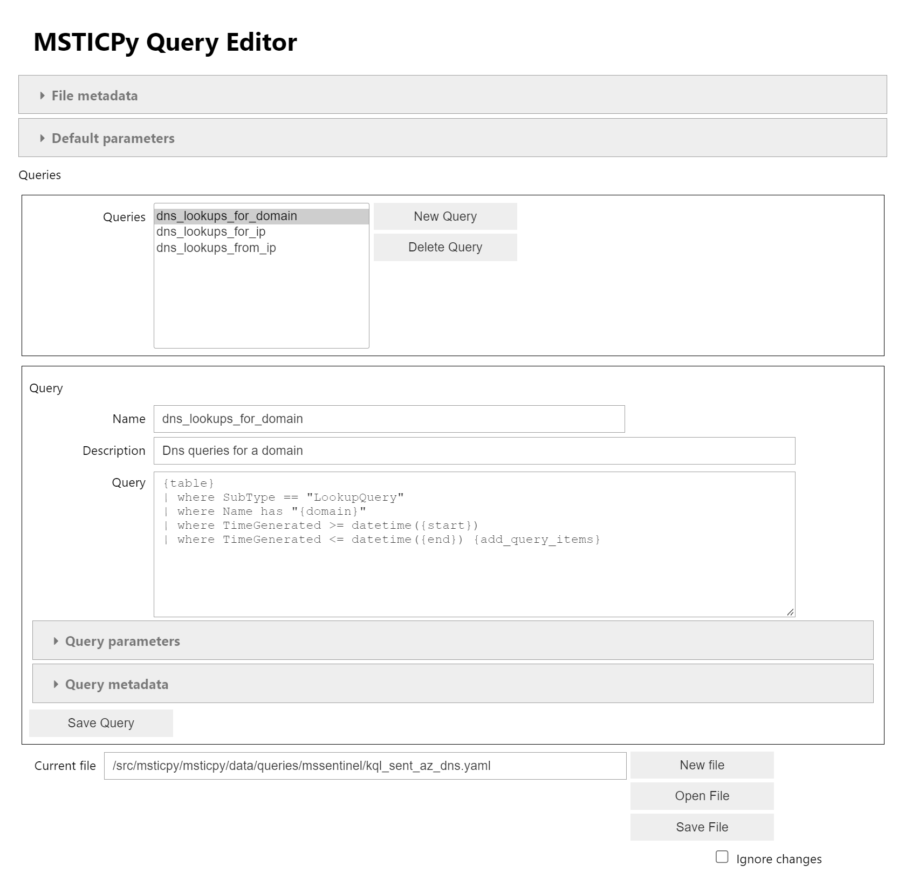
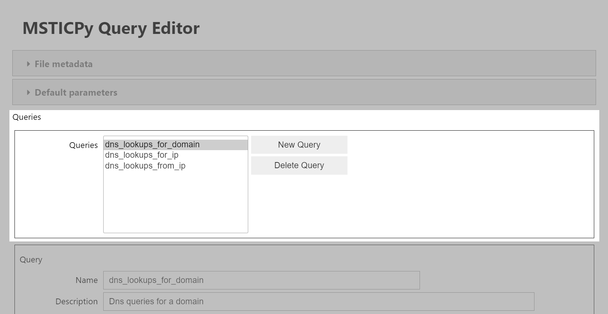
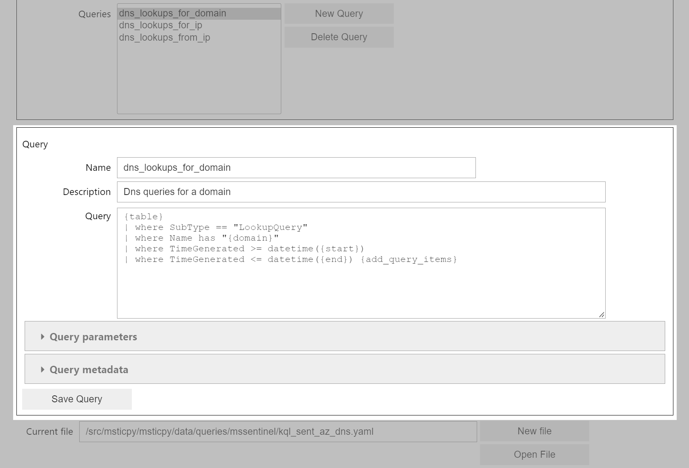
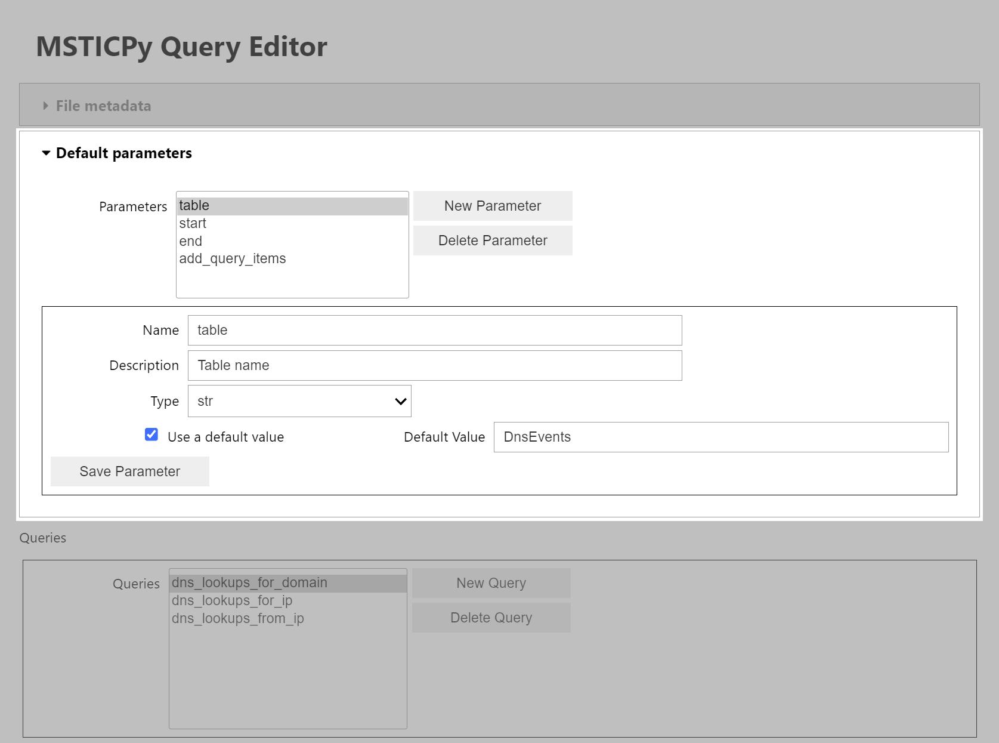
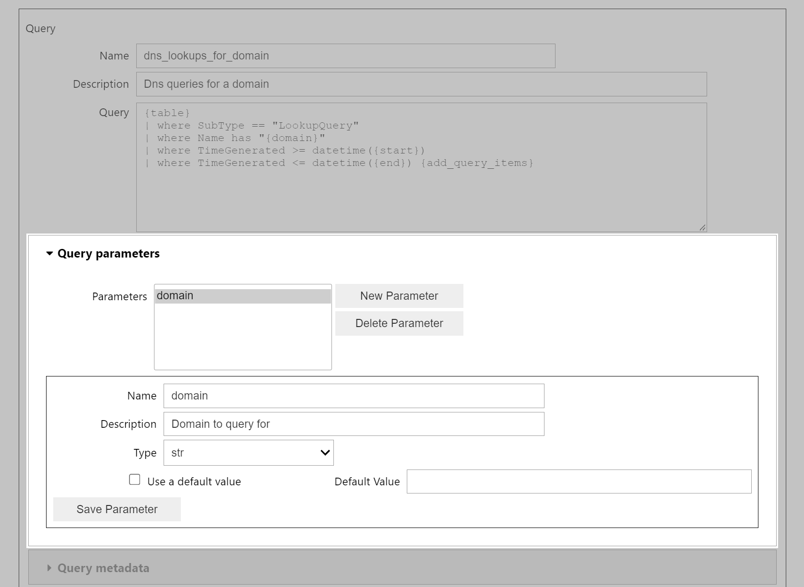
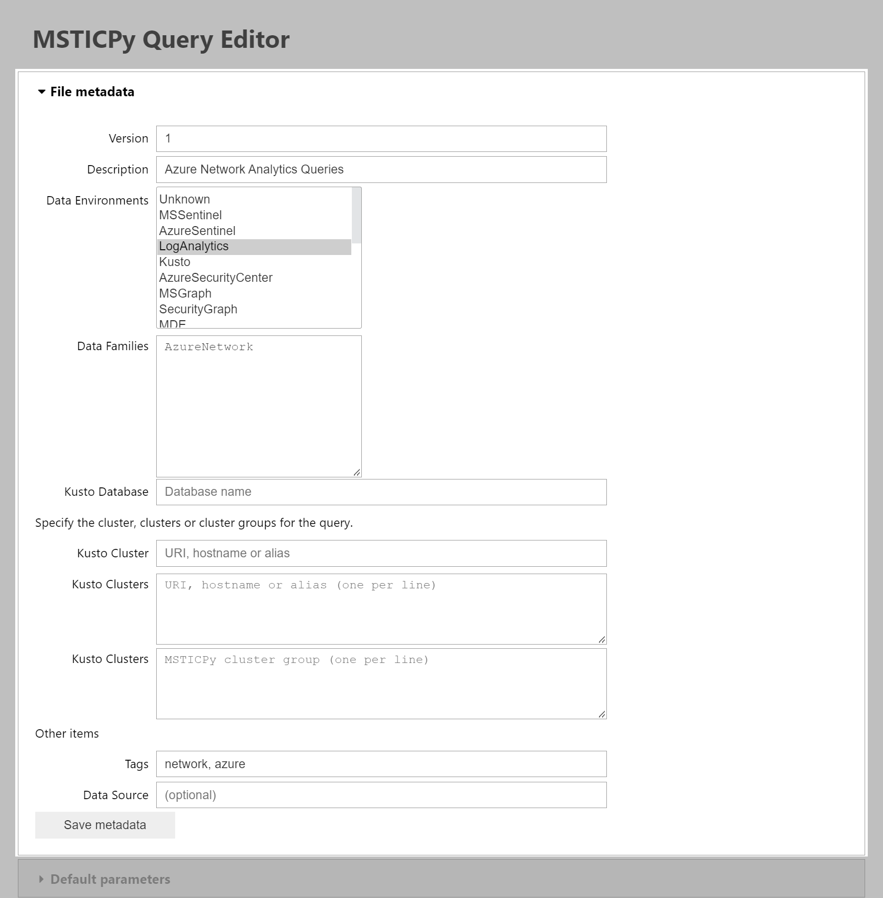
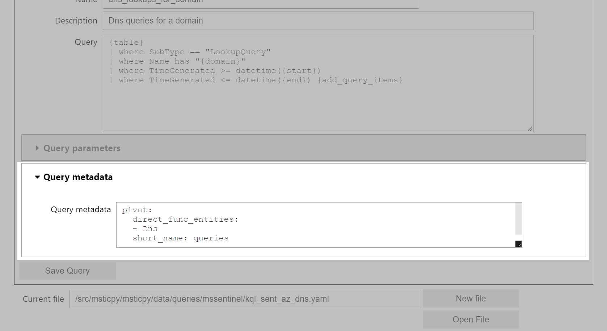

Query File Editor
=================

MSTICPy query collections are groups of related queries stored in YAML files
for use with one or more MSTICPy data providers.
The structure of these files and the purpose of the various sections
is described in :doc:`Queries`. Please read this section
to get a better understanding of the meaning of the various sections
of a query file.

The :py:class:`QueryEditor <msticpy.config.query_editor.QueryEditor>`
class provides a graphical user interface for creating and editing these
query collection files.

Loading the Query File Editor
-----------------------------

To use the ``QueryEditor`` class, create an instance of the class.
To edit an existing file, pass the path to the file as a parameter to
``QueryEditor``. If you supply no parameters a new
:py:class:`QueryCollection <msticpy.data.core.query_template.QueryCollection>`
object will be created.

.. note::

    The QueryFileEditor class is a Jupyter widget and will only work
    in a Jupyter notebook environment.

Example
~~~~~~~

Here is an example of how to use the ``QueryEditor`` class with
an existing file. You can also supply the ``query_file`` parameter
as a pathlib ``Path`` object or a ``QueryCollection`` object.

.. code-block:: ipython

    from msticpy.config.query_editor import QueryEditor

    # Create a QueryEditor instance for a YAML file
    editor = QueryEditor("my_query_collection.yaml")

    editor

Running ``editor`` on the last line will display the query editor interface.

The interface is divided into sections that map to the different
data sections in the query file. By default, some of these sections
are not shown until needed.
The default editor view shows a selectable list of available queries in the upper
part of the screen and the details the currently selected query in the lower
part. At the bottom of the window is the path of the query file being
edited along with buttons to save the file, open a file or create a new file.

Hidden sections allow editing of the file metadata, default parameters,
query-specific parameter and query-specific metadata.

These elements are described in the follow sections.

Query File Controls
-------------------

The query file controls are shown at the bottom of the editor window.
If you loaded a file from the command line (as in the earlier example),
the path to the file will be displayed here. If you loaded the QueryEditor
with no parameters or a query collection, a default filename is shown
here.

The **Save File** button saves the current state of the edited query collection
to the file path shown in the **Current file** field. You can type in
a new path to save the file to a different location.

The **Open File** button will try to open the file path shown in the **Current file**
field. If the file does not exist, an exception will be thrown.

The **New File** button will create a new empty query collection.

If you have made changes in the editor but have not saved them, **Open File**
and **New File** will do nothing. If you want to discard your changes, check
the **Ignore Changes** checkbox before clicking **Open File** or **New File**.

Query Selection Controls
------------------------

The query selection controls are shown in the upper part of the editor window.
Use the selection list to choose a query to edit. The query details will be
shown in the lower part of the window. The **New Query** button will add
a new query to the collection. The **Delete Query** button will delete the
currently selected query.

Query Details Editor Controls
-----------------------------

The query details editor controls are shown in the lower part of the editor window.

There are three primary fields, all are required:

* **Name** - the name of the query. This must be unique within the query collection.
* **Description** - a short (single-line) description of the query.
* **Query** - the query text. This can be any valid query text for the data provider
  that you are using. The **Query** is multi-line allowing you to break the
  query into separate lines. The query text can also contain parameters
  that will be replaced
  when the query is executed. See :doc:`../data_acquisition/DataProviders` for more details.

.. important::

    For any change that you make to a query you must save those changes using
    the **Save** button. This causes any changes you have made to update
    the in-memory query collection. It does not save the changes to the
    query file - use **Save File**, when you have made all of the changes
    needed to the file (or perhaps more frequently if you a bit cautious).

    Each subsection of the QueryEditor has its own **Save** button (Query,
    Parameters, Metadata). E.g. if you are editing a parameter defintion,
    hit **Save** before moving on to the next parameter. If you don't
    save the changes, they will be discarded.

Adding Query Parameters to the Query
------------------------------------

Query parameters can be included in the query text.
They are specified using the ``{parameter_name}`` syntax.
The parameter name must match the name of a parameter defined in the **Parameters**
section of the query file (see below).

Depending on the query syntax, the data provider and the data type of the parameter,
the parameter value will be inserted into the query text in different ways.
For example, if the parameter is a string, it will be inserted into the query
text as a quoted string. If the parameter is a datetime, it will be inserted
(by default) as an unquoted ISO8601 formatted string. Integers and floats
will be inserted as unquoted numbers. You may need to add additional syntax
to the query to have the parameter value interpreted correctly by the data
provider.

For instance, KQL syntax requires that datetime values are enclosed in
``datetime()`` function calls. To do this, you would need to add the function
call to the query text. To take a concrete example, if you had a parameter called
``StartTime`` that was a ``datetime``, you would need to add the function call
to the query text like this:

.. parsed-literal::

    | where EventTime >= datetime({StartTime})

Parameters also support list types. In general, the data provider library
and/or the data provider driver will have special handling for formatting
list types correctly. For example, the KQL-based drivers will convert a list
of strings as follows:

Assuming your query template looks like this

.. parsed-literal::

    {table}
    | where TimeGenerated >= datetime({StartTime})
    | where ClientIP in {ip_addresses}

The formatted query will look like this:

    ClientAccessLogs
    | where TimeGenerated >= datetime(2020-01-01T00:00:00)
    | where ClientIP in ("123.1.2.5", "17.4.34.8")

Special Query Parameters to include
~~~~~~~~~~~~~~~~~~~~~~~~~~~~~~~~~~~~

Although not mandatory, we recommend including the following parameters
in every query. Typically, you can add these to the default parameters
section.

* **start** - a datetime value that specifies the start time of the query.
* **end** - a datetime value that specifies the end time of the query.
* **table** - the name of the table to query. This allows the data provider
  to use check on the existence of a table before trying to run the
  query. It also allows queries to be repurposed for different table
  names. You should always include a default value for your ``table``
  parameter so that they user does not have to supply this parameter
  value in most cases.
* **add_query_items** - this is a string parameter that is designed
  to allow the query user to add additional logic to the query. For example,
  additional filtering, projection or aggregation logic. For query
  languages such as KQL that are built linearly from a series of
  operators, it is simple to include this as the last line of the
  template query. For other languages, adding parameters to allow
  user-defined query elements, this may be more complex and require
  additional parameters. Optional parameters such as this, should have
  a benign default value so the query will run without the user having
  to supply a value.

In this KQL example, we show a typical use of these parameters. The
``add_query_items`` parameter is included as the last line of the query
and defaults to an empty string.

.. parsed-literal::

    {table}
    | where TimeGenerated >= datetime({start}) and TimeGenerated < datetime({end})
    | where ClientIP in {ip_addresses}
    {add_query_items}

A user could add additional filtering, grouping or projection operators
by supplying a value for the ``add_query_items`` parameter.

Adding Query Parameters to the Query Definition
-----------------------------------------------

Every parameter that you want to use in the query text must be defined
in either the **Parameters** section of the query or the **Default Parameters** section.
The **Parameters** section defines parameters that are specific to the query.
The **Default Parameters** section defines parameters that are available to all
queries in the query collection (the query file). Query-specific parameters
will override default parameters if they have the same name.

The operation of the **Parameters** and **Default Parameters** sections is
identical.

Default Parameter editor

    :width: 800px
    :alt: Query Editor - Default Parameters

Query Parameter editor

    :alt: Query Editor - Query Parameters

The **Parameters** section has the following controls:

* A parameter list that shows all of the parameters defined in the section.
* A **New Parameter** button that will add a new parameter to the list.
* A **Delete Parameter** button that will delete the currently selected parameter.

For the selected parameter, the following controls are available:

* **Name** - the name of the parameter. This must be unique within the section.
  (See the section below on naming parameters.)
* **Description** - a short (single-line) description of the parameter.
  This is is used by the Python help system to give a user-friendly
  description of the purpose of the parameter.
* **Type** - the data type of the parameter. This must be one of the supported
  parameter types. See the section below on parameter types.
* **Use a default value** - if checked, the parameter you must supply a default
  in the **Default Value** field. If unchecked, the query user will have to
  supply a value for this parameter when running the query.
* **Default Value** - the default value for the parameter. This is the value
  used if the user does not supply a value for the parameter.
* **Save Parameter** - hitting this button saves your changes to the current
  parameter. This does not save the changes to the query file. If you select
  a different parameter or add a new one without saving the current parameter,
  any changes will be discarded.

Naming Query Parameters
~~~~~~~~~~~~~~~~~~~~~~~

Query parameters must have unique names within the **Parameters** section
although they can have the same name as a parameter in the **Default Parameters**.

Parameter names must be valid Python identifiers. They must start with a letter
and can only contain letters, numbers and underscores.

Some parameter names are treated specially by the query system. These are
typically parameters that refer to entity identifiers. For example, the
``host_name`` parameter is used to identify a host, ``ip_address`` indicates
an IP address.
These parameters are used by the MSTICPy Pivot subsystem. This groups all
entity-related functions (including queries) on the class for that entity.
This makes it easier to locate all queries that take a "Host" or "URL" as
parameters. The Pivot system is described in detail in
:doc:`../data_analysis/PivotFunctions`.

If you follow the naming convention for entity parameters, as shown below,
your queries will automatically be included in the Pivot system and attached
as pivot functions to the corresponding entity class.

=================  ================  ===================
Query Parameter    Entity            Entity Attribute
=================  ================  ===================
account_name       Account           Name
host_name          Host              fqdn
process_name       Process           ProcessFilePath
source_ip_list     IpAddress         Address
ip_address_list    IpAddress         Address
ip_address         IpAddress         Address
user               Account           Name
logon_session_id   Process           LogonSession
                   HostLogonSession  SessionId
                   Account           LogonId
process_id         Process           ProcessId
commandline        Process           CommandLine
url                Url               Url
file_hash          File              file_hash
domain             Dns               DomainName
resource_id        AzureResource     ResourceId
=================  ================  ===================

Query Collection Metadata
-------------------------

The **File metadata** section allows you to add global parameters
used by all queries in the file. These are inherited by all queries in
the same file. However, each query can have a metadata section
(of the same format) where any of the file parameters can be overridden.
Although we recommend avoiding this as much as possible.

Some of these parameters are are only used by the Kusto driver and
can be ignored for other drivers.

The settings common to all drivers are as follows. These are mandatory,
except where noted:

* **Version** - this is the version of the query collection. This
  an integer and is optional.
* **Description** - a short description of the query collection.
  This is also optional.
* **Data Environments** - this is used to determine which driver or
  drivers the query collection is associated with. For example, when
  you create a Kusto query provider (``QueryProvider("Kusto")``), the
  "Kusto" *DataEnvironment* parameter tells the query provider to both
  load the Kusto driver and to look for query collections that have
  "Kusto" in their *Data Environments* list.
  You can select multiple environments by holding down the Ctrl key
  if this query can be used by multiple drivers.
* **Data Families** - this is used to group queries into logical
  families, for example, "Network", "Syslog", "Windows". When the queries
  are added to the QueryProvider they will be grouped into data family
  containers (e.g. ``qry_prov.Syslog.list_ssh_logins()``).
  You can add multiple families on separate lines. You can make the
  names dotted to introduce multiple levels of hierarchy.
* **Tags** - this is a an optional list of tags that can be used to help search
  for queries (see :py:meth:`QueryProvider.search <msticpy.data.core.query_provider_utils_mixin.QueryProviderUtilsMixin.search>`)
  but not used otherwise. Tags are separated by commas.
* **Data Source** - this is an optional field for documentation and is
  not used by the query system.

For the Kusto driver, you can also specify cluster and database parameters.
See the :doc:`../data_acquisition/DataProv-Kusto` section for more details.

Query-specific metadata
-----------------------

You can add per-query metadata in this section.

Since query metadata is inherited from the file metadata, you only need to
add metadata for a query if you want to override the file metadata.
There are also some additional metadata fields that are used by the
Pivot system. To add query metadata, enter it as yaml-formatted text.
Follow the guidance in the :doc:`Queries` section for
help with the syntax used. You can also look at some of the queries
in the ``msticpy`` package for examples.