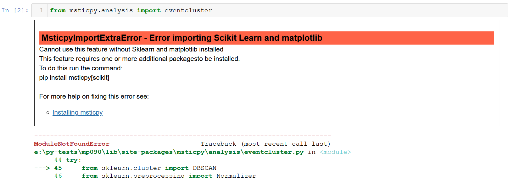

Installing
==========

Python 3.8 or Later
-------------------

*MSTICPy* requires Python 3.8 or later.
If you are running in hosted environment such as Azure Notebooks,
Python is already installed. Please ensure that the Python 3.8 (or later)
kernel is selected for your notebooks.

If you are running the notebooks locally, you will need to install Python 3.8
or later. The Ananconda distribution is a good starting point since it comes
with many of packages required by *MSTICPy* pre-installed.

Creating a virtual environment
------------------------------

.. note:: This is an optional step. You will most likely want to do this
   if you are installing *MSTICPy* in a local Python installation. If
   you are using a cloud notebook environment such as Azure ML you
   will usually not need to create a virtual environment.

*MSTICPy* has a significant number of dependencies. To avoid conflicts
with packages in your existing Python environment you may want to
create a Python virtual environment
or a conda environment and install the package there.

For standard python use the ``venv`` command to do this
(there are also several alternatives to venv available).

.. code:: bash

    ~$ python -m venv my_env
    ~$ ./my_env/scripts/activate
    (my_env) ~$

For Conda use the conda ``create`` command from a conda shell.

.. code:: bash

    (base) c:\users\ian> conda create -n my_env
    (base) c:\users\ian> conda activate my_env
    (my_env) c:\users\ian>

You should see the name of the environment that you've just
created and activated in the prompt.

Installation
------------

Run the following command to install the base configuation of *MSTICPy*.

``pip install msticpy``

or for the latest dev build

``pip install git+https://github.com/microsoft/msticpy``

Selective Installation - using "extras"
---------------------------------------

pip supports specification of an additional parameter sequence
known as extras. The syntax for this is:

``pip install package_name[extra1,extra2,...]``

As of version 0.9.0 *MSTICPy* has its dependencies split into
extras. This allows you to install only the packages that you
need and avoid the overhead of time and diskspace of dependencies
that you do not need.

.. note:: extras do not affect the which code from *MSTICPy* is
   installed - only the external libraries on which certain
   functions inside *MSTICPy* need to work.

.. warning:: zshell/MacOS users - you need to escape the first "[".
   Otherwise this is interpreted as the start of a file pattern
   match expression. In other shells such as bash you may find that
   you need to escape the leading "[" if the extra name matches
   the pattern of local files in your current directory.

   .. code:: bash

      pip install msticpy\[riskiq]

   If you are installing a specific version number you should
   also escape one of the "=" characters

   .code:: bash

      pip install msticpy\[vt]\==1.8.2

Extras in *MSTICPy*
~~~~~~~~~~~~~~~~~~~

The extras available in *MSTICPy* are described in the following table:

+------------------+------------------------------------+--------------+--------------+
| extra            | Functionality                      | Install time | Install time |
|                  |                                    | (increment)  | (full)       |
+==================+====================================+==============+==============+
| [none]           | - Most functionality (approx 75%)  |       --     |   1m:13s     |
|                  | - Kqlmagic Jupyter basic           |              |              |
+------------------+------------------------------------+--------------+--------------+
| keyvault         | - Key Vault and keyring storage of |       5s     |   1m:18s     |
|                  |   settings secrets                 |              |              |
+------------------+------------------------------------+--------------+--------------+
| azure            | - Azure API data retrieval         |   1m:36s     |   2m:50s     |
|                  |   (subs, resources, Vms, etc.)     |              |              |
|                  | - Azure storage APIs               |              |              |
|                  | - Azure Sentinel APIs (not data    |              |              |
|                  |   query)                           |              |              |
|                  | - Also includes "keyvault"         |              |              |
+------------------+------------------------------------+--------------+--------------+
| kql              | - Azure Sentinel data queries      |   2m:07s     |   3m:20s     |
|                  | - Kqlmagic Jupyter extended        |              |              |
+------------------+------------------------------------+--------------+--------------+
| sentinel         | - Combination of core install      |   3m:48s     |   5m:00s     |
| (aliases:        |   plus "azure", "keyvault" and     |              |              |
| azsentinel       |   "kql"                            |              |              |
| azuresentinel)   |                                    |              |              |
+------------------+------------------------------------+--------------+--------------+
| ml               | - Timeseries analysis              |      29s     |   1m:42s     |
|                  | - Event clustering                 |              |              |
|                  | - Outlier analysis                 |              |              |
+------------------+------------------------------------+--------------+--------------+
| splunk           | - Splunk data queries              |       3s     |   1m:16s     |
+------------------+------------------------------------+--------------+--------------+
| vt3              | - VirusTotal V3 graph API          |       4s     |   1m:17s     |
|                  |   (default VT lookup is included   |              |              |
|                  |   in base install)                 |              |              |
+------------------+------------------------------------+--------------+--------------+
| riskiq           | - RiskIQ Illuminate threat intel   |       6s     |   1m:19s     |
|                  |   provider & pivot functions       |              |              |
+------------------+------------------------------------+--------------+--------------+
| all              | - Includes all of above packages   |   4m:00s     |   5m:29s     |
+------------------+------------------------------------+--------------+--------------+
| dev              | - Development tools plus "base"    |   1m:17s     |   2m:30s     |
+------------------+------------------------------------+--------------+--------------+
| test             | - "dev" plus "all"                 |   4m:20s     |   5m:50s     |
+------------------+------------------------------------+--------------+--------------+

The installation times here are meant to be indicative of comparative
times for installation - they will vary depending on the performance of
your computer and network.

The *Install time (increment)* column shows times relative to
the base install (i.e. assuming you've already run ``pip install msticpy``).
The *Install time (full)* column shows the time to install the base
plus extra. Both columns assume that the following packages are already
installed: jupyter, pandas and matplotlib.

If you do not specify an "extra" in your pip install command, the base
dependencies for *MSTICPy* will be installed. This has a lot of functionality
such as networking, pivoting, visualization but excludes most dependencies
that are specific to a particular data environment like Azure Sentinel or
Splunk.

Some of the extras, like "all" and "azsentinel" are combinations of
other options collected together as a convenience. You can also specify
multiple extras during install, separating them with commas.

.. code:: bash

    pip install msticpy[azure,kql]

.. warning:: when specifying multiple extras, do not leave spaces between
   the options - just separate with commas.

Missing "extra" exceptions
^^^^^^^^^^^^^^^^^^^^^^^^^^

If you try to use functionality for a component that needs a dependency
that you have not installed you will usually get an informative
exception message telling you which "extra" option you need to use
to enable that feature.

To fix this simply run pip install with the "extra" option shown in the
exception message:

.. code:: bash

    pip install msticpy[ml]

.. note:: In some cases you many not get an informative error. We've
   tried to trap all of the cases but if
   experience a problem with some *MSTICPy* functionality (especially
   an *ImportError* exception, make sure
   that you have installed the *extra* that corresponds to the
   functionality you are trying to use.

Installing in Managed Spark compute in Azure Machine Learning Notebooks
^^^^^^^^^^^^^^^^^^^^^^^^^^^^^^^^^^^^^^^^^^^^^^^^^^^^^^^^^^^^^^^^^^^^^^^

*MSTICPy* installation for Managed (Automatic) Spark Compute in Azure Machine Learning workspace requires
different instructions since library installation is different.

.. note:: These notebook requires Azure ML Spark Compute.
   If you are using it for the first time, follow the guidelines at
   `Attach and manage a Synapse Spark pool in Azure Machine Learning (preview)
   <https://learn.microsoft.com/azure/machine-learning/how-to-manage-synapse-spark-pool?tabs=studio-ui>`__

Once you have completed the pre-requisites, you will see AzureML Spark Compute
in the dropdown menu for Compute. Select it and run any cell to start Spark Session.

Please refer to
`Managed (Automatic) Spark compute in Azure Machine Learning Notebooks
<https://learn.microsoft.com/azure/machine-learning/interactive-data-wrangling-with-apache-spark-azure-ml>`__
for more guidance and screenshots.

In order to install any libraries in Spark compute, you need to use a
conda file to configure a Spark session.
Please save below file as conda.yml , check the Upload conda file
checkbox. You can modify the version number as needed.
Then, select Browse, and choose the conda file saved earlier with
the Spark session configuration you want.
se, and choose the conda file saved earlier with the Spark session configuration you want.

.. code-block:: yaml

    name: msticpy
    channels:
    - defaults
    dependencies:
    - bokeh
    - numpy
    - pip:
        - msticpy[azure]>=2.3.1
