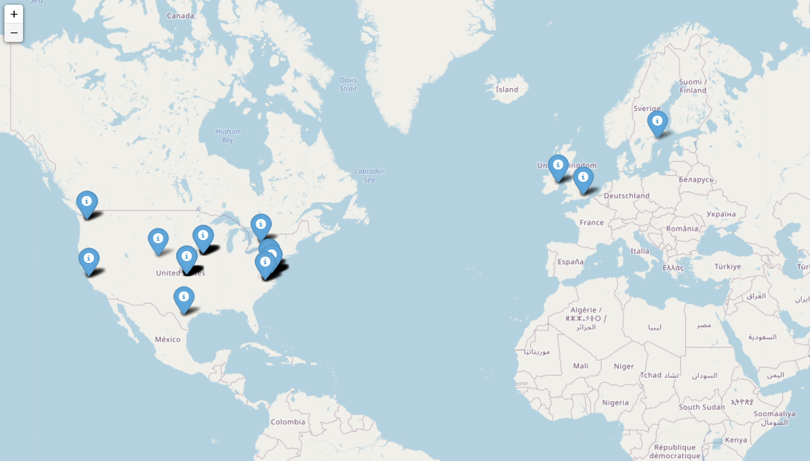

Quick Start Overview of MSTICPy
===============================

Installing
----------

Install from PyPI:

.. code:: bash

    pip install msticpy

.. note:: Ensure that the correct version of ``pip`` is being run.

    The safest approach is to avoid running ``pip`` directly from
    the command line. Instead, first ensure that you have activated
    the Python environment that you want to use then type:

    .. code:: bash

        python -m pip install msticpy

For more details see :doc:`Installing <../getting_started/Installing>`

Importing MSTICPy
-----------------

You can install MSTICPy as it is or rename it to something
easier to type such as ``mp``.

.. code:: python

    import msticpy as mp

Simple help is available:

.. code:: python

    help(mp)

.. parsed-literal::

    This product includes GeoLite2 data created by MaxMind, available from https://www.maxmind.com.
    Help on package msticpy:

    NAME
        msticpy - msticpy - Jupyter and Python Tools for InfoSec.

    ....

Many commonly-used classes are available as attributes of
the ``msticpy`` top-level package:

- QueryProvider
- MpConfigEdit - the configuration editor
- init_notebook - see `Initializing MSTICPy`_

Searching for a MSTICPy module
------------------------------

Use the ``search`` function to find the module to import

.. code:: python

    mp.search("geo")

Initializing MSTICPy
--------------------

The initialization function is intended to prepare things when
you are using MSTICPy interactive (usually in a notebook).
It does a few things by default:

- Imports some common (non-MSTICPy) packages such as pandas, numpy,
  ipywidgets
- Imports a number of MSTICPy components such as Entities
- Checks for a valid msticpyconfig file
- Initializes MSTICPy notebook magics and pandas accessors
- Hooks notebook exception handling to display friendly MSTICPy
  exceptions (other exceptions are unaffected).

.. code:: python

    mp.init_notebook()

If you are having issues with this you can increase the verbosity
of the output with ``verbosity=1`` or ``verbosity=1`` parameter.
Use ``help(mp.init_notebook)`` for more detailed usage.

Setup msticpyconfig.yaml
------------------------

For many of the most interesting MSTICPy features to work you
will need configuration for query providers and things like
Threat Intelligence and other data providers.

See the following documents for more details:

- :doc:`MSTICPy Config <../getting_started/SettingsEditor>`
- :doc:`Settings Editor <../getting_started/msticpyconfig>`

Running a data query
--------------------

To run a query you must load and instantiate a Query Provider
for the data source that you want to query from. Several providers
are supported by MSTICPy including: Microsoft Sentinel, Splunk,
Microsoft Defender, Azure Monitor, Cybereason and Sumologic.

.. code:: python

    qry_sent = mp.QueryProvider("MSSentinel")
    qry_splunk = mp.QueryProvider("Splunk")

You will need to connect and authenticate to the data service.
The exact parameters depend on the data provider and what
details you've added to your msticpconfig.yaml

.. code:: python

    qry_sent.connect(mp.WorkspaceConfig(workspace="MySentinelWorkspace"))
    qry_splunk.connect(host=splunk_uri, user="splunkuser", password=MYPWD)

Use ``query_prov.list_queries()`` to see the built-in queries for the
provider type.

Built-in queries are functions that usually require additional parameters.
Run the query passing "?" for more help (if you run a query that is
missing required parameters, the missing parameters will be listed in
the exception thrown)

.. code:: python

    results_df = qry_sent.WindowsSecurity.list_host_logons(host_name="myhost")

If successful, the query returns results as a pandas DataFrame.

For more information see: :doc:`Querying and Importing Data <../DataAcquisition>`

Visualizing Data
----------------

MSTICPy has several visualizations that are simple to use. Most
are based on the Bokeh package. Visualizations can be run directly
from DataFrames using the MSTICPy custom accessor ``mp_plot``.

.. code:: python

    results_df.mp_plot.timeline(group_by="LogonType")

.. figure:: ../visualization/_static/Timeline-05.png
   :alt: Timeline of logons grouped by logon type

.. code:: python

    results_df.mp_plot.folium_map(ip_column="IpAddress")

For more information see: :doc:`Displaying/Visualizing Data <../Visualization>`

Enriching data with Context and Pivot Functions
-----------------------------------------------

When investigating an incident, it is normal for analysts to need
more contextual information about the entities that they see. In
MSTICPy you can run many context queries directly from Entities.
Entities are Python classes such as IpAddress, Host, Url, that
encapsulate attributes and methods relevant to the corresponding
objects in the real (virtual?) world.

For example:

.. code:: python

    IpAddress.ip_type("172.217.14.206")

=============== =======
ip              result
=============== =======
172.217.14.206	Public
=============== =======

.. code:: python

    IpAddress.whois("172.217.14.206")

=====  ===============  ==================  ==========  =================  ==============  ============================================
  asn  asn_cidr         asn_country_code    asn_date    asn_description    asn_registry    nets
=====  ===============  ==================  ==========  =================  ==============  ============================================
15169  172.217.14.0/24  US                  2012-04-16  GOOGLE, US         arin            [{'cidr': '172.217.0.0/16', 'name': 'GOOGLE'
=====  ===============  ==================  ==========  =================  ==============  ============================================

If you have any Threat Intelligence provider accounts configured
in your msticpconfig.yaml you can use the same mechanism to
lookup Threat Intelligence reports on one or more observables.

.. code:: python

    iocs = ['162.244.80.235', '185.141.63.120', '82.118.21.1', '85.93.88.165']
    IpAddress.ti.lookup_ip(iocs)

==============  =========  ================  ==========  ===========  ======================================================================================  =====================================================
Ioc             IocType    SanitizedValue    Provider    Severity     Details                                                                                 Reference
==============  =========  ================  ==========  ===========  ======================================================================================  =====================================================
162.244.80.235  ipv4       162.244.80.235    RiskIQ      high         {'summary': {'resolutions': 12, 'certificates': 12, 'malware_hashes': 2, 'projects'...  https://community.riskiq.com
185.141.63.120  ipv4       185.141.63.120    RiskIQ      high         {'summary': {'resolutions': 2, 'certificates': 6, 'malware_hashes': 1, 'projects': ...  https://community.riskiq.com
82.118.21.1     ipv4       82.118.21.1       RiskIQ      high         {'summary': {'resolutions': 13, 'certificates': 20, 'malware_hashes': 0, 'projects'...  https://community.riskiq.com
85.93.88.165    ipv4       85.93.88.165      RiskIQ      high         {'summary': {'resolutions': 24, 'certificates': 25, 'malware_hashes': 2, 'projects'...  https://community.riskiq.com
162.244.80.235  ipv4       162.244.80.235    VirusTotal  high         {'verbose_msg': 'IP address in dataset', 'response_code': 1, 'positives': 34, 'dete...  https://www.virustotal.com/vtapi/v2/ip-address/report
185.141.63.120  ipv4       185.141.63.120    VirusTotal  high         {'verbose_msg': 'IP address in dataset', 'response_code': 1, 'positives': 19, 'dete...  https://www.virustotal.com/vtapi/v2/ip-address/report
82.118.21.1     ipv4       82.118.21.1       VirusTotal  high         {'verbose_msg': 'IP address in dataset', 'response_code': 1, 'positives': 41, 'dete...  https://www.virustotal.com/vtapi/v2/ip-address/report
85.93.88.165    ipv4       85.93.88.165      VirusTotal  high         {'verbose_msg': 'IP address in dataset', 'response_code': 1, 'positives': 7, 'detec...  https://www.virustotal.com/vtapi/v2/ip-address/report
==============  =========  ================  ==========  ===========  ======================================================================================  =====================================================

You can also use the individual modules directly from the
TILookup module:

.. code:: python

    ioc_lookup = mp.TILookup()
    ioc_lookup.lookup_iocs(iocs)

You can also use additional queries as context lookups.
For example:

.. code:: python

    Host.qry_sent_myworkspace.LinuxSyslog.list_logons_for_source_ip(iocs)

MSTICPy also includes more specialized context functions
for Azure and Azure Sentinel resources.

For more details about context functions see:

- :doc:`Enriching Data <../DataEnrichment>`
- :doc:`Pivot Functions <../data_analysis/PivotFunctions>`

Analysis and Data Transformation
--------------------------------

MSTICPy has several generic analysis and transformation
functions. Some examples of transforms are:

- Process Tree building
- Decoding encoded and compressed data
- IoC/observable extraction from data
- Syslog parsing

Some examples of analysis functions are:

- Anomaly patterns in Office activity
- Time series decomposition
- Event clustering

For more details see:

- :doc:`Data Analysis <../DataAnalysis>`
- :doc:`Process Trees <../visualization/ProcessTree>`