*MSTICPy* Settings Editor
=========================

The Settings editor is a collection of classes that let you manage and edit
your **MSTICPy** settings.

This document is a walkthrough of using these classes to create your settings
from scratch.

There is also a notebook that follows this flow. You can download
and use this to configure your settings -
`MPSettingsEditor <https://github.com/microsoft/msticpy/blob/master/docs/notebooks/MPSettingsEditor.ipynb>`__

You should also read the companion document
:doc:`*MSTICPy* Package Configuration <msticpyconfig>`, which has
more information about individual settings.

To load the editor classes run the following.

.. code:: ipython3

    from msticpy.config import MpConfigFile, MpConfigEdit

This loads MpConfigFile - a tool to manage settings files - and
MpConfigEdit. MpConfigEdit is the user interface for adding and editing
individual settings.

.. warning:: Creating and editing your settings will likely involve displaying
   secrets such as API Keys in the Jupyter notebook that you are using
   to edit the settings.

   These secrets may be persisted in the notebook you are using and in
   the checkpointed auto-save copy that Jupyter keeps in the ``.ipynb_checkpoints``
   sub-folder. To remove these, clear all cell outputs and then save the notebook.
   This should remove any output from both the main copy of the notebook
   and the checkpoint copy. For the very security-conscious, it is also a
   good idea to clear your browser cache, or use the settings notebook in
   *private* mode.

   These secrets are never normally displayed by *MSTICPy*, nor are they
   stored in the browser memory so should never appear in your
   browser cache. When editing or displaying those settings though, **both** of
   these happen. Caveat emptor!

Checking your existing settings
-------------------------------

You can use MpConfigFile from the command line or as an interactive UI
to do this.

.. code:: ipython3

    mpconfig = MpConfigFile()
    mpconfig.load_default()
    mpconfig.view_settings()

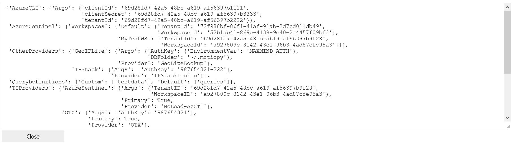

   image.png

If you see nothing but a pair of curly braces in the settings view above it means that you
should set up a ``msticpyconfig.yaml``.

.. note:: If you know that you have configured a ``msticpyconfig`` file
   you can search for this file using MpConfigFile. Click on **Load file**
   and browse to or search for the file.
   Once you’ve done that go to the `Setting the path to your
   msticpyconfig.yaml <#Setting-the-path-to-your-msticpyconfig.yaml>`__
   to set your MSTICPYCONFIG environment variable.

Edit your msticpyconfig settings
--------------------------------

MpConfigEdit
~~~~~~~~~~~~

To do this we'll be using the configuration editor MpConfigEdit.
It uses a tabbed interface to show different settings sections.

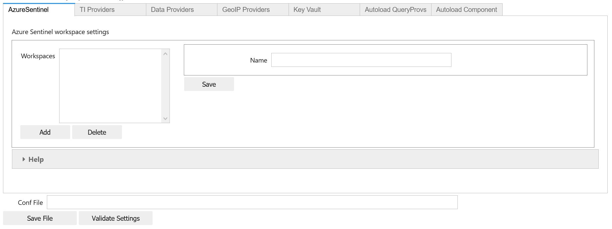

As well as showing settings, there is text box to input a file name to
save the settings to - with a corresponding **Save Settings** button.

.. note:: Each settings tab has a **Save** button. This saves changes on
   the current editor screen to an in-memory copy of your settings. They
   are not saved to a file until you enter a file name and click on
   **Save Settings**.

The **Validate Settings** also lets you check on the status of the settings.
It does a logical check (for sections/settings that you probably need) as
well as a structural check to make sure that setting syntax is specified
correctly. The results of the validation are shown in a text view box.
Close this when you are done with the **Close** button.

There is also help for the settings available on each tab, with links
to more detailed documentation.

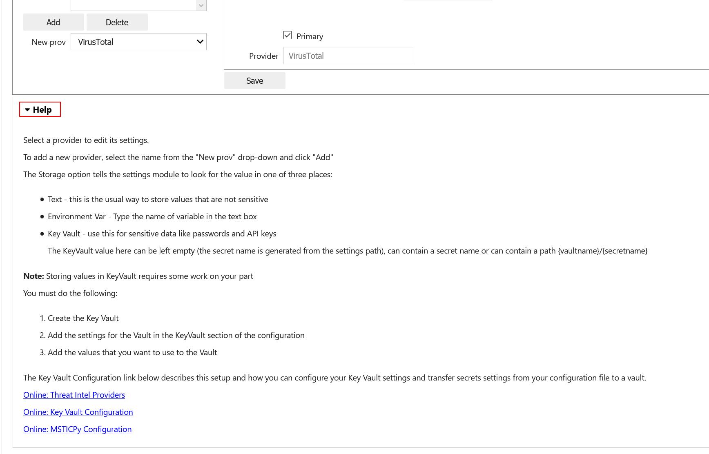

MpConfigEdit has a single parameter ``settings``. This can take be:

- a file path - it will try to load settings from the file.
- an instance of ``MpConfigFile`` - it will load the settings loaded by
  this tool. This is useful if you need to search for a file using MpConfigFile
  and then edit the settings.
- a settings dictionary - the msticpyconfig settings converted from YAML into
  a Python dictionary

If you don't supply any value for ``settings`` it will try to load your default
settings using the MSTICPYCONFIG environment variable.

Microsoft Sentinel Workspaces
-----------------------------

Microsoft Sentinel settings can be edited from the **MicrosoftSentinel**
tab. Click on the **Add** button to add a new Workspace settings
entry or select an existing Workspace to edit the settings.

Click on **Update** to confirm changes that you make and click
on **Save Settings** to write the settings to the selected ``msticpyconfig.yaml``.

Import Microsoft Sentinel Workspace Settings
~~~~~~~~~~~~~~~~~~~~~~~~~~~~~~~~~~~~~~~~~~~~

In version 2.0 of MSTICPy we added functionality to retrieve
Microsoft Sentinel settings from a portal URL and to resolve
full details of a Workspace from partial information such as
a Workspace ID.

In the **Microsoft Sentinel** tab, you can paste a URL from
the Microsoft Sentinel portal, for example, the Overview Page.

.. note:: You will need to authenticate to Azure for this to
   work. If you are not automatically authenticated, use the
   following code in another cell and retry.

   .. code:: python

      from msticpy.auth.azure_auth import az_connect
      az_connect()

Navigate to your
Sentinel portal and copy the URL from the address bar. Paste this
into the **Portal URL** text box and click on **Import from URL**.
Clicking on **Import from URL** will parse the URL and attempt
to lookup the full workspace details and populate the currently
selected workspace with these details.

.. warning:: The **Import from URL** will overwrite any settings
   for the workspace currently displayed. If you do this by mistake
   simple select another workspace then select your previous workspace
   (without clicking on the **Update** button), to refresh the
   existing settings.

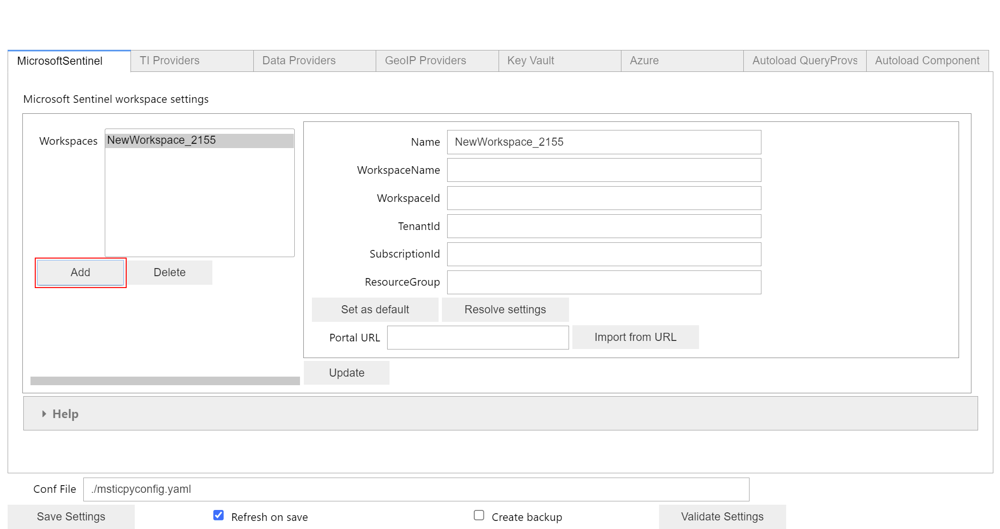

You can also resolve full Workspace details from partial details
using the **Resolve settings** button. Using this you can populate
full workspace details from a Workspace ID or Workspace Name.

.. important:: The value for TenantID returned using either of these
   operations is the Tenant ID of the workspace itself. If you are
   using Azure Lighthouse or other delegation authentication mechanism
   and your account is not in the same Azure Active Directory (AAD) you
   should use the Tenant ID of the AAD where your account is located.

Importing settings from ``config.json``
~~~~~~~~~~~~~~~~~~~~~~~~~~~~~~~~~~~~~~~

When you create a notebook in Azure Machine Learning, Microsoft Sentinel
creates a ``config.json`` file in the root of your
notebooks user folder. You can use this configuration file as an
alternative to using the Workspace lookup described in the previous
section.

This file contains configuration details about the
Microsoft Sentinel workspace that you launched the notebook from. However,
the format is slightly different to the settings format used by **MSTICPy**.

Follow these steps to find and convert your ``config.json``:

1. Run ``MpConfigFile()`` (see the code immediately below)
2. Locate your ``config.json``

   - click the **Load file** button. There are two options for finding
     a file.
   - Browse - use the controls to navigate to find config.json
   - Search - set the starting directory to search and open the
     **Search** drop-down
   - When you see the file click on it to select it and
     click **Select File** button (below the file browser). The **Select File**
     button will act on the last file you selected - whether in the file directory
     listing or the search results.
   - optionally, click **View Settings** to confirm that the settings in the
     ``config.json`` look right

3. Convert the config settings to msticpyconfig format

   - click **Convert to MP**
   - click **View Settings**

4. Save the file

   - type a path into the **Current file** text box
   - Click on **Save file**

5. You can set this file to always load by assigning the path to
   an environment variable. See `Setting the path to your
   msticpyconfig.yaml <#Setting-the-path-to-your-msticpyconfig.yaml>`__

.. code:: ipython3

    mpconfig = MpConfigFile()
    mpconfig

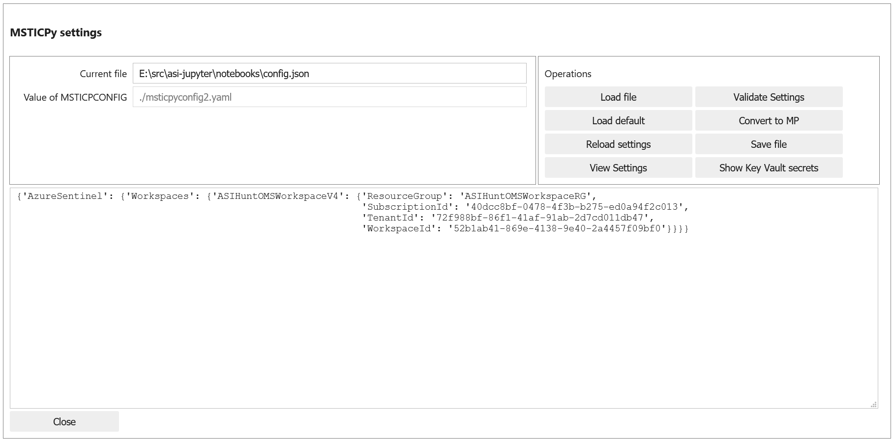

This is the equivalent of the previous steps from the command line, which
is probably faster if you know where your config file is.

.. code:: ipython3

    mpconfig = MpConfigFile()
    mpconfig.load_from_file("E:\\src\\sentinel\\notebooks\\config.json")
    mpconfig.map_json_to_mp_ws()
    mpconfig.settings

.. code:: ipython3

    {'AzureSentinel': {'Workspaces': {'ASWorkspace': {'ResourceGroup': 'ASWorkspaceRG',
        'SubscriptionId': '2c1bc08d-6a9e-43f0-aa55-a84f383b1a6b',
        'TenantId': '3f3fb3df-3c79-4407-8043-4a765430db0e',
        'WorkspaceId': '722f602f-340e-47a1-8d0a-c2b6a8fbc4c4'}}}}

If you loaded a config.json file you should see your workspace
displayed. If not, you can add one or more workspaces here. The Name,
WorkspaceId and TenantId are mandatory. The other fields are helpful but
not essential.

Default Workspace
~~~~~~~~~~~~~~~~~
If you have a workspace that you use frequently or all of the time, you
may want to set this as the default. This creates a duplicate entry
named “Default” and this is used when you connect to AzureSentinel as
the default workspace to connect to (you can override this by specifying
a workspace name at connect time).

Getting help
~~~~~~~~~~~~

Use the **Help** drop-down panel to find more information about adding
workspaces and finding the correct values for your workspace.

Saving your settings
~~~~~~~~~~~~~~~~~~~~

When you’ve finished, type a file name (usually “msticpyconfig.yaml”)
into the **Conf File** text box and click **Save File**,

You can also try the **Validate Settings** button. This should show that
you have a few missing sections (we’ll fill these in later) but should
show nothing under the the “Type Validation Results”.

.. code:: ipython3

    mpedit = MpConfigEdit(settings=mpconfig)
    mpedit

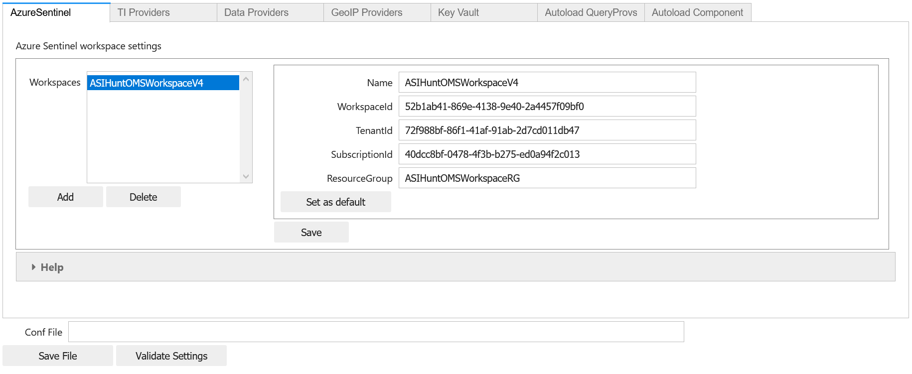

.. note:: The saved settings are not automatically reloaded by
   MSTICPy. If you want to reload the settings you just saved
   you can use the following code

   .. code:: python

      import msticpy
      msticpy.settings.refresh_config()

How MSTICPy finds ``msticpyconfig.yaml``
----------------------------------------

MSTICPy uses the following logic for finding its configuration
file:

- Using the path defined in a MSTICPYCONFIG environment variable
- Looking for a msticpyconfig.yaml in the .msticpy folder of your
  home directory (%USERPROFILE% on Windows or $HOME on Linux/Mac)
- Looking in the current directory

When you use :py:meth:`init_notebook <msticpy.init.nbinit.init_notebook>`
to initialize MSTICPy you can also specify a ``config="<path>"``
parameter. This will load msticpy settings from this location
and takes priority over the other methods.

Setting the MSTICPYCONFIG variable to point to your msticpyconfig.yaml
~~~~~~~~~~~~~~~~~~~~~~~~~~~~~~~~~~~~~~~~~~~~~~~~~~~~~~~~~~~~~~~~~~~~~~

This is a good point to set up an environment variable so that you can
keep a single configuration file in a known location and always load the
same settings. Of course, you’re free to use multiple configs if you
need to use different settings for each notebook folder. If you don't
set the MSTICPYCONFIG variable **MSTICPy** will try to load a
``msticpyconfig.yaml`` from the current directory.

-  decide on a location for your ``msticpyconfig.yaml``
   This could be in ``~/.msticpyconfig.yaml`` or ``%userprofile%/msticpyconfig.yaml``
-  copy the ``msticpyconfig.yaml`` file that you just created to this location.
-  set the ``MSTICPYCONFIG`` environment variable to point to that location

On Windows
^^^^^^^^^^

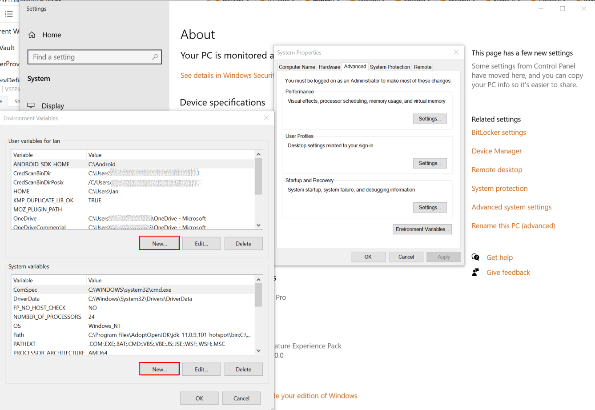

On Linux/Mac
^^^^^^^^^^^^

In your .bashrc (or somewhere else convenient) add:

.. code:: bash

    export MSTICPYCONFIG=~/.msticpyconfig.yaml

Test auto-loading your msticpyconfig.yaml
^^^^^^^^^^^^^^^^^^^^^^^^^^^^^^^^^^^^^^^^^

-  In the cell below replace the ``./msticpyconfig2.yaml`` with the
   filename from the previous step
-  Run the cell (Ctrl-Enter or Shift-Enter)

You should see the settings editor loaded with the settings you created
earlier

.. note:: The environment variable set in the cell below is not persistent. To make
   this persistent you need to add it to a startup file like .bashrc or
   your Windows registry as described above.

.. code:: ipython3

    %env MSTICPYCONFIG=./msticpyconfig2.yaml
    mpedit = MpConfigEdit()
    mpedit

You should see your saved settings displayed.

More Settings
-------------

Adding Threat Intelligence (TI) Providers
~~~~~~~~~~~~~~~~~~~~~~~~~~~~~~~~~~~~~~~~~

You will likely want to do lookups of IP Addresses, URLs and other items
to check for any Threat Intelligence reports. To do that you need to add
the providers that you want to use. Most TI providers require that you
have an account with them and supply an API key or other authentication
items when you connect.

Most providers have a free use tier (or in cases like AlienVault OTX)
are entirely free. Free tiers for paid providers usually impose a
certain number of requests that you can make in a given time period.

For account creation, each provider does this slightly differently. Use
the help links in the editor help to find where to go set each of these
up.

Assuming that you have done this, we can configure a provider. Be sure
to store any authentication keys somewhere safe (and memorable).

We are going to use `VirusTotal <https://www.virustotal.com>`__ (VT) as
an example TI Provider. For this you will need a VirusTotal API key from
the
`VirusTotal <https://developers.virustotal.com/v3.0/reference#getting-started>`__
website. We also support a range of other threat intelligence providers
- you can read about this here `MSTICPy
TIProviders <https://msticpy.readthedocs.io/en/latest/data_acquisition/TIProviders.html>`__

Taking VirusTotal as our example.

- Click on the **TI Providers** tab
- Select "VirusTotal" from the **New prov** drop-down list
- Click **Add**

This should show you the values that you need to provide:

- a single item **AuthKey** (this is usually referred to as an “API Key”)

You can paste the key into the **Value** field and click the **Save**
button. Do not surround the value with quotes.

Instead of keeping your key in the configuration file,
you can opt to store the VT AuthKey as an environment variable. This is
a bit more secure than having it laying around in configuration files.
Assuming that you have set you VT key as an environment variable

.. code:: bash

   set VT_KEY=VGhpcyBzaG91bGQgc2hvdyB5b3UgdGhlIHZhbHVlcyB  (Windows)
   export VT_KEY=VGhpcyBzaG91bGQgc2hvdyB5b3UgdGhlIHZhbHVlcyB  (Linux/Mac)

Flip the **Storage** radio button to **EnvironmentVar** and type the
name of the variable (``VT_KEY`` in our example) into the value box.

You can also use Azure Key Vault to store secrets like these but we will
need to set up the Key Vault settings before this will work. This
is covered later in `Key Vault Secrets`_ and `Key Vault`_.

Click the **Save File** button to save your changes.

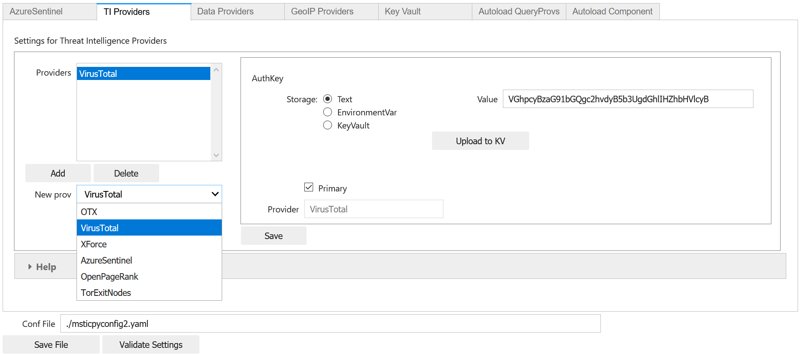

Test that the TI settings work
~~~~~~~~~~~~~~~~~~~~~~~~~~~~~~

This assumes that you have set an environment variable pointed at your
``msticpyconfig.yaml`` or have this file in your current directory.
Use the MpConfigFile tool to force *MSTICPy* to reload settings from the disk,
then run a simple lookup.

.. code:: ipython3

    mpconfig.refresh_mp_config()

    # import the TI module
    from msticpy.context import TILookup
    result = TILookup().lookup_ioc('ed01ebfbc9eb5bbea545af4d01bf5f1071661840480439c6e5babe8e080e41aa')
    TILookup.result_to_df(result)

=============  ===========  ==============  ==========  ========  ==========  ====================================================== =========================  ===============================================  ========
Ioc            IocType      QuerySubtype    Provider    Result    Severity    Details                                                RawResult                  Reference                                          Status
=============  ===========  ==============  ==========  ========  ==========  ====================================================== =========================  ===============================================  ========
ed01ebfbc9...  sha256_hash                  VirusTotal  True      high        {'verbose_msg': 'Scan finished, information embedde... {'scans': {'Bkav': {'d...  https://www.virustotal.com/vtapi/v2/file/report         0
=============  ===========  ==============  ==========  ========  ==========  ====================================================== =========================  ===============================================  ========

Key Vault Secrets
~~~~~~~~~~~~~~~~~

If you have a secret configured as a text string or set as an environment
variable, you can use the **Upload to KV** button on the to move it to a
Vault. You must have Key Vault settings configured before you can do this.
See `Key Vault`_ later in this document.

*MSTICPy* will generate a default name for the secret based on the path
of the setting (e.g. "TIProviders-VirusTotal-Args-AuthKey"). If the value
is successfully uploaded the **Value** field in the settings dialog will
be deleted and the underlying setting replaced with a ``{ "KeyVault": null }``
value. *MSTICPy* will use this to indicate that it should generate the path
automatically when trying to retrieve the key.

If you already have secrets stored in a Key Vault you can enter the secret
name in the **Value** field. If the secret is not stored in your default
Vault (the values specified in the `Key Vault`_ section), you can specify a path
of *VaultName*/*SecretName*. Fetching settings from a Vault in a different
tenant is not currently supported.

See also the
:ref:`Specifying secrets as Key Vault secrets <getting_started/msticpyconfig:specifying secrets as key vault secrets>`
section of the *MSTICPy* Package Configuration document.

Adding GeoIP Providers
~~~~~~~~~~~~~~~~~~~~~~

*MSTICPy* supports two geo location providers - *Maxmind GeoIPLite* and *IP Stack*.
The main difference between the two is that Maxmind downloads and uses a
local database, while IPStack is a purely online solution.

For either you need API keys to either download the free database from
MaxMind or access the IPStack online lookup

We’ll use IPStack as our example. You can sign up for a free accounts for
`IPStack <https://ipstack.com>`__ and
`Maxmind <https://www.maxmind.com/en/geolite2/signup>`__
where you can obtain an API key. You’ll need
the API for the following steps.

- Select “GeoIPLite” from the **New Prov**
- Click **Add**
- Paste your Maxmind key into the **Value** field

Set the Maxmind data folder: - this defaults to ``~/.msticpy``
- On Windows this translates to the foldername ``%USERPROFILE%/.msticpy``.
- On Linux/Mac this translates to the folder ``.msticpy`` in your home folder.

This folder is where the downloaded GeopIP database will be stored -
although you can choose another folder name and location if you prefer.

.. note:: As with the TI providers, you can opt to store your key as
   an environment variable or keep it in Key Vault.

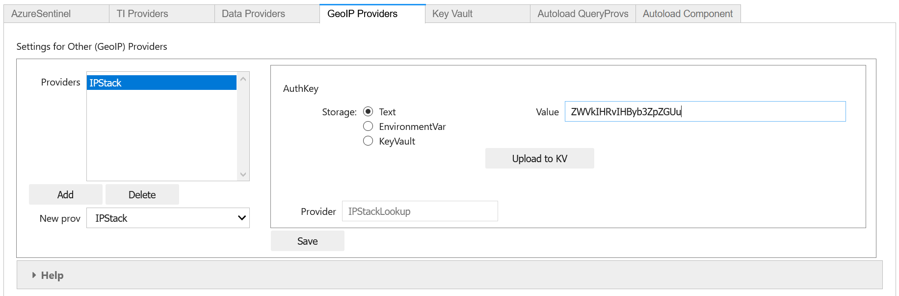

Test that the GeoIP settings work
~~~~~~~~~~~~~~~~~~~~~~~~~~~~~~~~~

.. code:: ipython3

    mpconfig.refresh_mp_config()

    from msticpy.context.geoip import IPStackLookup
    geoip = IPStackLookup()
    geoip.lookup_ip("52.96.165.18")[1][0]

.. raw:: html

    <h3>ipaddress</h3>
    {&nbsp;'AdditionalData':&nbsp;{}, 
    &nbsp;&nbsp;'Address':&nbsp;'52.96.165.18', 
    &nbsp;&nbsp;'Location':&nbsp;{&nbsp;'AdditionalData':&nbsp;{}, 
    &nbsp;&nbsp;&nbsp;&nbsp;&nbsp;&nbsp;&nbsp;&nbsp;&nbsp;&nbsp;&nbsp;&nbsp;&nbsp;&nbsp;&nbsp;&nbsp;'City':&nbsp;'Quincy', 
    &nbsp;&nbsp;&nbsp;&nbsp;&nbsp;&nbsp;&nbsp;&nbsp;&nbsp;&nbsp;&nbsp;&nbsp;&nbsp;&nbsp;&nbsp;&nbsp;'CountryCode':&nbsp;'US', 
    &nbsp;&nbsp;&nbsp;&nbsp;&nbsp;&nbsp;&nbsp;&nbsp;&nbsp;&nbsp;&nbsp;&nbsp;&nbsp;&nbsp;&nbsp;&nbsp;'CountryName':&nbsp;'United&nbsp;States', 
    &nbsp;&nbsp;&nbsp;&nbsp;&nbsp;&nbsp;&nbsp;&nbsp;&nbsp;&nbsp;&nbsp;&nbsp;&nbsp;&nbsp;&nbsp;&nbsp;'Latitude':&nbsp;47.206031799316406, 
    &nbsp;&nbsp;&nbsp;&nbsp;&nbsp;&nbsp;&nbsp;&nbsp;&nbsp;&nbsp;&nbsp;&nbsp;&nbsp;&nbsp;&nbsp;&nbsp;'Longitude':&nbsp;-119.7993392944336, 
    &nbsp;&nbsp;&nbsp;&nbsp;&nbsp;&nbsp;&nbsp;&nbsp;&nbsp;&nbsp;&nbsp;&nbsp;&nbsp;&nbsp;&nbsp;&nbsp;'State':&nbsp;'Washington', 
    &nbsp;&nbsp;&nbsp;&nbsp;&nbsp;&nbsp;&nbsp;&nbsp;&nbsp;&nbsp;&nbsp;&nbsp;&nbsp;&nbsp;&nbsp;&nbsp;'Type':&nbsp;'geolocation', 
    &nbsp;&nbsp;&nbsp;&nbsp;&nbsp;&nbsp;&nbsp;&nbsp;&nbsp;&nbsp;&nbsp;&nbsp;&nbsp;&nbsp;&nbsp;&nbsp;'edges':&nbsp;set()}, 
    &nbsp;&nbsp;'ThreatIntelligence':&nbsp;[], 
    &nbsp;&nbsp;'Type':&nbsp;'ipaddress', 
    &nbsp;&nbsp;'edges':&nbsp;set()}

|

This is the equivalent for Maxmind *GeoLite*.

.. code:: ipython3

    mpconfig.refresh_mp_config()

    from msticpy.context.geoip import GeoLiteLookup
    geoip = GeoLiteLookup()
    geoip.lookup_ip("52.96.165.18")[1][0]

.. raw:: html

    <h3>ipaddress</h3>{&nbsp;'AdditionalData':&nbsp;{}, 
    &nbsp;&nbsp;'Address':&nbsp;'52.96.165.18', 
    &nbsp;&nbsp;'Location':&nbsp;{&nbsp;'AdditionalData':&nbsp;{}, 
    &nbsp;&nbsp;&nbsp;&nbsp;&nbsp;&nbsp;&nbsp;&nbsp;&nbsp;&nbsp;&nbsp;&nbsp;&nbsp;&nbsp;&nbsp;&nbsp;'CountryCode':&nbsp;'US', 
    &nbsp;&nbsp;&nbsp;&nbsp;&nbsp;&nbsp;&nbsp;&nbsp;&nbsp;&nbsp;&nbsp;&nbsp;&nbsp;&nbsp;&nbsp;&nbsp;'CountryName':&nbsp;'United&nbsp;States', 
    &nbsp;&nbsp;&nbsp;&nbsp;&nbsp;&nbsp;&nbsp;&nbsp;&nbsp;&nbsp;&nbsp;&nbsp;&nbsp;&nbsp;&nbsp;&nbsp;'Latitude':&nbsp;47.6032, 
    &nbsp;&nbsp;&nbsp;&nbsp;&nbsp;&nbsp;&nbsp;&nbsp;&nbsp;&nbsp;&nbsp;&nbsp;&nbsp;&nbsp;&nbsp;&nbsp;'Longitude':&nbsp;-122.3412, 
    &nbsp;&nbsp;&nbsp;&nbsp;&nbsp;&nbsp;&nbsp;&nbsp;&nbsp;&nbsp;&nbsp;&nbsp;&nbsp;&nbsp;&nbsp;&nbsp;'State':&nbsp;'Washington', 
    &nbsp;&nbsp;&nbsp;&nbsp;&nbsp;&nbsp;&nbsp;&nbsp;&nbsp;&nbsp;&nbsp;&nbsp;&nbsp;&nbsp;&nbsp;&nbsp;'Type':&nbsp;'geolocation', 
    &nbsp;&nbsp;&nbsp;&nbsp;&nbsp;&nbsp;&nbsp;&nbsp;&nbsp;&nbsp;&nbsp;&nbsp;&nbsp;&nbsp;&nbsp;&nbsp;'edges':&nbsp;set()}, 
    &nbsp;&nbsp;'ThreatIntelligence':&nbsp;[], 
    &nbsp;&nbsp;'Type':&nbsp;'ipaddress', 
    &nbsp;&nbsp;'edges':&nbsp;set()}

|

Azure Cloud and Authentication Settings
---------------------------------------

Azure Cloud Settings
~~~~~~~~~~~~~~~~~~~~

From version 1.4.0 MSTICPy supports multiple sovereign clouds in addition
to the Azure global cloud.

The Azure clouds supported are:

- **cn** - China
- **usgov** - US Government

de - Germany has been deprecated and is no longer supported.

Configuring MSTICPy to use one of these clouds will cause the following
components to use the Authority and API endpoint URLs specific to that cloud.

The ``resource_manager_url`` setting allows you to specify the Azure Resource Manager Url to use. This is only needed if you are using a cloud outside of global, usgov, and cn. This will override the cloud and its associated Authority and API endpoint URLs.

These components include:

- Microsoft Sentinel data provider
- Microsoft Sentinel API
- Azure Data (Azure resource API) provider
- Azure Resource graph provider
- Azure Key Vault

To set the cloud run the following code in a Jupyter notebook:

.. code:: ipython3

   mpedit = MpConfigEdit()
   mpedit

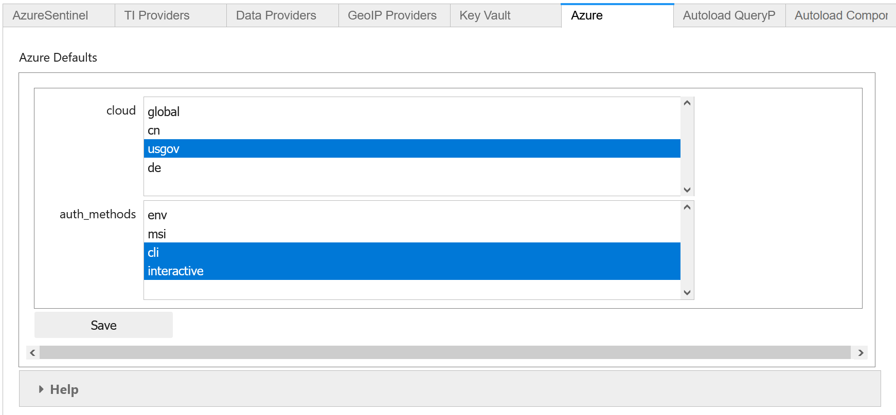

Select the **Azure** tab and choose the required cloud identifier from
the list. Click **Save** and then **Save Settings** to update and
write the changed settings to your configuration file.

Default Azure authentication methods
~~~~~~~~~~~~~~~~~~~~~~~~~~~~~~~~~~~~

In the Azure settings tab you can also specify the default authentication
methods that you want to use. The available methods are:

- **env** - Use credentials set in environment variables
- **cli** - Use credentials available in an local AzureCLI logon
- **msi** - Use the Managed Service Identity (MSI) credentials of the
  machine you are running the notebook kernel on
- **devicecode** - use browser-based device code authentication flow
- **vscode** - Use credentials from your authenticated VS Code session
- **powershell** - Use credentials from an authenticated Azure Powershell session
- **clientsecret** - Use an Azure AppID and client secret
- **certificate** - Use client certificate authentication.
- **interactive** - Interactive browser logon

For more details on Azure authentication/credential types see
:doc:`./AzureAuthentication`

You can select one or more of these. When attempting to authenticate,
MSTICPy will try each of the selected methods in turn until one
succeeds (or they all fail). This uses a mechanism known as a
*ChainedCredential*. This does give you flexibility and a useful
fallback, if your preferred authentication method does not work.
However, it does take additional time to cycle through multiple
methods. If you know, for example, that you always want to use *devicecode*
browser logon (with device code authorization), select this one
and leave the others unselected.

.. note:: If you are using a remote Jupyter notebook service such as
   Azure Machine Learning, the first three methods refer to things
   running on the Jupyter server (the Azure ML Compute). For example,
   if you want to use AzureCLI credentials you must run ``az login`` on
   the compute (you may need to install Azure CLI to do this).
   Similarly, with MSI credentials, these are the credentials of the
   Jupyter hub server, not the machine that your browser is running
   on. For environment variables, these must be set on the
   Jupyter server.

   Although **interactive** is supported in MSTICPy, the client
   code may not have the ability to open a browser on your machine.
   This can be the case if you are using a remote Jupyter
   hub such as Azure Machine Learning.

Using Azure CLI as your default login method
~~~~~~~~~~~~~~~~~~~~~~~~~~~~~~~~~~~~~~~~~~~~

Due to its ability to cache credentials, we strongly
recommend using Azure CLI logon. This allows all MSTICPy
Azure functions to try to obtain current credentials from Azure
CLI rather than initiate an interactive authentication.
This is especially helpful when using multiple Azure components
or when using multiple notebooks.

If the host running your notebook kernel does not have Azure CLI
installed you can install it from
`here <https://docs.microsoft.com/cli/azure/install-azure-cli>`__.

To log in using Azure CLI enter the following:

From a terminal:

.. code:: bash

   az login

From a notebook

.. code:: ipython3

   !az login

Optional Settings
-----------------

Other data providers - Splunk, Azure CLI, LocalData, Mordor
~~~~~~~~~~~~~~~~~~~~~~~~~~~~~~~~~~~~~~~~~~~~~~~~~~~~~~~~~~~

Azure API and Microsoft Sentinel API
^^^^^^^^^^^^^^^^^^^^^^^^^^^^^^^^^^^^

If you have set your preferences for Azure authentication methods
in the **Azure** tab you do not need to add the **AzureCLI**
data provider unless you want to explicitly use something other
that the defaults for Azure and Microsoft Sentinel APIs. If you are
happy to use the defaults, you can skip the remainder of this section.

See `Default Azure authentication methods`_ for details about this.

To access Azure APIs (such as the Sentinel APIs or Azure resource APIs)
you need to be able to use Azure Authentication. The setting is named
"AzureCLI" for historical reasons - don’t let that confuse you.

We currently support two ways of authenticating:

1. Chained chained authentication (recommended)
2. With a client app ID and secret

Chained authentication lets you try up to four methods of authentication
as described in `Default Azure authentication methods`_.

To use chained authentication methods select the methods to want to use
and leave the clientId/tenantId/clientSecret fields empty.

Splunk
^^^^^^

The Splunk provider has many options. Typically you need only:

- host (your Splunk server host name)
- username
- password (you can opt to store this in an environment variable or
  Key Vault).

You can also supply some or all of these values at startup)

LocalData
^^^^^^^^^

This is a data provider that reads from local CSVs or Pickled pandas
DataFrames.

You can set the default data paths that it looks in for data files. This
can have multiple values:

- put each on a new line
- do not add quotes
- do not escape backslashes (e.g. Windows path 'e:\\myfolder' is fine.)

Mordor
^^^^^^

.. note:: The Mordor GitHub repo has been renamed to "SecurityDatasets".

The Mordor provider has two options:

- The path to save temporary downloaded files (default is the current directory)
- Whether to cache files or delete them immediately after download.

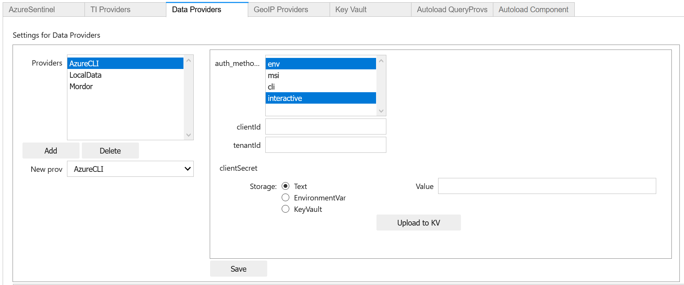

Key Vault
~~~~~~~~~

You only need to configure this if you want to store secrets in Azure Key Vault.

You need to create the Key Vault first - do that at your Azure portal.
Here is the link for the `global KeyVault management
portal <https://ms.portal.azure.com/#blade/HubsExtension/BrowseResource/resourceType/Microsoft.KeyVault%2Fvaults>`__

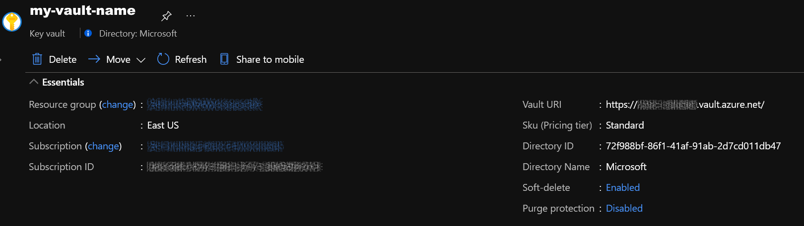

The required settings are all values that you get from the Vault
properties (albeit a couple of them have different names):

- **VaultName** is show at the top left of the properties screen
- **TenantId** is shown as *Directory ID*
- **AzureRegion** is shown as *Location*
- **Authority** is the cloud for your Azure service.

Only **VaultName**, **TenantId** and **Authority** are required to
retrieve secrets from the the Vault. The other values are needed if you
opt to create a vault from MSTICPy. See

.. note:: If you have set values for the Authority in the Azure Settings
   section (see `Azure Cloud and Authentication Settings`_),
   you do not need to specify it here. Due to limitations of
   the configuration editor, you cannot empty an empty value in this
   tab. If you are using a cloud other than the Azure global cloud, make sure
   that you either

   - set the **Authority** value to the same value as you have set in the
     **Azure** settings section
   - manually delete the KeyVault\\Authority value from your msticpyconfig.yaml

For more details see
:ref:`Specifying secrets as Key Vault secrets <getting_started/msticpyconfig:Specifying secrets as Key Vault secrets>`

The **Use KeyRing** option is checked by default. This lets you cache
Key Vault credentials in a local KeyRing. Not all platforms support this
but it is supported on Windows, Mac and most Linux distributions
(for Linux wll may need KWallet or Freedesktop Secret Service - for
more details see the
`Keyring documentation <https://keyring.readthedocs.io/en/latest/index.html>`__.

.. warning:: You should not enable KeyRing if you do not fully trust
   the host that the notebook is running on. The "host" in this case
   is the Jupyter hub server, where the notebook kernel is running, not
   necessarily the machine that your browser is running on. Keyring does
   its caching on the host where the notebook kernel is running.

   In some cases, you may trust the Jupyter host more than you trust
   the machine that you are browsing from. Keyring does not transmit
   any credentials to the browser directly.

Click **Save** and then **Save File** when you are done.

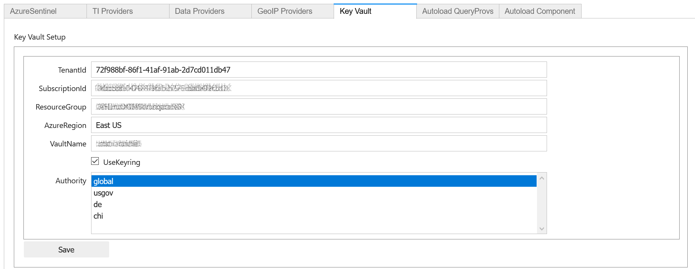

Test Key Vault
^^^^^^^^^^^^^^

See if you can connect and view any secrets. Of course nothing will show
up if you haven’t entered a secret. Add a test secret to the vault to
show here.

-  Refresh settings
-  Try to connect and display secrets

.. warning:: Don’t leave this output in your saved notebook.
   If there are real secrets in the output, use the notebook
   **Clear output** before saving the notebook. Also delete cached copies of
   this notebook. Look in the ``.ipynb_checkpoints`` sub-folder of this
   folder and delete copies of this notebook (although saving the
   notebook with cleared output should overwrite the checkpoint copy).

.. code:: ipython3

    mpconfig.refresh_mp_config()
    mpconfig.show_kv_secrets()

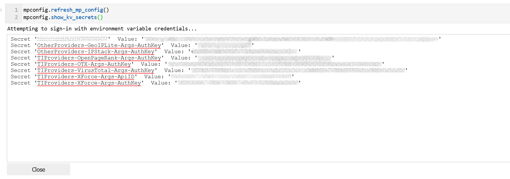

Autoload Query Providers
~~~~~~~~~~~~~~~~~~~~~~~~

.. warning:: This feature is being deprecated. Please avoid using
  this. If you have a use case that requires this, please contact
  the MSTICPy team - msticpy@microsoft.com. We'd love to hear
  how you are using it and how we might be able to improve it.

This section controls which, if any, query providers you want to load
automatically when you run ``nbinit.init_notebook``.

This can save a lot of time if you are frequently authoring new
notebooks. It also allows the right providers to be loaded before other
components that might use them such as:

- Pivot functions
- Notebooklets

(more about these in the next section)

There are two types of provider support:

- Microsoft Sentinel - here you specify both the provider name and the
  workspace name that you want to connect to.
- Other providers - for other query providers, just specify the name
  of the provider.

Available Microsoft Sentinel workspaces (in the Add Item drop-down)
are taken from the items you
configured in the **Microsoft Sentinel** tab. Other providers are taken from
the list of available provider types in *MSTICPy*.

There are two options for each of these:

- **connect** - if this is True (checked) *MSTICPy* will try to authenticate
  to the provider backend immediately after loading. This assumes that you’ve configured
  credentials for the provider in your settings. Note: if this is not set
  it defaults to True.
- **alias** - when *MSTICPy* loads a provider it assigns it to a Python variable name.
  By default this is "qry\_*workspace_name*" for Microsoft Sentinel providers and
  "qry\_*provider_name*" for other providers. If you want to use
  something a bit shorter and easier to type/remember you can add an
  *alias*. The variable name created will be "qry\_*alias*"

.. note:: If you lose track of which providers have been loaded by
   this mechanism they are added to the ``current_providers`` attribute
   of ``msticpy``

.. code:: ipython3

    mpedit.set_tab("Autoload QueryProvs")
    mpedit

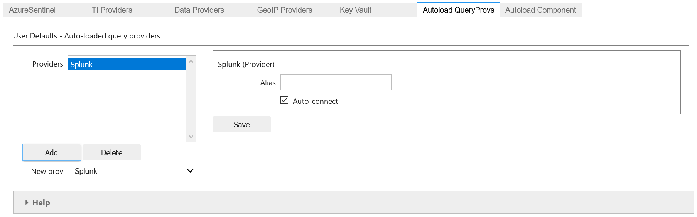

Autoload Component
~~~~~~~~~~~~~~~~~~

.. warning:: This feature is being deprecated. Please avoid using
  this. If you have a use case that requires this, please contact
  the MSTICPy team - msticpy@microsoft.com. We'd love to hear
  how you are using it and how we might be able to improve it.

This section controls which, if other components you want to load
automatically when you run ``nbinit.init_notebook()``.

This includes:

- TILookup - the Threat Intel provider library
- GeopIP - the Geo ip provider that you want to use
- AzureData - the module used to query details about Azure resources
- AzureSentinelAPI - the module used to query the Microsoft Sentinel API
- Notebooklets - loads notebooklets from the `msticnb package <https://msticnb.readthedocs.io/en/latest/>`__
- Pivot - pivot functions

These are loaded in this order, since the Pivot component needs query
and other providers loaded in order to find the pivot functions that it
will attach to entities. For more information see `pivot
functions <https://msticpy.readthedocs.io/en/latest/data_analysis/PivotFunctions.html>`__

Some components do not require any parameters (e.g. TILookup and Pivot).
Others do support or require additional settings:

**GeoIpLookup**

You must type the name of the GeoIP provider that you want to use -
either “GeoLiteLookup” or “IPStack”

**AzureData** and **AzureSentinelAPI**

- **auth_methods** - override the default settings for AzureCLI and connect
  using the selected methods
- **connnect** - set to false to load but not connect

**Notebooklets**

This has a single parameter block **AzureSentinel**. At minimum you
should specify the workspace name. This needs to be in the following
format:

.. code::

   workspace:WORKSPACENAME

*WORKSPACENAME* must be one of the workspaces defined in the Azure
Sentinel tab.

You can also add addition parameters to send to the notebooklets init
function: Specify these as addition key:value pairs, separated by
newlines.

.. code::

   workspace:WORKSPACENAME
   providers=["LocalData","geolitelookup"]

See the `msticnb init documentation
<https://msticnb.readthedocs.io/en/latest/msticnb.html#msticnb.data_providers.init>`__
for more details

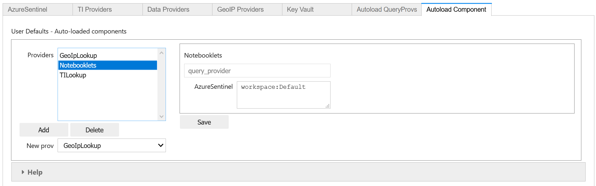

Using MpConfigFile to check and manage your msticpyconfig.yaml
--------------------------------------------------------------

You can use MpConfigFile as an interactive control or programmatically.

.. figure:: _static/settings_mp_file_config.png
   :alt: MpFileConfig user interface.

This tool lets you do the following operations. The function call equivalents
are listed against each operation:

======================  ======================================  ==========================================
UI Button               Method call                             Notes
======================  ======================================  ==========================================
Load File               ``mpconfig.load_from_file(file_path)``  Load a settings file
                        ``mpconfig.browse_for_file()``          Launch file browser/search
Load Default            ``mpconfig.load_default()``             Load your default settings (pointed to by
                                                                the MSTICPYCONFIG environment variable)
Save File               ``mpconfig.save_to_file(file_path)``
View Settings           ``mpconfig.view_settings()``            View the text of the settings file
Validate Settings       ``mpconfig.validate_settings()``        Validate loaded settings
Convert to MP           ``mpconfig.map_json_to_mp_ws()``        If you have loaded a ``config.json`` file
                                                                this will convert it to MSTICPy format
Show Key Vault Secrets  ``mpconfig.show_kv_secrets()``          View secrets in your Key Vault
Reload Settings         ``mpconfig.refresh_mp_config()``        reloads the settings for MSTICPy based on
                                                                the saved default config file (this is
                                                                either the file pointed to by
                                                                MSTICPYCONFIG env variable or a file
                                                                "msticpyconfig.yaml" in the current
                                                                directory.
======================  ======================================  ==========================================

If you create ``MpConfigFile()`` with no parameters this will also load the default settings

You can get more help on these methods from the See
:py:class:`MpConfigFile API documentation <msticpy.config.mp_config_file.MpConfigFile>`
or by using the Python help function:

.. code:: ipython3

   help(MpConfigFile)
