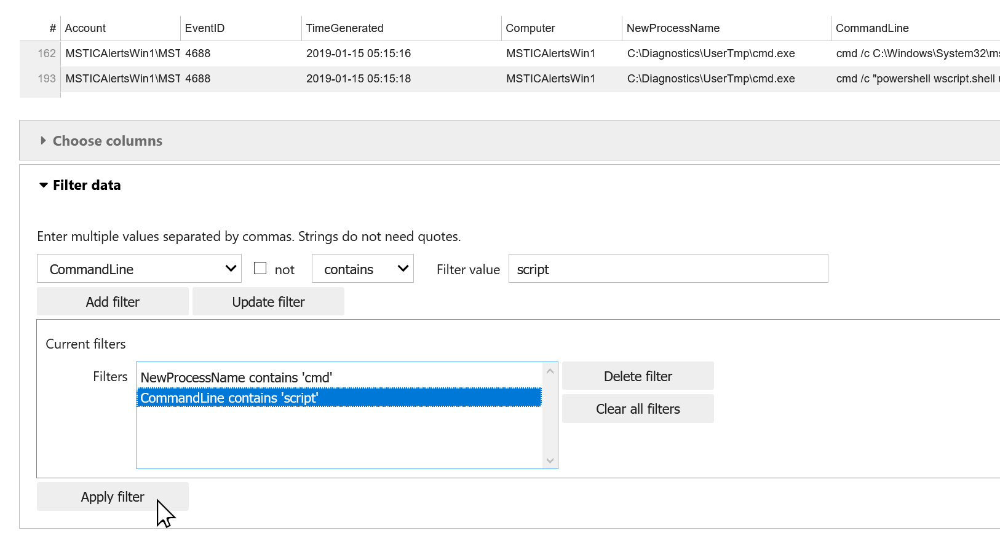

Data Viewer
===========

This describes the use of the
:py:class:`DataViewer<msticpy.vis.data_viewer.DataViewer>`
control.

DataViewer uses the Bokeh DataTable control to provide some basic
data manipulation features for viewing pandas DataFrames
more easily:

- Scrollable data viewer taking a fixed amount of the output cell
- Sorting data by column
- Column selection
- Data filtering

There is also a `notebook with the contents of this document
<https://github.com/microsoft/msticpy/blob/master/docs/notebooks/DataViewer.ipynb>`__

Use the DataViewer to display a DataFrame
-----------------------------------------

To view a DataFrame in the viewer just pass the DataFrame as
the `data` parameter.

.. code:: ipython3

    from msticpy.vis.data_viewer import DataViewer
    import pandas as pd

    # data is a pandas DataFrame
    DataViewer(data)

Specify an initial set of columns
---------------------------------

You can start the viewer with a restricted set of columns by
passing a list of column names as the `selected_columns`
parameter

.. code:: ipython3

    columns = [
        "Account",
        "EventID",
        "TimeGenerated",
        "Computer",
        "NewProcessName",
        "CommandLine",
        "ParentProcessName",
    ]
    DataViewer(data, selected_cols=columns)

Sorting the data by a column
----------------------------

Click on a column heading to sort the displayed data by that
column. Click again on the same column header to sort in
reverse order.

Choosing which columns to display
---------------------------------

The right side list contains the available columns in the DataFrame, the
left side is the list of columns to display.

Use the **Add**/**Remove** buttons (1 in the screen shot below) to
add or remove columns from the selected
set. You can select multiple columns using Ctrl+Click or Shift+Click
(the former selects or deselects an item for each click, the latter
selects a range of items between the last item selected and the
currently-clicked item).

Click on **Apply columns** (2 in the screen shot) to update the data view.

.. code:: ipython3

    viewer = DataViewer(data, selected_cols=columns)

Filtering the data
------------------

You can apply multiple filters - each filter is additive, i.e. each is
logically AND-ed with the others.

The **Filter data** drop down shows the following controls:

Filter expression
^^^^^^^^^^^^^^^^^

- *Column selector* drop-down - which column you want the filter to apply to
- *Not* checkbox - invert the logic of the filter (for this filter item only)
- *Operator* drop-down - the available operators are different for string
  and non-string (numeric and dates)
- *Expression* text box - type in the expression that you want to match

- **Add filter** button - adds the current filter items as a new filter
  expression to **Current filters**
- **Update filter** - overwrites the selected filter in **Current filters**
  with the current filter expression.

Current filters
^^^^^^^^^^^^^^^

- Select the filter expression you want to operate on
  from the **Filters** list
- **Delete filter** deletes the selected item
- **Clear all filters** removes all filter expressions
- **Apply filter** - applies the filter items to the data and updates the display

Advanced querying with filter **query** operator
------------------------------------------------

Selecting the **query** operator from the filter expression *operator* drop down
lets you type in a pandas *query* expression.

.. Note:: the selected column is not relevant for this operator since you
   specify the column name within the query expression. You can select
   any column name.

See this documentation for the `syntax of the pandas *query*
method <https://pandas.pydata.org/pandas-docs/stable/user_guide/indexing.html#the-query-method>`__

Accessing the filtered data
---------------------------

Use the ``filtered_data`` property of the DataViewer to retrieve a
DataFrame corresponding to the current column and row filtering.

.. Note:: column sorting is not captured in this data.

.. code:: ipython3

   viewer.filtered_data

==========================  ======================================================================  ===============  =========  ===================================  ===========================  ==========================
Account                     CommandLine                                                             Computer           EventID  NewProcessName                       ParentProcessName            TimeGenerated
==========================  ======================================================================  ===============  =========  ===================================  ===========================  ==========================
MSTICAlertsWin1\MSTICAdmin  .\rundll32.exe  /C mshtml,RunHTMLApplication javascript:alert(tada!)    MSTICAlertsWin1       4688  C:\Diagnostics\UserTmp\rundll32.exe  C:\Windows\System32\cmd.exe  2019-01-15 05:15:16.663000
MSTICAlertsWin1\MSTICAdmin  cmd  /c C:\Windows\System32\mshta.exe vbscript:CreateObject("Wscript..  MSTICAlertsWin1       4688  C:\Diagnostics\UserTmp\cmd.exe       C:\Windows\System32\cmd.exe  2019-01-15 05:15:16.020000
MSTICAlertsWin1\MSTICAdmin  .\wuauclt.exe  /C "c:\windows\softwaredistribution\cscript.exe"         MSTICAlertsWin1       4688  C:\Diagnostics\UserTmp\wuauclt.exe   C:\Windows\System32\cmd.exe  2019-01-15 05:15:18.080000
MSTICAlertsWin1\MSTICAdmin  .\lsass.exe  /C "c:\windows\softwaredistribution\cscript.exe"           MSTICAlertsWin1       4688  C:\Diagnostics\UserTmp\lsass.exe     C:\Windows\System32\cmd.exe  2019-01-15 05:15:18.287000
MSTICAlertsWin1\MSTICAdmin  cmd  /c "powershell wscript.shell used to download a .gif"              MSTICAlertsWin1       4688  C:\Diagnostics\UserTmp\cmd.exe       C:\Windows\System32\cmd.exe  2019-01-15 05:15:18.337000
MSTICAlertsWin1\MSTICAdmin  cacls.exe  c:\windows\system32\wscript.exe /e /t /g everyone:f          MSTICAlertsWin1       4688  C:\Diagnostics\UserTmp\cacls.exe     C:\Windows\System32\cmd.exe  2019-01-15 05:15:18.403000
MSTICAlertsWin1\MSTICAdmin  cmd  /c echo /e:vbscript.encode /b                                      MSTICAlertsWin1       4688  C:\Diagnostics\UserTmp\cmd.exe       C:\Windows\System32\cmd.exe  2019-01-15 05:15:18.820000
==========================  ======================================================================  ===============  =========  ===================================  ===========================  ==========================

|

Exporting and importing the filters
-----------------------------------

You can export the current filter set as a dictionary:

.. code:: ipython3

   viewer.filters

::

   {"ParentProcessName contains 'cmd'": FilterExpr(column='ParentProcessName', inv=False, operator='contains', expr='cmd'),
   "CommandLine contains 'script'": FilterExpr(column='CommandLine', inv=False, operator='contains', expr='script')}

You can import an existing filter set like this:

.. code:: ipython3

    # manually add a filter
    sample_filter = {
        "ParentProcessName contains 'cmd'": ("ParentProcessName", False, "contains", "cmd"),
        "CommandLine contains 'script'": ("CommandLine", False, "contains", "script"),
    }
    viewer.import_filters(sample_filter)

The format of the filter dictionary is:

.. code:: ipython3

    {
        "Filter name": Tuple({column_name}, {not}, {operator}, {expression}),
        "Filter two": Tuple({column_name}, {not}, {operator}, {expression}),
        ...
    }

You can also use the :py:class:`FilterExpr<msticpy.vis.data_viewer.FilterExpr>`
named tuple to specify each filter condition:

.. code:: ipython3

    from msticpy.vis.data_viewer import FilterExpr
    sample_filter = {
        "ParentProcessName contains 'cmd'": FilterExpr(
            column="ParentProcessName",
            inv=False,
            operator="contains",
            expr="cmd"
        ),
        ...
    }
