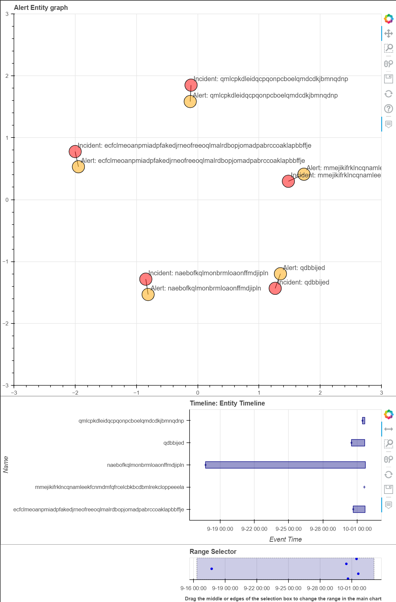

Entity Graph
============

This describes the use of the
:py:class:`EntityGraph<msticpy.vis.entity_graph_tools.EntityGraph>`
control.

The purpose of this feature is to allow a user to create a graph of Incidents, Alerts, and other eneities during the course of an investigation.
A graph can be initially created using any of the above entity options, with additional entities, and links between these entities added as an investigation progresses.
As well as creating a graph object this feature allows for the plotting of the graph, allowing for interactive exploration of the entities and thier links.

.. note: this feature provides similar funcitonality to `msticpy.nbtools.security_alert_graph`, however it is expanded to include support for additional entity types and incidents.
    You can pass `EntityGraph` a SecurtyAlert in the same way you can with security_alert_graph and will produce a very similar graph.

Creating a Graph from an Incident or Alert
------------------------------------------

Incidents and Alerts often have a set of assocaited entities (and other alerts), graphing these relationships is useful function and a common way to start the creation of a graph.
`EntityGraph` can accept `Incident`, `Alert` and `SecurityAlert` entities and will extract each entity & assocaited alert in the entity, add them to the graph and create the connections between them.
This is done by instantiating an EntityGraph object and passing in an incident, alert, or entity:

.. code:: ipython3

    from msticpy.datamodel.entities.soc.incident import Incident
    incident = Incident(sample_inc)
    graph = EntityGraph(incident)

.. code:: ipython3

    from msticpy.datamodel.entities.alert import Alert
    alert = Alert(sample_alert)
    graph = EntityGraph(alert)

.. code:: ipython3

    from msticpy.nbtools.security_alert import SecurityAlert
    sec_alert = SecurityAlert(pd.Series(sample_alert))
    graph = EntityGraph(alersec_alert)

.. code:: ipython3

    from msticpy.datamodel.entities.url import Url
    url_ent = Url({"Url": "www.contoso.com"})
    graph = EntityGraph(url_ent)

Creating from a DataFrame
^^^^^^^^^^^^^^^^^^^^^^^^^

It is also possible to create graphs containing multiple alerts or incidents by passing a DataFrame containing incident or alert events to `EntityGraph` this will then convert these to the relevant entity type and plot them all on the one graph.

.. code:: ipython3

    df_graph = EntityGraph(df)

There is also a Pandas accessor for this feature that allows for graph creation and plotting direct from a DataFrame with `df.mp_incident_graph.plot()`

.. code:: ipython3

    df_graph = mp_incident_graph.build()

Plotting a Graph
^^^^^^^^^^^^^^^^

Once a graph has been created it can be visualized with the `plot` function.

.. code:: ipython3

    graph.plot()

Its also possible to visualize the graph. along with a timeline showing any timestamps attached to entities in the graph with `plot_with_timeline`.

.. code:: ipython3

    graph.plot_with_timeline()

It is also possible to plot directly from a dataframe with the Pandas accessor.

.. code:: ipython3

    df_graph = mp_incident_graph.plot()
    df_graph = mp_incident_graph.plot_with_timeline()

Adding & Removing Entities
--------------------------

During an investigation, you will want to expand or collapse the graph based on the outcomes of your investigations. The EntityGraph supports the ability to add and remove entities from the graph during the investigation.
Entities that are added with the `add_entity` or `add_incident` functions, depending on whether the item being added is an incident or an entity. Added entities can be attached to another entity in the graph by specifying the name of the entity to attach to with the `attached_to` parameter.

.. code:: ipython3

    url_ent = Url(Url="www.contoso.com")
    graph = EntityGraph(incident)
    graph.add_entity(url_ent, attached_to="demo")
    graph.plot()

Removing a entity from the graph is done with `remove_node` function, with the name of the entity to remove passed with the `name` parameter:

.. code:: ipython3

    graph.remove_node("demo")
    graph.plot()

Adding & Removing Links
-----------------------

As well as adding entities to the graph you will also want to update the links between them as an investigation progresses. This can be done with the `add_link` and `remove_link` functions.

.. code:: ipython3

    graph.add_link("www.contoso.com", "Incident: Sample Incident")
    graph.add_link("www.contoso.com", "CONTOSO\\auser")
    graph.remove_link("CONTOSO\\auser", "Incident: Sample Incident")
    graph.plot()

Adding Notes
------------
Entities are not the only elements that you might want to record as part of an investigation. To include a wide range of other items and observations the EntityGraph has the concept of Notes. Notes are nodes in the graph that have free form titles and descriptions, allowing the user to add anything they need - be it a comment on an entity on the graph, or a query used to find an event.
Notes area added with the `add_note` function. As with the `add_entity` function notes can be attached to an existing entity in the graph.

.. code:: ipython3

    graph.add_note(name="This is a note",
        description="Notes allow for free form additions to the graph",
        attached_to="Incident: Sample Incident")
    graph.plot()

Exporting Nodes to a DataFrame
------------------------------

As a graph has been built up during the course of the investigation you  may want to access or export some of the key elements of the graph. This can easily be done with the `to_df` function.

.. note: he EntityGraph is built on NetworkX. If you want to access the networkx object of the graph it can be accessed with `alertentity_graph`.

.. code:: ipython3

    graph.to_df()

    ====  =================================================  ============================================================================================  ===========  =============================  =======================  =======================
      ..  Name                                               Description                                                                                   Type         TimeGenerated                  EndTime                  StartTime
    ====  =================================================  ============================================================================================  ===========  =============================  =======================  =======================
       0  Sample Incident                                    2021-09-22T15:09:09.2786667Z - Sample Incident - 123                                          incident     2021-09-22 15:09:09.278666700  2021-09-22T14:39:24.04Z  2021-09-22T14:39:24.04Z
       1  User Added to Priviledged Group in CONTOSO Domain  User Added to Priviledged Group in CONTOSO Domain - ['8b7d06d8-dbae-4b23-87ed-1a27b75437d5']  alert        NaT
       2  CONTOSO\auser                                                                                                                                    entity       NaT
       3  www.contoso.com                                    www.contoso.com                                                                               entity       NaT
       4  This is a note                                     Notes allow for free form additions to the graph                                              analystnote  2021-10-06 09:05:35.203699
    ====  =================================================  ============================================================================================  ===========  =============================  =======================  =======================