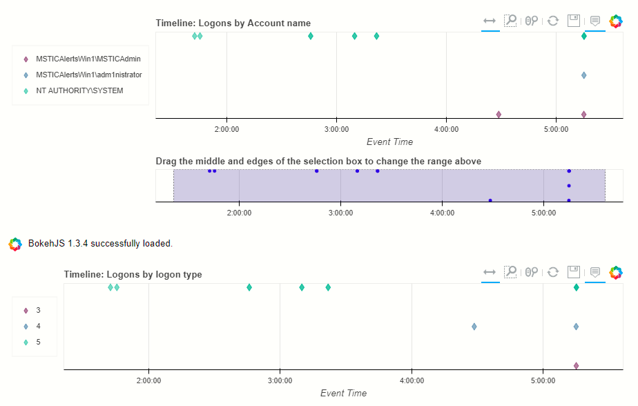
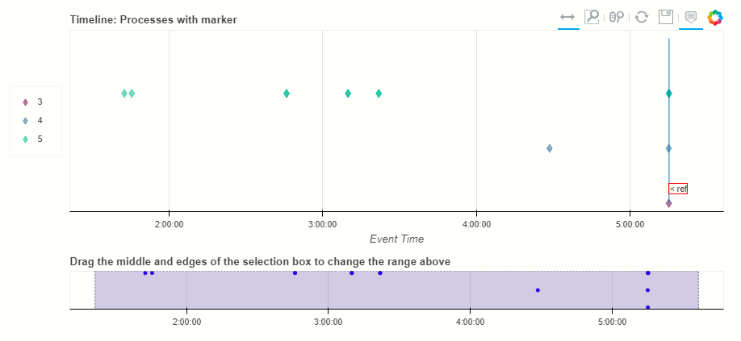
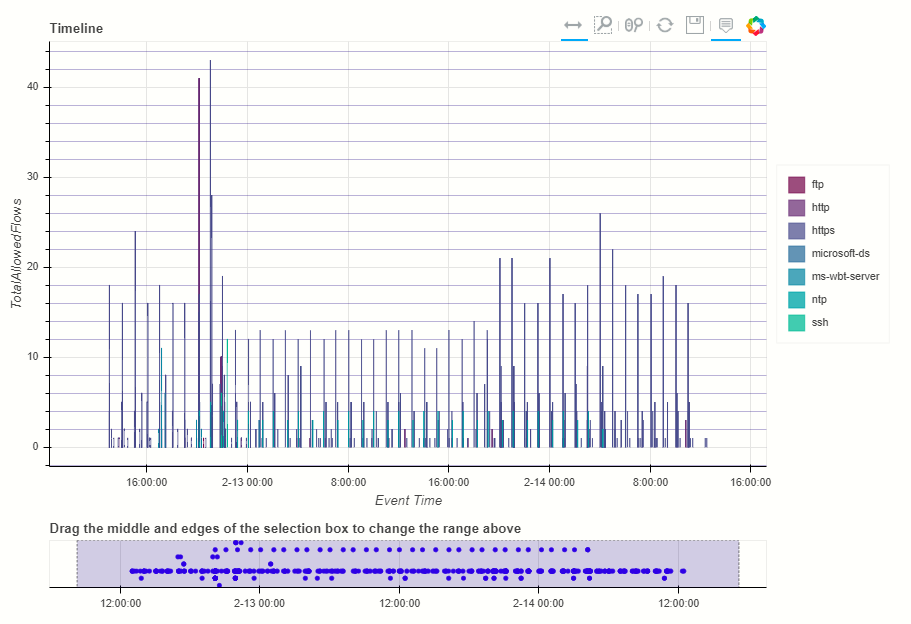

Event Timeline
==============

This document describes the use of the interactive timeline controls built
using the `Bokeh library <https://bokeh.pydata.org>`__.

There are two chart controls types:

* Discrete event series - this plots multiple series of events as discrete
  glyphs
* Event value series - this plots a scalar value of the events using glyphs,
  bars or traditional line graph (or some combination).

A sample notebook demonstrating the use of these plot controls is
available here `Event Timeline Usage Notebook <https://github.com/microsoft/msticpy/blob/master/docs/notebooks/EventTimeline.ipynb>`__

Discrete Event Timelines
------------------------

Plotting a simple timeline
^^^^^^^^^^^^^^^^^^^^^^^^^^

The display_timeline function (see
:py:func:`display_timeline<msticpy.nbtools.timeline.display_timeline>`) takes three main
parameters:

* data - the data to plot. This can be either a pandas DataFrame or a
  dictionary of data sets (see :ref:`plot_diff_data_sets` later.)
* time_column - the name of the data column in the data to use as the
  chart x axis.
* source_columns - a list of column names used to populate the hovertool,
  which shows the values of these columns as a tooltip, when you hover
  over each point with a mouse.

This code shows an example of createing a simple plot, with a single
time series.

.. code:: ipython3

    processes_on_host = pd.read_csv('data/processes_on_host.csv',
                                    parse_dates=["TimeGenerated"],
                                    infer_datetime_format=True)

    # At a minimum we need to pass a dataframe with data
    nbdisplay.display_timeline(processes_on_host)

.. figure:: _static/Timeline-01.png
   :alt: Simple timeline chart

The Bokeh graph is interactive and has the following features:

**Tooltip** display for each event marker as you hover over it

**Toolbar** with the following tools described in the order shown:

* Panning
* Select zoom
* Mouse wheel zoom
* Reset to default view
* Save image to PNG
* Hover tool

Most of these are toggles, enabling or disabling the tool.

Additionally an interactive timeline navigation bar is displayed below
the main chart. You can change the timespan shown on the main chart by
dragging or resizing the selected area on this navigation bar. You
can also use the Bokeh panning and zoom tools directly on the main chart.

.. note:: The tooltips work on the Windows process data shown above
   because of a legacy fallback built into the code. Usually, you must
   specify the ``source_columns`` parameter explicitly to have the hover
   tooltips populated correctly.

More Advanced Timelines
^^^^^^^^^^^^^^^^^^^^^^^

``display_timeline`` also takes a number of optional parameters that
give you more flexibility to show multiple data series and change the
way the graph appears.

See :py:func:`display_timeline<msticpy.nbtools.timeline.display_timeline>` Documentation
for a description of all of the parameters.

Grouping Series From a Single DataFrame
~~~~~~~~~~~~~~~~~~~~~~~~~~~~~~~~~~~~~~~

.. code:: ipython3

    nbdisplay.display_timeline(processes_on_host,
                               group_by="Account",
                               source_columns=["NewProcessName",
                                               "ParentProcessName"],
                               legend="inline");

.. figure:: _static/Timeline-02.png
   :alt: Grouped timeline chart

We can use the group_by parameter to specify a column on which to split
individually plotted series.

Specifying a legend, we can see the value of each series group. The
legend is interactive - click on a series name to hide/show the data.
The legend can also be placed outside of the graph specifying “left” or
“right”.

Specifying a legend, we can see the value of each series group.
The legend is interactive - click on a series name to
hide/show the data. The legend can be placed inside of the chart
(`legend="inline"`) or to the left or right.

.. note:: the trailing semicolon just prevents Jupyter showing the return
   value from the function. It isn’t mandatory.

Alternatively we can enable the yaxis - although this is not guaranteed
to show all values of the groups.

.. code:: ipython3

    nbdisplay.display_timeline(processes_on_host,
                               group_by="Account",
                               source_columns=["NewProcessName", "ParentProcessName"],
                               yaxis=True);

.. figure:: _static/Timeline-03.png
   :alt: Grouped timeline chart with yaxis

Two other examples using logon events.

.. code:: ipython3

    nbdisplay.display_timeline(host_logons,
                               title="Logons by Account name",
                               group_by="Account",
                               source_columns=["Account",
                                               "TargetLogonId",
                                               "LogonType"],
                               legend="left",
                               height=200);

    nbdisplay.display_timeline(host_logons,
                               title="Logons by logon type",
                               group_by="LogonType",
                               source_columns=["Account",
                                               "TargetLogonId",
                                               "LogonType"],
                               legend="left",
                               height=200,
                               range_tool=False);

Displaying a reference line
^^^^^^^^^^^^^^^^^^^^^^^^^^^

If you have a single item (e.g. an alert) that you want to show as a
reference point on the graph you can pass a datetime value, or any
object that has a TimeGenerated or StartTimeUtc property.

If the object doesn’t have one of these, just pass the property as the
ref_time parameter.

.. code:: ipython3

    # pull out a sample row to use as a reference marker
    fake_alert = processes_on_host.sample().iloc[0]

    nbdisplay.display_timeline(host_logons,
                               title="Processes with marker",
                               group_by="LogonType",
                               source_columns=["Account", "TargetLogonId", "LogonType"],
                               ref_event=fake_alert,
                               legend="left");

.. _plot_diff_data_sets:

Plotting series from different data sets
^^^^^^^^^^^^^^^^^^^^^^^^^^^^^^^^^^^^^^^^

When you want to plot data sets with different schema on the same plot
it is difficult to put them in a single DataFrame. To do this we need to
assemble the different data sets into a dictionary and pass that to the
``display_timeline``

The dictionary has this format::

    Key (str) - Name of data set to be displayed in legend
    Value (Dict[str, Any]) - containing:
        data (pd.DataFrame) - Data to plot
        time_column (str, optional) - Name of the timestamp column
        source_columns (list[str], optional) - source columns to use
            in tooltips
        color (str, optional) - color of datapoints for this data
    If any of the last values are omitted, they default to the values
    supplied as parameters to the function (see below)

This example shows creating this dictionary. Notice that ``source_columns``
parameter for each series is different. The source column set used is the
union of all of the individual sets so some items will display "???" If
the source data does not have a column corresponding to one or more of the
names.

.. code:: ipython3

    procs_and_logons = {
        "Processes" : {"data": processes_on_host, "source_columns": ["NewProcessName", "Account"]},
        "Logons": {"data": host_logons, "source_columns": ["Account", "TargetLogonId", "LogonType"]}
    }

    nbdisplay.display_timeline(data=procs_and_logons,
                               title="Logons and Processes",
                               legend="left");

.. figure:: _static/Timeline-06.png
   :alt: Timeline with a dictionary of data series.

Plotting Series with Scalar Values
----------------------------------

Often you may want to see a scalar value plotted with the series.

The example below uses ``display_timeline_values`` to plot network flow
data using the total flows recorded between a pair of IP addresses.

Note that the majority of parameters are the same as
``display_timeline`` but include a mandatory ``y`` parameter which
indicates which value you want to plot on the y (vertical) axis.

See :py:func:`display_timeline_values<msticpy.nbtools.timeline.display_timeline_values>` documentation
for a description of all of the parameters.

.. code:: ipython3

    az_net_flows_df = pd.read_csv('data/az_net_flows.csv',
                              parse_dates=["TimeGenerated", "FlowStartTime", "FlowEndTime"],
                              infer_datetime_format=True)

    flow_plot = nbdisplay.display_timeline_values(data=az_net_flows_df,
                                      group_by="L7Protocol",
                                      source_columns=["FlowType",
                                                      "AllExtIPs",
                                                      "L7Protocol",
                                                      "FlowDirection",
                                                      "TotalAllowedFlows"],
                                      time_column="FlowStartTime",
                                      y="TotalAllowedFlows",
                                      legend="right",
                                      height=500);

By default the plot uses vertical bars show the values but you can use
any combination of vbar, circle and line, using the ``kind`` parameter.
You specify the plot types as a list of strings (all lowercase).

Including “circle” in the plot kinds makes it easier to see
the hover value.

.. code:: ipython3

    flow_plot = nbdisplay.display_timeline_values(data=az_net_flows_df,
                                                  group_by="L7Protocol",
                                                  source_columns=["FlowType",
                                                                  "AllExtIPs",
                                                                  "L7Protocol",
                                                                  "FlowDirection",
                                                                  "TotalAllowedFlows"],
                                                  time_column="FlowStartTime",
                                                  y="TotalAllowedFlows",
                                                  legend="right",
                                                  height=500,
                                                  kind=["vbar", "circle"]
                                                );

.. figure:: _static/Timeline-08.png
   :alt: Timeline values plot with circles.

The line plot can be a bit misleading since it will
plot lines between adjacent data points of the same series, implying that
there is a gradual change in the value being plotted - even though there
may be no data between the times of these adjacent points. For this
reason using vbar is often a more accurate view. Compare the following
two plots.

.. figure:: _static/Timeline-09.png
   :alt: Comparing line and vbar plots.

Exporting Plots as PNGs
-----------------------

To use ``bokeh.io`` image export functions you need selenium, phantomjs and
pillow installed:

``conda install -c bokeh selenium phantomjs pillow``

or

``pip install selenium pillow``

``npm install -g phantomjs-prebuilt``

For phantomjs downloads see `phantomjs.org <https://phantomjs.org/download.html>`__.

Once the prerequisites are installed you can create a plot and save the
return value to a variable. Then export the plot using ``export_png``
function.

.. code:: python

   from bokeh.io import export_png
   from IPython.display import display, Image, Markdown

   # Create a plot
   flow_plot = nbdisplay.display_timeline_values(data=az_net_flows_df,
                                                 group_by="L7Protocol",
                                                 source_columns=["FlowType",
                                                                 "AllExtIPs",
                                                                 "L7Protocol",
                                                                 "FlowDirection",
                                                                 "TotalAllowedFlows"],
                                                 time_column="FlowStartTime",
                                                 y="TotalAllowedFlows",
                                                 legend="right",
                                                 height=500,
                                                 kind=["vbar", "circle"]
                                               );

   # Export
   file_name = "plot.png"
   export_png(flow_plot, filename=file_name)

   # Read it and show it
   display(Markdown(f"## Here is our saved plot: {file_name}"))
   Image(filename=file_name)
