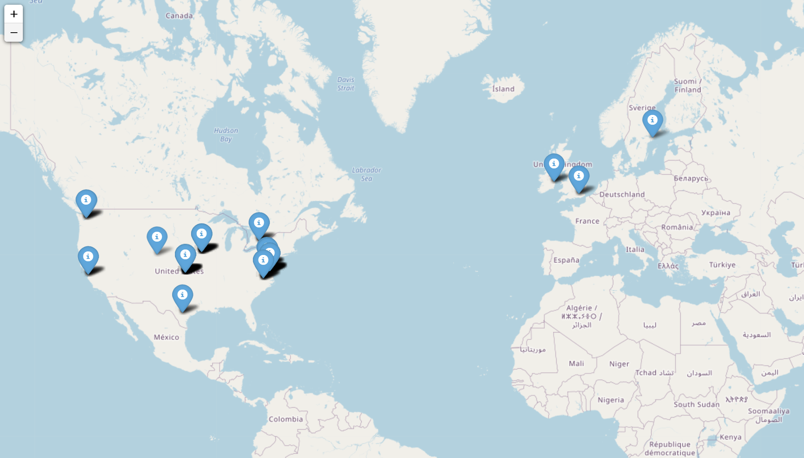
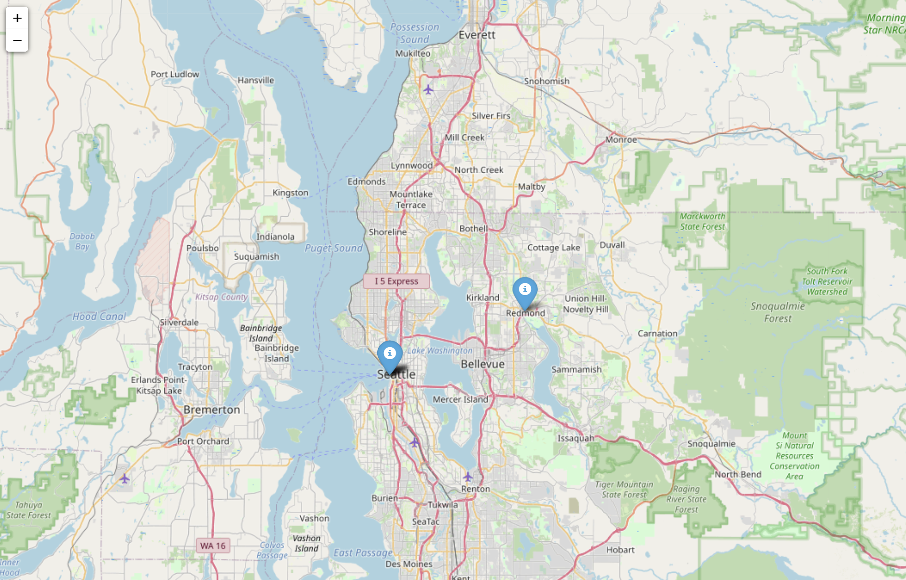
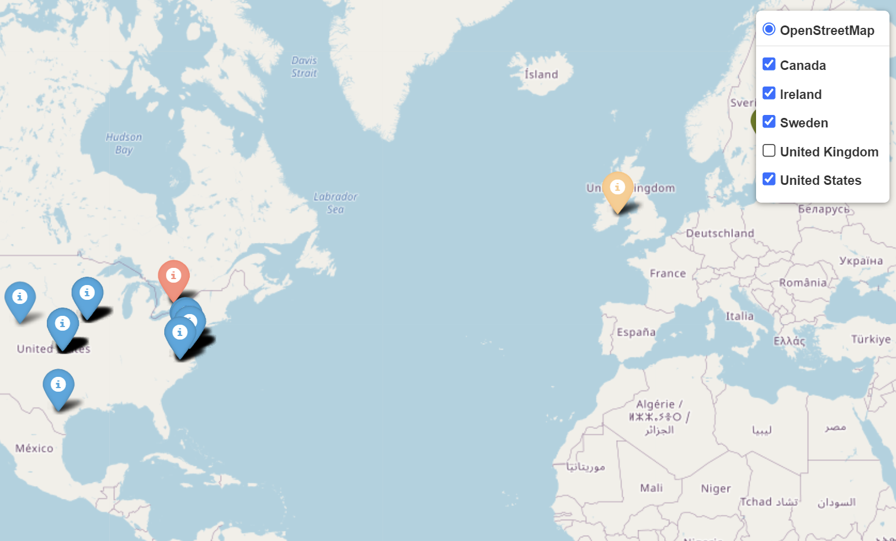
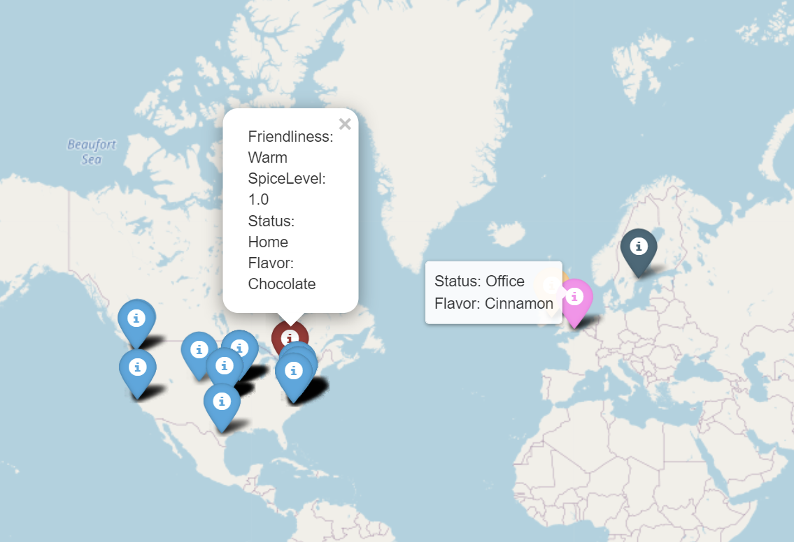
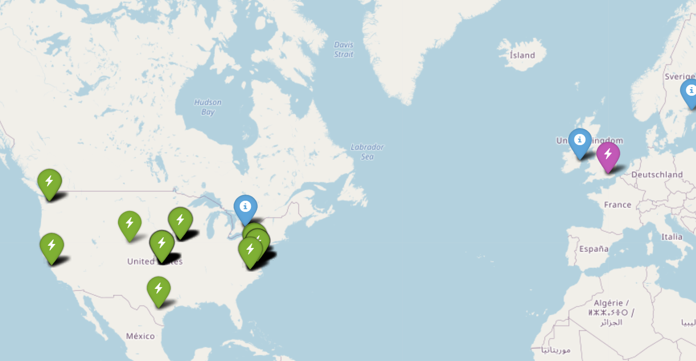
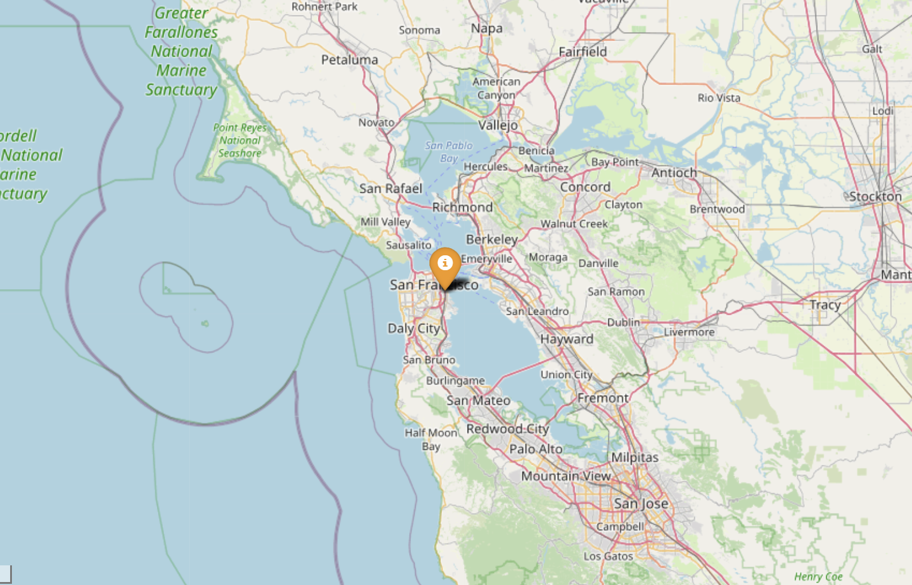
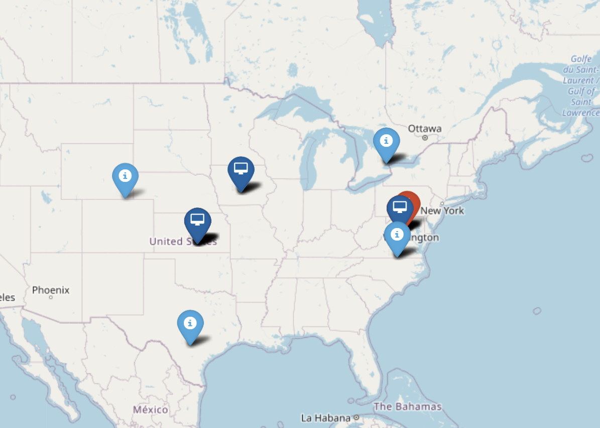

Folium Map Plotting
===================

The :py:class:`FoliumMap<msticpy.vis.foliummap.FoliumMap>`
class is a wrapper around the Folium geo-mapping interactive
mapping package.
See `Folium <https://python-visualization.github.io/folium/>`__.

The MSTICPy Folium plotting can be used with DataFrames,
IP addresses, locations, and geohashes as well as the MSTICPy
IpAddress and GeoLocation entities.

You can use Folium via a pandas accessor, the plot_map function or
directly interacting with our FoliumMap class.

Plotting from a Pandas DataFrame
--------------------------------

MSTICPy uses pandas accessors to expose a lot of its visualization
functions.

Plotting with Folium can be done directly from a pandas DataFrame using
the ``mp_plot.folium_map`` extension.

See :py:func:`plot_map <msticpy.vis.folium_map.plot_map>`

This function returns an instance of the
:py:class:`FoliumMap<msticpy.vis.foliummap.FoliumMap>` class that you
can further customize (see FoliumMap class later in the document)

We'll read in some IpAddress data to use in the examples

.. code:: ipython3

    # read in a DataFrame from a csv file
    geo_loc_df = (
        pd
        .read_csv("data/ip_locs.csv", index_col=0)
        .dropna(subset=["Latitude", "Longitude"])  # We need to remove any NaN values
    )
    display(geo_loc_df.head(5))

=============  =============  ========  ===========  ===========  ==========  =====  =============
CountryCode    CountryName    State     City           Longitude    Latitude    Asn  IpAddress
=============  =============  ========  ===========  ===========  ==========  =====  =============
US             United States  Virginia  Boydton         -78.375      36.6534    nan  65.55.44.109
CA             Canada         Ontario   Toronto         -79.4195     43.6644    nan  13.71.172.128
CA             Canada         Ontario   Toronto         -79.4195     43.6644    nan  13.71.172.130
US             United States  Texas     San Antonio     -98.4926     29.4221    nan  40.124.45.19
US             United States  Iowa      Des Moines      -93.6127     41.6015    nan  104.43.212.12
=============  =============  ========  ===========  ===========  ==========  =====  =============

Basic plot
~~~~~~~~~~

.. code:: ipython3

    geo_loc_df.mp_plot.folium_map(ip_column="IPAddress")

Plotting from coordinates
~~~~~~~~~~~~~~~~~~~~~~~~~

If you already have coordinates in the data you can use these (rather
than looking up the IP location again) using the ``lat_column`` and
``long_column`` parameters.

.. code:: ipython3

    geo_loc_df.mp_plot.folium_map(
        lat_column="Latitude", long_column="Longitude", zoom_start=10
    )

Plotting Layers
~~~~~~~~~~~~~~~

You can use the Folium layers feature, specifying a column value on
which to group each layer with the ``layer_column`` parameter.

.. code:: ipython3

    geo_loc_df.mp_plot.folium_map(
        ip_column="IPAddress", layer_column="CountryName", zoom_start=2
    )

Adding custom tooltip and popup data
~~~~~~~~~~~~~~~~~~~~~~~~~~~~~~~~~~~~

You use DataFrame column values to populate the tooltip and popup
elements for each marker with the ``tooltip_columns`` and
``popup_columns`` parameters.

Although these parameters are shown being used together you can either of them
separately.

First we add some random data to our DataFrame

.. code:: ipython3

    # Create some data to display
    data_df = pd.DataFrame({
        "Status": ["Home", "Office", "Vacation"] * (len(geo_loc_df) // 3),
        "Friendliness": ["Warm", "Cold", "Medium"] * (len(geo_loc_df) // 3),
        "Flavor": ["Chocolate", "Cinnamon", "Mango"] * (len(geo_loc_df) // 3),
        "SpiceLevel": [1, 2, 3] * (len(geo_loc_df) // 3)
    })
    geo_loc_data_df = pd.concat([geo_loc_df, data_df], axis=1)

Then plot using the ``tooltip_columns`` and
``popup_columns`` parameters

.. code:: ipython3

    geo_loc_data_df.mp_plot.folium_map(
        ip_column="IPAddress",
        layer_column="CountryName",
        tooltip_columns=["Status", "Flavor"],
        popup_columns=["Friendliness", "SpiceLevel", "Status", "Flavor"],
        zoom_start=2,
    )

Using custom icons
~~~~~~~~~~~~~~~~~~

You can also control the icons used for each marker with the
``icon_column`` parameters. If you happen to have a column in your data
that contains names of FontAwesome or GlyphIcons icons. More typically
you would combine the ``icon_column`` with the ``icon_map`` parameter.
You can specify either a dictionary or a function. For a dictionary, the
value of the row in ``icon_column`` is used as a key - the value is a
dictionary of icon parameters passed to the Folium.Icon class. For a
method, the ``icon_column`` value is passed as a single parameter and
the return value should be a dictionary of valid parameters for the
``Icon`` class. You can read the documentation for this function in the
doc.

If ``icon_map`` is a dict it should contain keys that map to the value
of ``icon_col``. The values of te dict should be dicts of valid folium Icon properties
("color", "icon_color", "icon", "angle", "prefix"). The dict should
include a "default" entry that will be used if the value in the
DataFrame[icon_col] doesn't match any key. For example:

.. code:: python

       icon_map = {
           "high": {
               "color": "red",
               "icon": "warning",
           },
           "medium": {
               "color": "orange",
               "icon": "triangle-exclamation",
               "prefix": "fa",
           },
           "default": {
               "color": "blue",
               "icon": "info-sign",
           },
       }

If icon_map is a function it should take a single str parameter (the
item key) and return a dict of icon properties. It should return a
default set of values if the key does not match a known key. The
``icon_col`` value for each row will be passed to this function and the
return value used to populate the Icon arguments.

For example:

.. code:: python

       def icon_mapper(icon_key):
           if icon_key.startswith("bad"):
               return {
                   "color": "red",
                   "icon": "triangle-alert",
               }
           ...
           else:
               return {
                   "color": "blue",
                   "icon": "info-sign",
               }

Check out the possible names for icons:

-  FontAwesome icon (prefix "fa") names are available at
   https://fontawesome.com/
-  GlyphIcons icons (prefix "glyphicon") are available at
   https://www.glyphicons.com/

.. code:: ipython3

    icon_map = {
        "US": {
            "color": "green",
            "icon": "flash",
        },
        "GB": {
            "color": "purple",
            "icon": "flash",
        },
        "default": {
            "color": "blue",
            "icon": "info-sign",
        },
    }

    geo_loc_df.mp_plot.folium_map(
        ip_column="IPAddress",
        icon_column="CountryCode",
        icon_map=icon_map,
        zoom_start=2,
    )

Using the ``plot_map`` function
-------------------------------

The ``plot_map`` function is identical to the mp_plot.folium_map
accessor. You can import this directly and use in place of the pandas
accessor.

.. code:: ipython3

    from msticpy.vis.foliummap import plot_map

    plot_map(
        data=geo_loc_df,
        ip_column="IPAddress",
        icon_column="CountryCode",
        icon_map=icon_map,
        zoom_start=2,
    )

FoliumMap class
---------------

Use the :py:class:`FoliumMap class <msticpy.vis.foliummap.FoliumMap>`
when you want to build up data clusters and
layers incrementally.

It now supports multiple data types for entry:

- IpAddress entities
  (:py:meth:`add_ip_cluster <msticpy.vis.foliummap.FoliumMap.add_ip_cluster>`)
- Geolocation entities (:py:meth:`add_ip_cluster <msticpy.vis.foliummap.FoliumMap.add_geoloc_cluster>`)
- IP addresses (:py:meth:`add_ip_cluster <msticpy.vis.foliummap.FoliumMap.add_ips>`)
- Locations (:py:meth:`add_ip_cluster <msticpy.vis.foliummap.FoliumMap.add_locations>`)
- GeoHashes (:py:meth:`add_ip_cluster <msticpy.vis.foliummap.FoliumMap.add_geo_hashes>`)

You can also use other member functions to add layers and cluster
groups see :py:class:`FoliumMap class <msticpy.vis.foliummap.FoliumMap>`
for more details.

Here is the documentation for initializing the class.

.. code:: python

   FoliumMap(
       title: str = 'layer1',
       zoom_start: float = 2.5,
       tiles=None,
       width: str = '100%',
       height: str = '100%',
       location: list = None,
   )
   Wrapper class for Folium/Leaflet mapping.

   Parameters
   ----------
   title : str, optional
       Name of the layer (the default is 'layer1')
   zoom_start : int, optional
       The zoom level of the map (the default is 7)
   tiles : [type], optional
       Custom set of tiles or tile URL (the default is None)
   width : str, optional
       Map display width (the default is '100%')
   height : str, optional
       Map display height (the default is '100%')
   location : list, optional
       Location to center map on

   Attributes
   ----------
   folium_map : folium.Map

.. code:: ipython3

    folium_map = FoliumMap(location=(47.5982328,-122.331), zoom_start=14)
    folium_map

The underlying folium map object is accessible as the ``folium_map``
attribute

.. code:: ipython3

    type(folium_map.folium_map)

Adding IP Entities to the map
~~~~~~~~~~~~~~~~~~~~~~~~~~~~~

msticpy.vis.foliummap.FoliumMap
::

   fol_map.add_ip_cluster(
       ip_entities: Iterable[msticpy.datamodel.entities.IpAddress],
       **kwargs,
   )

.. code:: ipython3

    import pickle
    with open(b"data/ip_entities.pkl", "rb") as fh:
        ip_entities = pickle.load(fh)
    ip_entities = [ip for ip in ip_entities if ip.Location and ip.Location.Latitude]

    folium_map = FoliumMap(zoom_start=9)
    folium_map.add_ip_cluster(ip_entities=ip_entities, color='orange')
    folium_map.center_map()
    folium_map

Adding IP addresses
~~~~~~~~~~~~~~~~~~~

Signature

.. code:: ipython3

   ip_map.add_ips(ip_addresses: Iterable[str], **kwargs)

Example

.. code:: ipython3

    ips = geo_loc_df.query("State == 'California'").IPAddress.values

    print("IP dataset", ips[:3], "...")
    ip_map = FoliumMap(zoom_start="3")
    ip_map.add_ips(ips)
    ip_map.center_map()
    ip_map

Adding locations
~~~~~~~~~~~~~~~~

Signature

.. code:: ipython3

   ip_map.add_locations(locations: Iterable[Tuple[float, float]], **kwargs)

Example

.. code:: ipython3

    locations = geo_loc_df.query("CountryCode != 'US'").apply(lambda x: (x.Latitude, x.Longitude), axis=1).values

    print("Location dataset", locations[:3], "...")
    ip_map.add_locations(locations)
    ip_map.center_map()
    ip_map

Plotting IPAddress entities with location data
~~~~~~~~~~~~~~~~~~~~~~~~~~~~~~~~~~~~~~~~~~~~~~

.. code:: ipython3

    # Create IP and GeoLocation Entities from the dataframe
    def create_ip_entity(row):
        ip_ent = IpAddress(Address=row["IPAddress"])
        geo_loc = create_geo_entity(row)
        ip_ent.Location = geo_loc
        return ip_ent

    def create_geo_entity(row):
        # get subset of fields for GeoLocation
        loc_props = row[["CountryCode", "CountryName","State", "City", "Longitude", "Latitude"]]
        return GeoLocation(**loc_props.to_dict())

    geo_locs = list(geo_loc_df.apply(create_geo_entity, axis=1).values)
    ip_ents = list(geo_loc_df.apply(create_ip_entity, axis=1).values)

    fmap_ips = FoliumMap()
    fmap_ips.add_ip_cluster(ip_entities=ip_ents[:20], color='blue')
    fmap_ips.center_map()
    fmap_ips

Using different colors and icons
~~~~~~~~~~~~~~~~~~~~~~~~~~~~~~~~

.. code:: ipython3

    fmap_ips.add_ip_cluster(ip_entities=ip_ents[30:40], color='red', icon="flash")
    fmap_ips.center_map()
    fmap_ips

Using custom Icons with FoliumMap class
~~~~~~~~~~~~~~~~~~~~~~~~~~~~~~~~~~~~~~~

By default folium uses the information icon (i). Icons can be taken from
the default Bootstrap set. See the default list here
`glyphicons <https://www.w3schools.com/icons/bootstrap_icons_glyphicons.asp>`__

Alternatively you can use icons from the `Font Awesome
collection <https://fontawesome.com/icons?d=gallery>`__ by adding
prefx="fa” and icon="icon_name” to the call to add_ip_cluster or
add_geo_cluster.

.. code:: ipython3

    fmap_ips.add_geoloc_cluster(
        geo_locations=geo_locs[40:50],
        color='darkblue',
        icon="desktop",
        prefix="fa"
    )
    fmap_ips.center_map()
    fmap_ips

Utility Functions
-----------------

Calculate center point of entity locations
~~~~~~~~~~~~~~~~~~~~~~~~~~~~~~~~~~~~~~~~~~

.. code:: python

    from msticpy.vis.foliummap import get_map_center, get_center_ip_entities, get_center_geo_locs

    print(get_center_geo_locs(geo_locs))
    print(get_center_geo_locs(geo_locs, mode="mean"))

    # get_map_center Will accept iterable of any entity type that is either
    # an IpAddress entity or an entity that has properties of type IpAddress
    print(get_map_center(ip_ents[30:40]))
    print(get_map_center(ip_ents[:20]))

    print(get_center_ip_entities(ip_ents[:20]))

.. parsed-literal::

    (38.7095, -79.4195)
    (40.01865529411764, -84.9259)
    (38.7095, -78.1539)
    (38.7095, -86.5161)
    (38.7095, -86.5161)

Calculate distance between entity locations
~~~~~~~~~~~~~~~~~~~~~~~~~~~~~~~~~~~~~~~~~~~

.. code:: python

    from msticpy.context.geoip import entity_distance

    print("Distance between")
    print(f"{ip_ents[0].Address} ({ip_ents[0].Location.City})")
    print(f"{ip_ents[1].Address} ({ip_ents[1].Location.City})")
    print(entity_distance(ip_ents[0], ip_ents[1]), "km", "\n")

    print("Distance between")
    print(f"{ip_ents[0].Address} ({ip_ents[0].Location.City})")
    print(f"{ip_ents[13].Address} ({ip_ents[13].Location.City})")
    print(entity_distance(ip_ents[0], ip_ents[13]), "km", "\n")

.. parsed-literal::

    Distance between
    65.55.44.109 (Boydton)
    13.71.172.128 (Toronto)
    784.604908273247 km

    Distance between
    65.55.44.109 (Boydton)
    131.107.147.209 (Redmond)
    3751.614749340525 km

Converting IP Address Strings to IpAddress entities
---------------------------------------------------

This example uses an function to create
:py:class:`IpAddress<msticpy.vis.entityschema.IpAddress>` entities
from IP string or IpAdddress objects stored in a pandas DataFrame.

The ``format_ip_entity`` function converts the IP string value to
an IpAddress object, looks up the geo-location (this data is populated
into the IpAddress ``Location`` attribute). It also adds additional
information from the pandas DataFrame into the AdditionalData attribute.
Values populated here will be displayed in the tooltip for each plotted
IP Address on the map.

.. note:: The values populated into the AdditionalData attribute are
   specific to this example. AdditionalData is a dictionary object
   so you can put data keyed with a string name here. Primitive value types
   such as string, numbers, dates, etc. should display correctly.

.. code:: ipython3

    # Create a IP Geolookup class
    iplocation = GeoLiteLookup()

    def format_ip_entity(row, ip_col):
        ip_entity = entities.IpAddress(Address=row[ip_col])
        iplocation.lookup_ip(ip_entity=ip_entity)
        ip_entity.AdditionalData["protocol"] = row.L7Protocol
        if "severity" in row:
            ip_entity.AdditionalData["threat severity"] = row["severity"]
        if "Details" in row:
            ip_entity.AdditionalData["threat details"] = row["Details"]
        return ip_entity

    ips_out = list(selected_out.apply(lambda x: format_ip_entity(x, "dest"), axis=1))
    ips_in = list(selected_in.apply(lambda x: format_ip_entity(x, "source"), axis=1))
    ips_threats = list(ti_ip_results.apply(lambda x: format_ip_entity(x, "Ioc"), axis=1))

    icon_props = {"color": "green"}
    for ips in host_entity.public_ips:
        ips.AdditionalData["host"] = host_entity.HostName
    folium_map.add_ip_cluster(ip_entities=host_entity.public_ips, **icon_props)
    icon_props = {"color": "blue"}
    folium_map.add_ip_cluster(ip_entities=ips_out, **icon_props)
    icon_props = {"color": "purple"}
    folium_map.add_ip_cluster(ip_entities=ips_in, **icon_props)
    icon_props = {"color": "red"}
    folium_map.add_ip_cluster(ip_entities=ips_threats, **icon_props)

    display(folium_map)

See also
--------

:doc:`../data_acquisition/GeoIPLookups`