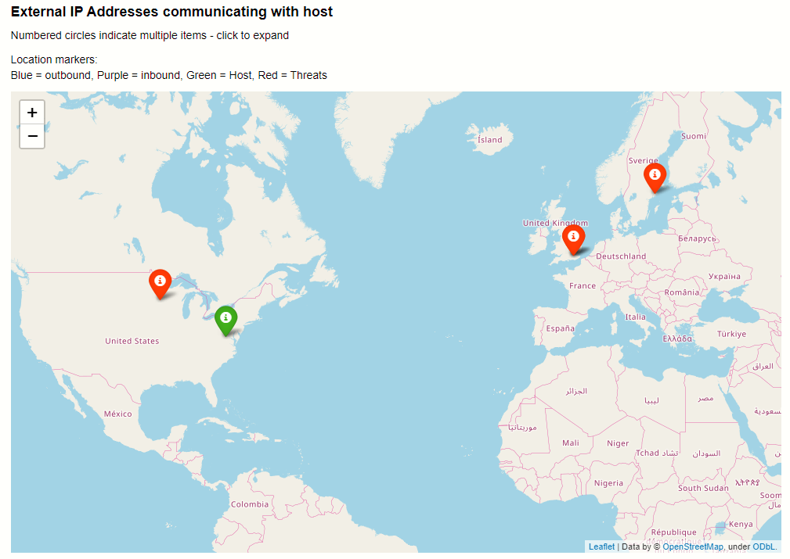

Folium Map Plotting
===================

The :py:class:`FoliumMap<msticpy.nbtools.foliummap.FoliumMap>`
class is a light wrapper around the Folium geo-mapping interactive
mapping package.
See `Folium <https://python-visualization.github.io/folium/>`_.

Folium is itself built on the leaflet.js library.

The msticpy ``FoliumMap`` class expects
:py:class:`IpAddress<msticpy.nbtools.entityschema.IpAddress>`
entities as input.
Each entity must have a valid ``Location`` property populated with
a :py:class:`GeoLocation<msticpy.nbtools.entityschema.GeoLocation>`
object containing the Latitude, Longitude and, optionally, other
attributes.

The GeoIP Lookup module classes return IpAddress entities populated
with this data so can be used seemlessly with the ``FoliumMap`` class.

Display a GeoIP Map
-------------------

Assuming that you have a set of IpAddress objects with location
data populated, you can plot the addresses as follows:

.. code:: ipython3

    from msticpy.nbtools.foliummap import FoliumMap
    folium_map = FoliumMap()

    # Set Icon properties to display
    icon_props = {"color": "green"}

    # Set additional properties to display in tooltips
    # in AdditionalData property of IpAddress entities
    for ips in host_entity.public_ips:
        ips.AdditionalData["host"] = host_entity.HostName
    # Add the IP set to the map
    folium_map.add_ip_cluster(ip_entities=host_entity.public_ips, **icon_props)

    # display the map (or just have folium_map as the last statement
    # of the cell - Jupyter will use display() automatically)
    display(folium_map)

Converting IP Address Strings to IpAddress entities
---------------------------------------------------

This example uses an function to create
:py:class:`IpAddress<msticpy.nbtools.entityschema.IpAddress>` entities
from IP string or ipaddress objects stored in a pandas DataFrame.

The ``format_ip_entity`` function converts the IP string value to
an IpAddress object, looks up the geolocation (this data is populated
into the IpAddress ``Location`` attribute). It also adds additional
information from the pandas DataFrame into the AdditionalData attribute.
Values populated here will be displayed in the tooltip for each plotted
IP Address on the map.

.. note:: The values populated into the AdditionalData attribute are
   specific to this example. AdditionalData is a dictionary object
   so you can put data keyed with a string name here. Primitive value types
   such as string, numbers, dates, etc. should display correctly.

.. code:: ipython3

    # Create a IP Geolookup class
    iplocation = GeoLiteLookup()

    def format_ip_entity(row, ip_col):
        ip_entity = entities.IpAddress(Address=row[ip_col])
        iplocation.lookup_ip(ip_entity=ip_entity)
        ip_entity.AdditionalData["protocol"] = row.L7Protocol
        if "severity" in row:
            ip_entity.AdditionalData["threat severity"] = row["severity"]
        if "Details" in row:
            ip_entity.AdditionalData["threat details"] = row["Details"]
        return ip_entity

    ips_out = list(selected_out.apply(lambda x: format_ip_entity(x, "dest"), axis=1))
    ips_in = list(selected_in.apply(lambda x: format_ip_entity(x, "source"), axis=1))
    ips_threats = list(ti_ip_results.apply(lambda x: format_ip_entity(x, "Ioc"), axis=1))

    icon_props = {"color": "green"}
    for ips in host_entity.public_ips:
        ips.AdditionalData["host"] = host_entity.HostName
    folium_map.add_ip_cluster(ip_entities=host_entity.public_ips, **icon_props)
    icon_props = {"color": "blue"}
    folium_map.add_ip_cluster(ip_entities=ips_out, **icon_props)
    icon_props = {"color": "purple"}
    folium_map.add_ip_cluster(ip_entities=ips_in, **icon_props)
    icon_props = {"color": "red"}
    folium_map.add_ip_cluster(ip_entities=ips_threats, **icon_props)

    display(folium_map)

See also
--------

:doc:`../data_acquisition/GeoIPLookups`