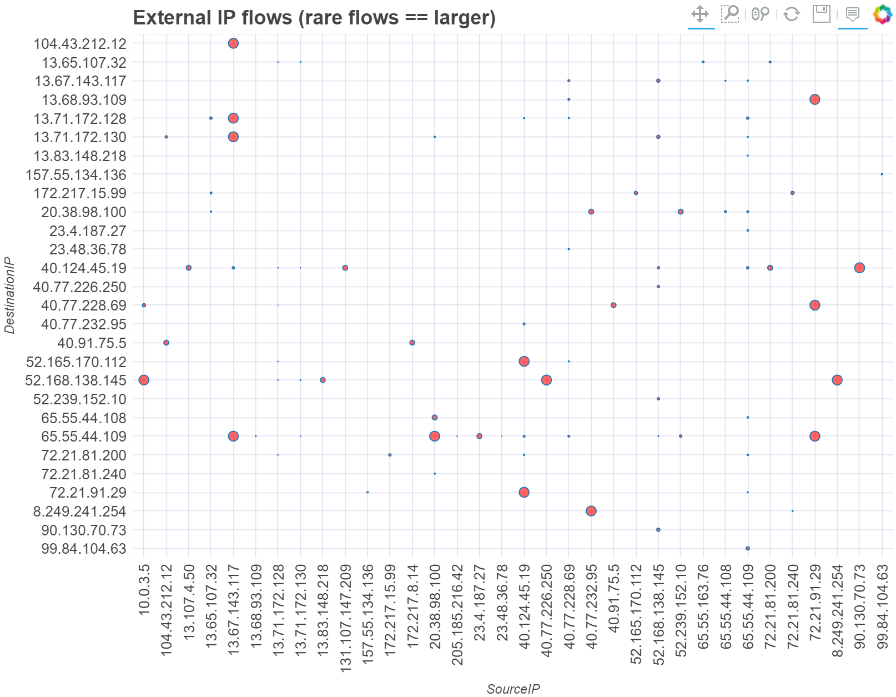
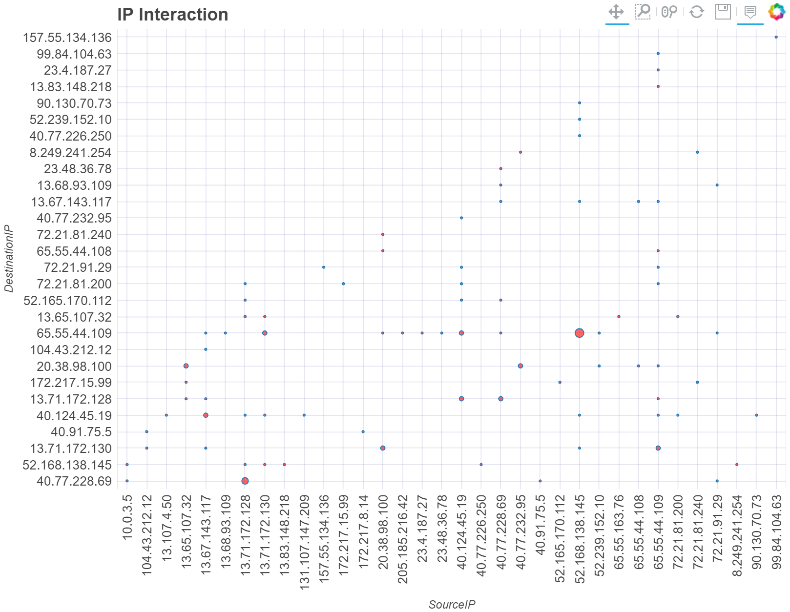
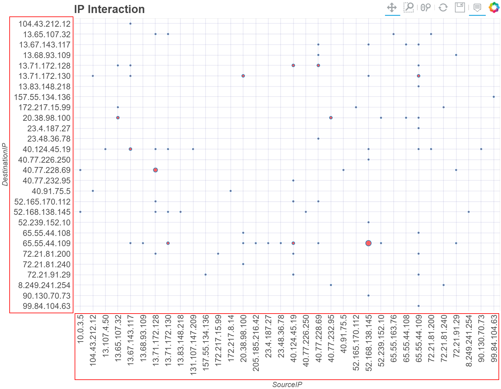
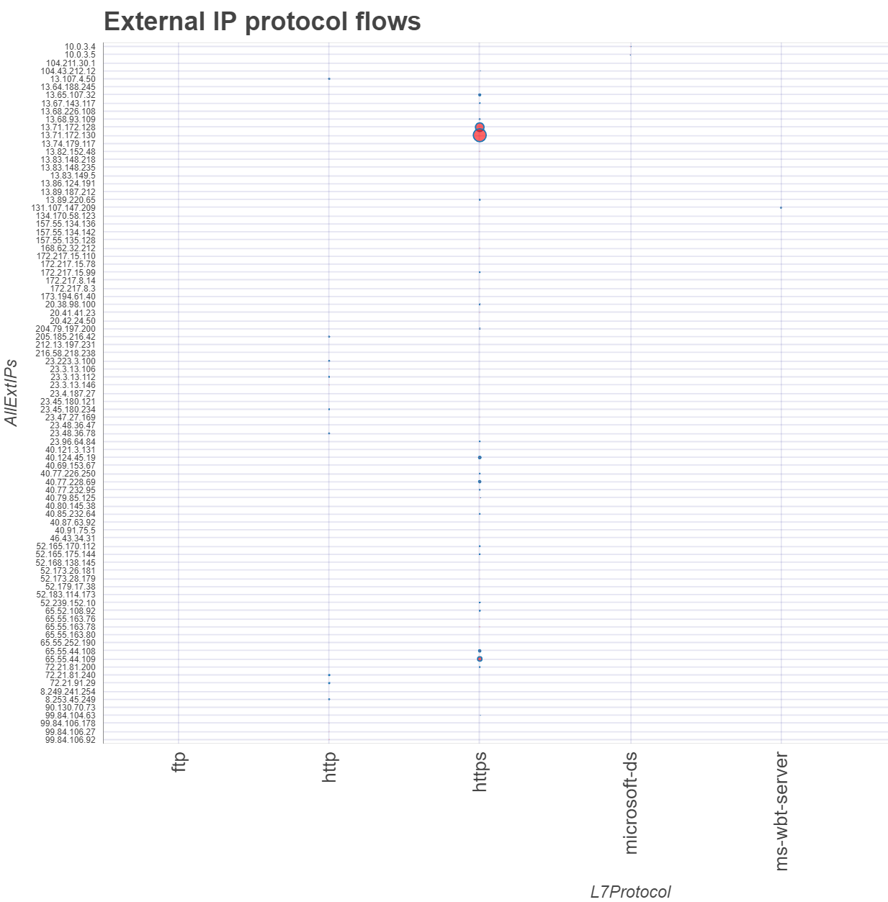
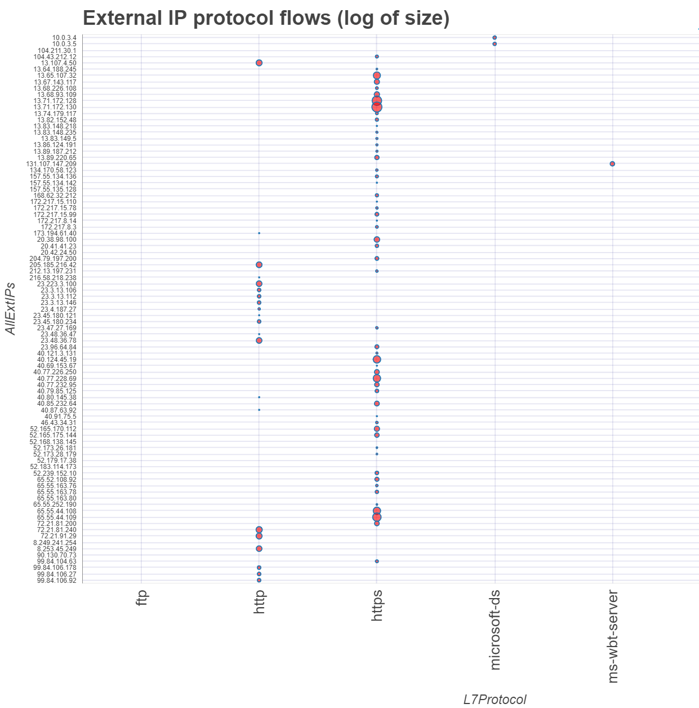
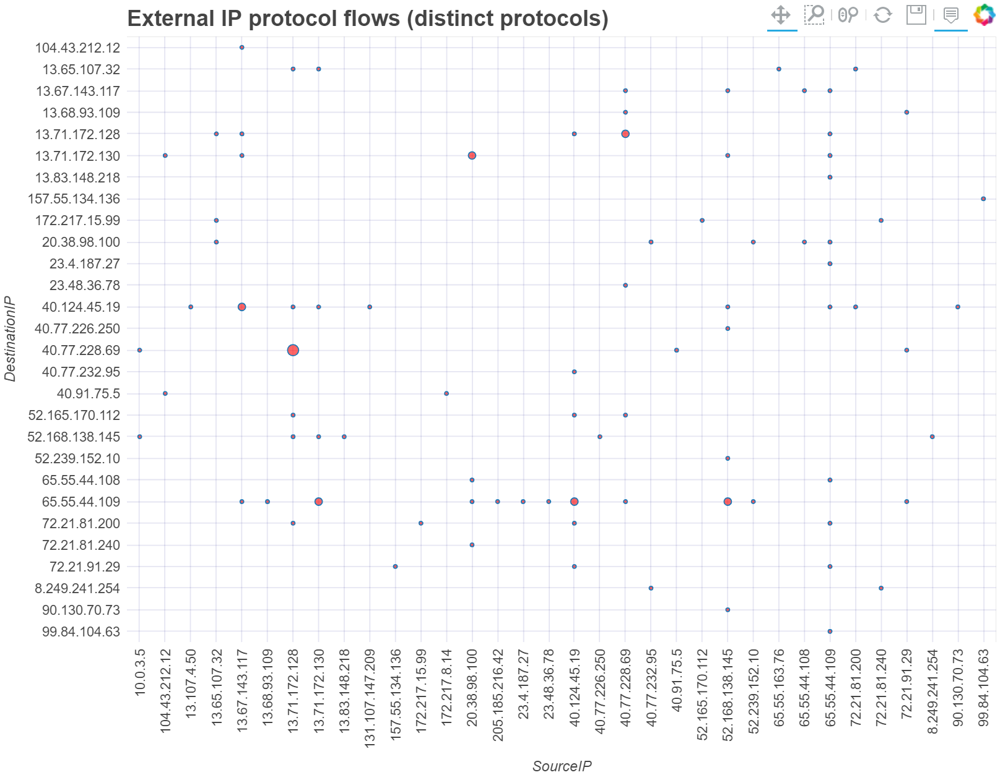
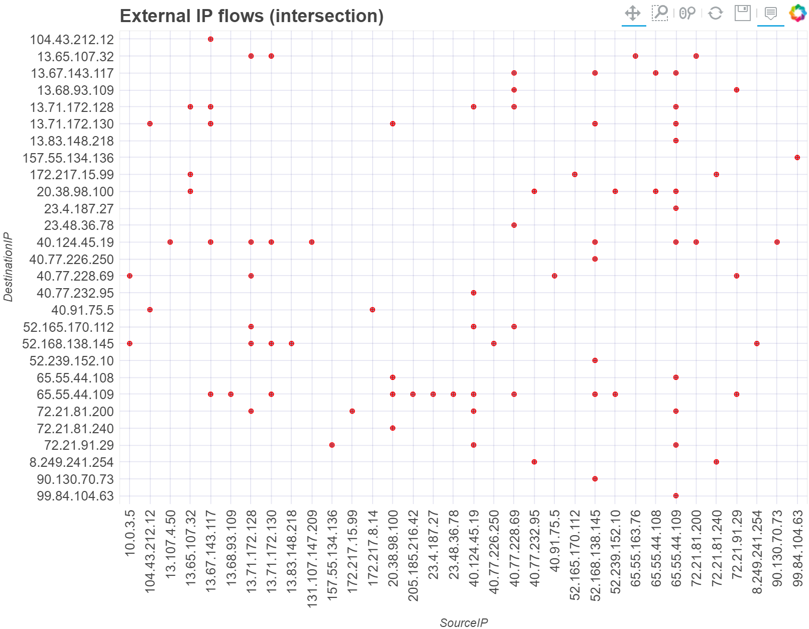

Matrix Plot
===========

The matrix plot is designed to show interactions between two sets of items
(columns in a pandas DataFrame) in a x-y grid.

For example, if you have a DataFrame with source and destination
IP addresses (such as a firewall log), you can plot the source IPs
on the y axis and destination IPs on the x axis. Where there is an event
(row) that links a given source and destination the matrix plot will
plot a circle.

        The size of each interaction is inversely proportional to the value of
        the TotalAllowedFlows column. This highlights rare interactions.

By default the circle is proportional to the number of events containing
a given source/destination (x and y).

The matrix plot also has the following variations:

- You can use a named column from the input data (e.g. bytes transmitted)
  to control the size of the plotted circle.
- You can invert the circle plot size, so that
  rarer interactions are shown with a large intersection point.
- You can plot just the presence of one or more interactions - this plots a
  fixed-size point and is useful if you only want to see the presence/
  absence of an interaction but don’t care about the number of
  interactions.
- You can use a count of distinct values to control the
  size (e.g. you might specify *protocol* as the value column and want to
  see how many distinct protocols the source/destination interacted over).
- You can plot the log of any of the above counts/size - this is useful
  if the variance in the size is orders of magnitude.

Sample data
-----------

A look at the top 3 rows of our sample data.

.. code:: ipython3

    net_df.head(3)

=============  ============  ===================  ===============
SourceIP       L7Protocol      TotalAllowedFlows  DestinationIP
=============  ============  ===================  ===============
20.38.98.100   https                           1  65.55.44.109
13.67.143.117  https                           1  13.71.172.130
65.55.163.76   https                           5  13.65.107.32
=============  ============  ===================  ===============

The basic matrix/interaction plot
---------------------------------

The basic matrix plot displays a circle at each interaction between the X and Y
axes items. The size of the circle is proportional to the number of
records/rows in which the X and Y parameter interact.

Here we are using MSTICPy pandas accessor to plot the graph directly
from the DataFrame.
See :py:meth:`mp_plot.matrix<msticpy.vis.mp_pandas_plot.matrix>`

.. code:: ipython3

    net_df.mp_plot.matrix(x="SourceIP", y="DestinationIP", title="IP Interaction")

        addresses

.. tip:: **Using the Bokeh interactive tools**

    The Bokeh graph is interactive. The toolbar lets you toggle the
    interactive tools: Panning, Select zoom, Mouse wheel zoom, Reset to default view, Save image to PNG, Hover tool.

    If the Hover tool is enabled a tooltip will display some properties
    of the intersecting point as you hover the mouse over that point.

Sorting the X and Y values
--------------------------

You can use the ``sort`` parameter to sort both axes or ``sort_x`` and
``sort_y`` to individually sort the values.

The sort parameters take values "asc" (ascending), "desc" (descending),
``True`` (ascending). ``None`` and ``False`` produce no sorting.

.. note:: Bokeh automatically sorts the X axis labels in
   ascending order. You can override this with sort_x="desc" but it is not
   possible to display the x axis in unsorted (DataFrame) order.

.. code:: ipython3

    net_df.mp_plot.matrix(
        x="SourceIP",
        y="DestinationIP",
        title="IP Interaction",
        sort="asc"
    )

        addresses, showing sorted values on both axes.

Using the ``plot_matrix`` function directly
-------------------------------------------

Although it is usually more convenient to plot directly from the DataFrame
accessor function (``df.mp_plot.matrix``), you can also import the
native function :py:func:`plot_matrix<msticpy.vis.matrix_plot.plot_matrix>`
and use that.

It has the same syntax as the pandas extension except that you must supply
the input DataFrame as the first parameter (or as the named parameter
``data``)

.. code:: python

   from msticpy.vis.matrix_plot import plot_matrix

   plot_matrix(data=net_df, x="SourceIP", y="DestinationIP", title="IP Interaction")

Plotting interactions based on column value
-------------------------------------------

The default behavior of the matrix plot is simply to count the number of
rows in which a given pair of X-Y items occur. The circle linking the X and
Y entities is sized in proportion to this count.

You can also use a *numeric* column in the input DataFrame to control this
sizing. For network data you might choose *BytesTransmitted* or something
similar.

In this example, we're using the *TotalAllowedFlows* column.

.. note:: Because there is a very large variance in the values
   of this column, the small values have been scaled to a very small
   size. We address this in the next selection

.. code:: ipython3

    all_df.mp_plot.matrix(
        x="L7Protocol",
        y="AllExtIPs",
        value_col="TotalAllowedFlows",
        title="External IP protocol flows",
        sort="asc",
    )

        The size of each interaction is controlled by the value of
        the TotalAllowedFlows column.

Log scaling the value/size column
---------------------------------

We saw how, in the previous example, the presence of a few large values
makes many of the interaction points difficult to see.
We can change this by plotting the log (natural log) of the scalar values
using the `log_size=True` parameter.

.. code:: ipython3

    all_df.mp_plot.matrix(
        x="L7Protocol",
        y="AllExtIPs",
        value_col="TotalAllowedFlows",
        title="External IP protocol flows (log of size)",
        log_size=True,
        sort="asc",
    )

        The size of each interaction is controlled by the natural log of
        the TotalAllowedFlows column. The data points for all interactions
        are much easier to see.

Size based on number of distinct values
---------------------------------------

Using the ``dist_count=True`` parameter lets us use non-numeric values
as the ``value_col``. In this case the display size is based on number
of distinct values in the ``value_col`` column.

The plot below plots the circle size from the number of
distinct Layer 7 protocols used between the endpoints.

.. code:: ipython3

    net_df.mp_plot.matrix(
        x="SourceIP",
        y="DestinationIP",
        value_col="L7Protocol",
        dist_count=True,
        title="External IP flows (distinct protocols)",
        sort="asc",
        max_label_font_size=9,
    )

        of distinct Layer 7 protocol used between the endpoints.

Inverting the size to show rare interactions
--------------------------------------------

Where you want to highlight unusual interactions, you can plot the
inverse of the ``value_col`` value or ``count`` of interactions using the
``invert=True`` parameter.

This results in a plot with larger circles for rarer interactions.

.. code:: ipython3

    net_df.mp_plot.matrix(
        x="SourceIP",
        y="DestinationIP",
        value_col="TotalAllowedFlows",
        title="External IP flows (rare flows == larger)",
        invert=True,
        sort="asc",
    )

        The size of each interaction is inversely proportional to the value of
        the TotalAllowedFlows column. This highlights rare interactions.

Showing interactions only
-------------------------

Where you do not care about any value associated with the interaction
and only want to see if there has been an interaction, you can use the
``intersect`` parameter

.. code:: ipython3

    net_df.mp_plot.matrix(
        x="SourceIP",
        y="DestinationIP",
        title="External IP flows (intersection)",
        intersect=True,
        sort="asc",
    )

        Each circle is a fixed size. This visualization is useful for
        just seeing which items interacted at all.

