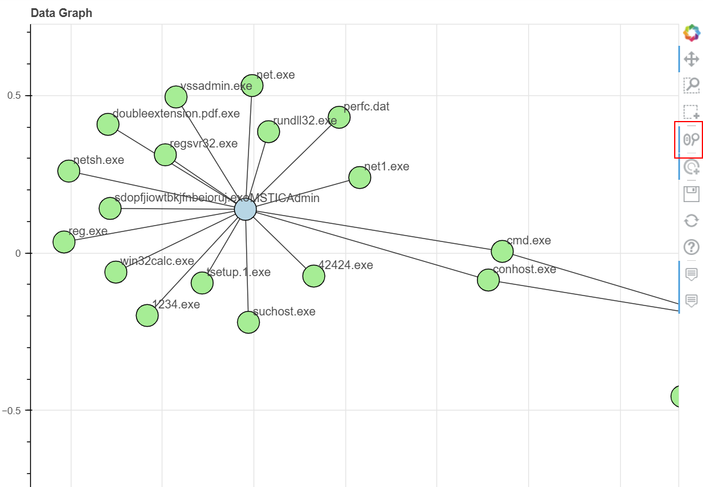
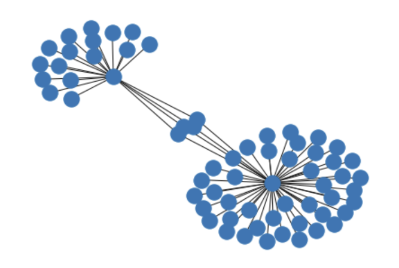
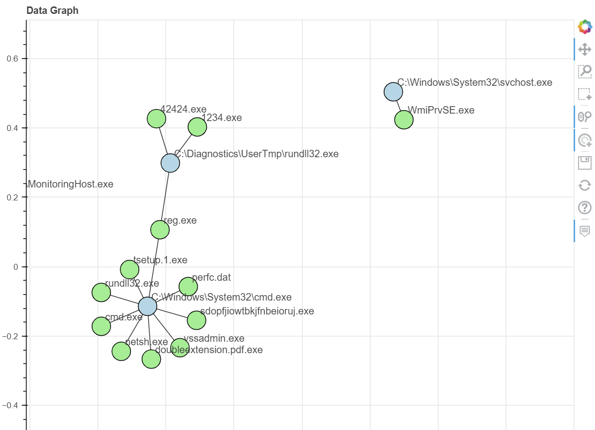
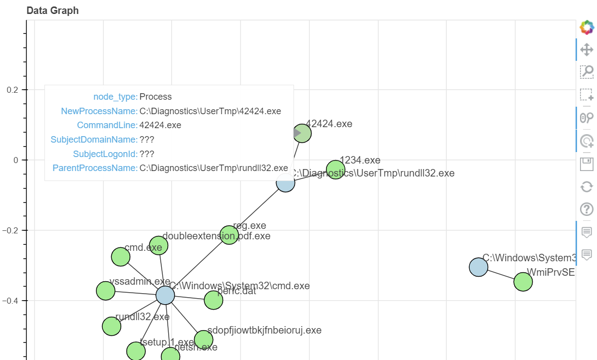

Plot a Network Graph from DataFrame
===================================

MSTICPy has functions that let you convert a pandas DataFrame into a
`networkx <https://networkx.org/>`__ graph or plot directly as a graph
using `Bokeh <https://docs.bokeh.org/>`__ interactive plotting.

This uses underlying functionality from NetworkX and Bokeh

You pass the functions the column names for the **source** and
**target** nodes to build a basic graph. You can also name other columns
to be node or edge attributes. When displayed these attributes are
visible as popup details courtesy of Bokeh's Hover tool.

You can also opt to use different networkx layouts other than the
default ``spring`` layout.

Note: We use the term ""network graph" in this document. This is
shortened to "graph" when used in the context of Networkx e.g. "a
Networkx graph".

.. code:: ipython3

    # Import msticpy
    import msticpy as mp
    mp.init_notebook();

    # Read in a DataFrame
    proc_df = pd.read_csv("./data/processes_on_host.csv", index_col=0)
    proc_df["Process"] = proc_df.NewProcessName.str.extract(r".*\\([^\\]+)")
    proc_df.head(3)

Overview
--------

You can create and display a DataFrame as a network graph using the
MSTICPy pandas accesssor
:py:meth:`mp_plot.network <msticpy.vis.mp_pandas_plot.MsticpyPlotAccessor.network>`.

Below is an example featuring process creation events using the
*SubjecUserName* and *Process* name as nodes. Node and edge attributes are
taken from other DataFrame columns.

.. tip:: use the **WheelZoom** tool to use the mouse scroll wheel to zoom in
    and out of the plot. The button to enable/disable
    the WheelZoom tool is highlighted in illustration below.

.. code:: ipython3

    proc_df.head(100).mp_plot.network(
        source_col="SubjectUserName",
        target_col="Process",
        source_attrs=["SubjectDomainName", "SubjectLogonId"],
        target_attrs=["NewProcessName", "ParentProcessName", "CommandLine"],
        edge_attrs=["TimeGenerated"],
    )

        created which processes.

Creating a NetworkX Graph from a DataFrame
------------------------------------------

The :py:meth:`mp.to_graph <msticpy.init.mp_pandas_accessors.MsticpyCoreAccessor.to_graph>`
accessor will generate a NetworkX graph from the
input data. This is a method that is automatically added to DataFrames by MSTICPy.

You can supply the following parameters:

-  source_col - Column for source nodes.
-  target_col - Column for target nodes.
-  source_attrs - Optional list of columns to use as source node
   attributes, by default None
-  target_attrs - Optional list of columns to use as target node
   attributes, by default None
-  edge_attrs - Optional list of columns to use as edge node attributes,
   by default None
-  graph_type - "graph" or "digraph" (for nx.DiGraph)

It returns a NetworkX graph that you can perform graph analyses on such
as extracting subgraphs, analyzing connectedness, etc See the `NetworkX
documentation <https://networkx.org/documentation/stable/reference/index.html>`__
for more details.

Create the NX graph.

.. code:: ipython3

    nx_graph = proc_df.mp.to_graph(
        source_col="SubjectUserName",
        target_col="Process"
    )

Show the number of nodes and edges.

.. code:: ipython3

    print("# nodes:", len(nx_graph.nodes()))
    print("# edges:", len(nx_graph.edges()))

.. parsed-literal::

    # nodes: 65
    # edges: 67

Display a node showing the default attributes.

.. code:: ipython3

    nx_graph.nodes["MSTICAdmin"]

.. parsed-literal::

    {'node_role': 'source', 'node_type': 'SubjectUserName'}

Use the ``nx.neighbors`` function to show the nodes directly
connected to this node.

.. code:: ipython3

    import networkx as nx
    # Show neighbors of a node - which processes where executed by this account
    list(nx.neighbors(nx_graph, "MSTICAdmin"))[:15]

.. parsed-literal::

    ['reg.exe',
     'cmd.exe',
     'rundll32.exe',
     '42424.exe',
     '1234.exe',
     'tsetup.1.exe',
     'netsh.exe',
     'perfc.dat',
     'sdopfjiowtbkjfnbeioruj.exe',
     'doubleextension.pdf.exe',
     'vssadmin.exe',
     'conhost.exe',
     'net.exe',
     'net1.exe',
     'regsvr32.exe']

Adding node and edge attributes.

.. code:: ipython3

    nx_graph = proc_df.mp.to_graph(
        source_col="SubjectUserName",
        target_col="Process",
        source_attrs=["SubjectDomainName", "SubjectLogonId"],
        target_attrs=["NewProcessName", "ParentProcessName", "CommandLine"],
        edge_attrs=["TimeGenerated"],
    )

Display the node with added attributes.

.. code:: ipython3

    nx_graph.nodes["MSTICAdmin"]

.. parsed-literal::

    {'SubjectDomainName': 'MSTICAlertsWin1',
     'SubjectLogonId': '0xfaac27',
     'node_role': 'source',
     'node_type': 'SubjectUserName'}

Instead of using the pandas accessor, you can import and use
the underlying function
:py:func:`df_to_networkx <msticpy.transform.network.df_to_networkx>`. This has the same
functionality as the pandas accessor method.

.. code:: ipython3

    msticpy.transform.network.df_to_networkx

    nx_graph = df_to_networkx(
        data=proc_df,
        source_col="SubjectUserName,
        target_col="Process"
    )

Built-in Networkx Plotting
~~~~~~~~~~~~~~~~~~~~~~~~~~

You can use the matplotlib built-in networkx plotting backend. You can
also use NetworkX functions to export the graph to a variety of more
flexibly visualization tools such as GraphViz.

.. code:: ipython3

    nx.draw(nx_graph)

Plotting a Network Graph
------------------------

Using Bokeh plotting gives you interactivity as well as a more
informative and richer display.

You can build and plot a graph in a single operation using the
:py:meth:`mp_plot.network <msticpy.vis.mp_pandas_plot.MsticpyPlotAccessor.network>`
accessor method.

Use the standard Bokeh tools on the created plot to select nodes and edges, to zoom
and pan around the network graph and to hover over elements to reveal
attribute values.

.. note:: Bokeh graph plotting does not support interactive dragging of
    nodes and recalculation of the layout.

.. code:: ipython3

    proc_df.head(70).mp_plot.network(
        source_col="ParentProcessName",
        target_col="Process"
    )

          created which processes.

This has the same options as the ``np.to_graph`` accessor method:

-  source_col - Column for source nodes.
-  target_col - Column for target nodes.
-  source_attrs - Optional list of columns to use as source node
   attributes, by default None
-  target_attrs - Optional list of columns to use as target node
   attributes, by default None
-  edge_attrs - Optional list of columns to use as edge node attributes,
   by default None
-  graph_type - "graph" or "digraph" (for nx.DiGraph)

In this case, they also cause the node and edge attributes to be
displayed on the plot using the Bokeh HoverTool. Moving the mouse cursor
over a node or edge will display the attributes.

Note the attributes for source and target nodes are both shown with the
HoverTool but only the values of populated attributes for that node type
(source or target) are shown.

.. code:: ipython3

    proc_df.head(70).mp_plot.network(
        source_col="ParentProcessName",
        target_col="Process",
        source_attrs=["SubjectDomainName", "SubjectLogonId"],
        target_attrs=["NewProcessName", "ParentProcessName", "CommandLine"],
        edge_attrs=["TimeGenerated"],
    )

        created which processes. This shows hovering over one process
        node and seeing the attributes such as Parent Process name
        and process command line.

There are a number of other parameters to control the display of the
graph.

-  title - Title for the plot, by default 'Data Graph'
-  node_size - Size of the nodes in pixels, by default 25
-  font_size - Font size for node labels, by default 10. Can be an
   integer (point size) or a string (e.g. "10pt")
-  width - Plot width in pixels, by default 800
-  height - Plot height (the default is 800)
-  plot scale - Position scale (the default is 2)
-  hide - Don 't show the plot, by default False. If True, just return
   the figure.
-  source_color - The color of the source nodes, by default 'light-blue'
-  target_color - The color of the source nodes, by default
   'light-green '
-  edge_color - The color of the edges, by default 'black'
-  node_size - Size of the nodes in pixels, by default 25
-  font_size - Font size for node labels, by default 10. Can be an
   integer (point size) or a string (e.g. "10pt")
-  \**kwargs - other keyword arguments will be passed to the Networkx
   layout function.

References
----------

-  `Networkx
   from_pandas_edgelist <https://networkx.org/documentation/stable/reference/generated/networkx.convert_matrix.from_pandas_edgelist.html>`__
-  `Bokeh graph
   visualization <https://docs.bokeh.org/en/latest/docs/user_guide/topics/graph.html>`__
