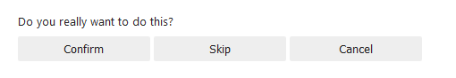
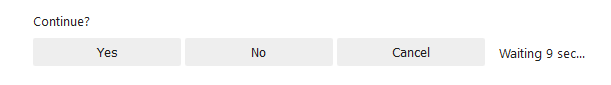
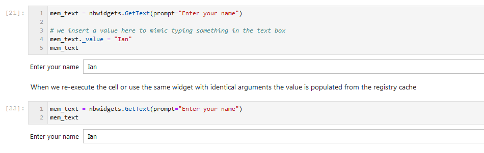
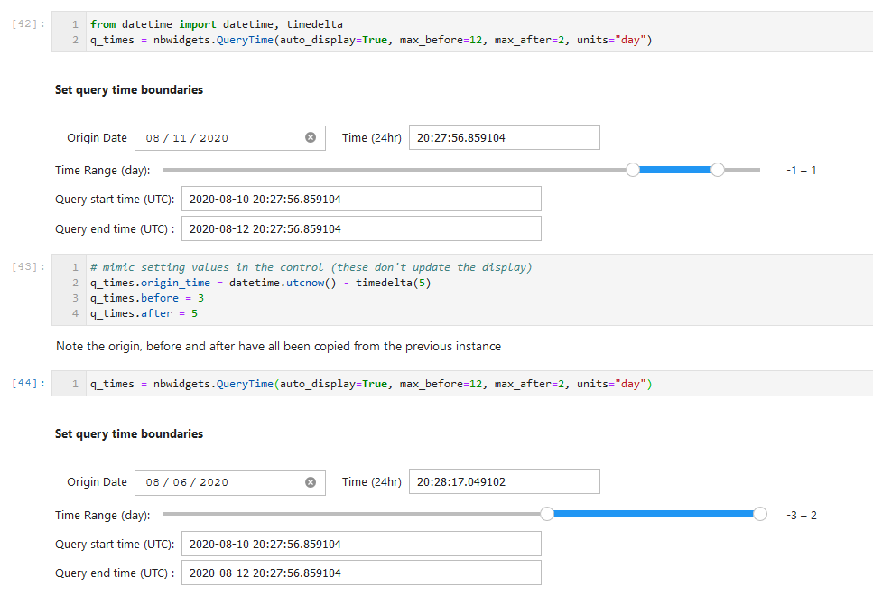
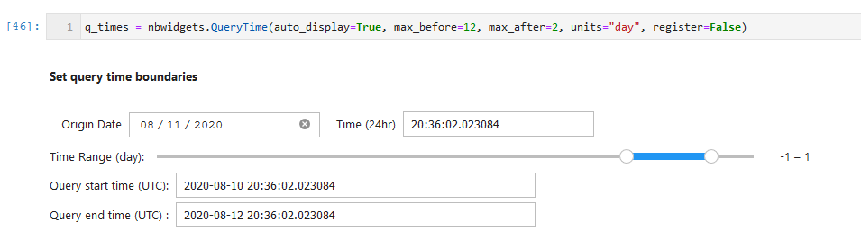
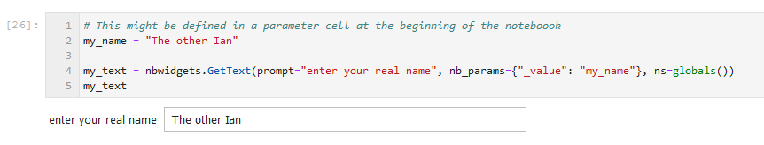

Notebook Widgets
================

This module contains aggregated widgets built using IPyWidgets. These
are designed to speed up common operations like selecting date ranges,
picking items from a list or tracking progress of a long-running event.

.. code:: ipython3

    # Imports

    import msticpy
    msticpy.init_notebook(globals(), verbosity=0)

QueryTime
---------

See :py:class:`QueryTime<msticpy.nbwidgets.QueryTime>`

This widget is used to specify time boundaries - designed to be used
with the built-in msticpy queries and custom queries. The ``start`` and
``end`` times are exposed as datetime properties.

.. note:: QueryTime is a *RegisteredWidget* so will recall the last
   values entered if re-run with the same starting parameters.
   (see :ref:`widgets-registered-widgets`)

.. code:: ipython3

    q_times = nbwidgets.QueryTime(units='day', max_before=20, before=5, max_after=1)
    q_times.display()

.. figure:: _static/Widgets1.png
   :alt: Date and time selector widget showing setting required start and end
         times.

.. code:: ipython3

    print(q_times.start, '....', q_times.end)

.. parsed-literal::

    2019-08-28 23:36:59.410918 .... 2019-09-03 23:36:59.410918

Keep multiple query boundaries aligged by having QueryTime instances
reference the time of the same alert or event, or to each other.

.. code:: ipython3

    from datetime import datetime, timedelta
    class MyAlert:
        pass
    alert = MyAlert()
    alert.TimeGenerated = datetime.utcnow() - timedelta(15)
    alert.TimeGenerated

    q_times1 = nbwidgets.QueryTime(units='hour', max_before=20, before=1, max_after=1,
                                 origin_time=alert.TimeGenerated, auto_display=True)

    q_times2 = nbwidgets.QueryTime(units='hour', max_before=20, before=4, max_after=2,
                                 origin_time=alert.TimeGenerated, auto_display=True)

    ...
    # Note this is a one-time assignment, the values are not linked.
    q_times2.origin_time = q_times1.origin_time

Use the QueryTime properties in a query.

.. note:: You can use a QueryTime instance as a parameter to a *msticpy* query.
    The query provider will the ``start`` and ``end``
    properties from the widget and supply these values as the corresponding
    ``start`` and ``end`` query parameters.
    See :doc:`../data_acquisition/DataProviders`

.. code:: ipython3

    # Use in a query
    my_kql = f'''
    SecurityAlert
    | where TimeGenerated >= datetime({q_times1.start})
    | where TimeGenerated <= datetime({q_times1.end})'''
    print(my_kql)

.. parsed-literal::

    SecurityAlert
    | where TimeGenerated >= datetime(2019-09-02 22:37:03.860216)
    | where TimeGenerated <= datetime(2019-09-03 00:37:03.860216)

Lookback
--------

See :py:class:`Lookback<msticpy.nbwidgets.Lookback>`

This is simpler version of QueryTime with single slider value

.. code:: ipython3

    alert.TimeGenerated = datetime.utcnow() - timedelta(5)
    lb = nbwidgets.Lookback(origin_time=alert.TimeGenerated, auto_display=True, max_value=48)

.. figure:: _static/Widgets2.png
   :alt: Lookback widget showing setting look-back period with slider

.. code:: ipython3

    print(lb.start, '....', lb.end)

.. parsed-literal::

    2019-08-28 19:37:06.883677 .... 2019-08-28 23:37:06.883677

SelectAlert
-----------

See :py:class:`SelectAlert<msticpy.nbwidgets.SelectAlert>`

This lets you view list of alerts and select one for investigation.
You can optionally provide an action (a Python function) to call
with the selected alert as a parameter to display or perform some
other action on the selected item.

SelectAlert attributes

*  ``selected_alert``: the selected alert
*  ``alert_id``: the ID of the selected alert
*  ``alerts``: the current alert list (DataFrame)

Supply a list of alerts with the ``alerts`` parameter.
The ``columns`` parameter overrides the default column set
that the widget will display from the alert set.

The ``action`` parameter is a Python callable. When an item
is selected, this function will be called and passed the
row (pandas series) of the selected item as a parameter.

Alert selector with action=DisplayAlert
~~~~~~~~~~~~~~~~~~~~~~~~~~~~~~~~~~~~~~~

.. code:: ipython3

    alert_select = nbwidgets.SelectAlert(alerts=alerts, action=nbdisplay.display_alert)
    display(Markdown('### Alert selector with action=DisplayAlert'))
    alert_select.display()

.. figure:: _static/Widgets4.png
   :alt: Alert selector widget showing browsable list of alerts.

SelectItem
----------

See :py:class:`SelectItem<msticpy.nbwidgets.SelectItem>`

Similar to AlertSelector but simpler and allows you to use any list or
dictionary of items.

.. code:: ipython3

    if security_alert is None:
        security_alert = SecurityAlert(alerts.iloc[0])
    ent_dict = {ent['Type']:ent for ent in security_alert.entities}

    nbwidgets.SelectItem(
        item_dict=ent_dict,
        description='Select an item',
        action=print,
        auto_display=True
    );

.. figure:: _static/Widgets5.png
   :alt: Using SelectAlert with an optional browser function to show the
         details of each alert as it is selected from the list.

GetText
-------

See :py:class:`GetEnvironmentKey<msticpy.nbwidgets.GetText>`

Get editable string value.

This is a simple wrapper around IPyWidgets Text widget. It is also
derived from RegisteredWidget so will automatically recall the last
value entered (for the same starting parameters).
See :ref:`widgets-registered-widgets`

.. code:: ipython3

    nbwidgets.GetText(prompt='Enter a value', auto_display=True);

GetEnvironmentKey
-----------------

See :py:class:`GetEnvironmentKey<msticpy.nbwidgets.GetEnvironmentKey>`

Get editable value of an environment variable.

A common use would be retrieving an API key from
your environment or allowing you to paste in a value if the environment
key isn’t set.

This is also a RegisteredWidget so will automatically recall the last
value entered (for the same starting parameters) unless the named
``env_var`` environment variable is set. When a valid environment variable
is found this will always override the "remembered" value.
See :ref:`widgets-registered-widgets`

.. note:: setting the variable only persists in the python kernel
    process running at the time. So you can retrieve it later in
    the notebook but not in other processes.

.. code:: ipython3

    nbwidgets.GetEnvironmentKey(env_var='userprofile', auto_display=True);

.. figure:: _static/Widgets6.png
   :alt: Text widget showing retrieving editable value of an environment
         variable.

SelectSubset
------------

See :py:class:`SelectSubset<msticpy.nbwidgets.SelectSubset>`

Allows you to select one or
multiple items from a list to populate an output set.

The ``source_items`` parameter can be:

*  a simple list
*  a dictionary(label, value)
*  a list of (label, value) tuples

In the latter two cases, the ``label`` value is displayed
but the ``selected_values`` property will return the corresponding
values.

The ``selected_items`` attribute will always return the label/value
pairs that have been selected.

You can also pre-populate the Selected items list by supplying values
for the ``default_selected``.

.. code:: ipython3

    # Simple list
    items = list(alerts["AlertName"].values)
    sel_sub = nbwidgets.SelectSubset(source_items=items)

.. figure:: _static/Widgets7.png
   :alt: Select Subset widget allowing you to pick a subset of values
         shown in one list and add them to the list of values
         that you want to use.

.. code:: ipython3

    # Label/Value pair items with a a subset of pre-selected items
    items = {v: k for k, v in alerts["AlertName"].to_dict().items()}
    pre_selected = {v: k for k, v in alerts["AlertName"].to_dict().items() if "commandline" in v}
    sel_sub = nbwidgets.SelectSubset(source_items=items, default_selected=pre_selected)

.. figure:: _static/Widgets8.png
   :alt: Select subset widget populated using Python dictionary instead of
         a simple list.

.. code:: ipython3

    print("Values:", sel_sub.selected_values, "\n")
    print("Items:", sel_sub.selected_items)

.. parsed-literal::

    Values: [79, 109, 83]

    Items: [('Detected suspicious commandline arguments', 79), ('Detected suspicious commandline used to start all executables in a directory', 109), ('Detected suspicious credentials in commandline', 83)]

Progress Indicator
------------------

See :py:class:`Progress<msticpy.nbwidgets.Progress>`

This is thin wrapper around the IPyWidgets ``IntProgess`` control.
It adds some convenience functions for updating progress and
controlling visibility.

.. code:: ipython3

    from time import sleep
    progress = nbwidgets.Progress(completed_len=2000)
    for i in range(0, 2100, 100):
        progress.update_progress(new_total=i)
        sleep(0.1)

    inc_progress = nbwidgets.Progress(completed_len=2000)
    for i in range(0, 2100, 100):
        inc_progress.update_progress(delta=100)
        sleep(0.1)

.. figure:: _static/Widgets9.png
   :alt: Progess bar indicators.

Multi-Option buttons with async wait
------------------------------------

This widget is pretty simple on the surface but has some useful features
for waiting for user input.

.. code:: ipython3

    opt = nbwidgets.OptionButtons(
        description="Do you really want to do this?",
        buttons=["Confirm", "Skip", "Cancel"]
    )

    # Displaying the widget works as expected
    # and sets `widget.value` to the last chosen button value.
    opt

Using OptionButtons to wait until an option is chosen (or timeout expires)
~~~~~~~~~~~~~~~~~~~~~~~~~~~~~~~~~~~~~~~~~~~~~~~~~~~~~~~~~~~~~~~~~~~~~~~~~~

Option buttons uses an asynchronous event loop to track both the button
state and the timeout simultaneously.

Because this requires the use of asynchronous code you must do the
following - call *widget*\ ``.display_async()`` method rather than just
``display()`` or using the auto-display functionality of Jupyter -
prefix this call with ``await`` - this tells IPython/Jupyter that you
are executing asynchronous code and that it needs to wait until this
call has completed before continuing with cell execution.

.. code:: ipython3

    # Using display_async will run the widget with a visible
    # timer. As soon as one option is chosen, that remains as the value
    # of the value of the widget.value property.
    opt = nbwidgets.OptionButtons(description="Continue?", timeout=10)
    await opt.display_async()

.. warning:: Awaiting the OptionButtons control does not pause the
   notebook execution. This is a capability that we are still working
   on.

.. _widgets-registered-widgets:

Registered Widgets
------------------

Some of the widgets (QueryTimes, GetText) can register themselves and
retain the setting and values previously entered. This can be useful
when stepping through a notebook since it is a common mistake to enter
text in a text box and then execute the same cell again by mistake.
This, of course, usually results in the widget being reset to its
default state and erasing the values you just entered.

If you use a registered widget and then create a new copy of the widget
with identical parameters it will look in the registry for a previous
copy of itself and auto-populate it’s values with the previous-entered
ones.

Registered widgets can also read their default values from notebook
variables - this is mainly useful with notebooks that are
programmatically supplied with parameters and executed with something
like Papermill.

Several of the additional parameters available in RegisteredWidgets init
are for internal use by widgets but three are usable by users:

::

    Parameters
    ----------
    nb_params : Optional[Dict[str, str]], optional
        A dictionary of attribute names and global variables. If the variable
        exists in the global namespace it will be used to populate the
        corresponding widget attribute. This is only done if the widget
        attribute currently has no value (i.e. restoring a value from
        the registry takes priority over this),
        by default None
    ns : Dict[str, Any], optional
        Namespace to look for global variables, by default None
    register : bool
        Do not register the widget or retrieve values from previously-
        registered instance.

See :py:class:`RegisteredWidget<msticpy.nbwidgets.RegisteredWidget>`

.. code:: ipython3

    mem_text = nbwidgets.GetText(prompt="Enter your name")

    # we insert a value here to mimic typing something in the text box
    mem_text._value = "Ian"
    mem_text

         been restored from its previously-saved value.

QueryTime also supports registration
~~~~~~~~~~~~~~~~~~~~~~~~~~~~~~~~~~~~

         default date and time values. Next its values are altered by some
         code. The third cell shows the widget being re-created and retrieving
         its default values from the remembered stat set in the previous
         cell.

Note that the new instance of the widget doesn't use the defaults but
retrieves its values from the changes we made in the second cell.

To skip registration add the parameter ``register=False``
~~~~~~~~~~~~~~~~~~~~~~~~~~~~~~~~~~~~~~~~~~~~~~~~~~~~~~~~~

Notice that in the following snippet we are creating an instance of
the QueryTime widget using the same parameters as earlier but this
time it ignores any remembered state and reverts to its defaults.

         does not populate values from saved state and reverts to its defaults.

Specifying ``register=False`` causes the widget to ignore any remembered
state and use its defaults. It will also prevent this instance of the
widget registering itself.

Using notebook parameters to populate RegisteredWidgets
~~~~~~~~~~~~~~~~~~~~~~~~~~~~~~~~~~~~~~~~~~~~~~~~~~~~~~~

If you use something like Papermill to automate your notebooks, you
may want to populate default values from notebook parameters. The
variables holding these parameters may not be set or even declared
when you create the notebook so you cannot reference them directly
when you write the code to use the widget.

You can supply a dictionary that specifies which widget attributes to
populate from variables available in the namespace (the namespace that
you usually want in notebooks is value retured by the ``globals()``
function.

The dictionary should be of the form:

.. code:: ipython3

    params_dict = {
      "widget_attr1", "var_name1",
      "widget_attr2", "var_name2"
      ...
    }

The widget_attr key is the attribute to set in the widget (you may need
to look at the documentation or code for the widget to work out what the
name of the attribute is). The "var_name" value is the name of a variable
that you want to look for when setting the default values of the widget.

You must also specify the namespace for the widget to search for this variable
name.

.. code:: ipython3

    # This might be defined in a parameter cell at the beginning of the noteboook
    my_name = "The other Ian"

    my_text = nbwidgets.GetText(prompt="enter your real name", nb_params={"_value": "my_name"}, ns=globals())
    my_text

         parameters.
