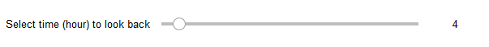
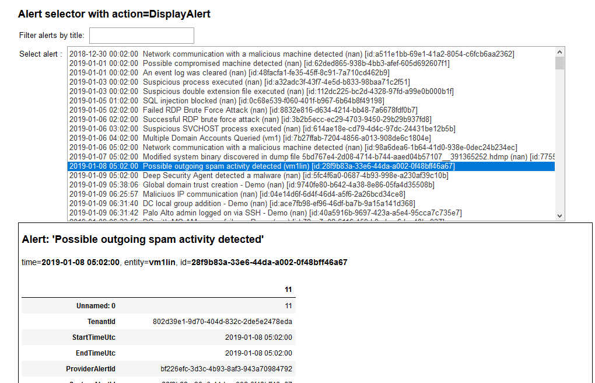
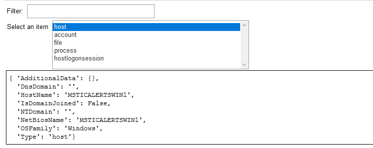
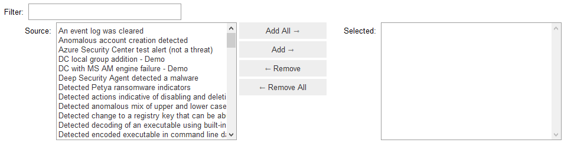
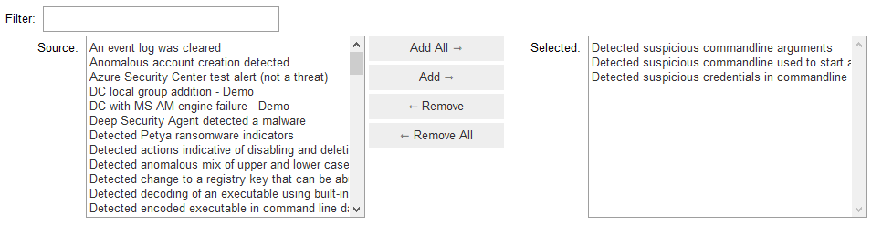

Notebook Widgets
================

This module contains aggregated widgets built using IPyWidgets. These
are designed to speed up common operations like selecting date ranges,
picking items from a list or tracking progress of a long-running event.

.. code:: ipython3

    # Imports
    import sys
    MIN_REQ_PYTHON = (3,6)
    if sys.version_info < MIN_REQ_PYTHON:
        print('Check the Kernel->Change Kernel menu and ensure that Python 3.6')
        print('or later is selected as the active kernel.')
        sys.exit("Python %s.%s or later is required.\n" % MIN_REQ_PYTHON)

    from IPython.display import display, Markdown
    import pandas as pd
    # Import nbtools package
    from msticpy.nbtools import *

QueryTime

See :py:class:`QueryTime<msticpy.nbtools.nbwidgets.QueryTime>`

This widget is used to specify time boundaries - designed to be used
with the built-in msticpy queries and custom queries. The ``start`` and
``end`` times are exposed as datetime properties.

.. code:: ipython3

    q_times = nbwidgets.QueryTime(units='day', max_before=20, before=5, max_after=1)
    q_times.display()

.. figure:: _static/Widgets1.png

.. code:: ipython3

    print(q_times.start, '....', q_times.end)

.. parsed-literal::

    2019-08-28 23:36:59.410918 .... 2019-09-03 23:36:59.410918

Keep multiple query boundaries aligged by having QueryTime instances
reference the time of the same alert or event, or to each other.

.. code:: ipython3

    from datetime import datetime, timedelta
    class MyAlert:
        pass
    alert = MyAlert()
    alert.TimeGenerated = datetime.utcnow() - timedelta(15)
    alert.TimeGenerated

    q_times1 = nbwidgets.QueryTime(units='hour', max_before=20, before=1, max_after=1,
                                 origin_time=alert.TimeGenerated, auto_display=True)

    q_times2 = nbwidgets.QueryTime(units='hour', max_before=20, before=4, max_after=2,
                                 origin_time=alert.TimeGenerated, auto_display=True)

    ...
    # Note this is a one-time assignment, the values are not linked.
    q_times2.origin_time = q_times1.origin_time

Use the QueryTime properties in a query.

.. note:: Direct extraction of the ``start`` and ``end``
    properties is possible when using the *msticpy* Data Provider queries.
    See :doc:`../data_acquisition/DataProviders`

.. code:: ipython3

    # Use in a query
    my_kql = f'''
    SecurityAlert
    | where TimeGenerated >= datetime({q_times1.start})
    | where TimeGenerated <= datetime({q_times1.end})'''
    print(my_kql)

.. parsed-literal::

    SecurityAlert
    | where TimeGenerated >= datetime(2019-09-02 22:37:03.860216)
    | where TimeGenerated <= datetime(2019-09-03 00:37:03.860216)

Lookback
--------

See :py:class:`Lookback<msticpy.nbtools.nbwidgets.Lookback>`

This is simpler version of QueryTime with single slider value

.. code:: ipython3

    alert.TimeGenerated = datetime.utcnow() - timedelta(5)
    lb = nbwidgets.Lookback(origin_time=alert.TimeGenerated, auto_display=True, max_value=48)

.. code:: ipython3

    print(lb.start, '....', lb.end)

.. parsed-literal::

    2019-08-28 19:37:06.883677 .... 2019-08-28 23:37:06.883677

AlertSelector
-------------

See :py:class:`AlertSelector<msticpy.nbtools.nbwidgets.AlertSelector>`

lets you view list of alerts and select one for investigation.
You can optionally provide an action (a Python function) to call
with the selected alert as a parameter to display or perform some
other action on the selected item.

AlertSelector attributes

*  ``selected_alert``: the selected alert
*  ``alert_id``: the ID of the selected alert
*  ``alerts``: the current alert list (DataFrame)

Supply a list of alerts with the ``alerts`` parameter.
The ``columns`` parameter overrides the default column set
that the widget will display from the alert set.

The ``action`` parameter is a Python callable. When an item
is selected, this function will be called and passed the
row (pandas series) of the selected item as a parameter.

Alert selector with action=DisplayAlert
~~~~~~~~~~~~~~~~~~~~~~~~~~~~~~~~~~~~~~~

.. code:: ipython3

    alert_select = nbwidgets.AlertSelector(alerts=alerts, action=nbdisplay.display_alert)
    display(Markdown('### Alert selector with action=DisplayAlert'))
    alert_select.display()

SelectString
------------

See :py:class:`SelectString<msticpy.nbtools.nbwidgets.SelectString>`

Similar to AlertSelector but simpler and allows you to use any list or
dictionary of items.

.. code:: ipython3

    if security_alert is None:
        security_alert = SecurityAlert(alerts.iloc[0])
    ent_dict = {ent['Type']:ent for ent in security_alert.entities}

    nbwidgets.SelectString(item_dict=ent_dict,
                        description='Select an item',
                        action=print,
                        auto_display=True);

GetEnvironmentKey

See :py:class:`GetEnvironmentKey<msticpy.nbtools.nbwidgets.GetEnvironmentKey>`

Get editable value of an environment variable.

A common use would be retrieving an API key from
your environment or allowing you to paste in a value if the environment
key isn’t set.

.. note:: setting the variable only persists in the python kernel
    process running at the time. So you can retrieve it later in
    the notebook but not in other processes.

.. code:: ipython3

    nbwidgets.GetEnvironmentKey(env_var='userprofile', auto_display=True);

SelectSubset
------------

See :py:class:`SelectSubset<msticpy.nbtools.nbwidgets.SelectSubset>`

Allows you to select one or
multiple items from a list to populate an output set.

The ``source_items`` parameter can be:

*  a simple list
*  a dictionary(label, value)
*  a list of (label, value) tuples

In the latter two cases, the ``label`` value is displayed
but the ``selected_values`` property will return the corresponding
values.

The ``selected_items`` attribute will always return the label/value
pairs that have been selected.

You can also pre-populate the Selected items list by supplying values
for the ``default_selected``.

.. code:: ipython3

    # Simple list
    items = list(alerts["AlertName"].values)
    sel_sub = nbwidgets.SelectSubset(source_items=items)

.. code:: ipython3

    # Label/Value pair items with a a subset of pre-selected items
    items = {v: k for k, v in alerts["AlertName"].to_dict().items()}
    pre_selected = {v: k for k, v in alerts["AlertName"].to_dict().items() if "commandline" in v}
    sel_sub = nbwidgets.SelectSubset(source_items=items, default_selected=pre_selected)

.. code:: ipython3

    print("Values:", sel_sub.selected_values, "\n")
    print("Items:", sel_sub.selected_items)

.. parsed-literal::

    Values: [79, 109, 83]

    Items: [('Detected suspicious commandline arguments', 79), ('Detected suspicious commandline used to start all executables in a directory', 109), ('Detected suspicious credentials in commandline', 83)]

Progress Indicator
------------------

See :py:class:`Progress<msticpy.nbtools.nbwidgets.Progress>`

This is thin wrapper around the IPyWidgets ``IntProgess`` control.
It adds some convenience functions for updating progress and
controlling visibility.

.. code:: ipython3

    from time import sleep
    progress = nbwidgets.Progress(completed_len=2000)
    for i in range(0, 2100, 100):
        progress.update_progress(new_total=i)
        sleep(0.1)

    inc_progress = nbwidgets.Progress(completed_len=2000)
    for i in range(0, 2100, 100):
        inc_progress.update_progress(delta=100)
        sleep(0.1)

