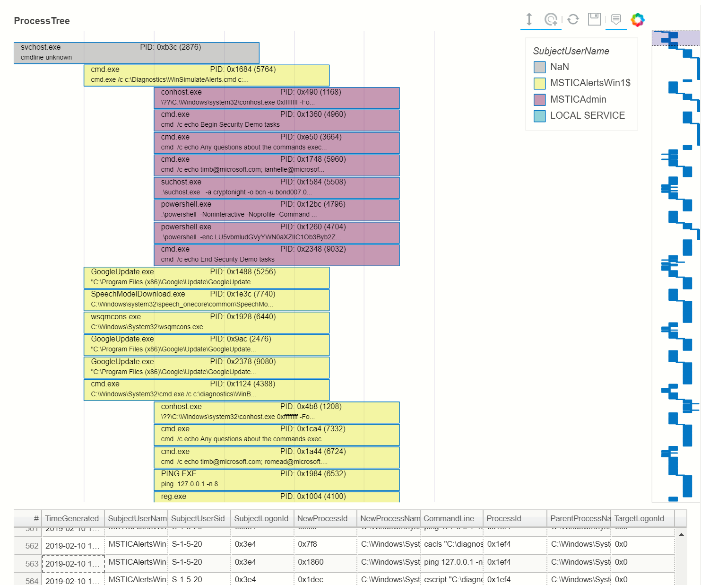
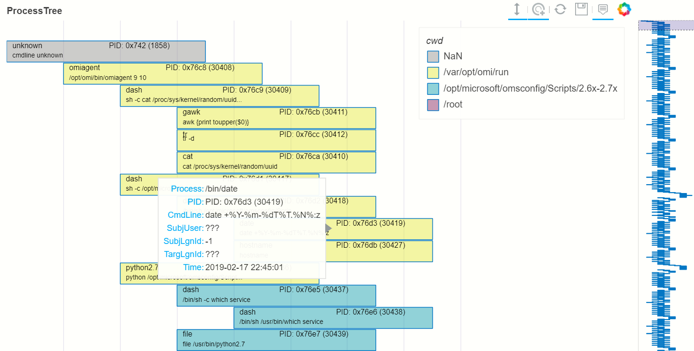

ProcessTree
===========

This describes the use of the process tree data and
visualization modules. These modules can be used with Windows
process creation events (ID 4688), Linux auditd logs or Microsoft Defender
for Endpoint (MDE) logs. The
ProcessTree visualization is built
using the `Bokeh library <https://bokeh.pydata.org>`__.

See the sample
`ProcessTree Notebook <https://github.com/microsoft/msticpy/blob/master/docs/notebooks/ProcessTree.ipynb>`__
for full code for the examples shown here.

The process tree functionality has two main components:

-  Process Tree creation - this takes a standard log from a single
   host and builds the parent-child relationships between processes
   in the data set. There are a set of utility functions to extract
   individual and partial trees from the processed data set.
-  Process Tree visualization - this takes the processed output from
   the previous component and displays the process tree using Bokeh
   plots.

.. note:: The expected schema for the Linux audit data is as produced
      by the ``auditdextract.py`` module in ``msticpy``. This module
      combines related process exec messages into a single combined message
      that emulates the Windows 4688 event. This retains the audit schema
      apart from the following additions:

      -  ``cmdline``: this is a concatenation of the ``a0``, ``a1``, etc
         argument fields
      -  ``EventType``: this is the audit message type (``SYSCALL``,
         ``EXECVE``, ``CWD``, etc.) - the combined ``SYSCALL_EXECVE``
         created by ``auditextract`` is the only type currently supported.

Support for other formats such as Sysmon is planned but not yet included.

Plotting process trees
----------------------

Plotting process trees from process event data involves two stages:

- Converting the linear event data into an hierarchical tree data
  structure
- Plotting the visualization

In most cases you don't need to worry about these two processes - the
standard :py:func:`plot_process_tree<msticpy.nbtools.process_tree.plot_process_tree>`
function and the pandas accessor function
:py:meth:`mp_process_tree.plot<msticpy.nbtools.process_tree.ProcessTreeAccessor.plot>`
will try to detect if the input data is in the correct format. If it is
not, the process tree builder is automatically applied to the data.

This should work for Windows events, Linux auditd events and MDE process events.

The easiest way to plot process data as a process tree is to use the pandas
``mp_process_tree`` accessor.

.. code:: IPython

   from msticpy.nbtools import process_tree

   my_proc_df.mp_process_tree.plot()

Here is the same thing using the ``plot_process_tree`` function.

.. code:: IPython

   from msticpy.nbtools import process_tree as ptree

   ptree.plot_process_tree(procs_df)

For full usage, see the later section `Process tree plotting parameters`_

Extracting process trees from logs
----------------------------------

You can build a process tree without plotting it.
You might want to do this if you want the intermediate data for
analysis or if you want to extract a sub-tree for display.

The later section `Process Tree utility functions`_ describes
some process tree analysis and manipulation functions that you can
use on the built process trees.

build_process_tree syntax
^^^^^^^^^^^^^^^^^^^^^^^^^
See :py:func:`build_process_tree<msticpy.sectools.proc_tree_builder.build_process_tree>`

.. code:: python

   from msticpy.sectools import process_tree as ptree
   ptree.build_process_tree(procs)

Parameters
^^^^^^^^^^

procs (pd.DataFrame)
    Process events (Windows 4688 or Linux Auditd)
schema (ProcSchema, optional)
    The column schema to use, by default None
    If None, then the schema is inferred
show_summary (bool, optional)
    Shows summary of the built tree, default is False.
debug (bool, optional)
    If True produces extra debugging output,
    by default False

The following example shows importing the require modules and reading in
test data.
We then call ``build_process_tree`` to extract the parent-child relationships
between processes.

.. container:: cell code

   .. code:: python

      from IPython.display import display
      import pandas as pd
      from msticpy.sectools import process_tree as ptree

      win_procs = pd.read_pickle("../demos/data/win_proc_test.pkl")
      p_tree_win = ptree.build_process_tree(win_procs, show_summary=True)

The tree builder process, tries to infer the schema (you can override this
with the *schema* parameter) and assembles process parent-child relationships.
It creates unique keys (the ``proc_key`` column) for each process, based on
the imagepath + process id + timecreated. It then tries to find the parent
process in the same dataset or infer the parent from the data in the created
process event. How it does this differs slightly between input data formats.
It then adds a ``parent_key`` field to each child record for the parent
record (found or inferred).

This modified dataframe is returned from ``build_process_tree``. If you
supply ``show_summary=True`` parameter it will also output some statistics
about the created tree.

.. container:: output stream stdout

   ::

      {'Processes': 1010, 'RootProcesses': 10, 'LeafProcesses': 815, 'BranchProcesses': 185, 'IsolatedProcesses': 0, 'LargestTreeDepth': 7}

The example below shows using two of the process tree utility functions
to extract the descendants (children, grandchildren, etc) of one of the
root process rows and then display the subtree.

.. note:: "root" process, in this context means any process whose parent
   could not be determined. This is not necessarily the actual root
   process for this tree. A typical data set will have more than one
   "root" process - this might be better thought of as "earliest discovered
   ancestor process" but that's a bit of a mouthful.

   "Root" processes are flagged in the data by an ``IsRoot`` column with the
   value True.

.. code:: ipython

   proc_tree = ptree.get_descendents(p_tree_win, ptree.get_roots(p_tree_win).iloc[2])
   ptree.plot_process_tree(data=proc_tree, legend_col="SubjectUserName", show_table=True)

Process Tree Plotting Syntax
----------------------------

See
:py:func:`plot_process_tree<msticpy.nbtools.process_tree.plot_process_tree>`
and
:py:func:`build_and_show_process_tree<msticpy.nbtools.process_tree.build_and_show_process_tree>`

.. code:: python

   ptree.plot_process_tree(
       data, schema=None, output_var=None,
       legend_colNone, show_table=False,
   )

Process tree plotting parameters
^^^^^^^^^^^^^^^^^^^^^^^^^^^^^^^^

data (pd.DataFrame)
   DataFrame containing one or more Process Trees. This should be the
   output of ``build_process_tree`` described above.

schema (ProcSchema, optional)
   The data schema to use for the data set, by default None. If None
   the schema is inferred. A schema object maps generic field names
   (e.g. ``process_name``) on to a data-specific name (e.g. ``exe``
   in the case of Linux audit data). This is usually not required
   since the function will try to infer the schema from fields in the
   input DataFrame.

output_var (str, optional)
   Output variable for selected items in the tree, by default None.
   Setting this lets you return the keys of any items selected in the
   bokeh plot. For example, if you supply the string "my_results" and
   then select one or more processes in the tree, the Python variable
   ``my_results`` will be populated with a list of keys (index items)
   of the corresponding rows in the input DataFrame.

legend_col (str, optional)
   The column used to color the tree items, by default None. If this
   column is a string, the values will be treated as categorical data
   and map unique values to different colors and display a legend of
   the mapping. If this column is a numeric or datetime value, the
   values will be treated as continuous and a color gradient bar will
   be displayed indicating the mapping of values on to the color
   gradient.

show_table (bool)
   Set to True to show the data table, by default False. Shows the
   source values as a data table beneath the process tree.

height (int, optional)
   The height of the plot figure
   (the default is 700)

width (int, optional)
   The width of the plot figure (the default is 900)

title (str, optional)
   Title to display (the default is None)

hide_legend (bool, optional)
   Hide the legend box, even if legend_col is specified.

pid_fmt (str, optional)
   Display Process ID as 'dec' (decimal) or 'hex' (hexadecimal),
   default is 'hex'.

.. warning:: **Large data sets** (more than a few hundred processses)

   These will normally be handled well by the Bokeh plot (up to multiple
   tens of thousands or more) but it will make navigation of the tree
   more difficult. In particular, the range tool (on the right of the main
   plot) will be difficult to manipulate. Split the input data into
   smaller chunks before plotting.

.. note:: **Range Tool and Font Size**
   Avoid using Range tool to change the size of the displayed plot.
   The font size does not scale based on how much data is shown. If you
   use the range tool to select too large a subset of the data in the
   main plot, the font will become unreadable. If this happens, use the
   ``reset`` tool to set the plot back to its defaults. Dragging the
   range box along the tree, rather than dragging individual edges
   (resulting in resizing the range) will give more readable results.

Linux Process Tree
------------------
The process for visualizing Linux process trees is almost identical to
visualizing Windows processes.

.. note:: This assumes that the Linux audit log has been read from a
   file using
   :py:func:`read_from_file<msticpy.sectools.auditdextract.read_from_file>`
   or read from Azure Sentinel/Log Analytics using the
   LinuxAudit.auditd_all query and processed using
   :py:func:`extract_events_to_df<msticpy.sectools.auditdextract.extract_events_to_df>`
   function. Using either of these, the audit messages events related to a single
   process start are merged into a single row.

   See :doc: `../data_acquisition/CollectingLinuxAuditLogs.rst` for more details.

   Also, see the section `Adapting the input schema of your data`_ for details
   about using different input schemas.

.. container:: cell code

   .. code:: python

      # Process Linux audit events. Show verbose output.

      p_tree_lx = ptree.build_process_tree(linux_proc, show_progress=True, debug=True)

   .. container:: output stream stdout

      ::

         Original # procs 34345
         Merged # procs 34345
         Merged # procs - dropna 11868
         Unique merged_procs index in merge 34345
         These two should add up to top line
         Rows with dups 0
         Rows with no dups 34345
         0 + 34345 = 34345
         original: 34345 inferred_parents 849 combined 35194
         has parent time 20177
         effectivelogonId in subjectlogonId 35190
         parent_proc_lc in procs 34345
         ProcessId in ParentProcessId 21431
         Parent_key in proc_key 34345
         Parent_key not in proc_key 845
         Parent_key is NA 845
         {'Processes': 35190, 'RootProcesses': 845, 'LeafProcesses': 17664, 'BranchProcesses': 16681, 'IsolatedProcesses': 0, 'LargestTreeDepth': 10}

.. container:: cell code

   .. code:: python

      # Take one of the roots from the process set and get the full tree beneath it
      t_root = ptree.get_roots(p_tree_lx).iloc[7]
      full_tree = ptree.get_descendents(p_tree_lx, t_root)
      print("Full tree size:", len(full_tree))

   .. container:: output stream stdout

      ::

         Full tree size: 3032

.. container:: cell code

   .. code:: python

      ptree.plot_process_tree(data=full_tree[:1000], legend_col="cwd")

Plotting Using a color gradient
-------------------------------

.. container:: cell code

   .. code:: python

      # Read in and process some data - this contains a Rarity column indicating
      # how common the process is in analyzed data set.
      proc_rarity = pd.read_pickle("../demos/data/procs_with_cluster.pkl")
      proc_rarity_tree = ptree.build_process_tree(proc_rarity, show_progress=True)

   .. container:: output stream stdout

      ::

         {'Processes': 22992, 'RootProcesses': 31, 'LeafProcesses': 15587, 'BranchProcesses': 7374, 'IsolatedProcesses': 0, 'LargestTreeDepth': 839}

.. container:: cell code

   .. code:: python

      # Get the root processes from the process tree data
      prar_roots = ptree.get_roots(proc_rarity_tree)

      # Find the tree with the highest Rarity Score and
      # calculate the AverageRarity for proceses in that tree.
      # NOTE: this code is only needed to help us choose likely trees to view
      # it is not needed for the plotting.
      tree_rarity = []
      for row_num, (ix, row) in enumerate(prar_roots.iterrows()):
          rarity_tree = ptree.get_descendents(proc_rarity_tree, row)
          tree_rarity.append({
              "Row": row_num,
              "RootProcess": prar_roots.loc[ix].NewProcessName,
              "TreeSize:": len(rarity_tree),
              "AverageRarity": rarity_tree["Rarity"].mean()
          })

      pd.DataFrame(tree_rarity).sort_values("AverageRarity", ascending=False)

   .. container:: output execute_result

      ::

             Row                                        RootProcess  TreeSize:
         27   27                    C:\Windows\System32\svchost.exe          4
         23   23                    C:\Windows\System32\svchost.exe          2
         22   22                       C:\Windows\System32\smss.exe         30
         20   20  C:\Windows\SoftwareDistribution\Download\Insta...          2
         9     9                       C:\Windows\System32\smss.exe          7
         7     7  C:\ProgramData\Microsoft\Windows Defender\plat...         46
         ....

.. container:: cell code

   .. code:: python

      # Plot the tree using the Rarity column as the legend_col parameter.
      svcs_tree = ptree.get_descendents(proc_rarity_tree, prar_roots.iloc[22])
      ptree.plot_process_tree(svcs_tree, legend_col="Rarity", show_table=True)

.. figure:: _static/process_tree3.png
   :alt: Process tree plot
   :width: 5in
   :height: 4in

Process Tree utility Functions
------------------------------

The :py:mod:`process_tree_utils<msticpy.sectools.process_tree_utils>`
module has a number of functions that may
be useful in extracting or manipulating process trees or tree
relationships.

These typically take a ``procs`` parameter - the DataFrame containing
the process trees.
Processes that perform navigation relative to another process (get_parent,
get_children, etc.) also take a ``source`` parameter - the process that is
the origin of the navigation.

Some functions also have an ``include_source`` parameter, e.g. get_children.
This controls whether the function will include the source process in the results.

Functions:

-  :py:func:`build_process_key<msticpy.sectools.process_tree_utils.build_process_key>`
-  :py:func:`build_process_tree<msticpy.sectools.process_tree_utils.build_process_tree>`
-  :py:func:`get_ancestors<msticpy.sectools.process_tree_utils.get_ancestors>`
-  :py:func:`get_children<msticpy.sectools.process_tree_utils.get_children>`
-  :py:func:`get_descendents<msticpy.sectools.process_tree_utils.get_descendents>`
-  :py:func:`get_parent<msticpy.sectools.process_tree_utils.get_parent>`
-  :py:func:`get_process<msticpy.sectools.process_tree_utils.get_process>`
-  :py:func:`get_process_key<msticpy.sectools.process_tree_utils.get_process_key>`
-  :py:func:`get_root<msticpy.sectools.process_tree_utils.get_root>`
-  :py:func:`get_root_tree<msticpy.sectools.process_tree_utils.get_root_tree>`
-  :py:func:`get_roots<msticpy.sectools.process_tree_utils.get_roots>`
-  :py:func:`get_siblings<msticpy.sectools.process_tree_utils.get_siblings>`
-  :py:func:`get_summary_info<msticpy.sectools.process_tree_utils.get_summary_info>`
-  :py:func:`get_tree_depth<msticpy.sectools.process_tree_utils.get_tree_depth>`
-  :py:func:`infer_schema<msticpy.sectools.process_tree_utils.infer_schema>`

:py:func:`~msticpy.sectools.process_tree_utils.get_summary_info`
^^^^^^^^^^^^^^^^^^^^^^^^^^^^^^^^^^^^^^^^^^^^^^^^^^^^^^^^^^^^^^^^

Get summary information.

.. container:: cell code

   .. code:: python

      ptree.get_summary_info(p_tree_win)

   .. container:: output execute_result

      ::

         {'Processes': 1010,
          'RootProcesses': 10,
          'LeafProcesses': 815,
          'BranchProcesses': 185,
          'IsolatedProcesses': 0,
          'LargestTreeDepth': 7}

:py:func:`~msticpy.sectools.process_tree_utils.get_roots`
^^^^^^^^^^^^^^^^^^^^^^^^^^^^^^^^^^^^^^^^^^^^^^^^^^^^^^^^^

Get roots of all trees in the data set.

.. container:: cell code

   .. code:: python

      # Get roots of all trees in the set
      ptree.get_roots(p_tree_win).head()

:py:func:`~msticpy.sectools.process_tree_utils.get_descendents`
^^^^^^^^^^^^^^^^^^^^^^^^^^^^^^^^^^^^^^^^^^^^^^^^^^^^^^^^^^^^^^^

Get the full tree beneath a process.

get_descendents takes an ``include_source`` parameter. Setting this to
True returns the source process with the result set.

.. container:: cell code

   .. code:: python

      # Take one of those roots and get the full tree beneath it
      t_root = ptree.get_roots(p_tree_win).loc["c:\windowsazure\guestagent_2.7.41491.901_2019-01-14_202614\waappagent.exe0x19941970-01-01 00:00:00.000000"]
      full_tree = ptree.get_descendents(p_tree_win, t_root)
      full_tree.head()

:py:func:`~msticpy.sectools.process_tree_utils.get_children`
^^^^^^^^^^^^^^^^^^^^^^^^^^^^^^^^^^^^^^^^^^^^^^^^^^^^^^^^^^^^

Get the immediate children of a process

get_children takes an ``include_source`` parameter. Setting this to
True returns the source process with the result set.

.. container:: cell code

   .. code:: python

      # Just get the immediate children of the root process
      children = ptree.get_children(p_tree_win, t_root)
      children.head()

:py:func:`~msticpy.sectools.process_tree_utils.get_tree_depth`
^^^^^^^^^^^^^^^^^^^^^^^^^^^^^^^^^^^^^^^^^^^^^^^^^^^^^^^^^^^^^^

Get the depth of a tree.

.. container:: cell code

   .. code:: python

      # Get the depth of the full tree
      depth = ptree.get_tree_depth(full_tree)
      print(f"depth of tree is {depth}")

   .. container:: output stream stdout

      ::

         depth of tree is 4

:py:func:`~msticpy.sectools.process_tree_utils.get_parent`
^^^^^^^^^^^^^^^^^^^^^^^^^^^^^^^^^^^^^^^^^^^^^^^^^^^^^^^^^^

:py:func:`~msticpy.sectools.process_tree_utils.get_ancestors`
^^^^^^^^^^^^^^^^^^^^^^^^^^^^^^^^^^^^^^^^^^^^^^^^^^^^^^^^^^^^^

Get the parent process or all ancestors.

get_ancestors takes an ``include_source`` parameter. Setting this to
True returns the source process with the result set.

.. container:: cell code

   .. code:: python

      # Get Ancestors
      # Get a child process that's at the bottom of the tree
      btm_descnt = full_tree[full_tree["path"].str.count("/") == depth - 1].iloc[0]

      print("parent")
      display(ptree.get_parent(p_tree_win, btm_descnt)[:20])
      print("ancestors")
      ptree.get_ancestors(p_tree_win, btm_descnt).head()

   .. container:: output stream stdout

      ::

         parent

         TenantId                           52b1ab41-869e-4138-9e40-2a4457f09bf0
         Account                                      WORKGROUP\MSTICAlertsWin1$
         EventID                                                            4688
         TimeGenerated                                2019-02-09 23:20:15.547000
         Computer                                                MSTICAlertsWin1
         SubjectUserSid                                                 S-1-5-18
         SubjectUserName                                        MSTICAlertsWin1$
         SubjectDomainName                                             WORKGROUP
         SubjectLogonId                                                    0x3e7
         NewProcessId                                                      0xccc
         NewProcessName                              C:\Windows\System32\cmd.exe
         TokenElevationType                                               %%1936
         ProcessId                                                        0x123c
         CommandLine                                                       "cmd"
         ParentProcessName     C:\WindowsAzure\GuestAgent_2.7.41491.901_2019-...
         TargetLogonId                                                       0x0
         SourceComputerId                   263a788b-6526-4cdc-8ed9-d79402fe4aa0
         TimeCreatedUtc                               2019-02-09 23:20:15.547000
         EffectiveLogonId                                                  0x3e7
         new_process_lc                              c:\windows\system32\cmd.exe
         Name: c:\windows\system32\cmd.exe0xccc2019-02-09 23:20:15.547000, dtype: object

   .. container:: output stream stdout

      ::

         ancestors

                                                                                         TenantId  \
         proc_key
         c:\windowsazure\guestagent_2.7.41491.901_2019-0...  52b1ab41-869e-4138-9e40-2a4457f09bf0
         c:\windowsazure\guestagent_2.7.41491.901_2019-0...  52b1ab41-869e-4138-9e40-2a4457f09bf0
         c:\windows\system32\cmd.exe0xccc2019-02-09 23:2...  52b1ab41-869e-4138-9e40-2a4457f09bf0
         c:\windows\system32\conhost.exe0x14ec2019-02-09...  52b1ab41-869e-4138-9e40-2a4457f09bf0

         ....

         [4 rows x 35 columns]

:py:func:`~msticpy.sectools.process_tree_utils.get_process`
^^^^^^^^^^^^^^^^^^^^^^^^^^^^^^^^^^^^^^^^^^^^^^^^^^^^^^^^^^^

get_process retrieves a process record by its key. The process returned
is a single row - a pandas Series.

.. container:: cell code

   .. code:: python

      proc_key = btm_descnt.name
      print(proc_key)
      ptree.get_process(p_tree_win, proc_key)

   .. container:: output stream stdout

      ::

         c:\windows\system32\conhost.exe0x14ec2019-02-09 23:20:15.560000

   .. code:: python

      process2 = full_tree[full_tree["path"].str.count("/") == depth - 1].iloc[-1]
      ptree.build_process_key(process2)

   .. container:: output execute_result

      ::

         'c:\\windows\\system32\\conhost.exe0x15842019-02-10 15:24:56.050000'

:py:func:`~msticpy.sectools.process_tree_utils.get_siblings`
^^^^^^^^^^^^^^^^^^^^^^^^^^^^^^^^^^^^^^^^^^^^^^^^^^^^^^^^^^^^

Get the siblings of a process.

get_siblings takes an ``include_source`` parameter. Setting this to
True returns the source process with the result set.

.. container:: cell code

   .. code:: python

      src_proc = ptree.get_children(p_tree_win, t_root, include_source=False).iloc[0]
      ptree.get_siblings(p_tree_win, src_proc, include_source=True).head()

   .. container:: output execute_result

      ::

                                                                                         TenantId  \
         proc_key
         c:\windowsazure\guestagent_2.7.41491.901_2019-0...  52b1ab41-869e-4138-9e40-2a4457f09bf0
         c:\windowsazure\guestagent_2.7.41491.901_2019-0...  52b1ab41-869e-4138-9e40-2a4457f09bf0
         c:\windowsazure\secagent\wasecagentprov.exe0xda...  52b1ab41-869e-4138-9e40-2a4457f09bf0
         ...

         [5 rows x 35 columns]

Create a network from a Tree using Networkx
-------------------------------------------

.. container:: cell code

   .. code:: python

      import networkx as nx
      import matplotlib.pyplot as plt
      p_graph = nx.DiGraph()

      p_graph = nx.from_pandas_edgelist(
          df=full_tree.reset_index(),
          source="parent_key",
          target="proc_key",
          edge_attr=["TimeGenerated", "NewProcessName", "NewProcessId"],
          create_using=nx.DiGraph,
      )

      plt.gcf().set_size_inches((20,20))
      pos = nx.circular_layout(p_graph)
      nx.draw_networkx(p_graph, pos=pos, with_labels=False, node_size=50, fig_size=(10,10))
      # Get the root binary name to plot labels (change the split param for Linux)
      labels = full_tree.apply(lambda x: x.NewProcessName.split("\\")[-1], axis=1).to_dict()
      nx.draw_networkx_labels(p_graph, pos, labels=labels, font_size=10, font_color='k', font_family='sans-serif', font_weight='normal', alpha=1.0)
      plt.show()

.. figure:: _static/process_tree4.png
   :alt: Networkx plot of process tree
   :width: 4in
   :height: 4in

Adapting the input schema of your data
--------------------------------------

The process tree builder uses generic names to map common event
properties such as process name and process ID between different
input schemas.

The built-in schemas for Windows 4688, Linux Auditd and Microsoft Defender
for Endpoint (MDE) are shown below.

===================  =====================  =====================  ===========================
Generic name         Win 4688 schema        Linux auditd schema    MDE schema
===================  =====================  =====================  ===========================
time_stamp           TimeGenerated          TimeGenerated          CreatedProcessCreationTime
process_name         NewProcessName         exe                    CreatedProcessName
process_id           NewProcessId           pid                    CreatedProcessId
parent_name          ParentProcessName      *(not used)*           ParentProcessName
parent_id            ProcessId              ppid                   CreatedProcessParentId
logon_id             SubjectLogonId         ses                    InitiatingProcessLogonId
target_logon_id      TargetLogonId          *(not used)*           LogonId
cmd_line             CommandLine            cmdline                CreatedProcessCommandLine
user_name            SubjectUserName        acct                   CreatedProcessAccountName
user_id              SubjectUserSid         uid                    CreatedProcessAccountSid
host_name_column     Computer               Computer               ComputerDnsName
event_id_column      EventID                EventType              *(not used)*
===================  =====================  =====================  ===========================

If your schema differs from, but is similar to one of the built-in
schema mappings you can adapt one of these or supply a custom schema
when you build and display the process tree.

There are also two schema properties that you might need to
add to the schema.

===================  =====================  =====================  =====================
Mapping property     Win 4688 schema        Linux auditd schema    MDE schema
===================  =====================  =====================  =====================
path_separator       ``\\``                 ``/``                  ``\\``
event_id_identifier  4688*                  SYSCALL_EXECVE         *(not used)*
===================  =====================  =====================  =====================

\*The event_id_identifier for Windows 4688 schema must be an integer.

The path_separator value is used to extract the process file name (minus
the path) in the process tree view.

The ``event_id_column`` and ``event_id_identifier`` work together and are useful if your
input data contains mixed event types. Using these together will tell
the process tree builder to filter on events where event_id_column == event_id_identifier.
E.g. ``data[data["EventID"] == 4688]``

The example below
shows how to adapt an existing Linux schema for different column
names in the source schema.

.. code:: ipython

   from msticpy.sectools.proc_tree_builder import LX_EVENT_SCH
   # also WIN_EVENT_SCH and MDE_EVENT_SCH are available
   from copy import copy
   cust_lx_schema = copy(LX_EVENT_SCH)

   cust_lx_schema.time_stamp = "TimeStamp"
   cust_lx_schema.host_name_column = "host"
   # Note these are used to filter events if you have a data
   # set that contains mixed event types.
   cust_lx_schema.event_id_column = None
   cust_lx_schema.event_id_identifier = None

   # now supply the schema as the schema parameter
   ptree.build_process_tree(auditd_df, schema=cust_lx_schema)

You can also supply a schema as a Python ``dict``, with the keys
being the generic internal name and the values, the names of the columns
in the input data. Both keys and values are strings except where
otherwise indicated above.

The ``time_stamp`` column **must** be a pandas Timestamp (Python datetime)
type. If your data is in another format (e.g. Unix timestamp or date string)
you should
convert this before trying to use the process tree tools. The example
below shows extracting the timestamp from the auditd ``mssg_id`` field.

.. code:: ipython

   linux_proc["ts"] = pd.to_numeric(linux_proc["mssg_id"].apply(lambda x: x.split(":")[0]))
   # the "ts" column is now a fixed-point number
   # Convert to a pandas timestamp.
   linux_proc["time_stamp"] = pd.to_datetime(linux_proc.ts, utc=True)

   # set the converted column as your time_stamp column.
   cust_lx_schema.time_stamp = "time_stamp"