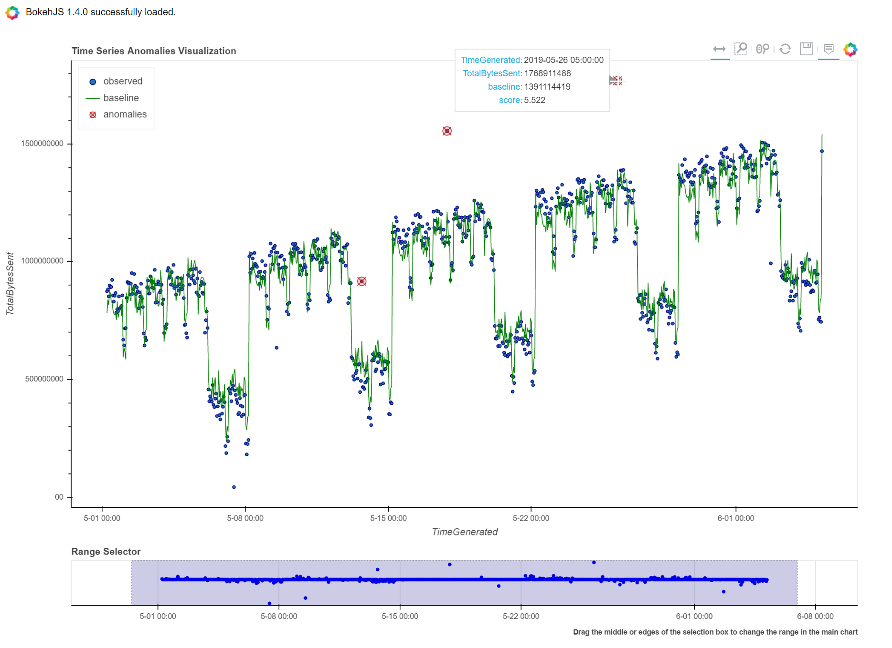
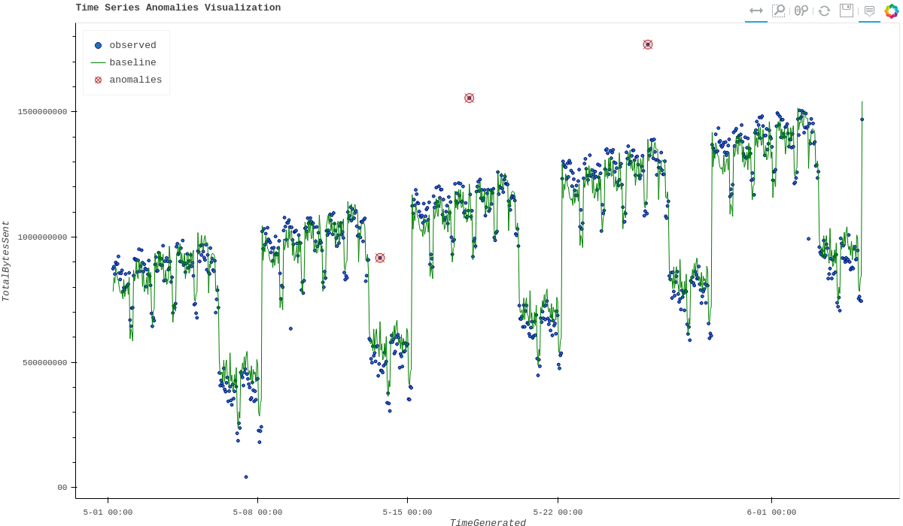
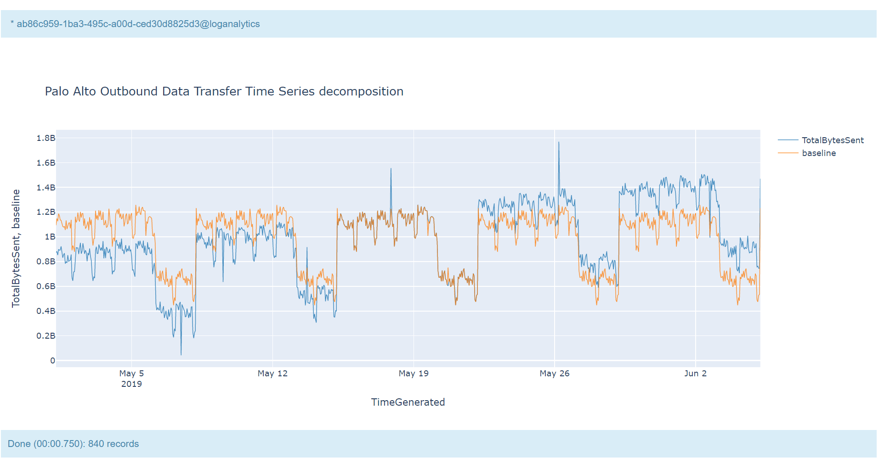

Time Series Analysis and Anomalies Visualization
================================================

MSTICPy has functions to calculate and display time series
decomposition results. These can be useful to spot time-based
anomalies in something that has a predictable seasonal pattern.

.. warning:: This document is in the process of being updated
   The first sections describe some of the new functionality in
   MSTICPy 2.0 - main the encapsulation of many of the time
   series functions in pandas accessors.
   The second part of the document is the original document
   that is still to be updated.

Some examples are number of logons or network bytes transmitted
per hour. Although these vary by day and time of day, they tend
to exhibit a regular recurring pattern over time.
Time Series decomposition can calculate this seasonal pattern.
We can then use this established pattern to look for periods
when significant differences occur - these might be indicators of
malicious activity on your network.

Time Series analysis generally involves these steps
 - Generating TimeSeries Data
 - Using Time Series Analysis functions to discover anomalies
 - Visualizing Time Series anomalies

You can read more about time series analysis in detail some Microsoft
TechCommunity blog posts.

- `Looking for unknown anomalies - what is normal?
  Time Series analysis & its applications in Security
  <https://techcommunity.microsoft.com/t5/azure-sentinel/looking-for-unknown-anomalies-what-is-normal-time-series/ba-p/555052>`__

- `Time Series visualization of Palo Alto logs to detect data exfiltration <https://techcommunity.microsoft.com/t5/azure-sentinel/time-series-visualization-of-palo-alto-logs-to-detect-data/ba-p/666344>`__

Some useful background reading on Forecasting and prediction using time
series here `Forecasting: Principals and Practice <https://otexts.com/fpp2/>`__
The section dealing with STL (Seasonal and Trend decomposition using Loess)
`STL decomposition <https://otexts.com/fpp2/stl.html>`__
is directly related to the techniques used here.

Preparation
-----------

You need to have the SciPy and Statsmodels packages installed to use
the Time Series functionality.

An easy way to get these is to install MSTICPy with the "ml" extract

.. code:: bash

  python -m pip install msticpy[ml]

Initializing MSTICPy

.. code:: ipython3

    import msticpy as mp
    mp.init_notebook()

Retrieving data to analyze
--------------------------

Time Series is a series of data points indexed (or listed or graphed) in
time order. The data points are often discrete numeric points such as
frequency of counts or occurrences against a timestamp column of the
dataset.

The basic characteristics of the data that you need is as follows:

- Time column - with the time stamp of the sampling interval
- A numeric count or sum of whatever value you want to check for
  anomalies. For example, bytes per hour. The numeric value is
  calculated for each time period.
- The total time span of the data must cover one or more seasonal periods,
  for example, 7 days.

A simple query for doing this for logon data is shown below.

.. code:: ipython3

  query = """
  SecurityEvent
  | where EventID == 4624
  | where TimeGenerated >= datetime(2022-05-01 00:00)
  | where TimeGenerated <= datetime(2022-06-01 00:00)
  | summarize LogonCount=count() by bin(TimeGenerated, 1h)
  | project TimeGenerated, LogonCount
  """
  ts_df = qry_prov.exec_query(query)
  ts_df = ts_df.set_index("TimeGenerated")

Performing the Time Series analysis
-----------------------------------

MSTICPy has a timeseries module that uses Statsmodel's STL function
to generate the time series analysis.

You can use it with your input DataFrame directly via the
:py:meth:`mp_timeseries.analyze <msticpy.analysis.timeseries.MsticpyTimeSeriesAccessor.analyze>`
pandas method.

.. code:: ipython3

  from msticpy.analysis import timeseries

  ts_decomp_df = ts_df.mp_timeseries.analyze(
      # time_column="TimeGenerated"  - if the DF is not indexed by timestamp
      data_column="LogonCount",
      seasonal=7,
      period=24
  )

  ts_decomp_df.head()

A full list and description of parameters to this function:

- time_column : If the input data is not indexed on the time column, use this column
  as the time index
- data_column : Use named column if the input data has more than one column.
- seasonal : Seasonality period of the input data required for STL.
  Must be an odd integer, and should normally be >= 7 (default).
- period: Periodicity of the the input data. by default 24 (Hourly).
- score_threshold : Standard deviation threshold value calculated using Z-score used to
  flag anomalies, by default 3

Displaying the time series anomalies
------------------------------------

Using the output from the previous step we can display the trends and any
anomalies graphically using
:py:meth:`mp_timeseries.plot <msticpy.analysis.timeseries.MsticpyTimeSeriesAccessor.plot>`

.. code:: ipython3

    ts_decomp_df.mp_timeseries.plot(
        y="LogonCount",
    )

You can also chain both operations together

.. code:: ipython3

    ts_decomp_df = ts_df.mp_timeseries.analyze(
        # time_column="TimeGenerated"  - if the DF is not indexed by timestamp
        data_column="LogonCount",
        seasonal=7,
        period=24
    ).mp_timeseries.plot(
        y="LogonCount",
    )

Extracting anomaly periods
--------------------------

You can get the anomalous periods (if any) using the
:py:meth:`mp_timeseries.anomaly_periods <msticpy.analysis.timeseries.MsticpyTimeSeriesAccessor.anomaly_periods>`
function.

.. code:: ipython3

    ts_decomp_df.mp_timeseries.anomaly_periods()

.. parsed-literal::

    [TimeSpan(start=2019-05-13 16:00:00+00:00, end=2019-05-13 18:00:00+00:00, period=0 days 02:00:00),
    TimeSpan(start=2019-05-17 20:00:00+00:00, end=2019-05-17 22:00:00+00:00, period=0 days 02:00:00),
    TimeSpan(start=2019-05-26 04:00:00+00:00, end=2019-05-26 06:00:00+00:00, period=0 days 02:00:00)]

This function returns anomaly periods as a list of MSTICPy :py:class:`TimeSpan <msticpy.common.timespan.TimeSpan>`
objects.

Extracting anomaly periods as KQL time filter clauses
~~~~~~~~~~~~~~~~~~~~~~~~~~~~~~~~~~~~~~~~~~~~~~~~~~~~~

You can also return the anomaly periods as a KQL expression that you
can use in MS Sentinel queries using
:py:meth:`mp_timeseries.kql_periods <msticpy.analysis.timeseries.MsticpyTimeSeriesAccessor.kql_periods>`.

.. code:: ipython3

    ts_decomp_df.mp_timeseries.kql_periods()

.. parsed-literal::

    '| where TimeGenerated between (datetime(2019-05-13 16:00:00+00:00) .. datetime(2019-05-13 18:00:00+00:00))
     or TimeGenerated between (datetime(2019-05-17 20:00:00+00:00) .. datetime(2019-05-17 22:00:00+00:00))
     or TimeGenerated between (datetime(2019-05-26 04:00:00+00:00) .. datetime(2019-05-26 06:00:00+00:00))'

Readjusting the anomaly threshold
---------------------------------

You can re-calculate the anomalies using a different setting for the
threshold. The threshold determines how much difference between the
actual measure value and the expected seasonal value before a period
is considered anomalous.

The default threshold is 3 standard deviations away from the
expected seasonal value.

.. code:: ipython3

    ts_decomp_df.mp_timeseries.apply_threshold(threshold=2.5).mp_timeseries.anomaly_periods()

.. parsed-literal::

    [TimeSpan(start=2019-05-06 02:00:00+00:00, end=2019-05-06 04:00:00+00:00, period=0 days 02:00:00),
    TimeSpan(start=2019-05-08 04:00:00+00:00, end=2019-05-08 06:00:00+00:00, period=0 days 02:00:00),
    TimeSpan(start=2019-05-08 10:00:00+00:00, end=2019-05-08 12:00:00+00:00, period=0 days 02:00:00),
    TimeSpan(start=2019-05-13 02:00:00+00:00, end=2019-05-13 05:00:00+00:00, period=0 days 03:00:00),
    TimeSpan(start=2019-05-13 16:00:00+00:00, end=2019-05-13 18:00:00+00:00, period=0 days 02:00:00),
    TimeSpan(start=2019-05-17 20:00:00+00:00, end=2019-05-17 22:00:00+00:00, period=0 days 02:00:00),
    TimeSpan(start=2019-05-22 05:00:00+00:00, end=2019-05-22 07:00:00+00:00, period=0 days 02:00:00),
    TimeSpan(start=2019-05-26 04:00:00+00:00, end=2019-05-26 06:00:00+00:00, period=0 days 02:00:00),
    TimeSpan(start=2019-05-27 03:00:00+00:00, end=2019-05-27 05:00:00+00:00, period=0 days 02:00:00)]

MSTICPy built-in Sentinel Queries
---------------------------------

MSTICPy has a number of built-in queries for MS Sentinel to support time series
analysis.

- MultiDataSource.get_timeseries_anomalies
- MultiDataSource.get_timeseries_data
- MultiDataSource.get_timeseries_decompose
- MultiDataSource.plot_timeseries_datawithbaseline
- MultiDataSource.plot_timeseries_scoreanomolies

To use these you will need to connect to a Sentinel workspace.

.. code:: ipython3

    # Authentication
    qry_prov = mp.QueryProvider(data_environment="LogAnalytics")
    qry_prov.connect(mp.WorkspaceConfig(workspace="MySentinelWorkspace"))

Table-agnostic time series query
~~~~~~~~~~~~~~~~~~~~~~~~~~~~~~~~

We can use the generic ``get_timeseries_data`` to retrieve suitable
data to analyze from different source tables.

The help for this query is show below.

::

    Query:  get_timeseries_data
    Data source:  LogAnalytics
    Retrieves TimeSeriesData prepared to use with built-in KQL time series functions

    Parameters
    ----------
    add_query_items: str (optional)
        Additional query clauses
    aggregatecolumn: str (optional)
        field to agregate from source dataset
        (default value is: Total)
    aggregatefunction: str (optional)
        Aggregation functions to use - count(), sum(), avg() etc
        (default value is: count())
    end: datetime
        Query end time
    groupbycolumn: str (optional)
        Group by field to aggregate results
        (default value is: Type)
    scorethreshold: str (optional)
        Score threshold for alerting
        (default value is: 3)
    start: datetime
        Query start time
    table: str
        Table name
    timeframe: str (optional)
        Aggregation TimeFrame
        (default value is: 1h)
    timestampcolumn: str (optional)
        Timestamp field to use from source dataset
        (default value is: TimeGenerated)
    where_clause: str (optional)
        Optional additional filter clauses
    Query:
    {table} {where_clause} | project {timestampcolumn},{aggregatecolumn},{groupbycolumn}
    | where {timestampcolumn} >= datetime({start})
    | where {timestampcolumn} <= datetime({end})
    | make-series {aggregatecolumn}={aggregatefunction} on {timestampcolumn}
      from datetime({start}) to datetime({end})
      step {timeframe} by {groupbycolumn} {add_query_items}

And an example of running the query.

.. code:: ipython3

    # Specify start and end timestamps
    start='2020-02-09 00:00:00.000000'
    end='2020-03-10 00:00:00.000000'

    # Execute the query by passing required and optional parameters
    time_series_data = qry_prov.MultiDataSource.get_timeseries_data(
        start=start,
        end=end,
        table="CommonSecurityLog",
        timestampcolumn="TimeGenerated",
        aggregatecolumn="SentBytes",
        groupbycolumn="DeviceVendor",
        aggregatefunction="sum(SentBytes)",
        where_clause='|where DeviceVendor=="Palo Alto Networks"',
        add_query_items='|mv-expand TimeGenerated to typeof(datetime), SentBytes to typeof(long)',
    )
    #display the output
    time_series_data

.. raw:: html

    

    
    <table border="1" class="dataframe">
      <thead>
        <tr style="text-align: right;">
          <th></th>
          <th>DeviceVendor</th>
          <th>SentBytes</th>
          <th>TimeGenerated</th>
        </tr>
      </thead>
      <tbody>
        <tr>
          <th>0</th>
          <td>Palo Alto Networks</td>
          <td>[2169225531, 2157438780, 2190010184, 2312862664, 2173326723, 2205690775, 2134192633, 2289092642,...</td>
          <td>[2020-02-09T00:00:00.0000000Z, 2020-02-09T01:00:00.0000000Z, 2020-02-09T02:00:00.0000000Z, 2020-...</td>
        </tr>
      </tbody>
    </table>
    

|

Using Log Analytics/MS Sentinel to calculate the Time Series
~~~~~~~~~~~~~~~~~~~~~~~~~~~~~~~~~~~~~~~~~~~~~~~~~~~~~~~~~~~~

You can also perform the time series analysis using the kusto
functionality in Microsoft Sentinel.

In this case, we will use built-in KQL function ``series_decompose()``
to decompose time series to generate additional data points such as
baseline, seasonal , trend etc.

**KQL Reference Documentation:** -
`series_decompose <https://docs.microsoft.com/azure/kusto/query/series-decomposefunction>`__

You can use the query
``qry_prov.MultiDataSource.plot_timeseries_datawithbaseline()`` to get
the similar details

::

   Query:  plot_timeseries_datawithbaseline
   Data source:  LogAnalytics
   Plot timeseries data using built-in KQL time series decomposition using built-in KQL render method

   Parameters
   ----------
   aggregatecolumn: str (optional)
       field to agregate from source dataset
       (default value is: Total)
   aggregatefunction: str (optional)
       Aggregation functions to use - count(), sum(), avg() etc
       (default value is: count())
   end: datetime
       Query end time
   groupbycolumn: str (optional)
       Group by field to aggregate results
       (default value is: Type)
   scorethreshold: str (optional)
       Score threshold for alerting
       (default value is: 3)
   start: datetime
       Query start time
   table: str
       Table name
   timeframe: str (optional)
       Aggregation TimeFrame
       (default value is: 1h)
   timestampcolumn: str (optional)
       Timestamp field to use from source dataset
       (default value is: TimeGenerated)
   where_clause: str (optional)
       Optional additional filter clauses
   Query:
    {table} {where_clause} | project {timestampcolumn},{aggregatecolumn},{groupbycolumn}
    | where {timestampcolumn} >= datetime({start}) | where {timestampcolumn} <= datetime({end})
    | make-series {aggregatecolumn}={aggregatefunction} on {timestampcolumn}
      from datetime({start}) to datetime({end}) step {timeframe} by {groupbycolumn}
    | extend (baseline,seasonal,trend,residual) = series_decompose({aggregatecolumn})
    | mv-expand {aggregatecolumn} to typeof(double), {timestampcolumn} to typeof(datetime),
      baseline to typeof(long), seasonal to typeof(long), trend to typeof(long), residual to typeof(long)
    | project {timestampcolumn}, {aggregatecolumn}, baseline
    | render timechart with (title="Time Series Decomposition - Baseline vs Observed TimeChart")

.. code:: ipython3

    time_series_baseline = qry_prov.MultiDataSource.plot_timeseries_datawithbaseline(
        start=start,
        end=end,
        table='CommonSecurityLog',
        timestampcolumn='TimeGenerated',
        aggregatecolumn='SentBytes',
        groupbycolumn='DeviceVendor',
        aggregatefunction='sum(SentBytes)',
        scorethreshold='1.5',
        where_clause='|where DeviceVendor=="Palo Alto Networks"'
    )
    time_series_baseline.head()

.. raw:: html

    

    
    <table border="1" class="dataframe">
      <thead>
        <tr style="text-align: right;">
          <th></th>
          <th>TimeGenerated</th>
          <th>SentBytes</th>
          <th>baseline</th>
        </tr>
      </thead>
      <tbody>
        <tr>
          <th>0</th>
          <td>2020-02-09 00:00:00</td>
          <td>2.169226e+09</td>
          <td>2205982717</td>
        </tr>
        <tr>
          <th>1</th>
          <td>2020-02-09 01:00:00</td>
          <td>2.157439e+09</td>
          <td>2205982717</td>
        </tr>
        <tr>
          <th>2</th>
          <td>2020-02-09 02:00:00</td>
          <td>2.190010e+09</td>
          <td>2205982717</td>
        </tr>
        <tr>
          <th>3</th>
          <td>2020-02-09 03:00:00</td>
          <td>2.312863e+09</td>
          <td>2205982717</td>
        </tr>
        <tr>
          <th>4</th>
          <td>2020-02-09 04:00:00</td>
          <td>2.173327e+09</td>
          <td>2205982717</td>
        </tr>
      </tbody>
    </table>
    

|

Displaying Time Series anomaly alerts
~~~~~~~~~~~~~~~~~~~~~~~~~~~~~~~~~~~~~

You can also use ``series_decompose_anomalies()`` which will run Anomaly
Detection based on series decomposition. This takes an expression
containing a series (dynamic numerical array) as input and extract
anomalous points with scores.

**KQL Reference Documentation:** -
`series_decompose_anomalies <https://docs.microsoft.com/azure/kusto/query/series-decompose-anomaliesfunction>`__

You can use available query
``qry_prov.MultiDataSource.get_timeseries_alerts()`` to get the similar
details

::

   Query:  get_timeseries_alerts
   Data source:  LogAnalytics
   Time Series anomaly alerts generated using built-in KQL time series functions

   Parameters
   ----------
   aggregatecolumn: str (optional)
       field to aggregate from source dataset
       (default value is: Total)
   aggregatefunction: str (optional)
       Aggregation functions to use - count(), sum(), avg() etc
       (default value is: count())
   end: datetime
       Query end time
   groupbycolumn: str (optional)
       Group by field to aggregate results
       (default value is: Type)
   scorethreshold: str (optional)
       Score threshold for alerting
       (default value is: 3)
   start: datetime
       Query start time
   table: str
       Table name
   timeframe: str (optional)
       Aggregation TimeFrame
       (default value is: 1h)
   timestampcolumn: str (optional)
       Timestamp field to use from source dataset
       (default value is: TimeGenerated)
   where_clause: str (optional)
       Optional additional filter clauses
   Query:
    {table} {where_clause} | project {timestampcolumn},{aggregatecolumn},{groupbycolumn}
    | where {timestampcolumn} >= datetime({start})
    | where {timestampcolumn} <= datetime({end})
    | make-series {aggregatecolumn}={aggregatefunction} on {timestampcolumn} from datetime({start}) to datetime({end})
      step {timeframe} by {groupbycolumn}
    | extend (anomalies, score, baseline) = series_decompose_anomalies({aggregatecolumn}, {scorethreshold},-1,"linefit")
    | mv-expand {aggregatecolumn} to typeof(double), {timestampcolumn} to typeof(datetime),
      anomalies to typeof(double), score to typeof(double), baseline to typeof(long)
    | where anomalies > 0
    | extend score = round(score,2)

.. code:: ipython3

    time_series_alerts = qry_prov.MultiDataSource.get_timeseries_alerts(
        start=start,
        end=end,
        table='CommonSecurityLog',
        timestampcolumn='TimeGenerated',
        aggregatecolumn='SentBytes',
        groupbycolumn='DeviceVendor',
        aggregatefunction='sum(SentBytes)',
        scorethreshold='1.5',
        where_clause='|where DeviceVendor=="Palo Alto Networks"'
    )
    time_series_alerts

.. raw:: html

    

    
    <table border="1" class="dataframe">
      <thead>
        <tr style="text-align: right;">
          <th></th>
          <th>DeviceVendor</th>
          <th>SentBytes</th>
          <th>TimeGenerated</th>
          <th>anomalies</th>
          <th>score</th>
          <th>baseline</th>
        </tr>
      </thead>
      <tbody>
        <tr>
          <th>0</th>
          <td>Palo Alto Networks</td>
          <td>2.318680e+09</td>
          <td>2020-03-09 23:00:00</td>
          <td>1.0</td>
          <td>1.52</td>
          <td>2204764145</td>
        </tr>
      </tbody>
    </table>
    

|

Using MSTICPY functions - Seasonal-Trend decomposition using LOESS (STL)
------------------------------------------------------------------------

In this case, we will use msticpy function `timeseries_anomalies_stl`
which leverages `STL` method from `statsmodels` API to decompose a time
series into three components: trend, seasonal and residual. STL uses
LOESS (locally estimated scatterplot smoothing) to extract smooths
estimates of the three components. The key inputs into STL are:

- season - The length of the seasonal smoother. Must be odd.
- trend - The length of the trend smoother, usually around 150%
  of season. Must be odd and larger than season.
- low_pass - The length of the low-pass estimation window, usually the
  smallest odd number larger than the periodicity of the data.

More background informatio is available at the
`statsmodel STL documentation
<https://www.statsmodels.org/dev/generated/statsmodels.tsa.seasonal.STL.html#statsmodels.tsa.seasonal.STL>`__

The timeseries_anomalies_stl function
~~~~~~~~~~~~~~~~~~~~~~~~~~~~~~~~~~~~~

.. code:: ipython3

    # Read Time series data with date as index and other column
    stldemo = pd.read_csv(
        "data/TimeSeriesDemo.csv", index_col=["TimeGenerated"], usecols=["TimeGenerated","TotalBytesSent"])
    stldemo.head()

.. raw:: html

    

    
    <table border="1" class="dataframe">
      <thead>
        <tr style="text-align: right;">
          <th></th>
          <th>TotalBytesSent</th>
        </tr>
        <tr>
          <th>TimeGenerated</th>
          <th></th>
        </tr>
      </thead>
      <tbody>
        <tr>
          <th>2019-05-01T06:00:00Z</th>
          <td>873713587</td>
        </tr>
        <tr>
          <th>2019-05-01T07:00:00Z</th>
          <td>882187669</td>
        </tr>
        <tr>
          <th>2019-05-01T08:00:00Z</th>
          <td>852506841</td>
        </tr>
        <tr>
          <th>2019-05-01T09:00:00Z</th>
          <td>898793650</td>
        </tr>
        <tr>
          <th>2019-05-01T10:00:00Z</th>
          <td>891598085</td>
        </tr>
      </tbody>
    </table>
    

|

We will run msticpy function
:py:func:`timeseries_anomalies_stl <msticpy.analysis.timeseries.timeseries_anomalies_stl>`
on the input data to discover anomalies.

.. code:: ipython3

    output = timeseries_anomalies_stl(stldemo)
    output.head()

.. raw:: html

    

    
    <table border="1" class="dataframe">
      <thead>
        <tr style="text-align: right;">
          <th></th>
          <th>TimeGenerated</th>
          <th>TotalBytesSent</th>
          <th>residual</th>
          <th>trend</th>
          <th>seasonal</th>
          <th>weights</th>
          <th>baseline</th>
          <th>score</th>
          <th>anomalies</th>
        </tr>
      </thead>
      <tbody>
        <tr>
          <th>0</th>
          <td>2019-05-01T06:00:00Z</td>
          <td>873713587</td>
          <td>-7258970</td>
          <td>786685528</td>
          <td>94287029</td>
          <td>1</td>
          <td>880972557</td>
          <td>-0.097114</td>
          <td>0</td>
        </tr>
        <tr>
          <th>1</th>
          <td>2019-05-01T07:00:00Z</td>
          <td>882187669</td>
          <td>2291183</td>
          <td>789268398</td>
          <td>90628087</td>
          <td>1</td>
          <td>879896485</td>
          <td>0.029661</td>
          <td>0</td>
        </tr>
        <tr>
          <th>2</th>
          <td>2019-05-01T08:00:00Z</td>
          <td>852506841</td>
          <td>-2875384</td>
          <td>791851068</td>
          <td>63531157</td>
          <td>1</td>
          <td>855382225</td>
          <td>-0.038923</td>
          <td>0</td>
        </tr>
        <tr>
          <th>3</th>
          <td>2019-05-01T09:00:00Z</td>
          <td>898793650</td>
          <td>17934415</td>
          <td>794432848</td>
          <td>86426386</td>
          <td>1</td>
          <td>880859234</td>
          <td>0.237320</td>
          <td>0</td>
        </tr>
        <tr>
          <th>4</th>
          <td>2019-05-01T10:00:00Z</td>
          <td>891598085</td>
          <td>8677706</td>
          <td>797012590</td>
          <td>85907788</td>
          <td>1</td>
          <td>882920378</td>
          <td>0.114440</td>
          <td>0</td>
        </tr>
      </tbody>
    </table>
    

|

Displaying Anomalies using STL
~~~~~~~~~~~~~~~~~~~~~~~~~~~~~~

We will filter only the anomalies (with value 1 from anomalies column) of
the output dataframe retrieved after running the MSTICPy function
`timeseries_anomalies_stl`

.. code:: ipython3

    output[output['anomalies']==1]

.. raw:: html

    

    
    <table border="1" class="dataframe">
      <thead>
        <tr style="text-align: right;">
          <th></th>
          <th>TimeGenerated</th>
          <th>TotalBytesSent</th>
          <th>residual</th>
          <th>trend</th>
          <th>seasonal</th>
          <th>weights</th>
          <th>baseline</th>
          <th>score</th>
          <th>anomalies</th>
        </tr>
      </thead>
      <tbody>
        <tr>
          <th>299</th>
          <td>2019-05-13T17:00:00Z</td>
          <td>916767394</td>
          <td>288355070</td>
          <td>523626111</td>
          <td>104786212</td>
          <td>1</td>
          <td>628412323</td>
          <td>3.827062</td>
          <td>1</td>
        </tr>
        <tr>
          <th>399</th>
          <td>2019-05-17T21:00:00Z</td>
          <td>1555286702</td>
          <td>296390627</td>
          <td>1132354860</td>
          <td>126541214</td>
          <td>1</td>
          <td>1258896074</td>
          <td>3.933731</td>
          <td>1</td>
        </tr>
        <tr>
          <th>599</th>
          <td>2019-05-26T05:00:00Z</td>
          <td>1768911488</td>
          <td>347810809</td>
          <td>1300005332</td>
          <td>121095345</td>
          <td>1</td>
          <td>1421100678</td>
          <td>4.616317</td>
          <td>1</td>
        </tr>
      </tbody>
    </table>
    

|

Read From External Sources
^^^^^^^^^^^^^^^^^^^^^^^^^^

If you have time series data in other locations, you can read it via
pandas or respective data store API where data is stored. The pandas I/O
API is a set of top level reader functions accessed like
pandas.read_csv() that generally return a pandas object.

Displaying Anomalies Separately
~~~~~~~~~~~~~~~~~~~~~~~~~~~~~~~

We will filter only the anomalies shown in the above plot and display
below along with associated aggregated hourly time window. You can later
query for the time windows scope for additional alerts triggered or any
other suspicious activity from other data sources.

.. code:: ipython3

    timeseriesdemo[timeseriesdemo['anomalies'] == 1]

.. raw:: html

    

    
    <table border="1" class="dataframe">
      <thead>
        <tr style="text-align: right;">
          <th></th>
          <th>TimeGenerated</th>
          <th>TotalBytesSent</th>
          <th>baseline</th>
          <th>score</th>
          <th>anomalies</th>
        </tr>
      </thead>
      <tbody>
        <tr>
          <th>299</th>
          <td>2019-05-13 17:00:00</td>
          <td>916767394</td>
          <td>662107538</td>
          <td>3.247957</td>
          <td>1</td>
        </tr>
        <tr>
          <th>399</th>
          <td>2019-05-17 21:00:00</td>
          <td>1555286702</td>
          <td>1212399509</td>
          <td>4.877577</td>
          <td>1</td>
        </tr>
        <tr>
          <th>599</th>
          <td>2019-05-26 05:00:00</td>
          <td>1768911488</td>
          <td>1391114419</td>
          <td>5.522387</td>
          <td>1</td>
        </tr>
      </tbody>
    </table>
    

|

Time Series Anomalies Visualization
-----------------------------------

Time series anomalies once discovered, you can visualize with line chart
type to display outliers. Below we will see 2 types to visualize using msticpy function
``display_timeseries_anomalies()`` via Bokeh library as well as using
built-in KQL ``render``.

:py:func:`display_timeseries_anomalies <msticpy.vis.timeseries.display_timeseries_anomalies>`.

.. code:: ipython3

    display_timeseries_anomalies(data=timeseriesdemo, y= 'TotalBytesSent')

.. raw:: html

        

            
            Loading BokehJS ...
        

|

Exporting Plots as PNGs
-----------------------

To use bokeh.io image export functions you need selenium, phantomjs and
pillow installed:

``conda install -c bokeh selenium phantomjs pillow``

or

``pip install selenium pillow`` ``npm install -g phantomjs-prebuilt``

For phantomjs see https://phantomjs.org/download.html.

Once the prerequisites are installed you can create a plot and save the
return value to a variable. Then export the plot using ``export_png``
function.

.. code:: ipython3

    from bokeh.io import export_png
    from IPython.display import Image

    # Create a plot
    timeseries_anomaly_plot = display_timeseries_anomalies(data=timeseriesdemo, y= 'TotalBytesSent')

    # Export
    file_name = "plot.png"
    export_png(timeseries_anomaly_plot, filename=file_name)

    # Read it and show it
    display(Markdown(f"## Here is our saved plot: {file_name}"))
    Image(filename=file_name)

.. raw:: html

        

            
            Loading BokehJS ...
        

Here is our saved plot: plot.png
~~~~~~~~~~~~~~~~~~~~~~~~~~~~~~~~

|

Using Built-in KQL render operator
~~~~~~~~~~~~~~~~~~~~~~~~~~~~~~~~~~

Render operator instructs the user agent to render the results of the
query in a particular way. In this case, we are using timechart which
will display linegraph.

**KQL Reference Documentation:** -
`render <https://docs.microsoft.com/azure/kusto/query/renderoperator?pivots=azuremonitor>`__

.. code:: ipython3

    timechartquery = """
    let TimeSeriesData = PaloAltoTimeSeriesDemo_CL
    | extend TimeGenerated = todatetime(EventTime_s), TotalBytesSent = todouble(TotalBytesSent_s)
    | summarize TimeGenerated=make_list(TimeGenerated, 10000),TotalBytesSent=make_list(TotalBytesSent, 10000) by deviceVendor_s
    | project TimeGenerated, TotalBytesSent;
    TimeSeriesData
    | extend (baseline,seasonal,trend,residual) = series_decompose(TotalBytesSent)
    | mv-expand TotalBytesSent to typeof(double), TimeGenerated to typeof(datetime),
      baseline to typeof(long), seasonal to typeof(long), trend to typeof(long), residual to typeof(long)
    | project TimeGenerated, TotalBytesSent, baseline
    | render timechart with (title="Palo Alto Outbound Data Transfer Time Series decomposition")
    """
    %kql -query timechartquery

